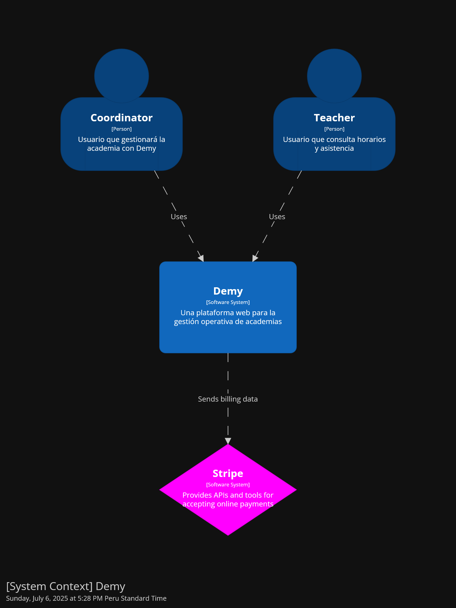
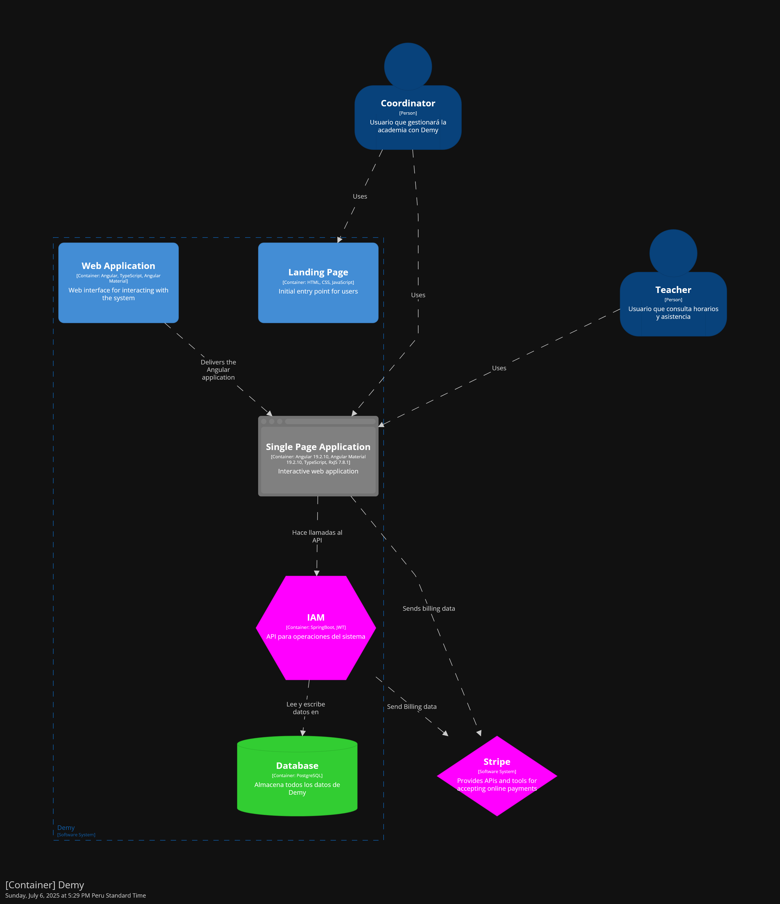
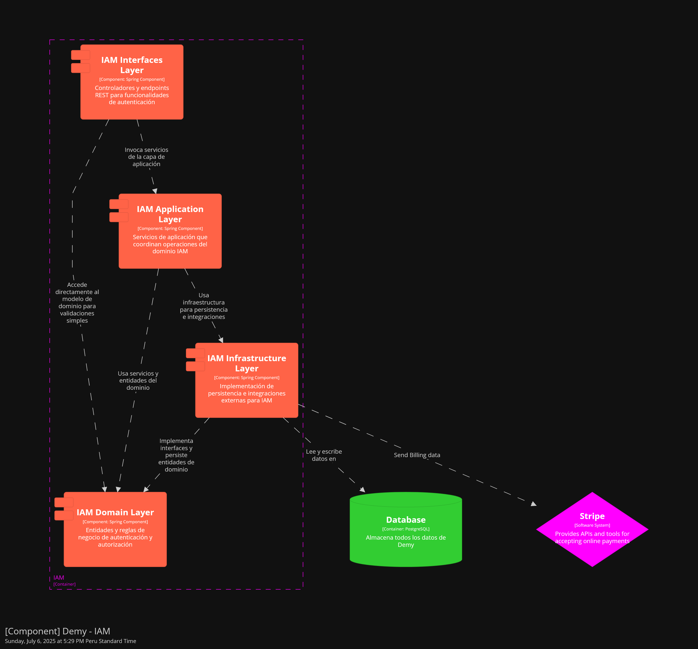
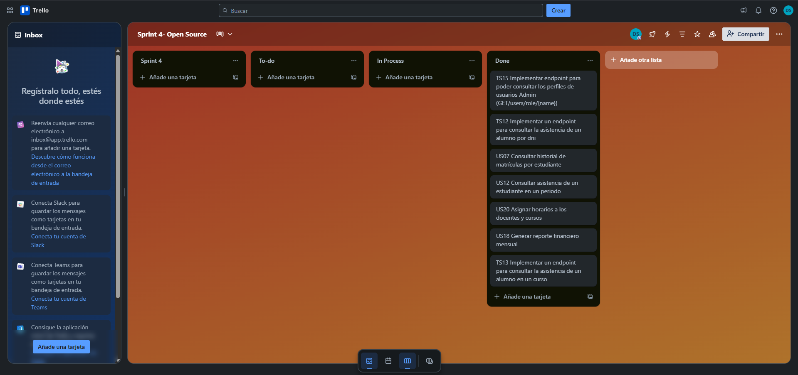

<h2 style="text-align: center;"> Universidad Peruana de Ciencias Aplicadas </h2>

<div style="text-align: center;">
  
</div>

<h4 style="text-align: center"> Ingeniería de Software </h4>

<h4 style="text-align: center"> 1ASI0729 - Desarrollo de Aplicaciones Open Source </h4>

<h4 style="text-align: center"> NRC: 4304  </h4>

<h4 style="text-align: center"> Docente: Efraín Ricardo Bautista Ubillús </h4>

<h4 style="text-align: center;"> Informe del Trabajo Final </h4>

<h4 style="text-align: center"> Startup: SmartEdu </h4>

<h4 style="text-align: center"> Producto: Demy </h4>

<h2 style="text-align: center">Team members:</h2>

| Código     | Nombre                             |
|------------|------------------------------------|
| U20221G120 | Crispin Ramos, Daniel Franco       |
| U202312318 | Dominguez Vargas, Rafael Alexander |
| U20201E843 | Ramirez Mestanza, Salim Ignacio    |
| U20221C486 | Sulca Gonzales, Paúl Fernando      |
| U20231A778 | Vilca Saboya, Diego Alejandro      |

<h5 style="text-align: center"> Ciclo 2025-10 </h5>

# Registro de Versiones del Informe

| Versión | Fecha      | Autor                                                                                    | Descripción de modificación                                                                                                  |
|---------|------------|------------------------------------------------------------------------------------------|------------------------------------------------------------------------------------------------------------------------------|
| 1.0     | 08/04/2025 | Salim Ramirez                                                                            | Creación inicial del documento de trabajo en formato Markdown para centralizar el desarrollo del informe final.              |
| 1.1     | 10/04/2025 | Paúl Sulca                                                                               | Se agregó la carátula, tabla de contenidos y la estructura básica del informe siguiendo las pautas del curso.                |
| 2.0     | 12/04/2025 | Daniel Crispin <br> Rafael Dominguez <br> Salim Ramirez <br> Paúl Sulca <br> Diego Vilca | Se completó el Capítulo I: Introducción. Se definieron objetivos, contexto, visión general del producto.                     |
| 2.1     | 12/04/2025 | Daniel Crispin <br> Rafael Dominguez <br> Salim Ramirez <br> Paúl Sulca <br> Diego Vilca | Se agregaron los resultados de entrevistas y análisis de competidores, como parte del Capítulo II.                           |
| 3.0     | 13/05/2025 | Daniel Crispin <br> Rafael Dominguez <br> Salim Ramirez <br> Paúl Sulca <br> Diego Vilca | Se completó el Capítulo II: Requirements Elicitation & Analysis, incluyendo personas, escenarios y requerimientos iniciales. |
| 3.1     | 16/05/2025 | Daniel Crispin <br> Rafael Dominguez <br> Salim Ramirez <br> Paúl Sulca <br> Diego Vilca | Se integraron las User Stories, Landing Page Stories y Technical Stories como parte del Capítulo III.                        |
| 4.0     | 18/05/2025 | Daniel Crispin <br> Rafael Dominguez <br> Salim Ramirez <br> Paúl Sulca <br> Diego Vilca | Se completó el Capítulo III: Requirements Specification, detallando los criterios de aceptación y modelo de casos de uso.    |
| 4.1     | 21/05/2025 | Daniel Crispin <br> Rafael Dominguez <br> Salim Ramirez <br> Paúl Sulca <br> Diego Vilca | Se añadieron los style guidelines, mockups, wireframes, wireflow y userflow en el Capítulo IV: Product Design.               |
| 5.0     | 23/05/2025 | Daniel Crispin <br> Rafael Dominguez <br> Salim Ramirez <br> Paúl Sulca <br> Diego Vilca | Se completó el Capítulo IV: Product Design, incluyendo arquitectura de componentes, estructura visual y navegación.          |
| 5.1     | 25/05/2025 | Daniel Crispin <br> Rafael Dominguez <br> Salim Ramirez <br> Paúl Sulca <br> Diego Vilca | Se desarrolló la sección de Software Configuration Management. Se añadió la planificación del Sprint 1.                      |
| 6.0     | 25/05/2025 | Daniel Crispin <br> Rafael Dominguez <br> Salim Ramirez <br> Paúl Sulca <br> Diego Vilca | Se completó el Capítulo V: Product Implementation, incluyendo evidencias de avance en el desarrollo de la Landing Page.      |
| 6.1     | 18/06/2025 | Daniel Crispin <br> Rafael Dominguez <br> Salim Ramirez <br> Paúl Sulca <br> Diego Vilca | Se actualizó algunos detalles como las technical stories                                                                     |
| 7.0     | 18/06/2025 | Daniel Crispin <br> Rafael Dominguez <br> Salim Ramirez <br> Paúl Sulca <br> Diego Vilca | Se añadió todas las secciones del Sprint 3                                                                                   |
| 7.1     | 25/06/2025 | Daniel Crispin <br> Rafael Dominguez <br> Salim Ramirez <br> Paúl Sulca <br> Diego Vilca | Se añadió las entrevistas de validación junto a la evaluación según heurísticas                                              |                                                                                                                                                                   |
| 7.2     | 01/07/2025 | Daniel Crispin <br> Rafael Dominguez <br> Salim Ramirez <br> Paúl Sulca <br> Diego Vilca | Se añadió el sprint 4 backlog                                                                                                |    
| 8.0     | 07/07/2025 | Daniel Crispin <br> Rafael Dominguez <br> Salim Ramirez <br> Paúl Sulca <br> Diego Vilca | Se añadió las demás secciones del sprint 4 y se levantó observaciones                                                        |    

# Project Report Collaboration Insights

Enlace para acceder al repositorio para el reporte del proyecto: [*Ver en GitHub*](https://github.com/upc-pre-202510-1asi0729-4304-smartedu/demy-report)

**TB1**
<br>Para el desarrollo del TB1 cada participante del equipo realizo las siguientes tareas:

| Integrantes                        | Tarea Asignada                                                                                                                                                                                                                                                                                                                                                                                                                                                                                                                |
|------------------------------------|-------------------------------------------------------------------------------------------------------------------------------------------------------------------------------------------------------------------------------------------------------------------------------------------------------------------------------------------------------------------------------------------------------------------------------------------------------------------------------------------------------------------------------|
| Crispin Ramos, Daniel Franco       | - Startup Profile<br>- Perfiles del equipo<br>- Empathy Mapping<br>- Ubiquitous Language<br>- Diseño, ejecución y análisis de una entrevista<br>- To-Be Scenario Mapping<br>- General Style Guidelines<br>- Searching Systems<br>- Web Applications Wireframes<br>- Web Applications Wireflow Diagramas<br>- Landing Page(Contact + Footer)<br>- Environment Configuration<br>- Source Code Management)                                                                                                                       |
| Dominguez Vargas, Rafael Alexander | - Project Report Collaboration Insights<br>- Segmentos objetivo<br>- User Task Matrix<br>- Diseño, ejecución y análisis de una entrevista<br>- Impact Mapping<br>- Organization Systems<br>- Landing Page Wireframes<br>- Web applications Mock-ups<br>- Web Application User Flow Diagrams<br>- Landing Page(testimonials + About us)<br>- Development Evidence<br>- Execution Evidence<br>- Deployment Evidence<br>- Team Collaboration Insights                                                                            |
| Ramirez Mestanza, Salim Ignacio    | - Registro de Versiones del Informe<br>- Lean UX Process completo (4 partes)<br>- User Personas<br>- Diseño, ejecución y análisis de una entrevista<br>- Product Backlog<br>- SEO Tags and Meta Tags<br>- Web Applications Prototyping<br>- Class Diagrams<br>- Class Dictionary<br>- Database Diagram<br>- Landing Page (Navbar + Hero + i18n)                                                                                                                                                                               |
| Sulca Gonzales, Paúl Fernando      | - Antecedentes y problemática<br>- As-is Scenario Mapping<br>- Diseño, ejecución y análisis de una entrevista<br>- Product Backlog<br>- Labeling Systems<br>- Landing Page Mock-up<br>- Web Applications Wireframes<br>- Web Applications Prototyping<br>- Software Architecture Context Diagram<br>- Software Architecture Container Diagrams<br>- Software Architecture Container Diagrams<br>- Software Architecture Components Diagrams<br>- Database Diagram<br>- Landing Page (Planes y precios + preguntas frecuentes) |
| Vilca Saboya, Diego Alejandro      | - Carátula<br>- Tabla de contenidos<br>- Student outcome<br>- Análisis competitivo y estrategias<br>- User Journey Mapping<br>- Diseño, ejecución y análisis de una entrevista<br>- User Stories<br>- Web Style Guidelines<br>- Navigation Systems<br>- Web Applications Mock-ups<br>- Landing Page (About the product + Beneficios y características)<br>- Style Guide & Conventions<br>- Deployment Configuration<br>- Sprint Planning<br>- Aspect Leaders and Collaborators<br>- Sprint Backlog                            |

**TP**
<br>Para el desarrollo del TB1 cada participante del equipo realizo las siguientes tareas:

| Integrantes                        | Tarea Asignada                                                                                                                                                              |
|------------------------------------|-----------------------------------------------------------------------------------------------------------------------------------------------------------------------------|
| Crispin Ramos, Daniel Franco       | - Scheduling context<br>- Creación de entidades de scheduling<br>- Creación de servicios de scheduling<br>- Ubiquitous Language<br>- Development Evidence for Sprint Review |
| Dominguez Vargas, Rafael Alexander | - IAM Context<br>- Creación de entidades de IAM<br>- Creación de servicios de IAM<br>- Execution and Deployment Evidence for Sprint Review                                  |
| Ramirez Mestanza, Salim Ignacio    | - Billing context<br>- Creación de entidades de Billing (4 partes)<br>- Creación de servicios de billing<br>- Sprint Planning & Aspect Leaders and Collaborators            |
| Sulca Gonzales, Paúl Fernando      | - Enrollment Context<br>- Creación de entidades de Enrollment<br>- Creación de servicios de enrollment<br>- Development Evidence for Sprint Review                          |
| Vilca Saboya, Diego Alejandro      | - Attendance Context<br>- Creación de entidades de Attendance<br>- Creación de servicios de attendance<br>- Sprint Backlog 2 & Services Documentation for Sprint Review     |

**GitHub Collaboration Insights**

En GitHub se presenta un timeline de las principales ramas creadas por cada integrante del equipo, así como los procesos de *merge* realizados.  
Todas las ramas fueron gestionadas siguiendo el flujo de trabajo **GitFlow**, adaptado para una organización que utiliza un sistema de control de versiones.

Los integrantes son:

| Integrantes                          | Nombre en GitHub |
|--------------------------------------|------------------|
| Crispin Ramos, Daniel Franco         | danielcr04       |
| Dominguez Vargas, Rafael Alexander   | Radv2005         |
| Ramirez Mestanza, Salim Ignacio      | salimramirez     |
| Sulca Gonzales, Paúl Fernando        | Kyrubi           |
| Vilca Saboya, Diego Alejandro        | diesoks          |

Las principales ramas del repositorio son las siguientes:

- **main:** Rama principal que contiene la versión estable y consolidada del documento.
- **develop:** Rama de integración utilizada para fusionar los cambios realizados en las ramas de características.
- **feature/sprintX-daniel:** Rama utilizada por Daniel para el desarrollo de las tareas correspondientes a un determinado sprint.
- **feature/sprintX-diego:** Rama utilizada por Diego para el desarrollo de las tareas correspondientes a un determinado sprint.
- **feature/sprintX-paul:** Rama utilizada por Paul para el desarrollo de las tareas correspondientes a un determinado sprint.
- **feature/sprintX-rafael:** Rama utilizada por Rafael para el desarrollo de las tareas correspondientes a un determinado sprint.
- **feature/sprintX-salim:** Rama utilizada por Salim para el desarrollo de las tareas correspondientes a un determinado sprint.
- **release/vX.X.X:** Rama creada para preparar versiones candidatas al reporte final, siguiendo *Semantic Versioning 2.0.0*. En esta rama se realizan ajustes finales como correcciones menores y revisiones antes de integrarla a `main`.
- **hotfix/urgent-fix:** Rama utilizada para aplicar correcciones críticas directamente sobre `main`, asegurando la estabilidad de la versión publicada.

<div style="text-align: center; margin-top: 1rem; margin-bottom: 1rem;">

**TB1**

Gráfico de red (*network graph*) de ramas en el repositorio de GitHub.


</div>

A continuación, se presentan los gráficos que muestran el análisis de los commits en el repositorio correspondiente al informe.  
Estos gráficos detallan la cantidad de líneas de código añadidas por cada miembro del equipo y la actividad de commits registrada.

<div style="text-align: center; margin-top: 1rem; margin-bottom: 1rem;">

Análisis de líneas de código añadidas por contribuyente.


</div>

El siguiente gráfico muestra la cantidad de commits realizados en la semana con mayor actividad en el proyecto.

<div style="text-align: center; margin-top: 1rem; margin-bottom: 1rem;">

Análisis de cantidad de commits realizados por semana.


</div>

<div style="text-align: center; margin-top: 1rem; margin-bottom: 1rem;">

**TP1**

Gráfico de red (*network graph*) de ramas en el repositorio de GitHub.


</div>

A continuación, se presentan los gráficos que muestran el análisis de los commits en el repositorio correspondiente al informe.  
Estos gráficos detallan la cantidad de líneas de código añadidas por cada miembro del equipo y la actividad de commits registrada.

<div style="text-align: center; margin-top: 1rem; margin-bottom: 1rem;">

Análisis de líneas de código añadidas por contribuyente.


</div>

El siguiente gráfico muestra la cantidad de commits realizados en la semana con mayor actividad en el proyecto.

<div style="text-align: center; margin-top: 1rem; margin-bottom: 1rem;">

Análisis de cantidad de commits realizados por semana.


</div>

<div style="text-align: center; margin-top: 1rem; margin-bottom: 1rem;">

**TB2**

Gráfico de red (*network graph*) de ramas en el repositorio de GitHub.


</div>

A continuación, se presentan los gráficos que muestran el análisis de los commits en el repositorio correspondiente al informe.  
Estos gráficos detallan la cantidad de líneas de código añadidas por cada miembro del equipo y la actividad de commits registrada.

<div style="text-align: center; margin-top: 1rem; margin-bottom: 1rem;">

Análisis de líneas de código añadidas por contribuyente.


</div>

El siguiente gráfico muestra la cantidad de commits realizados en la semana con mayor actividad en el proyecto.

<div style="text-align: center; margin-top: 1rem; margin-bottom: 1rem;">

Análisis de cantidad de commits realizados por semana.


</div>

# Contenido

- [Capítulo I: Introducción](#capítulo-i-introducción)
    - [1.1. Startup Profile](#11-startup-profile)
        - [1.1.1. Descripción de la Startup](#111-descripción-de-la-startup)
        - [1.1.2. Perfiles de los integrantes del equipo](#112-perfiles-de-los-integrantes-del-equipo)
    - [1.2. Solution Profile](#12-solution-profile)
        - [1.2.1. Antecedentes y problemática](#121-antecedentes-y-problemática)
        - [1.2.2. Lean UX Process](#122-lean-ux-process)
            - [1.2.2.1. Lean UX Problem Statements](#1221-lean-ux-problem-statements)
            - [1.2.2.2. Lean UX Assumptions](#1222-lean-ux-assumptions)
            - [1.2.2.3. Lean UX Hypothesis](#1223-lean-ux-hypothesis)
            - [1.2.2.4. Lean UX Canvas](#1224-lean-ux-canvas)
    - [1.3. Segmentos objetivo](#13-segmentos-objetivo)

- [Capítulo II: Requirements Elicitation & Analysis](#capítulo-ii-requirements-elicitation--analysis)
    - [2.1. Competidores](#21-competidores)
        - [2.1.1. Análisis competitivo](#211-análisis-competitivo)
        - [2.1.2. Estrategias y tácticas frente a competidores](#212-estrategias-y-tácticas-frente-a-competidores)
    - [2.2. Entrevistas](#22-entrevistas)
        - [2.2.1. Diseño de entrevistas](#221-diseño-de-entrevistas)
        - [2.2.2. Registro de entrevistas](#222-registro-de-entrevistas)
        - [2.2.3. Análisis de entrevistas](#223-análisis-de-entrevistas)
    - [2.3. Needfinding](#23-needfinding)
        - [2.3.1. User Personas](#231-user-personas)
        - [2.3.2. User Task Matrix](#232-user-task-matrix)
        - [2.3.3. User Journey Mapping](#233-user-journey-mapping)
        - [2.3.4. Empathy Mapping](#234-empathy-mapping)
        - [2.3.5. As-is Scenario Mapping](#235-as-is-scenario-mapping)
    - [2.4. Ubiquitous Language](#24-ubiquitous-language)

- [Capítulo III: Requirements Specification](#capítulo-iii-requirements-specification)
    - [3.1. To-Be Scenario Mapping](#31-to-be-scenario-mapping)
    - [3.2. User Stories](#32-user-stories)
    - [3.3. Impact Mapping](#33-impact-mapping)
    - [3.4. Product Backlog](#34-product-backlog)

- [Capítulo IV: Product Design](#capítulo-iv-product-design)
    - [4.1. Style Guidelines](#41-style-guidelines)
        - [4.1.1. General Style Guidelines](#411-general-style-guidelines)
        - [4.1.2. Web Style Guidelines](#412-web-style-guidelines)
    - [4.2. Information Architecture](#42-information-architecture)
        - [4.2.1. Organization Systems](#421-organization-systems)
        - [4.2.2. Labeling Systems](#422-labeling-systems)
        - [4.2.3. SEO Tags and Meta Tags](#423-seo-tags-and-meta-tags)
        - [4.2.4. Searching Systems](#424-searching-systems)
        - [4.2.5. Navigation Systems](#425-navigation-systems)
    - [4.3. Landing Page UI Design](#43-landing-page-ui-design)
        - [4.3.1. Landing Page Wireframe](#431-landing-page-wireframe)
        - [4.3.2. Landing Page Mock-up](#432-landing-page-mock-up)
    - [4.4. Web Applications UX/UI Design](#44-web-applications-uxui-design)
        - [4.4.1. Web Applications Wireframes](#441-web-applications-wireframes)
        - [4.4.2. Web Applications Wireflow Diagrams](#442-web-applications-wireflow-diagrams)
        - [4.4.3. Web Applications Mock-ups](#443-web-applications-mock-ups)
        - [4.4.4. Web Applications User Flow Diagrams](#444-web-applications-user-flow-diagrams)
    - [4.5. Web Applications Prototyping](#45-web-applications-prototyping)
    - [4.6. Domain-Driven Software Architecture](#46-domain-driven-software-architecture)
        - [4.6.1. Software Architecture Context Diagram](#461-software-architecture-context-diagram)
        - [4.6.2. Software Architecture Container Diagrams](#462-software-architecture-container-diagrams)
        - [4.6.3. Software Architecture Components Diagrams](#463-software-architecture-components-diagrams)
    - [4.7. Software Object-Oriented Design](#47-software-object-oriented-design)
        - [4.7.1. Class Diagrams](#471-class-diagrams)
        - [4.7.2. Class Dictionary](#472-class-dictionary)
    - [4.8. Database Design](#48-database-design)
        - [4.8.1. Database Diagram](#481-database-diagram)

- [Capítulo V: Product Implementation, Validation & Deployment](#capítulo-v-product-implementation-validation--deployment)
    - [5.1. Software Configuration Management](#51-software-configuration-management)
        - [5.1.1. Software Development Environment Configuration](#511-software-development-environment-configuration)
        - [5.1.2. Source Code Management](#512-source-code-management)
        - [5.1.3. Source Code Style Guide & Conventions](#513-source-code-style-guide--conventions)
        - [5.1.4. Software Deployment Configuration](#514-software-deployment-configuration)
    - [5.2. Landing Page, Services & Applications Implementation](#52-landing-page-services--applications-implementation)
        - [5.2.1. Sprint 1](#521-sprint-1)
            - [5.2.1.1. Sprint Planning 1](#5211-sprint-planning-1)
            - [5.2.2.2. Aspect Leaders and Collaborators](#5212-aspect-leaders-and-collaborators)
            - [5.2.1.3. Sprint Backlog 1](#5213-sprint-backlog-1)
            - [5.2.1.4. Development Evidence for Sprint Review](#5214-development-evidence-for-sprint-review)
            - [5.2.1.5. Execution Evidence for Sprint Review](#5215-execution-evidence-for-sprint-review)
            - [5.2.1.6. Services Documentation Evidence for Sprint Review](#5216-services-documentation-evidence-for-sprint-review)
            - [5.2.1.7. Software Deployment Evidence for Sprint Review](#5217-software-deployment-evidence-for-sprint-review)
            - [5.2.1.8. Team Collaboration Insights during Sprint](#5218-team-collaboration-insights-during-sprint)
        - [5.2.2. Sprint 2](#522-sprint-2)
            - [5.2.2.1. Sprint Planning 2](#5221-sprint-planning-2)
            - [5.2.2.2. Aspect Leaders and Collaborators](#5222-aspect-leaders-and-collaborators)
            - [5.2.2.3. Sprint Backlog 2](#5223-sprint-backlog-2)
            - [5.2.2.4. Development Evidence for Sprint Review](#5224-development-evidence-for-sprint-review)
            - [5.2.2.5. Execution Evidence for Sprint Review](#5225-execution-evidence-for-sprint-review)
            - [5.2.2.6. Services Documentation Evidence for Sprint Review](#5226-services-documentation-evidence-for-sprint-review)
            - [5.2.2.7. Software Deployment Evidence for Sprint Review](#5227-software-deployment-evidence-for-sprint-review)
            - [5.2.2.8. Team Collaboration Insights during Sprint](#5228-team-collaboration-insights-during-sprint)
        - [5.2.3. Sprint 3](#523-sprint-3)
            - [5.2.3.1. Sprint Planning 3](#5231-sprint-planning-3)
            - [5.2.3.2. Aspect Leaders and Collaborators](#5232-aspect-leaders-and-collaborators)
            - [5.2.3.3. Sprint Backlog 3](#5233-sprint-backlog-3)
            - [5.2.3.4. Development Evidence for Sprint Review](#5234-development-evidence-for-sprint-review)
            - [5.2.3.5. Execution Evidence for Sprint Review](#5235-execution-evidence-for-sprint-review)
            - [5.2.3.6. Services Documentation Evidence for Sprint Review](#5236-services-documentation-evidence-for-sprint-review)
            - [5.2.3.7. Software Deployment Evidence for Sprint Review](#5237-software-deployment-evidence-for-sprint-review)
            - [5.2.3.8. Team Collaboration Insights during Sprint](#5238-team-collaboration-insights-during-sprint)
        - [5.2.4. Sprint 4](#524-sprint-4)
            - [5.2.4.1. Sprint Planning 4](#5241-sprint-planning-4)
            - [5.2.4.2. Aspect Leaders and Collaborators](#5242-aspect-leaders-and-collaborators)
            - [5.2.4.3. Sprint Backlog 4](#5243-sprint-backlog-4)
            - [5.2.4.4. Development Evidence for Sprint Review](#5244-development-evidence-for-sprint-review)
            - [5.2.4.5. Execution Evidence for Sprint Review](#5245-execution-evidence-for-sprint-review)
            - [5.2.4.6. Services Documentation Evidence for Sprint Review](#5246-services-documentation-evidence-for-sprint-review)
            - [5.2.4.7. Software Deployment Evidence for Sprint Review](#5247-software-deployment-evidence-for-sprint-review)
            - [5.2.4.8. Team Collaboration Insights during Sprint](#5248-team-collaboration-insights-during-sprint)
    - [5.3. Validation Interviews](#53-validation-interviews)
        - [5.3.1. Diseño de Entrevistas](#531-diseño-de-entrevistas)
        - [5.3.2. Registro de Entrevistas](#532-registro-de-entrevistas)
        - [5.3.3. Evaluaciones según Heurísticas](#533-evaluaciones-según-heurísticas)
    - [5.4. Video About-the-Product](#54-video-about-the-product)

- [Conclusiones](#conclusiones)
    - [Conclusiones y recomendaciones](#conclusiones-y-recomendaciones)
    - [Video About-the-Team](#video-about-the-team)
- [Bibliografía](#bibliografía)
- [Anexos](#anexos)

# Student Outcome

El curso contribuye al cumplimiento del Student Outcome ABET:

**ABET – EAC - Student Outcome 3:**

**Criterio:** *Capacidad de comunicarse efectivamente con un rango de audiencias.*

En el siguiente cuadro se describe las acciones realizadas y enunciados de conclusiones por parte del grupo, que permiten sustentar el haber alcanzado el logro del ABET – EAC - Student Outcome 3.

| **Criterio específico**                                                   | **Acciones realizadas**                                                                                                                                                                                                                                                                                                                                                                                                                                                                                                                                                                                                                                                                                                                                                                                                                                                                                                                                                                                                                                                                                                                                                                                                                                                                                                                                                                                                                                                                                                                                                                                                                                                                                                                                                                                                                                                                                                                                                                                                                                                                                                                                                                                                                                                                  | **Conclusiones**                                                                                                                                                                                                                                                                                                                                                                                                                                                                                                     |
|---------------------------------------------------------------------------|------------------------------------------------------------------------------------------------------------------------------------------------------------------------------------------------------------------------------------------------------------------------------------------------------------------------------------------------------------------------------------------------------------------------------------------------------------------------------------------------------------------------------------------------------------------------------------------------------------------------------------------------------------------------------------------------------------------------------------------------------------------------------------------------------------------------------------------------------------------------------------------------------------------------------------------------------------------------------------------------------------------------------------------------------------------------------------------------------------------------------------------------------------------------------------------------------------------------------------------------------------------------------------------------------------------------------------------------------------------------------------------------------------------------------------------------------------------------------------------------------------------------------------------------------------------------------------------------------------------------------------------------------------------------------------------------------------------------------------------------------------------------------------------------------------------------------------------------------------------------------------------------------------------------------------------------------------------------------------------------------------------------------------------------------------------------------------------------------------------------------------------------------------------------------------------------------------------------------------------------------------------------------------------|----------------------------------------------------------------------------------------------------------------------------------------------------------------------------------------------------------------------------------------------------------------------------------------------------------------------------------------------------------------------------------------------------------------------------------------------------------------------------------------------------------------------|
| **Comunica oralmente con efectividad a diferentes rangos de audiencia**   | **Salim:**<br>TB1: Participé guiando al equipo para tomar un rumbo claro y fomentar un espacio de coherencia y comunicación entre todos.<br>TP1: Realicé una presentación grupal sobre el progreso del proyecto, explicando detalladamente cada fase y participando activamente en las discusiones con el resto del equipo.<br><br>**Diego:**<br>TB1: Participé en las reuniones de trabajo apoyando al equipo y aportando ideas que se tuvieron en cuenta en el proceso de desarrollo.<br>TP1: En las reuniones virtuales del equipo, me aseguré de que todos los puntos relevantes se comunicaran de forma clara y eficiente.<br><br>**Daniel:**<br>TB1: Trabajé en conjunto con mi equipo para participar activamente en la toma de decisiones que nos permitió mejorar como grupo.<br>TP1: Ayudé a coordinar las reuniones de trabajo donde cada miembro del equipo podía expresar sus puntos de vista y actualizaciones del proyecto.<br><br>**Rafael:**<br>TB1: Mantuve una comunicación oral adecuada para comunicarme correctamente con mi equipo y recibí retroalimentación de mis compañeros para asegurar el correcto proceso de desarrollo.<br>TP1: Durante el trabajo parcial, participé en discusiones de grupo y presentaciones orales donde contribuyó a una comunicación efectiva entre todos. <br>  <br> **Paul:** <br>  TB1: Participé activamente en las reuniones de equipo, asegurándome de que todos tuviéramos un entendimiento común sobre los avances y tareas a realizar.  <br> TP1: Durante el trabajo final, ayudé a coordinar las presentaciones orales, colaborando para que todos los miembros del equipo se sintieran cómodos al presentar sus avances, y apoyé a que las discusiones fueran organizadas y productivas.                                                                                                                                                                                                                                                                                                                                                                                                                                                                                                                                 | Consideramos que este criterio ha sido abordado satisfactoriamente. Las reuniones y presentaciones orales fueron claves para mantener una comunicación efectiva dentro del equipo y con los involucrados. Cada miembro, al aportar en las discusiones, contribuyó a una mejor comprensión del trabajo en equipo, lo que permitió realizar ajustes rápidos y eficientes en el desarrollo del proyecto. Las presentaciones grupales también nos ayudaron a organizar y estructurar la información de manera efectiva.  |
| **Comunica por escrito con efectividad a diferentes rangos de audiencia** | **Salim:**<br>TB1: Comunicaba en nuestro grupo de WhatsApp los pendientes que había, coordinábamos horarios para las reuniones, y avisaba sobre los cambios y actualizaciones realizadas.<br>TP1: A través de WhatsApp y Discord, mantuve a todo el equipo informado sobre el progreso, las tareas y actualizaciones necesarias.<br><br>**Diego:**<br>TB1: Trabajé junto a mis compañeros expresándome adecuadamente por los medios digitales establecidos para la coordianción (WhatsApp, Discord, etc) de forma asertiva para lograr una mejor comunicación entre los miembros.<br>TP1: Colaboré activamente en los debates y comentarios en los documentos compartidos en Notion y en GitHub, garantizando una comunicación fluida con el equipo.<br><br>**Daniel:**<br>TB1: Fomenté el entorno colaborativo entre los integrantes para comunicarnos adecuadamente. Me permitieron expresarme libremente aportando ideas que fueron consideradas para el proyecto.<br>TP1: Utilicé plataformas como Notion y trello para coordinar las tareas del equipo, asegurando que todos los miembros pudieran realizar un seguimiento de los avances.<br><br>**Rafael:**<br>TB1: Trabajé en mi entorno colaborativo y pudimos crear un ambiente saludable donde pudimos expresar nuestras ideas y compartir nuestros distintos puntos de vista.<br>TP1: Me aseguré de que todas las discusiones por escrito fueran claras y detalladas, con el fin de evitar malentendidos y garantizar la coordinación efectiva del equipo.<br><br>**Paul:**<br>TB1: Para este entregable, mantuve una comunicación constante con mi equipo por medio de entornos digitales de comunicación escrita.<br>TP1: Contribuí en las plataformas digitales, asegurando que todos los miembros del equipo tuvieran acceso a la información actualizada y participaran activamente.                                                                                                                                                                                                                                                                                                                                                                                                                                    | Creemos que hemos logrado un buen desempeño en este aspecto. La comunicación escrita a través de plataformas digitales como WhatsApp, Trello y GitHub ha sido fundamental para mantener al equipo alineado. Esto facilitó la colaboración y coordinación de tareas, además de asegurar que todos tuviéramos claro el estado de las entregas. Las herramientas nos permitieron registrar evidencias claras de lo realizado y contribuyó al seguimiento adecuado de los objetivos del proyecto.                        |

# Capítulo I: Introducción

## 1.1. Startup Profile

### 1.1.1. Descripción de la Startup

La startup **SmartEdu**, conformada por estudiantes de la carrera de Ingeniería de Software, tiene como objetivo ofrecer una solución tecnológica para optimizar la gestión administrativa de academias educativas en el Perú. A través de nuestra plataforma web **Demy**, buscamos agilizar y mejorar los procesos fundamentales dentro de las academias, como la matrícula de alumnos, la gestión de asistencia, la asignación de horarios, y la administración de inventarios. Además, se incorpora el seguimiento de pagos tanto para estudiantes como para docentes, todo a través de un sistema centralizado y de fácil acceso.

**Misión**: Revolucionar la gestión administrativa de las academias educativas en el Perú, ofreciendo una plataforma que optimice procesos clave de matrícula, asistencia, asignación de horarios, control de inventarios y pagos.

**Visión**: Convertirnos en líderes en la transformación digital de la gestión administrativa de academias educativas presenciales en el Perú, asegurando la eficiencia, transparencia y accesibilidad de sus procesos internos mediante soluciones tecnológicas innovadoras.

### 1.1.2. Perfiles de los integrantes del equipo

| **Foto**                                     | **Nombre**                            | **Código** | **Carrera**            | **Resumen de Conocimientos Técnicos y Habilidades**                                                                                                          |
|----------------------------------------------|---------------------------------------|------------|------------------------|--------------------------------------------------------------------------------------------------------------------------------------------------------------|
|    | **Daniel Franco Crispin Ramos**       | U20221G120 | Ingeniería de Software | Conocimiento en bases de datos y gestión de proyectos. Experiencia en interfaces de usuario y soluciones para la administración educativa.                   |
|        | **Paul Fernando Sulca Gonzales**      | U20221C486 | Ingeniería de Software | Conocimiento en diseño de software orientado a objetos y modelado UML. Experiencia en implementación de interfaces web adaptativas.                          |
|      | **Salim Ignacio Ramirez Mestanza**    | U20201E843 | Ingeniería de Software | Conocimiento en arquitectura de software y control de versiones con Git. Experiencia en documentación técnica y colaboración en equipos ágiles.              |
|      | **Diego Alejandro Vilca Saboya**      | U20231A778 | Ingeniería de Software | Conocimiento en desarrollo web utilizando las últimas tecnologías en tendencia. Experiencia en elaboración de diagramas de arquitectura y prototipado UX/UI. |
|    | **Rafael Alexander Dominguez Vargas** | U202312318 | Ingeniería de Software | Conocimiento en bases de datos relacionales y validación de requisitos. Experiencia en análisis de necesidades de usuario y desarrollo frontend.             |

## 1.2. Solution Profile

### 1.2.1. Antecedentes y problemática

#### What?

#### ¿Cuál es el problema?

El problema radica en la gestión desorganizada y manual de los procesos administrativos en academias educativas presenciales. Muchas de estas instituciones utilizan hojas de Excel, documentos físicos o plataformas no integradas, lo que genera el aumento de esfuerzo, pérdida de información, errores y una ineficiente administración de los recursos y tiempo.

#### When (Cuando)

#### ¿Cuándo sucede el problema?

Este problema sucede de manera constante en el día a día de las academias, especialmente al inicio de ciclos academicos, al momento de inscribir alumnos, registrar asistencia, gestionar pagos, distribuir horarios y administrar recursos. La falta de automatización y centralización de procesos es una barrera persistente que afecta la eficiencia desde el primer contacto con el alumno hasta el cierre del periodo académico.

#### Where (Dónde)

#### ¿A dónde se dirige?

La solución está dirigida a academias privadas de nivel escolar, preuniversitario o técnico que buscan mejorar su gestión interna mediante tecnología accesible, amigable y diseñada para sus flujos operativos reales.

#### ¿Dónde surge el problema?

Surge dentro de las academias presenciales que gestionan sus operaciones de forma tradicional en todo el país. Específicamente, el problema ocurre en las áreas administrativas, académicas y de coordinación de recursos.
#### Who (Quién)

#### ¿Quiénes están involucrados? ¿Quién lo utilizará?

Los principales usuarios serán el personal administrativo (coordinadores) y los docentes (para el control de asistencia y gestión de clases)
Estos perfiles utilizarán la plataforma para registrar matrículas, gestionar pagos, asignar horarios, monitorear asistencia, controlar inventarios, y obtener reportes para la toma de decisiones.

#### Why (Por qué)

#### ¿Cuál es la causa del problema?

La causa del problema está en la falta de herramientas accesibles y especializadas que se adapten al contexto operativo de academias presenciales. Muchas instituciones no han adoptado soluciones tecnológicas por miedo al cambio, desconocimiento o falta de recursos, lo cual perpetúa el uso de métodos manuales que limitan su eficiencia y capacidad de crecimiento.

### ¿Cuáles son las 2H?

#### How (Cómo)

#### ¿Cómo se utilizará el producto?

La plataforma web será utilizada diariamente por el personal de la academia. A través de una interfaz amigable, podrán registrar matrículas, programar clases, marcar asistencia, ingresar pagos y gestionar inventario. Se podrá acceder desde computadoras o smartphones, permitiendo que los usuarios trabajen desde cualquier lugar con conexión a internet.

#### ¿Cómo lograremos alcanzar la correcta gestión de los procesos administrativos de la academia dentro de la plataforma?

Mediante el diseño de módulos para cada funcionalidad clave que hemos identificado:

- Módulo de matrícula.

- Módulo de pagos con alertas automáticas de vencimientos.

- Módulo de asistencia accesible para los docentes con visualización por grupo.

- Módulo de horarios que permite programar docentes, salones y materias.

- Módulo de registro de alumnos, profesores, secciones, aulas, sedes, etc.

- Dashboard administrativo.

#### How much (Cuánto)

#### ¿Qué porcentaje del personal académico-administrativo se beneficiaría?

Se estima que el sistema podría beneficiar directamente al 70% del personal de una academia promedio, incluyendo al menos 3 a 5 administrativos y entre 10 y 20 docentes, aunque todo esto dependeria del tamaño de la institución y las sedes que esta maneje.

### 1.2.2. Lean UX Process

El Lean UX Process es una metodología ágil que nos permite diseñar soluciones centradas en el usuario, validando hipótesis mediante ciclos de prueba, retroalimentación y aprendizaje continuo.
En este proyecto, aplicamos este enfoque para resolver los desafíos administrativos que enfrentan las academias presenciales, partiendo de problemáticas reales y construyendo una plataforma que responda a sus necesidades.

#### 1.2.2.1 Lean UX Problem Statements

El servicio de Demy tiene como objetivo proporcionar a las instituciones educativas privadas una plataforma web integral que permita automatizar procesos administrativos esenciales, como matrículas, control de asistencia, asignación de horarios, docentes y salones, seguimiento de pagos y gestión de recursos y materiales.

El problema se manifiesta en la manera tradicional y desorganizada con la que muchas academias manejan su administración interna. Actualmente, la mayoría utiliza herramientas básicas como hojas de Excel, documentos físicos o plataformas que no están integradas entre sí. Esto genera duplicidad de tareas, falta de trazabilidad, pérdida de información clave, errores en la asignación de recursos y complicaciones en la gestión de pagos y control de asistencia. Como consecuencia, el personal administrativo invierte un tiempo excesivo en tareas repetitivas, y los docentes enfrentan dificultades para coordinar sus horarios o registrar adecuadamente la asistencia y rendimiento de los alumnos.

Hemos identificado que esta deficiencia en la administración limita seriamente la capacidad de crecimiento y profesionalización de muchas academias. Además, deteriora la experiencia de alumnos y profesores, y afecta negativamente la percepción del servicio ofrecido. La ausencia de un sistema unificado también impide tomar decisiones informadas sobre finanzas, rendimiento académico y uso de recursos, generando un impacto directo en la sostenibilidad del negocio.

¿Cómo podríamos centralizar y automatizar la gestión administrativa de academias presenciales de forma escalable y accesible, permitiendo al personal administrativo y docente ahorrar tiempo, reducir errores y mejorar el control sobre los procesos clave del día a día?

#### 1.2.2.2. Lean UX Assumptions

#### Business Assumptions

1. **Creemos que nuestros clientes necesitan** una plataforma web centralizada que les permita automatizar y simplificar su gestión administrativa diaria.
2. **Estas necesidades se pueden resolver con** un sistema web que facilite procesos clave como la matrícula de alumnos, control de asistencia, asignación de horarios, docentes y salones, gestión de inventario y seguimiento de pagos.
3. **Nuestros clientes iniciales serán** los administradores y docentes de academias educativas presenciales pequeñas, medianas y grandes que actualmente operan con métodos manuales o herramientas desarticuladas.
4. **El valor más importante que el cliente quiere de nuestro servicio es** tener mayor control y eficiencia en la administración de su academia, reduciendo la carga operativa y los errores humanos, y facilitando la toma de decisiones.
5. **El cliente también puede obtener beneficios adicionales** como recordatorios de pagos vencidos, seguimiento de inventario para reposición y escalabilidad mediante distintos planes por tamaño de academia.
6. **Vamos a adquirir la mayoría de nuestros clientes mediante** marketing digital dirigido en redes sociales (Facebook, Instagram, TikTok), campañas en Google Ads y alianzas con gremios educativos.
7. **Generaremos dinero a través de** un modelo de suscripción mensual escalable, con tres planes: Essentials $19.90 (academias pequeñas); Pro $69.90 (academias medianas); Elite $159.90 (academias grandes).
8. **Nuestra competencia principal en el mercado son** sistemas genéricos de gestión escolar, soluciones empresariales o especializadas y hojas de cálculo utilizadas por academias.
9. **Lo venceremos debido a** ofrecer una solución enfocada específicamente en academias presenciales, con una interfaz amigable, soporte local y funciones diseñadas desde el enfoque de sus procesos reales.
10. **El mayor riesgo del servicio es** que las academias, especialmente las pequeñas, no estén dispuestas a migrar desde sus métodos manuales actuales por temor al cambio o falta de conocimiento tecnológico.
11. **Resolveremos esto a través de** una interfaz simple y guiada, materiales de capacitación, soporte personalizado para la implementación, y un periodo de prueba gratuito para incentivar la adopción.

#### User Assumptions

**¿Quién es el usuario?**

Principalmente, el personal administrativo y los docentes de academias educativas que necesitan herramientas accesibles y prácticas para gestionar alumnos, horarios y pagos.

**¿Qué problema tiene nuestro producto que debe resolver?**

El problema radica en el desorden de los procesos administrativos, la pérdida de tiempo por tareas repetitivas, falta de visibilidad sobre pagos y asistencias.

**¿Qué características son importantes?**

Destacan principalmente el control de matrículas y asistencia, la asignación de horarios, salones y docentes, recordatorios de pagos vencidos e inventario con seguimiento de stock.

**¿Dónde encaja nuestro producto en su trabajo o vida?**

En el día a día laboral de los administradores y docentes, ayudándolos a organizar, controlar y optimizar la operación de su academia desde un solo lugar.

**¿Cúando y cómo es nuestro producto? ¿Usado?**

Será usado todos los días hábiles, especialmente al inicio de clases, al registrar asistencia, gestionar horarios o monitorear pagos.
Accederán desde computadoras o laptops, y en algunos casos desde tablets o smartphones.

**¿Cómo debe verse nuestro producto y cómo debe comportarse?**

Debe tener una interfaz moderna, clara y adaptable a cualquier dispositivo. La navegación debe ser intuitiva, con acciones guiadas y accesibles para usarlos sin conocimientos técnicos.
El sistema debe responder rápido, enviar notificaciones útiles y garantizar la seguridad de la información.

#### 1.2.2.3. Lean UX Hypothesis

- **Hypothesis 01:**

  **Creemos que** los administradores de academias presenciales estarán dispuestos a adoptar nuestra plataforma web para digitalizar procesos como matrícula, pagos, asistencia y asignación de horarios.

  **Sabremos que** hemos tenido éxito.

  **Cuando** al menos el 70% de los usuarios activos usen la plataforma para gestionar estos procesos durante el primer mes de uso, y al menos el 60% renueve su suscripción tras el primer ciclo mensual.


- **Hypothesis 02:**

  **Creemos que** la integración de recordatorios de morosidad y vencimiento de pagos reducirá significativamente el retraso en los pagos de los alumnos.

  **Sabremos que** hemos tenido éxito.

  **Cuando** el porcentaje de pagos vencidos disminuye en al menos un 40% entre los usuarios que adoptan esta funcionalidad en los primeros tres meses.


- **Hypothesis 03:**

  **Creemos que** permitir la gestión del inventario (como libros, plumones o equipos) dentro del sistema facilitará el control de materiales y reducirá pérdida o faltantes.

  **Sabremos que** hemos tenido éxito.

  **Cuando** al menos el 80% de las academias con más de una sede reporten una mejora en el seguimiento de materiales y una disminución de pérdidas en un periodo de 2 meses.


- **Hypothesis 04:**

  **Creemos que** la interfaz intuitiva y el diseño responsivo de la plataforma aumentará la frecuencia de uso por parte de docentes y personal administrativo, incluso si no tienen experiencia tecnológica previa.

  **Sabremos que** hemos tenido éxito.

  **Cuando** al menos el 75% de los usuarios califiquen la usabilidad de la plataforma como "fácil" o "muy fácil" en las encuestas de satisfacción realizadas durante la fase piloto.


- **Hypothesis 05:**

  **Creemos que** ofrecer planes escalables (Essentials, Pro, Elite) permitirá a las academias elegir el plan adecuado según su tamaño, y facilitará el crecimiento dentro del mismo sistema.

  **Sabremos que** hemos tenido éxito.

  **Cuando** al menos el 25% de los clientes del plan Essentials migren al plan Pro o Elite en los primeros seis meses de uso.

#### 1.2.2.4. Lean UX Canvas

El Lean UX Canvas nos permite organizar de forma clara y colaborativa los elementos clave del diseño: problema, usuarios, suposiciones, hipótesis y métricas.
En este proyecto, nos ayuda a enfocar el desarrollo en generar valor real para las academias educativas.

A continuación, se presenta el Lean UX Canvas elaborado en la herramienta *Miro*:

<div style="text-align: center; margin-top: 1rem; margin-bottom: 1rem;">

**Figura 4.** Lean UX Canvas del proyecto *Demy*.


<br>

</div>

**Enlace al Lean UX Canvas:** [*Ver en Miro*](https://miro.com/app/board/uXjVIGPrhA0=/?share_link_id=155958536023)

## 1.3. Segmentos objetivo

En el análisis del segmento objetivo para Demy, hemos previsto que nuestros principales usuarios de nuestra startup serían profesores y personal administrativo de academias preuniversitarias.

### Profesores de academias preuniversitarias

Según la revista Gan@Mas(24 de julio,2014), sabemos que diversos docentes usan hasta el **29% de su tiempo en tareas administrativas**, las cuales no deberían estar ligadas a profesionales de la educación. La gran demanda en estas academias preuniversitarias no permite a los profesores dedicar su tiempo laboral a ejercer plenamente su labor de docente.

- **Edad**: Buscamos profesores de cualquier edad
- **Necesidad clave**: Reducir la carga administrativa y optimizar su tiempo para centrarse en la enseñanza y mejorar su eficiencia en las aulas.
- **Nivel educativo**: Profesores con formación universitaria, preferiblemente con especialización en educación o áreas afines.
- **Uso de tecnología**: Profesores que utilizan tecnología en su labor docente, pero que requieren herramientas más eficientes para la gestión administrativa.

### Administradores de las academias preuniversitarias

Administradores de las academias preuniversitarias suelen enfrentarse a una gran carga de trabajo relacionada con la planificación de horarios, gestión de pagos y matrículas. Según la Encuesta Nacional de Uso del Tiempo (ENUT) 2024, el 45% de los trabajadores en el sector educativo dedican más de 20 horas semanales a tareas administrativas, lo que refleja una carga significativa en el tiempo dedicado a tareas no pedagógicas (Instituto Nacional de Estadística e Informática [INEI], 2024). Además, un estudio realizado por el Grupo de Análisis para el Desarrollo (GRADE) destaca que el 70% de los directores de instituciones educativas en Perú consideran que las herramientas actuales para la gestión administrativa son ineficientes, lo que subraya la necesidad de adoptar nuevas soluciones tecnológicas (GRADE, 2023). Este segmento busca soluciones tecnológicas que optimicen el manejo de información y mejoren la experiencia educativa de los alumnos.

- **Edad**: Buscamos personal administrativo de cualquier edad
- **Necesidad clave**: Contar con una solución tecnológica que facilite la gestión, mejore la eficiencia operativa y brinde una experiencia más fluida tanto para el personal como para los alumnos y padres.
- **Nivel educativo**: Administradores con formación técnica o universitaria, preferiblemente en áreas de gestión, administración o educación.
- **Uso de tecnología**: Administradores que utilizan herramientas digitales para la gestión de información, pero que requieren una plataforma más integrada y eficiente para optimizar sus procesos.

# Capítulo II: Requirements Elicitation & Analysis

## 2.1. Competidores

### 2.1.1. Análisis competitivo

Esta sección tiene objetivo conocer mejor los competidores a los que se enfrentará SmartEDU y poder así comparar nuestros beneficios.

| **Competitive Analysis Landscape**     |                                                                                                                                                                                              |                   
|----------------------------------------|----------------------------------------------------------------------------------------------------------------------------------------------------------------------------------------------|
| ¿Por qué llevar acabo este análisis?   | El objetivo de este análisis competitivo es saber como será nuestro posicionamiento en el mercado en comparación a otros sistema de gestión de academias y que será lo que nos hará destacar |

<div style="font-size: 90%;">

|                     |                                                                    | SmartEdu                                                                                                                                                       | <br>Academygest                                                                 | <br>Playoff                                             | <br>Quickschools                                                                                                             |
|---------------------|--------------------------------------------------------------------|----------------------------------------------------------------------------------------------------------------------------------------------------------------|-------------------------------------------------------------------------------------------------------------------------------------------------------------------------|-----------------------------------------------------------------------------------------------------------------------------------------|------------------------------------------------------------------------------------------------------------------------------------------------------------------------------------------------------------------------|
| Perfil              | Overview                                                           | SmartEdu ofrece a Demy un sistema web integral que facilita la organización, reduce la carga operativa y mejora la experiencia tanto de alumnos como docentes. | Plataforma integral que facilita la gestión de academias y centros educativos, permitiendo organizar y mantener datos de alumnos.                                       | Sistema de gestión para entidades, que ofrece también control de cobros, pagos y organización de actividades académicas.                | Plataforma en la nube para gestión escolar, con funciones como calificaciones, asistencia y comunicación con padres. Dirigida a escuelas pequeñas y medianas.                                                          |
|                     | Ventaja <br> competitiva <br> ¿Qué valor <br> ofrece al cliente?   | Solución integral y escalable para la administración de academias, accesible y adaptable según las necesidades de cada institución.                            | Optimización de la gestión administrativa, ahorro de tiempo y mejora de la eficiencia en la administración de centros educativos.                                       | Incremento de la motivación y participación en programas educativos mediante dinámicas de juego personalizadas.                         | Gestión académica simple y flexible, enfocada en facilidad de uso y personalización para escuelas pequeñas y medianas.                                                                                                 |
| Perfil de marketing | Mercado objetivo                                                   | Academias presenciales preuniversitarias, con una o varias sedes.                                                                                              | Academias y centros de formación en España que requieren control académico, administrativo y financiero.                                                                | Entidades educativas y corporativas que buscan motivar mediante estrategias de gamificación.                                            | Escuelas K-12 privadas y pequeñas instituciones educativas a nivel global que necesitan soluciones simples y flexibles.                                                                                                |
|                     | Estrategias de marketing                                           | Publicidad en televisión y campañas digitales en TikTok, Instagram y Facebook.                                                                                 | Campañas en línea enfocadas en instituciones educativas que requieren soluciones de gestión.                                                                            | Publicaciones de artículos y casos de éxito sobre implementación de gamificación educativa.                                             | Generación de guías y contenidos educativos para atraer y retener clientes potenciales.                                                                                                                                |
| Perfil de producto  | Productos y servicios                                              | Registro y matrícula de alumnos.<br> Automatización de pagos.<br> Toma de asistencia.<br> Gestión de inventario de materiales.                                 | Control de asistencia de alumnos.<br> Gestión de pagos y cobros.<br> Gestión de informes académicos.<br> Envío de SMS a estudiantes.                                    | Plataforma de gamificación educativa.<br> Análisis de participación.<br> Personalización de experiencias según la entidad.              | Gestión de comunicaciones.<br> Gradebook personalizado.<br> Horarios de clases inteligentes.<br> Información académica accesible.                                                                                      |
|                     | Precios y costos                                                   | Plan Básico: \$50/mes (1 sede).<br> Plan Intermedio: \$100/mes (2 sedes).<br> Plan Premium: \$200/mes (varias sedes).                                          | Plan único: 25€/mes.<br> Incluye:<br> - Sin instalaciones.<br> - Servicio 24/7.<br> - Alumnos y cursos ilimitados.<br> - Gestión de asistencia.<br> - Soporte técnico.  | Plan Base: 34,95€.<br> Plan Pro: 49,95€.<br> Plan Top: 69,95€.<br> Plan Premium: personalizado.<br> Incluye prueba gratuita de 15 días. | Gaia Plan: \$0.99/estudiante/mes.<br> Apollo Plan: \$1.49/estudiante/mes.<br> Athena Plan: \$2.99/estudiante/mes.<br> Todos incluyen prueba gratuita de 30 días.<br> Plan Enterprise disponible bajo contacto directo. |
|                     | Canales de distribución                                            | Distribución exclusiva vía web.                                                                                                                                | Disponible en navegadores web.                                                                                                                                          | Distribución web y acceso a app móvil con el Plan Pro.                                                                                  | Disponible vía web y aplicaciones móviles.                                                                                                                                                                             |
| Análisis SWOT       | Fortalezas                                                         | Solución especializada en academias preuniversitarias.<br> Planes escalables según necesidades.                                                                | Plataforma intuitiva, en español, adecuada para academias pequeñas y medianas.<br> Cobertura completa de funciones básicas.                                             | Enfoque especializado en gamificación educativa.<br> Adaptable a academias, empresas y áreas de RRHH.                                   | Plataforma madura, flexible y con soporte eficaz.<br> Planes escalables.                                                                                                                                               |
|                     | Debilidades                                                        | Startup emergente con financiamiento limitado.<br> Ausencia de aplicación móvil.                                                                               | Limitado geográficamente a España.<br> Sin aplicación móvil.<br> Menor reconocimiento frente a competidores globales.                                                   | Solución complementaria, no integral.<br> App móvil solo disponible en ciertos planes.                                                  | Puede resultar costoso en grandes escalas.<br> Limitación al idioma inglés.                                                                                                                                            |
|                     | Oportunidades                                                      | Bajo nivel de competencia en el segmento objetivo.<br> Crecimiento del uso de tecnología educativa post COVID-19.                                              | Expansión a Latinoamérica.<br> Desarrollo de aplicación móvil.                                                                                                          | Creciente interés en gamificación educativa.<br> Alianzas con plataformas educativas.                                                   | Inclusión del idioma español.<br> Posibilidad de alianzas con redes escolares y gobiernos.                                                                                                                             |
|                     | Amenazas                                                           | Resistencia al cambio en academias tradicionales.<br> Competencia fuerte.<br> Vulnerabilidad ante ciberataques debido a falta de experiencia.                  | Alta competencia global.<br> Dependencia de un solo mercado geográfico.                                                                                                 | Necesidad de clientes que comprendan el valor de la gamificación.<br> Riesgo de baja adopción.                                          | Competencia con plataformas multilingües.<br> Saturación del mercado K-12.                                                                                                                                             |

</div>

### 2.1.2. Estrategias y tácticas frente a competidores

Para competir eficazmente en el mercado de plataformas de gestión para academias presenciales, SmartEdu aplicará las siguientes estrategias y tácticas preliminares, considerando sus propias fortalezas y debilidades, así como el contexto de oportunidades y amenazas en relación a sus competidores:

* Diferenciación por enfoque especializado <br>
  **Estrategia**: Posicionar a Demy como la plataforma especializada en academias preuniversitarias presenciales, a diferencia de otros competidores que ofrecen soluciones más genéricas o centradas en colegios o empresas.
  <br>
  **Tácticas**:Desarrollar funcionalidades específicas para academias preuniversitarias, como módulos de simulacros, cronogramas de preparación para exámenes de admisión 

<br>

* Modelo de precios escalables
  <br>
  **Estrategia**:Mantener un esquema de precios accesible, con planes diferenciados según el tamaño de la academia, y con mejor relación calidad-precio frente a competidores como QuickSchools o Playoff.
  <br>
  **Tácticas**: Evaluar una prueba gratuita de n días , Ofrecer descuentos cada cierto tiempo o evaluar una contratación anual incluida con descuento

<br>

* Mejora progresiva del producto y adaptabilidad
  <br>
  **Estrategia**:Competir frente a soluciones más maduras (como QuickSchools) con un enfoque ágil y adaptable, incorporando mejoras constantes con base en la retroalimentación directa de los usuarios.
  <br>
  **Tácticas**: Lanzamientos de mejoras mensuales (por sprints) , futura implementación de la versión móvil.

<br>

*  Seguridad y confianza
   <br>
   **Estrategia**: Reducir la percepción de riesgo en torno a ciberseguridad, una amenaza para startups, generando confianza desde etapas tempranas.
   <br>
   **Táctica**:Contratar un servicio externo para auditorías de seguridad básicas.

<br>

* Aprovechamiento del contexto post-pandemia
  <br>
  **Estrategia**: Capitalizar el aumento de la digitalización en la educación tras el COVID-19 para incentivar la transformación digital de academias tradicionales
  <br>
  **Tácticas**: Ofrecer workshops gratuitos virtuales sobre “Digitaliza tu academia en 3 pasos con Demy”. Enseñar casos de éxito que muestren cómo academias presenciales mejoraron su eficiencia tras usar la plataforma.

## 2.2. Entrevistas

En esta sección se aborda la investigación cualitativa realizada mediante entrevistas a representantes de los segmentos objetivo del proyecto: administrativos y docentes de academias educativas.
El objetivo fue comprender las herramientas, procesos y problemáticas actuales en su gestión, así como validar posibles soluciones digitales a partir de sus propias experiencias.

### 2.2.1. Diseño de entrevistas

Para diseñar las entrevistas, se elaboraron dos bloques de preguntas, diferenciados según el segmento objetivo.
Las preguntas buscaban obtener tanto información objetiva (como el contexto de trabajo y herramientas utilizadas) como información subjetiva (percepciones, frustraciones y expectativas respecto a posibles soluciones).

---

#### **Segmento 1: Administrativos de academias**

**Preguntas sobre la problemática**

1. ¿Cómo gestionan actualmente los procesos administrativos como matrículas, horarios, pagos y asistencia?

2. ¿Qué problemas frecuentes enfrentas con las herramientas o métodos que usas hoy?

3. ¿Qué tipo de información necesitas consultar con frecuencia, y qué tan fácil es acceder a ella?

4. ¿Qué consecuencias trae la desorganización o errores en la administración para ti o tu equipo?

**Preguntas sobre la solución**

1. ¿Qué funcionalidades crees que debería tener una herramienta ideal para facilitar tu trabajo administrativo?

2. ¿Qué tan importante sería para ti recibir alertas sobre tareas o pagos?

3. ¿Preferirías un sistema con muchas funciones o uno más simple pero fácil de usar?

4. ¿Qué beneficios esperas obtener si decides adoptar una nueva plataforma de gestión?

5. ¿Estarías dispuesto a aprender a usar una nueva herramienta si mejora tu gestión (organización)?

---

#### **Segmento 2: Docentes de academias**

**Preguntas sobre la problemática**

1. ¿Qué herramientas o métodos usas para registrar asistencia o notas en caso lo hagas? ¿Funcionan bien para usted?

2. ¿Qué tipo de coordinación tiene con el personal administrativo? ¿Es fácil comunicarse con ellos o enfrenta dificultades?

3. ¿Cómo accedes a la información de tus clases o alumnos cuando la necesitas?

4. ¿Cómo manejas los cambios de aula, horarios u otras incidencias en tu día a día?

**Preguntas sobre la solución**

1. ¿Qué funcionalidades te gustaría que tenga una herramienta digital para docentes?

2. ¿Qué tan útil sería para ti revisar tu horario o registrar asistencia desde cualquier dispositivo?

3. ¿Qué tan importante es que la plataforma sea fácil de usar e intuitiva?

4. ¿Preferirías acceder a la plataforma desde tu celular, tablet o computadora?

5. ¿Qué tan valioso sería que recibas alertas (notificaciones) sobre cambios de horario o asistencia irregular, y demás?

6. ¿Estarías dispuesto a aprender a usar una nueva herramienta si mejora tu gestión (organización)?

### 2.2.2. Registro de entrevistas

#### Segmento: Administrativo - Entrevistado 1

| Atributo                | Detalle                                                                                                                                                                                                                                                                                                                                                                                                                                                                                                                                                                                                                                                                |
|-------------------------|------------------------------------------------------------------------------------------------------------------------------------------------------------------------------------------------------------------------------------------------------------------------------------------------------------------------------------------------------------------------------------------------------------------------------------------------------------------------------------------------------------------------------------------------------------------------------------------------------------------------------------------------------------------------|
| **Nombre**              | Kevin Rodriguez                                                                                                                                                                                                                                                                                                                                                                                                                                                                                                                                                                                                                                                        |
| **Edad**                | 28                                                                                                                                                                                                                                                                                                                                                                                                                                                                                                                                                                                                                                                                     |
| **Sexo**                | Masculino                                                                                                                                                                                                                                                                                                                                                                                                                                                                                                                                                                                                                                                              |
| **Distrito**            | Ica                                                                                                                                                                                                                                                                                                                                                                                                                                                                                                                                                                                                                                                                    |
| **Ocupación**           | Coordinador de Academia                                                                                                                                                                                                                                                                                                                                                                                                                                                                                                                                                                                                                                                |
| **Fecha de entrevista** | 09 de abril de 2025                                                                                                                                                                                                                                                                                                                                                                                                                                                                                                                                                                                                                                                    |
| **Timing**              | 00:00 - 05:29                                                                                                                                                                                                                                                                                                                                                                                                                                                                                                                                                                                                                                                          |
| **Video**               | [Ver en Microsoft Stream](https://upcedupe-my.sharepoint.com/:v:/g/personal/u20201e843_upc_edu_pe/EXN4PH3yo6BDpMxZlyfjpr8BqyL-elHkge9QM1vrQeoYRg?e=F1PS4p&nav=eyJyZWZlcnJhbEluZm8iOnsicmVmZXJyYWxBcHAiOiJTdHJlYW1XZWJBcHAiLCJyZWZlcnJhbFZpZXciOiJTaGFyZURpYWxvZy1MaW5rIiwicmVmZXJyYWxBcHBQbGF0Zm9ybSI6IldlYiIsInJlZmVycmFsTW9kZSI6InZpZXcifSwicGxheWJhY2tPcHRpb25zIjp7InN0YXJ0VGltZUluU2Vjb25kcyI6MS40Mn19)                                                                                                                                                                                                                                                            |
| **Captura**             |                                                                                                                                                                                                                                                                                                                                                                                                                                                                                                                                                                                                  |
| **Resumen**             | Kevin gestiona actualmente sus procesos administrativos con Excel y listas impresas, lo que considera poco eficiente y repetitivo. Necesita acceder con frecuencia a información como asistencias y notas, pero no siempre la tiene a la mano, lo que afecta la atención a padres, quienes consultan regularmente. Expresa el deseo de contar con un sistema automatizado que permita búsquedas rápidas por nombre o código y que envíe alertas sobre pagos. Está dispuesto a adoptar una nueva herramienta siempre que sea intuitiva, centralice la información y tenga un costo accesible. Espera mejorar la organización y el control con una solución más moderna. |

#### Segmento: Administrativo - Entrevistado 2

| Atributo                | Detalle                                                                                                                                                                                                                                                                                                                                                                                                                                                                                                                                                                                                                                                                                                                             |
|-------------------------|-------------------------------------------------------------------------------------------------------------------------------------------------------------------------------------------------------------------------------------------------------------------------------------------------------------------------------------------------------------------------------------------------------------------------------------------------------------------------------------------------------------------------------------------------------------------------------------------------------------------------------------------------------------------------------------------------------------------------------------|
| **Nombre**              | Marleni Rosa Flores                                                                                                                                                                                                                                                                                                                                                                                                                                                                                                                                                                                                                                                                                                                 |
| **Edad**                | 58                                                                                                                                                                                                                                                                                                                                                                                                                                                                                                                                                                                                                                                                                                                                  |
| **Sexo**                | Femenino                                                                                                                                                                                                                                                                                                                                                                                                                                                                                                                                                                                                                                                                                                                            |
| **Distrito**            | Ica                                                                                                                                                                                                                                                                                                                                                                                                                                                                                                                                                                                                                                                                                                                                 |
| **Ocupación**           | Coordinadora de Academia                                                                                                                                                                                                                                                                                                                                                                                                                                                                                                                                                                                                                                                                                                            |
| **Fecha de entrevista** | 09 de abril de 2025                                                                                                                                                                                                                                                                                                                                                                                                                                                                                                                                                                                                                                                                                                                 |
| **Timing**              | 05:30 - 10:17                                                                                                                                                                                                                                                                                                                                                                                                                                                                                                                                                                                                                                                                                                                       |
| **Video**               | [Ver en Microsoft Stream](https://upcedupe-my.sharepoint.com/:v:/g/personal/u20201e843_upc_edu_pe/EXN4PH3yo6BDpMxZlyfjpr8BqyL-elHkge9QM1vrQeoYRg?e=h4QH4g&nav=eyJyZWZlcnJhbEluZm8iOnsicmVmZXJyYWxBcHAiOiJTdHJlYW1XZWJBcHAiLCJyZWZlcnJhbFZpZXciOiJTaGFyZURpYWxvZy1MaW5rIiwicmVmZXJyYWxBcHBQbGF0Zm9ybSI6IldlYiIsInJlZmVycmFsTW9kZSI6InZpZXcifSwicGxheWJhY2tPcHRpb25zIjp7InN0YXJ0VGltZUluU2Vjb25kcyI6MzMwLjV9fQ%3D%3D)                                                                                                                                                                                                                                                                                                                 |
| **Captura**             |                                                                                                                                                                                                                                                                                                                                                                                                                                                                                                                                                                                                                                                                 |
| **Resumen**             | Marleni, coordinadora de una academia enfocada en estudiantes de últimos años escolares, actualmente gestiona procesos administrativos como matrículas, pagos y asistencias de manera manual. Esto le genera dificultades para llevar un control preciso de pagos, ingresos, egresos y asistencia, lo que afecta la organización y eficiencia del trabajo. Expresa interés en una herramienta que incluya registro de alumnos, control de pagos, ingresos, egresos y pagos a profesores. Considera muy útil recibir alertas para recordar pagos pendientes y prefiere un sistema simple, con funciones esenciales y fácil de usar. Está dispuesta a adoptar una nueva plataforma si mejora la gestión y organización de su trabajo. |

#### Segmento: Administrativo - Entrevistado 3

| Atributo                | Detalle                                                                                                                                                                                                                                                                                                                                                                                                                                                                                                                                                                                                                                                                                                                                                                                                                                                                         |
|-------------------------|---------------------------------------------------------------------------------------------------------------------------------------------------------------------------------------------------------------------------------------------------------------------------------------------------------------------------------------------------------------------------------------------------------------------------------------------------------------------------------------------------------------------------------------------------------------------------------------------------------------------------------------------------------------------------------------------------------------------------------------------------------------------------------------------------------------------------------------------------------------------------------|
| **Nombre**              | Jhon Robert Candioti                                                                                                                                                                                                                                                                                                                                                                                                                                                                                                                                                                                                                                                                                                                                                                                                                                                            |
| **Edad**                | 42 años                                                                                                                                                                                                                                                                                                                                                                                                                                                                                                                                                                                                                                                                                                                                                                                                                                                                         |
| **Sexo**                | Masculino                                                                                                                                                                                                                                                                                                                                                                                                                                                                                                                                                                                                                                                                                                                                                                                                                                                                       |
| **Distrito**            | Ica                                                                                                                                                                                                                                                                                                                                                                                                                                                                                                                                                                                                                                                                                                                                                                                                                                                                             |
| **Ocupación**           | Dueño y administrativo de la academia Enigmas                                                                                                                                                                                                                                                                                                                                                                                                                                                                                                                                                                                                                                                                                                                                                                                                                                   |
| **Fecha de entrevista** | 09 de abril del 2025                                                                                                                                                                                                                                                                                                                                                                                                                                                                                                                                                                                                                                                                                                                                                                                                                                                            |
| **Timing**              | 10:18 - 18:45                                                                                                                                                                                                                                                                                                                                                                                                                                                                                                                                                                                                                                                                                                                                                                                                                                                                   |
| **Video**               | [Ver en Microsoft Stream](https://upcedupe-my.sharepoint.com/:v:/g/personal/u20201e843_upc_edu_pe/EXN4PH3yo6BDpMxZlyfjpr8BqyL-elHkge9QM1vrQeoYRg?e=Tf0He1&nav=eyJyZWZlcnJhbEluZm8iOnsicmVmZXJyYWxBcHAiOiJTdHJlYW1XZWJBcHAiLCJyZWZlcnJhbFZpZXciOiJTaGFyZURpYWxvZy1MaW5rIiwicmVmZXJyYWxBcHBQbGF0Zm9ybSI6IldlYiIsInJlZmVycmFsTW9kZSI6InZpZXcifSwicGxheWJhY2tPcHRpb25zIjp7InN0YXJ0VGltZUluU2Vjb25kcyI6NjE5LjE5fX0%3D)                                                                                                                                                                                                                                                                                                                                                                                                                                                               |
| **Captura**             |                                                                                                                                                                                                                                                                                                                                                                                                                                                                                                                                                                                                                                                                                                                                                                                                         |
| **Resúmen**             | John Robert, administrador de la academia Enigmas en Ica, lleva 1 año gestionando los procesos administrativos de su academia. Actualmente, utiliza Excel para manejar datos como matrículas, asistencia, pagos y horarios, lo cual le genera problemas de desorganización y falta de tiempo debido a la complejidad de navegar entre diferentes hojas de cálculo. Destaca que el estrés y los errores derivados de este método afectan la eficiencia de su trabajo. Busca una herramienta más sencilla y automatizada, que le permita acceder rápidamente a la información con solo ingresar el DNI de los estudiantes y los apoderados. Además, le gustaría contar con un registro de pagos pendientes y, lo que mejoraría su productividad. Está dispuesto a aprender a utilizar una nueva plataforma si esta resulta fácil de manejar y optimiza la gestión de la academia. |

#### Segmento: Docente - Entrevistado 1

| Atributo                | Detalle                                                                                                                                                                                                                                                                                                                                                                                                                                                                                                                                                                                                                                                                                                                                                                                                                                                                                                                                                                                                     |
|-------------------------|-------------------------------------------------------------------------------------------------------------------------------------------------------------------------------------------------------------------------------------------------------------------------------------------------------------------------------------------------------------------------------------------------------------------------------------------------------------------------------------------------------------------------------------------------------------------------------------------------------------------------------------------------------------------------------------------------------------------------------------------------------------------------------------------------------------------------------------------------------------------------------------------------------------------------------------------------------------------------------------------------------------|
| **Nombre**              | Luis de la Cruz Herrera                                                                                                                                                                                                                                                                                                                                                                                                                                                                                                                                                                                                                                                                                                                                                                                                                                                                                                                                                                                     |
| **Edad**                | 25                                                                                                                                                                                                                                                                                                                                                                                                                                                                                                                                                                                                                                                                                                                                                                                                                                                                                                                                                                                                          |
| **Sexo**                | Masculino                                                                                                                                                                                                                                                                                                                                                                                                                                                                                                                                                                                                                                                                                                                                                                                                                                                                                                                                                                                                   |
| **Distrito**            | La Molina                                                                                                                                                                                                                                                                                                                                                                                                                                                                                                                                                                                                                                                                                                                                                                                                                                                                                                                                                                                                   |
| **Ocupación**           | Docente de Círculos de estudio en la universidad Agraria                                                                                                                                                                                                                                                                                                                                                                                                                                                                                                                                                                                                                                                                                                                                                                                                                                                                                                                                                    |
| **Fecha de entrevista** | 8 de abril del 2025                                                                                                                                                                                                                                                                                                                                                                                                                                                                                                                                                                                                                                                                                                                                                                                                                                                                                                                                                                                         |
| **Timing**              | 18:46 - 31:01                                                                                                                                                                                                                                                                                                                                                                                                                                                                                                                                                                                                                                                                                                                                                                                                                                                                                                                                                                                               |
| **Video**               | [Ver en Microsoft Stream](https://upcedupe-my.sharepoint.com/:v:/g/personal/u20201e843_upc_edu_pe/EXN4PH3yo6BDpMxZlyfjpr8BqyL-elHkge9QM1vrQeoYRg?e=qvqo4T&nav=eyJyZWZlcnJhbEluZm8iOnsicmVmZXJyYWxBcHAiOiJTdHJlYW1XZWJBcHAiLCJyZWZlcnJhbFZpZXciOiJTaGFyZURpYWxvZy1MaW5rIiwicmVmZXJyYWxBcHBQbGF0Zm9ybSI6IldlYiIsInJlZmVycmFsTW9kZSI6InZpZXcifSwicGxheWJhY2tPcHRpb25zIjp7InN0YXJ0VGltZUluU2Vjb25kcyI6MTEyOC41NH19)                                                                                                                                                                                                                                                                                                                                                                                                                                                                                                                                                                                             |
| **Captura**             |                                                                                                                                                                                                                                                                                                                                                                                                                                                                                                                                                                                                                                                                                                                                                                                                                                                                                                                                           |
| **Resumen**             | El entrevistado es un docente con experiencia en diversas academias y actualmente dicta clases en círculos de estudio en la UNALM. En su rutina diaria, enfrenta desafíos relacionados con la gestión manual de horarios pues usa herramientas como Excel, actividades que le consumen una gran cantidad de tiempo y afectan su eficiencia. Usa principalmente su laptop y su celular para organizarse, sin herramientas digitales especializadas, lo que le complica su trabajo. Al conocer la propuesta de nuestra startup, mostró una percepción positiva ante la posibilidad de contar con una herramienta que centralice y automatice estos procesos. Reconoce que una solución tecnológica podría mejorar su organización, reducir su carga administrativa y permitirle enfocarse más en la enseñanza. Se mostró dispuesto a adoptar nuevas herramientas que respondan a sus necesidades y faciliten su trabajo diario como docente, herramientas las cuales pueda usar desde su celular o su laptop. |

#### Segmento: Docente - Entrevistado 2

| Atributo                | Detalle                                                                                                                                                                                                                                                                                                                                                                                                                                                                                                                                                                                                                                                                                                                                                                                                                                                                                                   |
|-------------------------|-----------------------------------------------------------------------------------------------------------------------------------------------------------------------------------------------------------------------------------------------------------------------------------------------------------------------------------------------------------------------------------------------------------------------------------------------------------------------------------------------------------------------------------------------------------------------------------------------------------------------------------------------------------------------------------------------------------------------------------------------------------------------------------------------------------------------------------------------------------------------------------------------------------|
| **Nombre**              | Jean Paul Benezú                                                                                                                                                                                                                                                                                                                                                                                                                                                                                                                                                                                                                                                                                                                                                                                                                                                                                          |
| **Edad**                | 21 años                                                                                                                                                                                                                                                                                                                                                                                                                                                                                                                                                                                                                                                                                                                                                                                                                                                                                                   |
| **Sexo**                | Masculino                                                                                                                                                                                                                                                                                                                                                                                                                                                                                                                                                                                                                                                                                                                                                                                                                                                                                                 |
| **Distrito**            | Santa Anita                                                                                                                                                                                                                                                                                                                                                                                                                                                                                                                                                                                                                                                                                                                                                                                                                                                                                               |
| **Ocupación**           | Docente en CEPRE Agraria                                                                                                                                                                                                                                                                                                                                                                                                                                                                                                                                                                                                                                                                                                                                                                                                                                                                                  |
| **Fecha de entrevista** | 08 de abril del 2025                                                                                                                                                                                                                                                                                                                                                                                                                                                                                                                                                                                                                                                                                                                                                                                                                                                                                      |
| **Timing**              | 31:01 - 45:48                                                                                                                                                                                                                                                                                                                                                                                                                                                                                                                                                                                                                                                                                                                                                                                                                                                                                             |
| **Video**               | [Ver en Microsoft Stream](https://upcedupe-my.sharepoint.com/:v:/g/personal/u20201e843_upc_edu_pe/EXN4PH3yo6BDpMxZlyfjpr8BqyL-elHkge9QM1vrQeoYRg?e=amN8XV&nav=eyJyZWZlcnJhbEluZm8iOnsicmVmZXJyYWxBcHAiOiJTdHJlYW1XZWJBcHAiLCJyZWZlcnJhbFZpZXciOiJTaGFyZURpYWxvZy1MaW5rIiwicmVmZXJyYWxBcHBQbGF0Zm9ybSI6IldlYiIsInJlZmVycmFsTW9kZSI6InZpZXcifSwicGxheWJhY2tPcHRpb25zIjp7InN0YXJ0VGltZUluU2Vjb25kcyI6MTg2Mi4zOX19)                                                                                                                                                                                                                                                                                                                                                                                                                                                                                           |
| **Captura**             |                                                                                                                                                                                                                                                                                                                                                                                                                                                                                                                                                                                                                                                                                                                                                                                                                                         |
| **Resumen**             | El entrevistado enseña en una academia preuniversitaria y usa Excel para registrar notas y asistencia, además de Google Forms en algunos casos. Si bien la comunicación con el personal administrativo es buena, ha experimentado dificultades al reprogramar clases debido a la baja asistencia en días especiales, por lo que realiza encuestas para reagendar. Considera fundamental contar con una herramienta centralizada que le permita registrar notas y asistencia de forma ordenada. Valora altamente que la plataforma sea intuitiva, visualmente simple y accesible desde su celular. También sugiere que padres o tutores puedan acceder a la información. Aunque no le interesa recibir alertas por notas o asistencia, considera clave recibir notificaciones por cambios de horario. Está dispuesto a aprender a usar nuevas herramientas si percibe una mejora real en su productividad. |

#### Segmento: Docente - Entrevistado 3

| Atributo                | Detalle                                                                                                                                                                                                                                                                                                                                                                                                                                                                                                                                                                                                                                                                                                                                                                                                                                                                                                                                                                                                                                                                                                                                                                                                                           |
|-------------------------|-----------------------------------------------------------------------------------------------------------------------------------------------------------------------------------------------------------------------------------------------------------------------------------------------------------------------------------------------------------------------------------------------------------------------------------------------------------------------------------------------------------------------------------------------------------------------------------------------------------------------------------------------------------------------------------------------------------------------------------------------------------------------------------------------------------------------------------------------------------------------------------------------------------------------------------------------------------------------------------------------------------------------------------------------------------------------------------------------------------------------------------------------------------------------------------------------------------------------------------|
| **Nombre**              | Jeff Aylas Quispe Vergara                                                                                                                                                                                                                                                                                                                                                                                                                                                                                                                                                                                                                                                                                                                                                                                                                                                                                                                                                                                                                                                                                                                                                                                                         |
| **Edad**                | 25                                                                                                                                                                                                                                                                                                                                                                                                                                                                                                                                                                                                                                                                                                                                                                                                                                                                                                                                                                                                                                                                                                                                                                                                                                |
| **Sexo**                | Masculino                                                                                                                                                                                                                                                                                                                                                                                                                                                                                                                                                                                                                                                                                                                                                                                                                                                                                                                                                                                                                                                                                                                                                                                                                         |
| **Distrito**            | San Juan de Lurigancho                                                                                                                                                                                                                                                                                                                                                                                                                                                                                                                                                                                                                                                                                                                                                                                                                                                                                                                                                                                                                                                                                                                                                                                                            |
| **Ocupación**           | Docente en Academia ADUNI                                                                                                                                                                                                                                                                                                                                                                                                                                                                                                                                                                                                                                                                                                                                                                                                                                                                                                                                                                                                                                                                                                                                                                                                         |
| **Fecha de entrevista** | 11 de abril del 2025                                                                                                                                                                                                                                                                                                                                                                                                                                                                                                                                                                                                                                                                                                                                                                                                                                                                                                                                                                                                                                                                                                                                                                                                              |
| **Timing**              | 45:49 - 50:16                                                                                                                                                                                                                                                                                                                                                                                                                                                                                                                                                                                                                                                                                                                                                                                                                                                                                                                                                                                                                                                                                                                                                                                                                     |
| **Video**               | [Ver en Microsoft Stream](https://upcedupe-my.sharepoint.com/:v:/g/personal/u20201e843_upc_edu_pe/EXN4PH3yo6BDpMxZlyfjpr8BqyL-elHkge9QM1vrQeoYRg?e=KNljaH&nav=eyJyZWZlcnJhbEluZm8iOnsicmVmZXJyYWxBcHAiOiJTdHJlYW1XZWJBcHAiLCJyZWZlcnJhbFZpZXciOiJTaGFyZURpYWxvZy1MaW5rIiwicmVmZXJyYWxBcHBQbGF0Zm9ybSI6IldlYiIsInJlZmVycmFsTW9kZSI6InZpZXcifSwicGxheWJhY2tPcHRpb25zIjp7InN0YXJ0VGltZUluU2Vjb25kcyI6Mjc1MC45N319)                                                                                                                                                                                                                                                                                                                                                                                                                                                                                                                                                                                                                                                                                                                                                                                                                   |
| **Captura**             |                                                                                                                                                                                                                                                                                                                                                                                                                                                                                                                                                                                                                                                                                                                                                                                                                                                                                                                                                                                                                                                                                                                                                                 |
| **Resumen**             | El docente entrevistado, que además es estudiante, utiliza principalmente herramientas como hojas de Excel o cuadernos para registrar asistencia y notas, aunque reconoce que no siempre son prácticas ni eficientes. La coordinación con el personal administrativo se da por canales informales como WhatsApp o correo, lo que a veces genera demoras y falta de claridad. El acceso a la información de clases o alumnos no está centralizado, lo que le obliga a recurrir a sus apuntes o hacer consultas adicionales. Los cambios de aula o horario suelen comunicarse de manera improvisada, lo que puede causar confusión. Valora la posibilidad de contar con una herramienta digital que integre funciones clave como registro de asistencia, horarios, notas y observaciones, accesible desde cualquier dispositivo, especialmente el celular. Considera fundamental que la plataforma sea fácil de usar e intuitiva, ya que si es compleja, volvería a sus métodos tradicionales. Además, percibe como muy útil recibir alertas sobre incidencias o comportamientos irregulares. Está dispuesto a adoptar una nueva herramienta siempre que le facilite la gestión y no represente una carga adicional de aprendizaje. |

### 2.2.3. Análisis de entrevistas

Las entrevistas se realizaron entre el 8 y el 11 de abril de 2025 a un total de seis participantes: tres docentes y tres administrativos/coordinadores de academias preuniversitarias en Lima e Ica.
El objetivo fue entender sus contextos operativos, frustraciones actuales y validar hipótesis sobre posibles soluciones digitales.

---

#### Segmento: Docentes de academias

**Total entrevistados:** 3  
**Edades:** 21, 25, 25 años  
**Distritos:** La Molina, Santa Anita, San Juan de Lurigancho  
**Instituciones:** CEPRE Agraria, Círculos de estudio UNALM, Academia ADUNI  
**Fechas:** 8 y 11 de abril de 2025

##### Características objetivas
- Usan Excel o Google Forms para registrar notas y asistencias: **3/3 (100%)**
- Prefieren gestionar tareas desde celulares o laptops: **3/3 (100%)**
- Los cambios de aula u horarios se gestionan por WhatsApp o encuestas improvisadas: **3/3 (100%)**
- No utilizan plataformas centralizadas ni automatizadas: **3/3 (100%)**

##### Características subjetivas
- Encuentran incómodo el uso de Excel en celular: **2/3 (66%)**
- Consideran que el trabajo administrativo les resta tiempo valioso de enseñanza: **3/3 (100%)**
- Ven con buenos ojos una solución intuitiva y fácil de usar: **3/3 (100%)**
- Quieren acceso a la plataforma desde múltiples dispositivos, especialmente celular: **3/3 (100%)**
- Notificaciones de cambios de horario son altamente valoradas: **2/3 (66%)**
- Disposición a adoptar nuevas herramientas si mejoran su productividad: **3/3 (100%)**

---

#### Segmento: Administrativos de academias

**Total entrevistados:** 3  
**Edades:** 28, 42, 58 años  
**Distritos:** Ica (todos)  
**Instituciones:** Enigmas, academias escolares particulares  
**Fechas:** 9 de abril de 2025

##### Características objetivas
- Utilizan Excel y registros manuales para manejar pagos, matrículas, asistencia y horarios: **3/3 (100%)**
- Consultan frecuentemente asistencia, notas y estado de pagos: **3/3 (100%)**
- Dependen de múltiples hojas y archivos, dificultando la trazabilidad: **3/3 (100%)**

##### Características subjetivas
- Consideran sus métodos actuales ineficientes y repetitivos: **3/3 (100%)**
- Señalan consecuencias negativas como pérdida de tiempo y mala atención a padres: **3/3 (100%)**
- Alertas para pagos vencidos son altamente valoradas: **3/3 (100%)**
- Desean funcionalidades como búsqueda rápida por nombre o DNI: **2/3 (66%)**
- Esperan una solución intuitiva, accesible y asequible: **3/3 (100%)**
- Disposición a adoptar nuevas plataformas si mejoran su gestión: **3/3 (100%)**

---

> Este análisis refleja claramente patrones de uso, frustraciones comunes y criterios clave que deben guiar el diseño del sistema. La coincidencia en prioridades entre ambos segmentos refuerza la necesidad de una plataforma centralizada, móvil, intuitiva y orientada a mejorar la eficiencia operativa diaria.

## 2.3. Needfinding

El Needfinding permite identificar necesidades reales de los usuarios mediante entrevistas y análisis del contexto.
A partir de esta información, se construyeron artefactos clave que ayudaron a comprender mejor sus objetivos, tareas, emociones y frustraciones.

### 2.3.1. User Personas

Los User Personas fueron elaborados a partir de los hallazgos de las entrevistas, reflejando perfiles representativos de los segmentos objetivo.
Cada ficha sintetiza aspectos demográficos, conductuales y emocionales que guían el diseño funcional y visual de la plataforma.

---

#### User Persona: Administrador de academia

Coordinadora administrativa que necesita centralizar pagos, matrículas y horarios.
Busca evitar errores, ahorrar tiempo y modernizar los procesos de su academia.


**Figura 2.** User Persona del segmento *Administrador*.

---

#### User Persona: Docente de academia

Profesor joven que busca herramientas simples y accesibles para gestionar asistencia y horarios desde cualquier dispositivo, sin depender de su laptop.
Valora la movilidad y odia perder tiempo con tareas repetitivas.


**Figura 3.** User Persona del segmento *Docente*.

---

### 2.3.2. User Task Matrix

En este User Task Matrix se detallan las tareas clave que cada tipo de usuario puede realizar dentro del sistema académico

| **TAREA**                                              |  **Carmen Gutierrez.(Administrador) - Frecuencia**  |  **Carmen Gutierrez.(Administrador) - Importancia**  |
|--------------------------------------------------------|:---------------------------------------------------:|:----------------------------------------------------:|
| Registrar matrícula de estudiantes                     |                       always                        |                         high                         |
| Gestionar los horarios de docentes y estudiantes       |                      sometimes                      |                         high                         |
| Controlar los pagos de estudiantes                     |                      sometimes                      |                         high                         |
| Visualizar la información académica                    |                        never                        |                        medium                        |
| Ver la información financiera de los estudiantes       |                      sometimes                      |                         high                         |
| Coordinar con los docentes para la gestión             |                      sometimes                      |                        medium                        |
| Gestionar reportes para estudiantes y profesores       |                      sometimes                      |                         high                         |
| Gestionar cambios en la asignación de aulas y horarios |                      sometimes                      |                         high                         |
| Supervisar los procesos administrativos                |                       always                        |                         high                         |

| **TAREA**                                       |  **Luis Mendoza(Profesor) - Frecuencia**  |  **Luis Mendoza(Profesor) - Importancia**  |
|-------------------------------------------------|:-----------------------------------------:|:------------------------------------------:|
| Registrar asistencia de estudiantes             |                 sometimes                 |                    high                    |
| Revisar y gestionar horarios de clases          |                 sometimes                 |                   medium                   |
| Registrar calificaciones                        |                  always                   |                    high                    |
| Acceder a información de los estudiantes        |                 sometimes                 |                 sometimes                  |
| Coordinar con el personal administrativo        |                 sometimes                 |                   medium                   |
| Comunicar incidencias en horario regular        |                   never                   |                    high                    |
| Preparar los materiales para las clases         |                  always                   |                    high                    |
| Diseñar las evaluaciones                        |                 sometimes                 |                    high                    |
| Gestionar que se cumplan las normas en el aula  |                  always                   |                    high                    |

### 2.3.3. User Journey Mapping
A continuación se presentarán los User Journey Maps de cada User Persona. Estos mapas nos permitirán comprender los puntos de dolor que experimentan en cada etapa, desde que descubren nuestra app hasta que comparten su opinión sobre ella.

* User Journey Map de Luis Mendoza:
  
  [Ver Imagen detallada aquí](https://drive.google.com/file/d/1ZwP-W8qpUPP0yI6UFXMareIiCiphqNrr/view?usp=sharing)


* User Journey Map de Carmen Gutiérrez:
  
  [Ver Imagen detallada aquí](https://drive.google.com/file/d/1oGSadSkVdSIzf-MeaMGnYL06wVVFKkJG/view?usp=sharing)

### 2.3.4. Empathy Mapping

Se elaboraron los Empathy Mapping para los dos User Personas: el Administrador de la academia y el Profesor. Este proceso permitió comprender mejor lo que dicen, piensan, hacen y sienten en su día a día, identificando sus principales pains y gains para diseñar una solución que realmente se adapte a sus necesidades.

---

#### Administrador de academia


**Figura x.** Empathy Mapping del user persona *Administrador*.

---

#### Docente de academia


**Figura x.** Empathy Mapping del user persona *Docente*.

---

### 2.3.5. As-Is Scenario Mapping

Para elaborar el As-Is Scenario Mapping, como grupo es importante empatizar con nuestros futuros usuarios, buscando describir sus experiencias de forma que reflejaran sus pain points identificados en la seccion anterior .

**As-Is Scenario Mapping Coordinador**


**As-Is Scenario Mapping Teacher**


## 2.4. Ubiquitous Language

---

**Teacher** (Docente)  
Persona encargada de impartir clases, evaluar a los estudiantes y registrar información académica como notas y asistencias.

---

**Student** (Estudiante)  
Persona inscrita en la academia para recibir formación académica y participar en actividades educativas.

---

**Administrative Coordinator** (Coordinador administrativo)  
Persona responsable de organizar y gestionar los procesos administrativos como matrículas, pagos, horarios y seguimiento académico.

---

**Enrollment** (Matrícula)  
Proceso mediante el cual un estudiante se inscribe formalmente en la academia para participar en sus clases.

---

**Attendance** (Asistencia)  
Registro que indica si el estudiante estuvo presente o ausente en cada clase.

---

**Tuition Payment** (Pago de matrícula)  
Pago realizado por el estudiante o su tutor para acceder a los servicios educativos de la academia.

---

**Outstanding Balance** (Deuda pendiente)  
Monto que un estudiante aún no ha pagado por concepto de matrícula u otros compromisos financieros.

---

**Student Record** (Ficha del estudiante)  
Conjunto de datos personales, académicos y administrativos de un estudiante, como notas, asistencia y pagos realizados.

---

**Academic Schedule** (Horario académico)  
Distribución de clases a lo largo de la semana, especificando días, horas y asignaturas correspondientes.

---

**Payment Control** (Control de pagos)  
Supervisión del cumplimiento de los pagos realizados por los estudiantes, con el fin de mantener actualizada la situación financiera.

---

**Manual Management** (Gestión manual)  
Organización de la información y ejecución de procesos administrativos utilizando medios no automatizados como hojas de Excel o listas impresas.

---

**Information Centralization** (Centralización de información)  
Proceso de integrar todos los datos administrativos y académicos en un único sistema para facilitar el acceso y la gestión.

---

**Reminder Alert** (Alerta de recordatorio)  
Notificación automática que recuerda tareas o eventos importantes, como vencimientos de pagos o cambios de horario.

# Capítulo III: Requirements Specification

## 3.1. To-Be Scenario Mapping.

Para el desarrollo del To-be Scenario Mapping, el equipo planteó cómo mejorarían las actividades de los administradores y docentes tras implementar Demy. Este flujo proyectado soluciona los problemas detectados en el As-is Scenario, con procesos más ágiles, automatizados y centrados en una mejor gestión y comunicación.

**To-Be Scenario Mapping Coordinator**


**To-Be Scenario Mapping Teacher**


## 3.2. User Stories

Se elaboraron historias de usuario (US), técnicas (TS) y de sitio web estático (LPS) para el sistema Demy, siguiendo buenas prácticas como INVEST. Estas historias reflejan necesidades reales de los usuarios y están organizadas por épicas, cada una con sus respectivos criterios de aceptación.

| Epic / Story ID | Título                                                                                                                                                                | Descripción                                                                                                                                                                                                                                            | Criterios de Aceptación                                                                                                                                                                                                                                                                                                                                                                                                                                                                                                                                                                                                                                                                                                                                                                                                                                                                                                                                                                                                                                                                                                                                                                                                                                    | Relacionado con (Epic ID)                                                                                                            |
|-----------------|-----------------------------------------------------------------------------------------------------------------------------------------------------------------------|--------------------------------------------------------------------------------------------------------------------------------------------------------------------------------------------------------------------------------------------------------|------------------------------------------------------------------------------------------------------------------------------------------------------------------------------------------------------------------------------------------------------------------------------------------------------------------------------------------------------------------------------------------------------------------------------------------------------------------------------------------------------------------------------------------------------------------------------------------------------------------------------------------------------------------------------------------------------------------------------------------------------------------------------------------------------------------------------------------------------------------------------------------------------------------------------------------------------------------------------------------------------------------------------------------------------------------------------------------------------------------------------------------------------------------------------------------------------------------------------------------------------------|--------------------------------------------------------------------------------------------------------------------------------------|
| US06            | Registrar matrícula de un estudiante                                                                                                                                  | Como administrativo,<br>quiero registrar alumnos en la aplicación web,<br>para que se almacenen sus datos y se pueda acceder a las funcionalidades adicionales.                                                                                        | **Scenario 1: Registro exitoso de matrícula**<br>Given el formulario de matrícula está disponible<br>And todos los campos obligatorios están indicados<br>When el coordinador ingresa los datos correctamente<br>Then el sistema guarda la matrícula y muestra mensaje de "Registro exitoso"<br><br>**Scenario 2: Registro fallido por datos inválidos**<br>Given el formulario está visible<br>When se ingresa un monto no válido o no se selecciona un periodo<br>Then el sistema muestra errores y no guarda datos hasta que se corrijan                                                                                                                                                                                                                                                                                                                                                                                                                                                                                                                                                                                                                                                                                                                | EP02                                                                                                                                 |
| US11            | Registrar asistencia de estudiantes por clase                                                                                                                         | Como profesor,<br>quiero poder registrar la asistencia de los estudiantes,<br>para tener un registro de los estudiantes que faltaron y los que asistieron.                                                                                             | **Scenario 1: Registro de asistencia exitoso**<br>Given que el usuario ha accedido al módulo de asistencia<br>When selecciona una clase y marca un estudiante como presente o ausente<br>Then el sistema registra correctamente la asistencia del estudiante<br><br>**Scenario 2: Registro sin selección de estudiante**<br>Given que el usuario abre el módulo de asistencia<br>When no selecciona ningún estudiante<br>Then el sistema no permite guardar la asistencia y muestra un mensaje de advertencia                                                                                                                                                                                                                                                                                                                                                                                                                                                                                                                                                                                                                                                                                                                                              | EP03                                                                                                                                 |
| US14            | Registrar pago de un estudiante                                                                                                                                       | Como administrativo,<br>quiero registrar el pago de un estudiante,<br>para llevar un control preciso de su estado financiero.                                                                                                                          | **Scenario 1: Registrar pago de un estudiante**<br>Given el administrador está en el perfil del estudiante<br>When selecciona la opción “Registrar pago” y elige el período de pago (1 mes, 2 meses, o ciclo completo)<br>Then el sistema muestra el monto correspondiente y actualiza el estado de cuenta<br><br>**Scenario 2: Registrar pago con descuento**<br>Given el administrador ingresa un monto con descuento<br>When selecciona la opción correspondiente<br>Then el sistema calcula el monto final y lo refleja en el estado de cuenta                                                                                                                                                                                                                                                                                                                                                                                                                                                                                                                                                                                                                                                                                                         | EP04                                                                                                                                 |
| US17            | Registrar egresos                                                                                                                                                     | Como administrativo,<br>quiero registrar los egresos financieros del centro educativo,<br>para mantener un control actualizado de los gastos y generar reportes precisos.                                                                              | **Scenario 1: Registrar egreso básico**<br>Given que el administrador está en el módulo financiero<br>When selecciona “Nuevo egreso” e ingresa concepto, monto y fecha<br>Then el sistema registra el egreso y actualiza el balance<br><br>**Scenario 2: Registrar egreso con categoría**<br>Given que se especifica una categoría (ej. “Pago Docentes”, “Materiales”, “Servicios”)<br>When se guarda el egreso<br>Then el sistema lo agrupa bajo esa categoría en el resumen financiero                                                                                                                                                                                                                                                                                                                                                                                                                                                                                                                                                                                                                                                                                                                                                                   | EP04                                                                                                                                 |
| US19            | Crear materias por periodo de estudio                                                                                                                                 | Como administrativo,<br>quiero crear materias por periodo de estudio,<br>para mantener un control claro del contenido académico en cada ciclo.                                                                                                         | **Scenario 1: Creación de materia exitosa**<br>Given que el usuario tiene rol administrativo<br>When ingresa a su organización<br>And navega a "Periodos" > "Gestión de materias"<br>And completa los datos de una nueva materia<br>Then el sistema guarda la materia y muestra un mensaje de confirmación                                                                                                                                                                                                                                                                                                                                                                                                                                                                                                                                                                                                                                                                                                                                                                                                                                                                                                                                                 | EP05                                                                                                                                 |
| US20            | Asignar horarios a los docentes y cursos                                                                                                                              | Como administrativo,<br>quiero asignar horarios a los docentes y cursos,<br>para evitar conflictos de disponibilidad.                                                                                                                                  | **Scenario 1: Asignación de horario exitosa**<br>Given que el usuario tiene rol administrativo<br>And existe una materia registrada en el periodo<br>When selecciona un horario disponible y un docente<br>Then el sistema guarda la asignación y muestra un mensaje de confirmación                                                                                                                                                                                                                                                                                                                                                                                                                                                                                                                                                                                                                                                                                                                                                                                                                                                                                                                                                                       | EP05                                                                                                                                 |
| US27            | Agregar profesores                                                                                                                                                    | Como administrativo,<br>quiero agregar profesores a la academia,<br>para que puedan acceder y gestionar sus tareas en el sistema.                                                                                                                      | **Scenario 1: Creación de profesor exitoso**<br>Given el administrador accede a la seccion de "Profesores"<br>And completa nombre, DNI único y correo válido <br>When confirma el registro<br>Then el sistema crea el perfil del profesor<br>And muestra un mensaje de confirmación <And> muestra los credenciales para su ingreso en el sistema<br><br> **Scenario 2: DNI o correo ya existente**<br>Given que el DNI o el correo ingresado ya está asignado a otro profesor<br>When intenta guardar los datos<br>Then el sistema muestra “DNI o correo ya registrado” <br> And no crea el profesor<br><br> **Scenario 3: Formato de correo o DNI inválido**<br>Given que el administrador ingresa un correo sin “@” o un DNI con caracteres no numéricos<br>When intenta guardar<br>Then el sistema resalta el campo erróneo y muestra “Formato inválido”<br><br>Scenario 4: Campos obligatorios vacíos<br>Given que deja en blanco nombre, DNI o correo<br>When intenta confirmar<br>Then el sistema marca los campos faltantes y muestra “Todos los campos son obligatorios” <br><br>                                                                                                                                                                  | EP01                                                                                                                                 |
| US28            | Agregar aulas                                                                                                                                                         | Como administrativo,<br>quiero registrar nuevas aulas físicas (código único y capacidad),<br>para poder asignarlas eficientemente a las clases.                                                                                                        | Scenario 1: Creación exitosa de aula<br>Given el administrador abre “Aulas”<br>And ingresa código único y capacidad validos <br>When intenta guardar el aula<br>Then el sistema registra el aula<br>And muestra “Aula creada con éxito”<br><br>Scenario 2: Código ya existente<br>Given que el código ingresado coincide con otro aula existente<br>When intenta guardar<br>Then el sistema muestra “Código de aula en uso” y no crea el registro<br><br>Scenario 3: Capacidad inválida<br>Given que ingresa un valor de capacidad 0 o negativo<br>When intenta guardar<br>Then el sistema señala “La capacidad debe ser un número mayor a cero”<br><br>Scenario 4: Campos obligatorios incompletos<br>Given que omite código, capacidad o ubicación<br>When confirma<br>Then el sistema resalta los campos vacíos y muestra “Todos los campos son obligatorios”                                                                                                                                                                                                                                                                                                                                                                                           | EP05                                                                                                                                 |
| US29            | Agregar periodo académico                                                                                                                                             | Como administrativo,<br>quiero definir nuevos periodos académicos (nombre, fecha de inicio y fin),<br>para organizar los ciclos y relacionar materias, matrículas y horarios.                                                                          | Scenario 1: Creación exitosa de periodo<br>Given el administrador accede a “Periodos Académicos”<br>And completa nombre, fecha de inicio < fecha de fin<br>And no existe solapamiento con otros periodos<br>When confirma la creación<br>Then el sistema registra el periodo<br>And lo muestra en el listado con sus fechas<br><br>Scenario 2: Fecha de inicio posterior a la de fin<br>Given que ingresa inicio ≥ fin<br>When intenta guardar<br>Then el sistema muestra “La fecha de inicio debe ser anterior a la fecha de fin”<br><br>Scenario 3: Solapamiento con periodo existente<br>Given que las fechas ingresadas se solapan con otro periodo<br>When intenta guardar<br>Then el sistema muestra “El periodo se solapa con uno existente”<br><br>Scenario 4: Campos obligatorios vacíos<br>Given que omite nombre, inicio o fin<br>When confirma<br>Then el sistema resalta los campos faltantes y muestra “Todos los campos son obligatorios”                                                                                                                                                                                                                                                                                                   | EP02                                                                                                                                 |
| US08            | Editar datos de una matrícula existente                                                                                                                               | Como administrativo,<br>quiero poder editar los datos de una matrícula existente en la aplicación web,<br>para actualizar información y mantener el registro académico al día.                                                                         | **Scenario 1: Edición exitosa**<br>Given que el coordinador accede a la edición<br>When realiza cambios válidos y guarda<br>Then el sistema actualiza la matrícula y muestra mensaje de éxito<br><br>**Scenario 2: Datos inválidos**<br>Given que el coordinador modifica un campo erróneo<br>When guarda los cambios<br>Then el sistema muestra errores y no actualiza la matrícula<br><br>**Scenario 3: Campos requeridos incompletos**<br>Given que omite campos obligatorios<br>When intenta guardar<br>Then el sistema muestra errores y permanece en la página<br><br>                                                                                                                                                                                                                                                                                                                                                                                                                                                                                                                                                                                                                                                                               | EP02                                                                                                                                 |
| US09            | Eliminar una matrícula registrada                                                                                                                                     | Como administrativo,<br>quiero eliminar una matrícula registrada en la aplicación web,<br>para gestionar solicitudes de retiro o deserción de estudiantes.                                                                                             | **Scenario 1: Eliminación exitosa de matricula**<br>Given que se selecciona una matrícula activa<br>When el coordinador confirma la eliminacion<br>Then el estado cambia a "eliminada" y se muestra mensaje de éxito<br><br>**Scenario 2: Confirmación de Eliminacion**<br>Given que se intenta eliminar una matrícula<br>When el sistema solicita confirmación<br>Then la eliminación se realiza solo si se confirma<br><br>                                                                                                                                                                                                                                                                                                                                                                                                                                                                                                                                                                                                                                                                                                                                                                                                                              | EP02                                                                                                                                 |
| US22            | Reprogramar clase por cambio de horario                                                                                                                               | Como profesor,<br>quiero reprogramar una clase por cambio de horario,<br>para garantizar el aprendizaje de mis alumnos sin retrasos.                                                                                                                   | **Scenario 1: Reprogramación exitosa**<br>Given que el usuario tiene rol docente<br>And accede a la gestión de clases<br>And selecciona "Reprogramar clase"<br>And indica la nueva hora<br>And el sistema le muestra los salones disponibles<br>When el docente selecciona uno<br>Then el sistema guarda la nueva programación y muestra mensaje de confirmación                                                                                                                                                                                                                                                                                                                                                                                                                                                                                                                                                                                                                                                                                                                                                                                                                                                                                           | EP05                                                                                                                                 |
| US23            | Actualizar calendario del docente                                                                                                                                     | Como profesor,<br>quiero visualizar automáticamente la reprogramación de la clase en mi horario,<br>para estar siempre al tanto de ello.                                                                                                               | **Scenario 1: Visualización de reprogramación**<br>Given que el usuario tiene rol docente<br>And tiene una clase reprogramada registrada<br>When accede a su calendario<br>Then el sistema muestra el horario actualizado incluyendo la reprogramación                                                                                                                                                                                                                                                                                                                                                                                                                                                                                                                                                                                                                                                                                                                                                                                                                                                                                                                                                                                                     | EP05                                                                                                                                 |
| US15            | Consultar estado de cuenta de un estudiante                                                                                                                           | Como administrativo,<br>quiero consultar el estado de cuenta de un estudiante,<br>para tener visibilidad de sus pagos realizados, deudas pendientes y fechas de vencimiento.                                                                           | **Scenario 1: Ver estado de cuenta completo**<br>Given el administrador accede al perfil del estudiante<br>When selecciona “Estado de cuenta”<br>Then el sistema muestra historial de pagos, deudas y fechas de vencimiento<br><br>**Scenario 2: Ver estado de cuenta con alerta de deuda**<br>Given que existe una deuda pendiente o vencida<br>When se visualiza el estado<br>Then el sistema muestra una alerta destacada al respecto                                                                                                                                                                                                                                                                                                                                                                                                                                                                                                                                                                                                                                                                                                                                                                                                                   | EP04                                                                                                                                 |
| US16            | Enviar alertas automáticas por pagos vencidos                                                                                                                         | Como administrativo,<br>quiero que el sistema envíe alertas automáticas sobre el estado de los pagos,<br>para mantener informados a los apoderados y asegurar una mejor gestión financiera.                                                            | **Scenario 1: Alerta automática por pago vencido**<br>Given que un estudiante tiene una deuda vencida<br>When se cumple la fecha límite sin pago<br>Then el sistema envía una notificación automática al apoderado (correo o WhatsApp)<br><br>**Scenario 2: Alerta de pago completado**<br>Given que el pago ha sido registrado<br>When se confirma el pago<br>Then el sistema envía una notificación de confirmación al apoderado                                                                                                                                                                                                                                                                                                                                                                                                                                                                                                                                                                                                                                                                                                                                                                                                                         | EP09                                                                                                                                 |
| US12            | Consultar asistencia de un estudiante en un periodo                                                                                                                   | Como usuario,<br>quiero consultar la asistencia de un estudiante en el periodo escogido,<br>para observar su desempeño en los cursos.                                                                                                                  | **Scenario 1: Consulta exitosa de asistencia**<br>Given que el usuario accede a la sección de estudiantes<br>When selecciona un estudiante y un periodo determinado<br>Then el sistema muestra las fechas y estados de asistencia (presente/ausente)<br><br>**Scenario 2: Estudiante sin registros en el periodo**<br>Given que el usuario consulta un periodo sin datos<br>When el sistema busca asistencia<br>Then muestra mensaje indicando que no hay registros para ese periodo                                                                                                                                                                                                                                                                                                                                                                                                                                                                                                                                                                                                                                                                                                                                                                       | EP03                                                                                                                                 |
| US13            | Enviar alertas sobre inasistencias                                                                                                                                    | Como usuario,<br>quiero enviar alertas sobre inasistencias,<br>para informar a los demás usuarios sobre la cantidad de inasistencias que está cometiendo un alumno.                                                                                    | **Scenario 1: Envío exitoso de alerta de inasistencia**<br>Given que la función de alerta está habilitada<br>When el usuario selecciona un estudiante con inasistencias<br>And activa la opción de alerta<br>Then el sistema registra y notifica a los usuarios responsables<br><br>**Scenario 2: Intento de alerta sin selección de alumno**<br>Given que el usuario accede al módulo de alertas<br>When no selecciona a ningún alumno<br>Then el sistema no permite emitir una alerta y muestra advertencia                                                                                                                                                                                                                                                                                                                                                                                                                                                                                                                                                                                                                                                                                                                                              | EP09                                                                                                                                 |
| US07            | Consultar historial de matrículas por estudiante                                                                                                                      | Como administrativo,<br>quiero consultar el historial de matrículas de un estudiante en la aplicación web,<br>para verificar su estado académico y tomar decisiones informadas.                                                                        | **Scenario 1: Consulta exitosa por dni**<br>Given que el coordinador accede a la página de consulta<br>When ingresa el dni de un estudiante valido<br>Then el sistema muestra su historial de matrículas<br><br>**Scenario 2: Búsqueda exitosa por nombre**<br> Given que el coordinador accede a la página de consulta<br>When ingresa el nombre de un estudiante válido<br> Then el sistema muestra su historial de matrículas<br><br>Scenario 3: Estudiante sin historial**<br>Given que no hay matrículas para ese estudiante<br>When el coordinador hace la búsqueda<br>Then el sistema muestra mensaje indicando historial vacío<br><br>                                                                                                                                                                                                                                                                                                                                                                                                                                                                                                                                                                                                             | EP02                                                                                                                                 |
| US10            | Visualizar resumen de estudiantes matriculados                                                                                                                        | Como administrativo,<br>quiero visualizar un resumen de los estudiantes matriculados,<br>para tener una visión clara del número de alumnos.                                                                                                            | **Scenario 1: Visualización exitosa**<br>Given que el coordinador selecciona la opcion "Ver Más"<br>When consulta el resumen<br>Then el sistema muestra nombres, estados y total de alumnos matriculados<br><br>**Scenario 2: Filtrado por estado**<br>Given que se aplica un filtro (activa, cancelada)<br>When se consulta el resumen<br>Then se muestran solo los estudiantes con ese estado<br><br>**Scenario 3: Detalle individual del estudiante**<br>Given que se hace clic en un nombre del listado<br>When se accede a los detalles<br>Then se muestra información completa de esa matrícula                                                                                                                                                                                                                                                                                                                                                                                                                                                                                                                                                                                                                                                      | EP02                                                                                                                                 |
| US18            | Generar reporte financiero mensual                                                                                                                                    | Como administrativo,<br>quiero generar reportes financieros,<br>para visualizar el estado económico del centro educativo y tomar decisiones informadas.                                                                                                | **Scenario 1: Generar reporte mensual estándar**<br>Given que se selecciona un mes y año<br>When el administrador hace clic en “Generar reporte”<br>Then el sistema muestra ingresos, egresos y balance del mes<br><br>**Scenario 2: Reporte con filtros personalizados**<br>Given que el administrador aplica filtros (categoría, tipo de ingreso/egreso)<br>When genera el reporte<br>Then el sistema muestra la información detallada según los filtros                                                                                                                                                                                                                                                                                                                                                                                                                                                                                                                                                                                                                                                                                                                                                                                                 | EP04                                                                                                                                 |
| US21            | Consultar disponibilidad de salones                                                                                                                                   | Como administrativo,<br>quiero consultar la disponibilidad de salones,<br>para asignar clases de manera eficiente.                                                                                                                                     | **Scenario 1: Consulta de disponibilidad**<br>Given que el usuario tiene rol administrativo<br>And accede a la gestión de salones<br>When selecciona un rango horario<br>Then el sistema muestra una lista de salones disponibles para ese rango                                                                                                                                                                                                                                                                                                                                                                                                                                                                                                                                                                                                                                                                                                                                                                                                                                                                                                                                                                                                           | EP05                                                                                                                                 |
| US01            | Iniciar sesión como usuario autenticado                                                                                                                               | Como usuario del sistema,<br>quiero iniciar sesión con mis credenciales,<br>para acceder a las funcionalidades permitidas por mi rol.                                                                                                                  | **Scenario 1: Inicio de sesión exitoso**<br>Given un usuario con credenciales válidas<br>When intenta iniciar sesión<br>Then el sistema le permite el acceso a la plataforma según su rol asignado<br><br>**Scenario 2: Inicio de sesión con credenciales inválidas**<br>Given un usuario con credenciales incorrectas<br>When intenta iniciar sesión<br>Then se le informa que las credenciales son inválidas y no se permite el acceso                                                                                                                                                                                                                                                                                                                                                                                                                                                                                                                                                                                                                                                                                                                                                                                                                   | EP01                                                                                                                                 |
| US02            | Cerrar sesión de forma segura                                                                                                                                         | Como usuario autenticado,<br>quiero cerrar sesión de forma segura,<br>para evitar el uso indebido de mi cuenta.                                                                                                                                        | **Scenario 1: Cierre de sesión voluntario**<br>Given un usuario autenticado<br>When decide cerrar sesión<br>Then el sistema finaliza su sesión y revoca el acceso a funcionalidades protegidas<br><br>**Scenario 2: Cierre de sesión por inactividad**<br>Given un usuario inactivo por un periodo prolongado<br>When se cumple el tiempo límite<br>Then el sistema cierra la sesión automáticamente por seguridad                                                                                                                                                                                                                                                                                                                                                                                                                                                                                                                                                                                                                                                                                                                                                                                                                                         | EP01                                                                                                                                 |
| US03            | Acceder con permisos según el rol                                                                                                                                     | Como usuario del sistema,<br>quiero que mis permisos de acceso estén definidos por mi rol,<br>para interactuar únicamente con lo que me corresponde.                                                                                                   | **Scenario 1: Usuario con rol administrador**<br>Given un usuario autenticado con rol de administrador<br>When accede al sistema<br>Then puede acceder a funcionalidades de gestión global como matrículas o pagos<br><br>**Scenario 2: Usuario con rol docente**<br>Given un usuario autenticado con rol de docente<br>When accede al sistema<br>Then puede gestionar asistencia y horarios asignados                                                                                                                                                                                                                                                                                                                                                                                                                                                                                                                                                                                                                                                                                                                                                                                                                                                     | EP01                                                                                                                                 |
| US04            | Recuperar acceso mediante correo                                                                                                                                      | Como usuario que ha perdido el acceso,<br>quiero recuperar mi contraseña mediante correo electrónico,<br>para restablecer mi cuenta de forma segura.                                                                                                   | **Scenario 1: Solicitud de recuperación exitosa**<br>Given un usuario registrado que olvidó su contraseña<br>When solicita la recuperación e ingresa su correo asociado<br>Then el sistema le envía un enlace temporal para crear una nueva contraseña<br><br>**Scenario 2: Solicitud con correo no registrado**<br>Given un usuario que ingresa un correo no asociado<br>When solicita recuperación<br>Then se le informa que no existe una cuenta vinculada a ese correo                                                                                                                                                                                                                                                                                                                                                                                                                                                                                                                                                                                                                                                                                                                                                                                 | EP01                                                                                                                                 |
| US05            | Registrarse como usuario en la plataforma                                                                                                                             | Como usuario interesado en la plataforma,<br>quiero registrarme creando una cuenta,<br>para acceder a las funcionalidades de la plataforma según mi rol.                                                                                               | **Scenario 1: Registro exitoso como usuario administrativo**<br>Given un visitante ingresa al formulario de registro<br>When elige la opción de registrarse como administrativo<br>And proporciona su información de contacto, nombre de la academia y correo<br>Then el sistema crea una cuenta administrativa<br><br>**Scenario 2: Registro exitoso como docente**<br>Given un visitante ingresa al formulario de registro<br>When elige la opción de registrarse como docente<br>And proporciona su información de contacto, nombre de la academia y correo<br>Then el sistema crea una cuenta con el rol de docente<br><br>**Scenario 3: Registro con datos incompletos**<br>Given un visitante que omite datos obligatorios (nombre, correo, etc.)<br>When intenta registrarse<br>Then el sistema muestra los campos faltantes y solicita completar la información                                                                                                                                                                                                                                                                                                                                                                                    | EP01                                                                                                                                 |
| US24            | Elegir plan de suscripción y método de pago                                                                                                                           | Como administrativo,<br> quiero visualizar las distintas suscripciones que ofrece Demy,<br> para escoger la que más se me acomode.                                                                                                                     | **Scenario 1: Visualización de las suscripciones**<br>Given que el usuario tiene rol administrativo<br>And es su primera vez ingresando a Demy<br>When termina su registro de cuenta<br>Then el sistema muestra los distintos planes de suscripción que ofrece Demy<br><br>**Scenario 2:Elegir método de pago**<br>Given que el usuario se encuentra en la vista de suscripciones<brWhen selecciona un plan<br>Then el sistema le muestra los distintos métodos de pago                                                                                                                                                                                                                                                                                                                                                                                                                                                                                                                                                                                                                                                                                                                                                                                    | EP08                                                                                                                                 |
| US25            | Ver plan actual y sus características                                                                                                                                 | Como administrativo,<br> quiero visualizar mi plan actual de suscripción,<br>para saber los beneficios que tengo actualmente                                                                                                                           | **Scenario 1: Visualización del plan actual**<br>Given que el usuario tiene un plan<br>When presiona el botón "Ver mi Plan Actual"<br>Then el sistema muestra el plan actual junto a sus características                                                                                                                                                                                                                                                                                                                                                                                                                                                                                                                                                                                                                                                                                                                                                                                                                                                                                                                                                                                                                                                   | EP08                                                                                                                                 |
| US26            | Ver bandeja de entrada con notificaciones                                                                                                                             | Como usuario,<br>quiero visualizar las notificaciones en una bandeja de entrada,<br>para estar al pendiente de alertas o recordatorios                                                                                                                 | **Scenario 1: Visualización de las notificaciones**<br>Given que el usuario se encuentra en la vista "Mi organización"<br>When presione el botón de campanita<br>Then el sistema muestra la bandeja de notificaciones.                                                                                                                                                                                                                                                                                                                                                                                                                                                                                                                                                                                                                                                                                                                                                                                                                                                                                                                                                                                                                                     | EP09                                                                                                                                 |
| EP01            | Gestión de usuarios y autenticación                                                                                                                                   | Como usuario del sistema,<br>quiero iniciar sesión, cerrar sesión y acceder según mi rol,<br>para utilizar solo las funcionalidades que me corresponden y proteger el acceso a la plataforma.                                                          | — *(Epica, no aplica)*                                                                                                                                                                                                                                                                                                                                                                                                                                                                                                                                                                                                                                                                                                                                                                                                                                                                                                                                                                                                                                                                                                                                                                                                                                     | US01<br>US02<br>US03<br>US04<br>US05                                                                                                 |
| EP02            | Gestión de matrículas                                                                                                                                                 | Como administrativo,<br>quiero registrar, editar y consultar matrículas de estudiantes,<br>para asegurar el control y trazabilidad de las inscripciones académicas.                                                                                    | — *(Epica, no aplica)*                                                                                                                                                                                                                                                                                                                                                                                                                                                                                                                                                                                                                                                                                                                                                                                                                                                                                                                                                                                                                                                                                                                                                                                                                                     | US06<br>US07<br>US08<br>US09<br>US10                                                                                                 |
| EP03            | Control de asistencia                                                                                                                                                 | Como profesor o administrativo,<br>quiero registrar y consultar la asistencia de los estudiantes,<br>para monitorear su participación y generar alertas o reportes cuando sea necesario.                                                               | — *(Epica, no aplica)*                                                                                                                                                                                                                                                                                                                                                                                                                                                                                                                                                                                                                                                                                                                                                                                                                                                                                                                                                                                                                                                                                                                                                                                                                                     | US11<br>US12                                                                                                                         |
| EP04            | Gestión financiera y alertas de pago                                                                                                                                  | Como administrativo,<br>quiero registrar pagos, emitir alertas por morosidad y controlar egresos,<br>para mantener las finanzas de la academia organizadas y al día.                                                                                   | — *(Epica, no aplica)*                                                                                                                                                                                                                                                                                                                                                                                                                                                                                                                                                                                                                                                                                                                                                                                                                                                                                                                                                                                                                                                                                                                                                                                                                                     | US14<br>US15<br>US17<br>US18                                                                                                         |
| EP05            | Gestión de horarios y asignaciones                                                                                                                                    | Como administrativo,<br>quiero asignar horarios, salones y docentes a los cursos,<br>para estructurar la carga académica de forma ordenada y gestionar imprevistos.                                                                                    | — *(Epica, no aplica)*                                                                                                                                                                                                                                                                                                                                                                                                                                                                                                                                                                                                                                                                                                                                                                                                                                                                                                                                                                                                                                                                                                                                                                                                                                     | US19<br>US20<br>US21<br>US22<br>US23                                                                                                 |
| EP06            | Accesos desde Landing Page por segmento                                                                                                                               | Como visitante del sitio,<br>quiero ser redirigido desde la landing page a la vista correspondiente según mi perfil,<br>para acceder fácilmente a la información o funcionalidades relevantes para mí.                                                 | — *(Epica, no aplica)*                                                                                                                                                                                                                                                                                                                                                                                                                                                                                                                                                                                                                                                                                                                                                                                                                                                                                                                                                                                                                                                                                                                                                                                                                                     | LPS01<br>LPS02<br>LPS03<br>LPS04<br>LPS05<br>LPS06<br>LPS07<br>LPS08<br>LPS09<br>LPS10                                               |
| EP07            | Servicios técnicos y APIs REST                                                                                                                                        | Como equipo de desarrollo,<br>quiero exponer endpoints REST bien documentados y seguros,<br>para facilitar la integración, el mantenimiento y la escalabilidad del sistema.                                                                            | — *(Epica, no aplica)*                                                                                                                                                                                                                                                                                                                                                                                                                                                                                                                                                                                                                                                                                                                                                                                                                                                                                                                                                                                                                                                                                                                                                                                                                                     | TS01<br>TS02<br>TS03<br>TS04<br>TS05<br>TS06<br>TS07<br>TS08<br>TS09<br>TS10<br>TS11<br>TS12<br>TS13<br>TS14<br>TS15<br>TS16<br>TS17 |
| EP08            | Gestión de planes y suscripciones                                                                                                                                     | Como administrativo del <br>sistema, quiero poder escoger un plan adecuado a mi perfil<br>para gestionar los beneficios de cada plan dentro de mi academia.                                                                                            | — *(Epica, no aplica)*                                                                                                                                                                                                                                                                                                                                                                                                                                                                                                                                                                                                                                                                                                                                                                                                                                                                                                                                                                                                                                                                                                                                                                                                                                     | US24<br>US25                                                                                                                         |
| EP09            | Comunicación y notificaciones                                                                                                                                         | Como usuario del sistema,<br>quiero recibir alertas dentro de la platafora<br>sobre información relevante según mi rol<br>para estar al tanto de los aspectos más urgentes en un momento determinado.                                                  | — *(Epica, no aplica)*                                                                                                                                                                                                                                                                                                                                                                                                                                                                                                                                                                                                                                                                                                                                                                                                                                                                                                                                                                                                                                                                                                                                                                                                                                     | US13<br>US16<br>US26                                                                                                                 |
| LPS01           | Ver Hero Section                                                                                                                                                      | Como visitante,<br>quiero visualizar una sección inicial llamativa,<br>para entender rápidamente qué ofrece la plataforma Demy.                                                                                                                        | **Scenario 1: Visualización inicial**<br>Given accedo al sitio desde cualquier dispositivo<br>When se carga la página<br>Then se muestra el nombre del producto, slogan y botón de acción con diseño atractivo                                                                                                                                                                                                                                                                                                                                                                                                                                                                                                                                                                                                                                                                                                                                                                                                                                                                                                                                                                                                                                             | EP06                                                                                                                                 |
| LPS02           | Ver sección "About the product"                                                                                                                                       | Como visitante,<br>quiero conocer en qué consiste Demy,<br>para entender cómo puede ayudar a academias como la mía.                                                                                                                                    | **Scenario 1: Ver detalles del producto**<br>Given estoy navegando por la landing<br>When hago scroll o clic en "¿Qué es Demy?"<br>Then se despliega una descripción clara del producto y su propósito                                                                                                                                                                                                                                                                                                                                                                                                                                                                                                                                                                                                                                                                                                                                                                                                                                                                                                                                                                                                                                                     | EP06                                                                                                                                 |
| LPS03           | Ver sección de beneficios y características                                                                                                                           | Como visitante,<br>quiero conocer los beneficios clave del sistema,<br>para identificar si resuelve mis necesidades.                                                                                                                                   | **Scenario 1: Visualización de beneficios**<br>Given estoy en la sección de beneficios<br>When la sección está visible<br>Then se muestran íconos o bullets con características destacadas como gestión, automatización, accesibilidad, etc.                                                                                                                                                                                                                                                                                                                                                                                                                                                                                                                                                                                                                                                                                                                                                                                                                                                                                                                                                                                                               | EP06                                                                                                                                 |
| LPS04           | Ver testimonios de usuarios reales                                                                                                                                    | Como visitante,<br>quiero leer opiniones de usuarios actuales,<br>para confiar más en la solución antes de probarla.                                                                                                                                   | **Scenario 1: Mostrar testimonios**<br>Given la sección de testimonios está disponible<br>When accedo a ella<br>Then se muestran citas o perfiles reales con sus experiencias positivas con Demy                                                                                                                                                                                                                                                                                                                                                                                                                                                                                                                                                                                                                                                                                                                                                                                                                                                                                                                                                                                                                                                           | EP06                                                                                                                                 |
| LPS05           | Ver sección "About us"                                                                                                                                                | Como visitante,<br>quiero saber quién está detrás de Demy,<br>para confiar en la propuesta y su respaldo profesional.                                                                                                                                  | **Scenario 1: Mostrar información del equipo**<br>Given accedo al pie o sección dedicada<br>When consulto "Sobre nosotros"<br>Then se muestra el equipo, misión y valores de la empresa                                                                                                                                                                                                                                                                                                                                                                                                                                                                                                                                                                                                                                                                                                                                                                                                                                                                                                                                                                                                                                                                    | EP06                                                                                                                                 |
| LPS06           | Consultar planes y precios                                                                                                                                            | Como visitante,<br>quiero ver los planes y precios disponibles,<br>para elegir el que mejor se adapte a mi academia.                                                                                                                                   | **Scenario 1: Visualización de precios**<br>Given accedo a la sección de precios<br>When hago clic en "Ver planes"<br>Then se muestran claramente los tres planes (Essentials, Pro, Elite) con sus respectivos precios y beneficios                                                                                                                                                                                                                                                                                                                                                                                                                                                                                                                                                                                                                                                                                                                                                                                                                                                                                                                                                                                                                        | EP06                                                                                                                                 |
| LPS07           | Acceder a sección de contacto                                                                                                                                         | Como visitante,<br>quiero tener acceso rápido a medios de contacto,<br>para resolver dudas antes de registrarme.                                                                                                                                       | **Scenario 1: Acceso a contacto<br>**Given accedo a la sección "Contacto"<br>When deseo comunicarme<br>Then se muestra formulario o datos (email, teléfono, redes) para contacto directo                                                                                                                                                                                                                                                                                                                                                                                                                                                                                                                                                                                                                                                                                                                                                                                                                                                                                                                                                                                                                                                                   | EP06                                                                                                                                 |
| LPS08           | Consultar preguntas frecuentes                                                                                                                                        | Como visitante,<br>quiero resolver dudas comunes de forma autónoma,<br>para entender mejor el uso de la plataforma.                                                                                                                                    | **Scenario 1: Expandir preguntas**<br>Given accedo a la sección de preguntas frecuentes<br>When hago clic en una pregunta<br>Then se expande la respuesta correspondiente                                                                                                                                                                                                                                                                                                                                                                                                                                                                                                                                                                                                                                                                                                                                                                                                                                                                                                                                                                                                                                                                                  | EP06                                                                                                                                 |                     
| LPS09           | Ver sección Footer con enlaces útiles                                                                                                                                 | Como visitante,<br>quiero ver al pie de página enlaces legales y de navegación rápida,<br>para ubicar información adicional.                                                                                                                           | **Scenario 1: Visualización de footer**<br>Given estoy en el final de la página<br>When visualizo el footer<br>Then se muestran enlaces a Términos y condiciones, política de privacidad y navegación interna                                                                                                                                                                                                                                                                                                                                                                                                                                                                                                                                                                                                                                                                                                                                                                                                                                                                                                                                                                                                                                              | EP06                                                                                                                                 |                    
| LPS10           | Ver sitio en varios idiomas (internacionalización)                                                                                                                    | Como visitante,<br>quiero cambiar el idioma de la landing page,<br>para entender el contenido en mi idioma preferido.                                                                                                                                  | **Scenario 1: Cambiar idioma**<br>Given el sitio tiene opción de idiomas<br>When selecciono otro idioma desde el menú<br>Then todo el contenido visible cambia automáticamente al idioma seleccionado                                                                                                                                                                                                                                                                                                                                                                                                                                                                                                                                                                                                                                                                                                                                                                                                                                                                                                                                                                                                                                                      | EP06                                                                                                                                 |                      
| TS01            | Implementar endpoint para registrar y gestionar matrículas (`POST, PUT, DELETE /enrollments`)                                                                         | Como developer, quiero exponer endpoints que gestionen una matrícula, para que los administradores puedan matricular, actualizar o eliminar inscripciones de estudiantes en cursos específicos.                                                        | **Scenario 1:** Registro exitoso<br>Given que el cuerpo contiene datos válidos<br>When se envía la solicitud<br>Then se responde con 201 Created<br><br>**Scenario 2:** Matrícula duplicada<br>Given que el estudiante ya está matriculado<br>When se intenta registrar<br>Then se responde con 409 Conflict<br><br>**Scenario 3:** Actualización exitosa<br>Given que el ID existe y el cuerpo es válido<br>When se envía la solicitud<br>Then se responde con 200 OK<br><br>**Scenario 4:** Cuerpo inválido<br>Given que el cuerpo tiene errores<br>When se realiza la solicitud<br>Then se responde con 400 Bad Request<br><br>**Scenario 5:** Eliminación exitosa<br>Given que el ID existe<br>When se realiza la solicitud<br>Then se responde con 204 No Content<br><br>**Scenario 6:** ID no encontrado<br>Given que el ID no existe<br>When se intenta eliminar<br>Then se responde con 404 Not Found                                                                                                                                                                                                                                                                                                                                              | EP07                                                                                                                                 |
| TS02            | Implementar endpoint para consultar matrícula por ID (`GET /enrollments/{id}`)                                                                                        | Como developer,<br>quiero exponer un endpoint que devuelva una matrícula por su ID,<br>para que los administradores puedan obtener sus detalles.                                                                                                       | **Scenario 1:** Matrícula encontrada<br>Given que el ID existe<br>When se consulta el endpoint<br>Then se retorna 200 OK con la matrícula<br><br>**Scenario 2:** Matrícula no encontrada<br>Given que el ID no existe<br>When se consulta el endpoint<br>Then se retorna 404 Not Found                                                                                                                                                                                                                                                                                                                                                                                                                                                                                                                                                                                                                                                                                                                                                                                                                                                                                                                                                                     | EP07                                                                                                                                 |
| TS03            | Implementar endpoint para listar matrículas (`GET /enrollments`)                                                                                                      | Como developer,<br>quiero exponer un endpoint que devuelva el listado de matrículas,<br>para que los administradores puedan consultar todas las matrículas registradas.                                                                                | **Scenario 1:** Con registros<br>Given que existen una o más matrículas<br>When se consulta el endpoint<br>Then se retorna 200 OK con el arreglo de matrículas<br><br>**Scenario 2:** Sin registros<br>Given que no existe ninguna matrícula<br>When se consulta el endpoint<br>Then se retorna 200 OK con un arreglo vacío                                                                                                                                                                                                                                                                                                                                                                                                                                                                                                                                                                                                                                                                                                                                                                                                                                                                                                                                | EP07                                                                                                                                 |
| TS04            | Implementar endpoint para consultar matrícula por DNI (`GET /enrollments/dni/{dni`)                                                                                   | Como developer,<br>quiero exponer un endpoint que devuelva una matrícula según el DNI del estudiante,<br>para que los administradores puedan consultar la matrícula sin conocer su ID interno.                                                         | **Scenario 1:** Matrícula encontrada<br>Given que el DNI corresponde a un estudiante con matrícula<br>When se consulta el endpoint<br>Then se retorna 200 OK con los datos de la matrícula<br><br>**Scenario 2:** DNI no encontrado<br>Given que no existe ningún estudiante con ese DNI<br>When se consulta el endpoint<br>Then se retorna 404 Not Found<br><br>**Scenario 3:** Estudiante sin matrícula<br>Given que el estudiante existe pero no tiene matrícula<br>When se consulta el endpoint<br>Then se retorna 204 No Content                                                                                                                                                                                                                                                                                                                                                                                                                                                                                                                                                                                                                                                                                                                      | EP07                                                                                                                                 |
| TS05            | Implementar endpoint para registrar y gestionar estudiantes (`POST, PUT, DELETE /students`)                                                                           | Como developer,<br>quiero exponer endpoints que gestione un estudiante,<br>para registrar, actualizar o eliminar su información en el sistema.                                                                                                         | **Scenario 1:** Registro exitoso<br>Given que el cuerpo contiene datos válidos<br>When se envía la solicitud<br>Then se responde con 201 Created<br><br>**Scenario 2:** Estudiante duplicado<br>Given que ya existe<br>When se intenta registrar<br>Then se responde con 409 Conflict<br><br>**Scenario 3:** Actualización exitosa<br>Given que el ID existe y la solicitud es válida<br>When se envía la solicitud<br>Then se responde con 200 OK<br><br>**Scenario 4:** ID inválido<br>Given que el estudiante no existe<br>When se hace la solicitud<br>Then se responde con 404 Not Found<br><br>**Scenario 5:** Eliminación exitosa<br>Given que el ID existe<br>When se solicita eliminación<br>Then se responde con 204 No Content<br><br>**Scenario 6:** ID inválido<br>Given que el estudiante no existe<br>When se intenta eliminar<br>Then se responde con 404 Not Found                                                                                                                                                                                                                                                                                                                                                                        | EP07                                                                                                                                 |
| TS06            | Implementar endpoint para obtener estudiante por ID (`GET /students/{id}`)                                                                                            | Como developer,<br>quiero exponer un endpoint que devuelva un estudiante por su ID,<br>para que los usuarios puedan visualizar sus datos personales.                                                                                                   | **Scenario 1:** Existe<br>Given que el ID corresponde a un estudiante<br>When se hace la consulta<br>Then se responde con 200 OK con el estudiante<br><br>**Scenario 2:** No existe<br>Given que el ID es inválido<br>When se hace la consulta<br>Then se responde con 404 Not Found                                                                                                                                                                                                                                                                                                                                                                                                                                                                                                                                                                                                                                                                                                                                                                                                                                                                                                                                                                       | EP07                                                                                                                                 |
| TS07            | Implementar endpoint para listar estudiantes (`GET /students`)                                                                                                        | Como developer,<br>quiero exponer un endpoint que devuelva el listado de estudiantes,<br>para que los usuarios puedan consultar todos los registros de estudiantes.                                                                                    | **Scenario 1:** Con registros<br>Given que existen uno o más estudiantes<br>When se consulta el endpoint<br>Then se retorna 200 OK con el arreglo de estudiantes<br><br>**Scenario 2:** Sin registros<br>Given que no existe ningún estudiante<br>When se consulta el endpoint<br>Then se retorna 200 OK con un arreglo vacío                                                                                                                                                                                                                                                                                                                                                                                                                                                                                                                                                                                                                                                                                                                                                                                                                                                                                                                              | EP07                                                                                                                                 |
| TS08            | Implementar endpoint para registrar y gestionar periodos academicos (`POST, PUT, DELETE /academic-periods`)                                                           | Como developer,<br>quiero exponer endpoints que gestionen un período académico,<br>para registrar, actualizar o eliminar su información en el sistema.                                                                                                 | **Scenario 1:** Registro exitoso<br>Given que los datos son válidos<br>When se envía la solicitud<br>Then se responde con 201 Created<br><br>**Scenario 2:** Fechas inválidas<br>Given que las fechas no son lógicas<br>When se intenta registrar<br>Then se responde con 400 Bad Request<br><br>**Scenario 3:** Duplicado<br>Given que ya existe<br>When se envía la solicitud<br>Then se responde con 409 Conflict<br><br>**Scenario 4:** Actualización exitosa<br>Given que el ID existe y los datos son válidos<br>When se envía la solicitud<br>Then se responde con 200 OK<br><br>**Scenario 5:** ID inexistente<br>Given que el período no existe<br>When se consulta<br>Then se responde con 404 Not Found<br><br>**Scenario 6:** Eliminación exitosa<br>Given que el ID es válido<br>When se elimina<br>Then se responde con 204 No Content<br><br>**Scenario 7:** ID inválido<br>Given que no existe<br>When se consulta<br>Then se responde con 404 Not Found                                                                                                                                                                                                                                                                                   | EP07                                                                                                                                 |
| TS09            | Implementar endpoint para obtener período académico por ID (`GET /academic-periods/{id}`)                                                                             | Como developer,<br>quiero exponer un endpoint que devuelva un período académico por su ID,<br>para ver sus fechas y estado.                                                                                                                            | **Scenario 1:** Existe<br>Given que el ID es válido<br>When se consulta<br>Then se responde con 200 OK con el período<br><br>**Scenario 2:** No existe<br>Given que el ID no existe<br>When se consulta<br>Then se responde con 404 Not Found                                                                                                                                                                                                                                                                                                                                                                                                                                                                                                                                                                                                                                                                                                                                                                                                                                                                                                                                                                                                              | EP07                                                                                                                                 |
| TS10            | Implementar endpoint para listar períodos académicos (`GET /academic-periods`)                                                                                        | Como developer,<br>quiero exponer un endpoint que devuelva el listado de períodos académicos,<br>para que los usuarios puedan consultar todas las ventanas de matrícula definidas.                                                                     | **Scenario 1:** Con registros<br>Given que existen uno o más períodos académicos<br>When se consulta el endpoint<br>Then se retorna 200 OK con el arreglo de períodos<br><br>**Scenario 2:** Sin registros<br>Given que no existe ningún período académico<br>When se consulta el endpoint<br>Then se retorna 200 OK con un arreglo vacío                                                                                                                                                                                                                                                                                                                                                                                                                                                                                                                                                                                                                                                                                                                                                                                                                                                                                                                  | EP07                                                                                                                                 |
| TS11            | Implementar un endpoint para registrar una class sesión                                                                                                               | Como developer, <br> quiero exponer un endpoint que gue permita guardar asistencia de una sesión de clase, <br> para que los profesores pueden guardar la asistencia de su clase.                                                                      | **Scenario 1:** Registro exitoso <br> Given que los datos son válidos <br> When se consulta el endpoint <br> Then se guarda la asistencia de una sesión de clase con el code 201 <br>                                                                                                                                                                                                                                                                                                                                                                                                                                                                                                                                                                                                                                                                                                                                                                                                                                                                                                                                                                                                                                                                      | EP03                                                                                                                                 |
| TS12            | Implementar un endpoint para consultar la asistencia de un alumno por DNI                                                                                             | Como developer, <br> quiero exponer un endpoint que permita consultar las asistencias de un alumno por su DNI<br> para que el usuario pueda ver las asistencias de un alumno.                                                                          | **Scenario 1:** Consulta exitosa <br> Given que existe una class session <br> When se consulta el endpoint <br> Then  retorna las asistencias del alumno requerido por su DNI                                                                                                                                                                                                                                                                                                                                                                                                                                                                                                                                                                                                                                                                                                                                                                                                                                                                                                                                                                                                                                                                              | EP03                                                                                                                                 |                                                                                                                                                                         
| TS13            | TS13 Implementar un endpoint para consultar la asistencia de un alumno en un curso                                                                                    | Como developer, <br> quiero exponer un endpoint que permita consultar las asistencias de los alumnos en un curso <br> para que el usuario pueda ver las asistencias de un curso especifico                                                             | **Scenario 1 :** Consulta exitosa <br> Given que existe una class session <br> When se consulta el endpoint <br> Then retorna las asistencias de los alumnos en el curso consultado.                                                                                                                                                                                                                                                                                                                                                                                                                                                                                                                                                                                                                                                                                                                                                                                                                                                                                                                                                                                                                                                                       | EP03                                                                                                                                 |                   
| TS14            | Implementar endpoint para registrar y consultar transacciones financieras (GET, POST /financial-transactions)                                                         | Como developer,<br>quiero exponer endpoints para registrar y consultar transacciones financieras,<br>para que el sistema mantenga un historial detallado de ingresos y egresos.                                                                        | *Scenario 1:* Registro exitoso<br>Given que los datos de la transacción son válidos<br>When se realiza el POST<br>Then se responde con 201 Created<br><br>*Scenario 2:* Consulta con registros<br>Given que existen transacciones registradas<br>When se realiza el GET<br>Then se responde con 200 OK y la lista de transacciones<br><br>*Scenario 3:* Consulta sin registros<br>Given que no existen transacciones aún<br>When se realiza el GET<br>Then se responde con 200 OK y arreglo vacío                                                                                                                                                                                                                                                                                                                                                                                                                                                                                                                                                                                                                                                                                                                                                          | EP07                                                                                                                                 |
| TS15            | Implementar endpoint para poder consultar los perfiles de usuarios Admin                                                                                              | Como developer,<br> quiero exponer un endpoint,<br> para consultar los perfiles de usuarios administradores                                                                                                                                            | **Scenario 1:** Usuarios ADMIN encontrado <br>Given que existen usuarios con rol "Admin" registrados <br>When hago una petición GET al endpoint /api/v1/users/admins <br>Then el sistema responde con una lista de perfiles de administradores <br>And el código de respuesta HTTP es 200 <br><br>Scenario 2: Usuarios ADMIN no encontrados <br>Given que no hay usuarios con rol "Admin" en el sistema <br>When hago una petición GET al endpoint /api/v1/users/admins/ <br>Then el sistema responde con una lista vacía <br>And el código de respuesta HTTP es 200                                                                                                                                                                                                                                                                                                                                                                                                                                                                                                                                                                                                                                                                                       | EP01                                                                                                                                 |
| TS16            | Implementar endpoint para poder editar los perfiles de admin                                                                                                          | Como developer,<br> quiero exponer un endpoint,<br> para editar los perfiles de usuarios administradores, por medio del id.                                                                                                                            | **Scenario 1:** Usuario ADMIN existente <br>Given que existe un administrador con ID valido <br>When hago una petición PUT al endpoint /api/v1/users/admins/{id} con datos válidos <br>Then el sistema actualiza el perfil del administrador <br>And responde con el perfil actualizado y HTTP 200 <br><br>Scenario 2: Usuario ADMIN no encontrado <br>Given que el ID no corresponde a ningún administrador <br>When hago una petición PUT al endpoint /api/v1/users/admins/{id} <br>Then el sistema responde con un mensaje de error <br>And el código de respuesta HTTP es 404 <br><br>Scenario 3: Datos inválidos <br>Given que existe un administrador con ID existente <br>When hago una petición PUT al endpoint /api/v1/users/admins con datos inválidos <br>Then el sistema rechaza la solicitud <br>And responde con errores de validación <br>And el código de respuesta HTTP es 400                                                                                                                                                                                                                                                                                                                                                            | EP01                                                                                                                                 |
| TS17            | Implementar  endpoint para poder consultar los perfiles de usuarios Teacher                                                                                           | Como developer,<br> quiero exponer un endpoint,<br> para consultar los perfiles de usuarios profesores.                                                                                                                                                | **Scenario 1:** Usuario TEACHER encontrado <br>Given que existen usuarios con rol "Teacher" registrados <br>When hago una petición GET al endpoint /api/v1/users/teachers <br>Then el sistema responde con una lista de perfiles de profesores <br>And el código de respuesta HTTP es 200 <br><br>Scenario 2: Usuario TEACHER no encontrado <br>Given que no hay usuarios con rol "Teacher" <br>When hago una petición GET al endpoint /api/v1/users/teachers <br>Then el sistema devuelve una lista vacía <br>And el código de respuesta HTTP es 200                                                                                                                                                                                                                                                                                                                                                                                                                                                                                                                                                                                                                                                                                                      | EP01                                                                                                                                 |
| TS18            | Implementar endpoint para poder agregar los perfiles de usuarios teacher                                                                                              | Como developer,<br> quiero exponer un endpoint,<br> para añadir nuevos usuarios profesores.                                                                                                                                                            | **Scenario 1:** Usuario TEACHER encontrado <br>Given que envío una petición POST con un cuerpo válido al endpoint /api/v1/users/teachers/{id} <br>When los datos cumplen con las validaciones <br>Then el sistema crea un nuevo usuario con rol "Teacher" <br>And responde con HTTP 201 y los datos del nuevo perfil <br><br>Scenario 2: Usuario TEACHER no encontrado <br>Given que envío una petición POST con datos inválidos <br>When intento crear el usuario <br>Then el sistema rechaza la petición <br>And responde con un mensaje de validación y código HTTP 400                                                                                                                                                                                                                                                                                                                                                                                                                                                                                                                                                                                                                                                                                 | EP01                                                                                                                                 |
| TS19            | Implementar endpoint para poder editar los perfiles de teacher                                                                                                        | Como developer,<br> quiero exponer un endpoint,<br> para editar usuarios profesores, usando el id.                                                                                                                                                     | **Scenario 1:** Usuario TEACHER encontrado <br>Given que existe un profesor con ID existente <br>When envío una petición PUT a /api/v1/users/teachers/{id} con nuevos datos válidos <br>Then el sistema actualiza el perfil correctamente <br>And responde con el perfil actualizado y HTTP 200 <br><br>Scenario 2: Usuario TEACHER no encontrado <br>Given que intento editar al profesor con un ID que no existe <br>When hago una petición PUT a /api/v1/users/teachers/{id} <br>Then el sistema responde con un error de recurso no encontrado <br>And devuelve HTTP 404 <br><br>Scenario 3: Datos inválidos <br>Given que existe un profesor con ID <br>When hago una petición PUT al endpoint /api/v1/users/teachers con datos inválidos <br>Then el sistema rechaza la solicitud <br>And responde con mensajes de error de validación <br>And el código de respuesta HTTP es 400                                                                                                                                                                                                                                                                                                                                                                    | EP01                                                                                                                                 |
| TS20            | Implementar endpoint para consultar los pagos de una factura (GET /payments/{invoiceId})                                                                              | Como developer,<br>quiero exponer un endpoint para listar los pagos asociados a una factura,<br>para que los administradores puedan hacer seguimiento del estado de los cobros.                                                                        | *Scenario 1:* Pagos encontrados<br>Given que la factura tiene pagos asociados<br>When se consulta el endpoint<br>Then se retorna 200 OK con la lista de pagos<br><br>*Scenario 2:* Sin pagos<br>Given que la factura no tiene pagos registrados<br>When se consulta el endpoint<br>Then se retorna 200 OK con un arreglo vacío<br><br>*Scenario 3:* Factura inexistente<br>Given que el ID de la factura no existe<br>When se consulta el endpoint<br>Then se responde con 404 Not Found                                                                                                                                                                                                                                                                                                                                                                                                                                                                                                                                                                                                                                                                                                                                                                   | EP01                                                                                                                                 |
| TS21            | Implementar endpoints para obtener datos de cursos (`GET /courses`, `GET /courses/{id}`)                                                                              | Como developer,<br>quiero exponer un endpoint para obtener todos los cursos y un endpoint para obtener un curso específico por su ID,<br>para que los usuarios puedan ver la lista de cursos o detalles de un curso.                                   | **Scenario 1:** Cursos encontrados<br>Given que existen cursos en el sistema<br>When se consulta el endpoint<br>Then se retorna status 200 OK con lista de cursos<br><br>**Scenario 2:** No hay cursos<br>Given que no existen cursos en el sistema<br>When se consulta el endpoint<br>Then se retorna status 200 OK con lista vacía<br><br>**Scenario 3:** Curso encontrado por ID<br>Given que el ID del curso existe<br>When se consulta el endpoint<br>Then se retorna status 200 OK con los detalles del curso<br><br>**Scenario 4:** Curso no encontrado<br>Given que el ID del curso no existe<br>When se consulta el endpoint<br>Then se retorna status 404 Not Found                                                                                                                                                                                                                                                                                                                                                                                                                                                                                                                                                                              | EP07                                                                                                                                 |
| TS22            | Implementar endpoints para registrar, actualizar y eliminar un curso (`POST /courses`, `PUT /courses/{id}`, `DELETE /courses/{id}`)                                   | Como developer,<br>quiero exponer un endpoint para registrar, actualizar y eliminar un curso,<br>para que los usuarios puedan crear, modificar o eliminar cursos en el sistema.                                                                        | **Scenario 1:** Curso registrado correctamente<br>Given que los datos del curso son válidos<br>When se consulta el endpoint<br>Then se retorna status 201 Created con el curso registrado<br><br>**Scenario 2:** Datos inválidos para registro<br>Given que los datos del curso son inválidos<br>When se consulta el endpoint<br>Then se retorna status 400 Bad Request con mensaje de error<br><br>**Scenario 3:** Curso actualizado correctamente<br>Given que el ID del curso existe y los datos son válidos<br>When se consulta el endpoint<br>Then se retorna status 200 OK con los detalles actualizados<br><br>**Scenario 4:** Curso no encontrado para actualizar<br>Given que el ID del curso no existe<br>When se consulta el endpoint<br>Then se retorna status 404 Not Found<br><br>**Scenario 5:** Curso eliminado correctamente<br>Given que el ID del curso existe<br>When se consulta el endpoint<br>Then se retorna status 204 No Content<br><br>**Scenario 6:** Curso no encontrado para eliminar<br>Given que el ID del curso no existe<br>When se consulta el endpoint<br>Then se retorna status 404 Not Found                                                                                                                         | EP07                                                                                                                                 |
| TS23            | Implementar endpoints para obtener datos de aulas (`GET /classrooms`, `GET /classrooms/{id}`)                                                                         | Como developer,<br>quiero exponer un endpoint para obtener todas las aulas y un endpoint para obtener un aula específica por su ID,<br>para que los usuarios puedan ver la lista de aulas o detalles de un aula.                                       | **Scenario 1:** Aulas encontradas<br>Given que existen aulas en el sistema<br>When se consulta el endpoint<br>Then se retorna status 200 OK con lista de aulas<br><br>**Scenario 2:** No hay aulas<br>Given que no existen aulas en el sistema<br>When se consulta el endpoint<br>Then se retorna status 200 OK con lista vacía<br><br>**Scenario 3:** Aula encontrada por ID<br>Given que el ID del aula existe<br>When se consulta el endpoint<br>Then se retorna status 200 OK con los detalles del aula<br><br>**Scenario 4:** Aula no encontrada<br>Given que el ID del aula no existe<br>When se consulta el endpoint<br>Then se retorna status 404 Not Found                                                                                                                                                                                                                                                                                                                                                                                                                                                                                                                                                                                        | EP07                                                                                                                                 |
| TS24            | Implementar endpoints para registrar, actualizar y eliminar un aula (`POST /classrooms`, `PUT /classrooms/{id}`, `DELETE /classrooms/{id}`)                           | Como developer,<br>quiero exponer un endpoint para registrar, actualizar y eliminar un aula,<br>para que los usuarios puedan crear, modificar o eliminar aulas en el sistema.                                                                          | **Scenario 1:** Aula registrada correctamente<br>Given que los datos del aula son válidos<br>When se consulta el endpoint<br>Then se retorna status 201 Created con el aula registrada<br><br>**Scenario 2:** Datos inválidos para registro<br>Given que los datos del aula son inválidos<br>When se consulta el endpoint<br>Then se retorna status 400 Bad Request con mensaje de error<br><br>**Scenario 3:** Aula actualizada correctamente<br>Given que el ID del aula existe y los datos son válidos<br>When se consulta el endpoint<br>Then se retorna status 200 OK con los detalles actualizados<br><br>**Scenario 4:** Aula no encontrada para actualizar<br>Given que el ID del aula no existe<br>When se consulta el endpoint<br>Then se retorna status 404 Not Found<br><br>**Scenario 5:** Aula eliminada correctamente<br>Given que el ID del aula existe<br>When se consulta el endpoint<br>Then se retorna status 204 No Content<br><br>**Scenario 6:** Aula no encontrada para eliminar<br>Given que el ID del aula no existe<br>When se consulta el endpoint<br>Then se retorna status 404 Not Found                                                                                                                                     | EP07                                                                                                                                 |
| TS25            | Implementar endpoints para obtener datos de horarios semanales (`GET /weeklyschedules`, `GET /weeklyschedules/{id}`)                                                  | Como developer,<br>quiero exponer un endpoint para obtener todos los horarios semanales y un endpoint para obtener un horario semanal específico por su ID,<br>para que los usuarios puedan ver la lista de horarios o detalles de un horario semanal. | **Scenario 1:** Horarios semanales encontrados<br>Given que existen horarios semanales en el sistema<br>When se consulta el endpoint<br>Then se retorna status 200 OK con lista de horarios<br><br>**Scenario 2:** No hay horarios semanales<br>Given que no existen horarios semanales en el sistema<br>When se consulta el endpoint<br>Then se retorna status 200 OK con lista vacía<br><br>**Scenario 3:** Horario semanal encontrado por ID<br>Given que el ID del horario semanal existe<br>When se consulta el endpoint<br>Then se retorna status 200 OK con los detalles del horario<br><br>**Scenario 4:** Horario semanal no encontrado<br>Given que el ID del horario semanal no existe<br>When se consulta el endpoint<br>Then se retorna status 404 Not Found                                                                                                                                                                                                                                                                                                                                                                                                                                                                                  | EP07                                                                                                                                 |
| TS26            | Implementar endpoints para registrar, actualizar y eliminar un horario semanal (`POST /weeklyschedules`, `PUT /weeklyschedules/{id}`, `DELETE /weeklyschedules/{id}`) | Como developer,<br>quiero exponer un endpoint para registrar, actualizar y eliminar un horario semanal,<br>para que los usuarios puedan crear, modificar o eliminar horarios semanales en el sistema.                                                  | **Scenario 1:** Horario semanal registrado correctamente<br>Given que los datos del horario semanal son válidos<br>When se consulta el endpoint<br>Then se retorna status 201 Created con el horario semanal registrado<br><br>**Scenario 2:** Datos inválidos para registro<br>Given que los datos del horario semanal son inválidos<br>When se consulta el endpoint<br>Then se retorna status 400 Bad Request con mensaje de error<br><br>**Scenario 3:** Horario semanal actualizado correctamente<br>Given que el ID del horario semanal existe y los datos son válidos<br>When se consulta el endpoint<br>Then se retorna status 200 OK con los detalles actualizados<br><br>**Scenario 4:** Horario semanal no encontrado para actualizar<br>Given que el ID del horario semanal no existe<br>When se consulta el endpoint<br>Then se retorna status 404 Not Found<br><br>**Scenario 5:** Horario semanal eliminado correctamente<br>Given que el ID del horario semanal existe<br>When se consulta el endpoint<br>Then se retorna status 204 No Content<br><br>**Scenario 6:** Horario semanal no encontrado para eliminar<br>Given que el ID del horario semanal no existe<br>When se consulta el endpoint<br>Then se retorna status 404 Not Found | EP07                                                                                                                                 |
| TS27            | Implementar endpoint para registrar y gestionar facturas (POST, PUT, DELETE /invoices)                                                                                | Como developer,<br>quiero exponer endpoints para crear, actualizar y eliminar facturas,<br>para que los administradores puedan gestionar correctamente los cobros a los estudiantes.                                                                   | *Scenario 1:* Registro exitoso<br>Given que el cuerpo contiene datos válidos<br>When se realiza la solicitud POST<br>Then se responde con 201 Created<br><br>*Scenario 2:* Factura duplicada<br>Given que ya existe una factura igual<br>When se realiza el POST<br>Then se responde con 409 Conflict<br><br>*Scenario 3:* Actualización exitosa<br>Given que el ID existe<br>When se realiza el PUT con datos válidos<br>Then se responde con 200 OK<br><br>*Scenario 4:* Eliminación exitosa<br>Given que el ID existe<br>When se realiza la solicitud DELETE<br>Then se responde con 204 No Content<br><br>*Scenario 5:* ID inexistente<br>Given que el ID no existe<br>When se hace PUT o DELETE<br>Then se responde con 404 Not Found                                                                                                                                                                                                                                                                                                                                                                                                                                                                                                                 | EP07                                                                                                                                 |
| TS28            | Implementar endpoint para consultar todas las facturas de un estudiante (GET /invoices/{studentId})                                                                   | Como developer,<br>quiero exponer un endpoint para obtener todas las facturas de un estudiante por su ID,<br>para facilitar la gestión financiera de su historial de pagos.                                                                            | *Scenario 1:* Facturas encontradas<br>Given que el estudiante tiene facturas<br>When se consulta el endpoint<br>Then se retorna 200 OK con la lista de facturas<br><br>*Scenario 2:* Sin facturas<br>Given que el estudiante no tiene facturas<br>When se consulta el endpoint<br>Then se retorna 200 OK con un arreglo vacío<br><br>*Scenario 3:* Estudiante inexistente<br>Given que el ID del estudiante no existe<br>When se consulta el endpoint<br>Then se responde con 404 Not Found                                                                                                                                                                                                                                                                                                                                                                                                                                                                                                                                                                                                                                                                                                                                                                | EP07                                                                                                                                 | 
| TS29            | Implementar endpoint para consultar una factura por su ID (GET /invoices/{id})                                                                                        | Como developer,<br>quiero exponer un endpoint para obtener los detalles de una factura por su ID,<br>para que los usuarios puedan revisar su información completa.                                                                                     | *Scenario 1:* Factura encontrada<br>Given que el ID es válido<br>When se consulta el endpoint<br>Then se retorna 200 OK con los datos de la factura<br><br>*Scenario 2:* Factura no encontrada<br>Given que el ID no existe<br>When se consulta el endpoint<br>Then se retorna 404 Not Found                                                                                                                                                                                                                                                                                                                                                                                                                                                                                                                                                                                                                                                                                                                                                                                                                                                                                                                                                               | EP07                                                                                                                                 |

## 3.3. Impact Mapping

En esta sección hemos elaborado nuestro Impact Mapping. Para ello, utilizamos la hipótesis desarrollada durante nuestro proceso de Lean UX. Reemplazamos los segmentos de cliente por los User Personas, los cuales fueron elaborados previamente en el capítulo II, y conectamos las funcionalidades con los objetivos, para que formen parte del Product Backlog.


Dentro de nuestro Impact Mapping se puede observar cómo los segmentos objetivos están relacionados con una acción representativa de cada uno, la cual, a su vez, es parte esencial de los business goals planteados anteriormente. Tanto el administrador como el profesor de academias desempeñan un papel crucial en el cumplimiento de los objetivos propuestos por Demy.

## 3.4. Product Backlog

Para elaborar el Product Backlog se identificaron y priorizaron las funcionalidades clave del sistema, organizándolas en historias que guían el desarrollo y permiten una planificación ágil y centrada en el usuario.

| # Orden | User Story Id | Título                                                                                                                                                                | Descripción                                                                                                                                                                                                                                             | Story Points |
|---------|---------------|-----------------------------------------------------------------------------------------------------------------------------------------------------------------------|---------------------------------------------------------------------------------------------------------------------------------------------------------------------------------------------------------------------------------------------------------|--------------|
| 1       | LPS01         | Ver Hero Section                                                                                                                                                      | Como visitante,<br>quiero visualizar una sección inicial llamativa,<br>para entender rápidamente qué ofrece la plataforma Demy.                                                                                                                         | 2            |
| 2       | LPS02         | Ver sección "About the product"                                                                                                                                       | Como visitante,<br>quiero conocer en qué consiste Demy,<br>para entender cómo puede ayudar a academias como la mía.                                                                                                                                     | 1            |
| 3       | LPS03         | Ver sección de beneficios y características                                                                                                                           | Como visitante,<br>quiero conocer los beneficios clave del sistema,<br>para identificar si resuelve mis necesidades.                                                                                                                                    | 2            |
| 4       | LPS06         | Consultar planes y precios                                                                                                                                            | Como visitante,<br>quiero ver los planes y precios disponibles,<br>para elegir el que mejor se adapte a mi academia.                                                                                                                                    | 2            |
| 5       | LPS07         | Acceder a sección de contacto                                                                                                                                         | Como visitante,<br>quiero tener acceso rápido a medios de contacto,<br>para resolver dudas antes de registrarme.                                                                                                                                        | 2            |
| 6       | LPS08         | Consultar preguntas frecuentes                                                                                                                                        | Como visitante,<br>quiero resolver dudas comunes de forma autónoma,<br>para entender mejor el uso de la plataforma.                                                                                                                                     | 1            |
| 7       | LPS04         | Ver testimonios de usuarios reales                                                                                                                                    | Como visitante,<br>quiero leer opiniones de usuarios actuales,<br>para confiar más en la solución antes de probarla.                                                                                                                                    | 2            |
| 8       | LPS10         | Ver sitio en varios idiomas (internacionalización)                                                                                                                    | Como visitante,<br>quiero cambiar el idioma de la landing page,<br>para entender el contenido en mi idioma preferido.                                                                                                                                   | 3            |
| 9       | LPS05         | Ver sección "About us"                                                                                                                                                | Como visitante,<br>quiero saber quién está detrás de Demy,<br>para confiar en la propuesta y su respaldo profesional.                                                                                                                                   | 2            |
| 10      | LPS09         | Ver sección Footer con enlaces útiles                                                                                                                                 | Como visitante,<br>quiero ver al pie de página enlaces legales y de navegación rápida,<br>para ubicar información adicional.                                                                                                                            | 1            |
| 11      | US05          | Registrarse como usuario en la plataforma                                                                                                                             | Como usuario interesado en la plataforma,<br>quiero registrarme creando una cuenta,<br>para acceder a las funcionalidades de la plataforma según mi rol.                                                                                                | 3            |
| 12      | US01          | Iniciar sesión como usuario autenticado                                                                                                                               | Como usuario del sistema,<br>quiero iniciar sesión con mis credenciales,<br>para acceder a las funcionalidades permitidas por mi rol.                                                                                                                   | 2            |
| 13      | US03          | Acceder con permisos según el rol                                                                                                                                     | Como usuario del sistema,<br>quiero que mis permisos de acceso estén definidos por mi rol,<br>para interactuar únicamente con lo que me corresponde.                                                                                                    | 3            |
| 14      | US02          | Cerrar sesión de forma segura                                                                                                                                         | Como usuario autenticado,<br>quiero cerrar sesión de forma segura,<br>para evitar el uso indebido de mi cuenta.                                                                                                                                         | 1            |
| 15      | US19          | Crear cursos/materias por periodo de estudio                                                                                                                          | Como administrativo,<br>quiero crear materias por periodo de estudio,<br>para mantener un control claro del contenido académico en cada ciclo.                                                                                                          | 3            |
| 16      | US20          | Asignar horarios a docentes y cursos                                                                                                                                  | Como administrativo,<br>quiero asignar horarios a los docentes y cursos,<br>para evitar conflictos de disponibilidad.                                                                                                                                   | 2            | 
| 17      | US06          | Registrar matrícula de un estudiante                                                                                                                                  | Como administrativo,<br>quiero registrar alumnos en la aplicación web,<br>para que se almacenen sus datos y se pueda acceder a las funcionalidades adicionales.                                                                                         | 5            |
| 18      | US11          | Registrar asistencia de estudiantes por clase                                                                                                                         | Como profesor,<br>quiero poder registrar la asistencia de los estudiantes,<br>para tener un registro de los estudiantes que faltaron y los que asistieron.                                                                                              | 2            |
| 19      | US14          | Registrar pago de un estudiante                                                                                                                                       | Como administrativo,<br>quiero registrar el pago de un estudiante,<br>para llevar un control preciso de su estado financiero.                                                                                                                           | 2            |
| 20      | US17          | Registrar egresos (pagos a docentes, local, y otros)                                                                                                                  | Como administrativo,<br>quiero registrar los egresos financieros del centro educativo,<br>para mantener un control actualizado de los gastos y generar reportes precisos.                                                                               | 3            |
| 21      | US16          | Enviar alertas automáticas por pagos vencidos                                                                                                                         | Como administrativo,<br>quiero que el sistema envíe alertas automáticas sobre el estado de los pagos,<br>para mantener informados a los apoderados y asegurar una mejor gestión financiera.                                                             | 2            |
| 22      | US09          | Cancelar una matrícula registrada                                                                                                                                     | Como administrativo,<br>quiero cancelar una matrícula registrada en la aplicación web,<br>para gestionar solicitudes de retiro o deserción de estudiantes.                                                                                              | 2            |
| 23      | US08          | Editar datos de una matrícula existente                                                                                                                               | Como administrativo,<br>quiero poder editar los datos de una matrícula existente en la aplicación web,<br>para actualizar información y mantener el registro académico al día.                                                                          | 2            |
| 24      | US12          | Consultar asistencia de un estudiante en un periodo                                                                                                                   | Como usuario,<br>quiero consultar la asistencia de un estudiante en el periodo escogido,<br>para observar su desempeño en los cursos.                                                                                                                   | 3            | 
| 25      | US13          | Enviar alertas sobre inasistencias                                                                                                                                    | Como usuario,<br>quiero enviar alertas sobre inasistencias,<br>para informar a los demás usuarios sobre la cantidad de inasistencias que está cometiendo un alumno.                                                                                     | 3            |
| 26      | US15          | Consultar estado de cuenta de un estudiante                                                                                                                           | Como administrativo,<br>quiero consultar el estado de cuenta de un estudiante,<br>para tener visibilidad de sus pagos realizados, deudas pendientes y fechas de vencimiento.                                                                            | 3            |
| 27      | US21          | Consultar disponibilidad de salones                                                                                                                                   | Como administrativo,<br>quiero consultar la disponibilidad de salones,<br>para asignar clases de manera eficiente.                                                                                                                                      | 2            |
| 28      | US10          | Visualizar resumen de estudiantes matriculados por periodo                                                                                                            | Como administrativo,<br>quiero visualizar un resumen de los estudiantes matriculados por periodo,<br>para tener una visión clara del número de alumnos por ciclo académico.                                                                             | 3            |
| 29      | US22          | Reprogramar clase por cambio de horario                                                                                                                               | Como profesor,<br>quiero reprogramar una clase por cambio de horario,<br>para garantizar el aprendizaje de mis alumnos sin retrasos.                                                                                                                    | 3            |
| 30      | US18          | Generar reporte financiero mensual                                                                                                                                    | Como administrativo,<br>quiero generar reportes financieros,<br>para visualizar el estado económico del centro educativo y tomar decisiones informadas.                                                                                                 | 5            |
| 31      | US07          | Consultar historial de matrículas por estudiante                                                                                                                      | Como administrativo,<br>quiero consultar el historial de matrículas de un estudiante en la aplicación web,<br>para verificar su estado académico y tomar decisiones informadas.                                                                         | 3            |
| 32      | US23          | Recibir alertas sobre cambios de horarios realizados                                                                                                                  | Como profesor,<br>quiero visualizar automáticamente la reprogramación de la clase en mi horario,<br>para estar siempre al tanto de ello.                                                                                                                | 2            |
| 33      | US04          | Recuperar contraseña mediante correo electrónico                                                                                                                      | Como usuario que ha perdido el acceso,<br>quiero recuperar mi contraseña mediante correo electrónico,<br>para restablecer mi cuenta de forma segura.                                                                                                    | 3            |
| 34      | TS01          | Implementar endpoint para registrar y gestionar matrículas (`POST, PUT, DELETE /enrollments`)                                                                         | Como developer, quiero exponer endpoints que gestionen una matrícula, para que los administradores puedan matricular, actualizar o eliminar inscripciones de estudiantes en cursos específicos.                                                         | 5            |
| 35      | TS02          | Implementar endpoint para consultar matrícula por ID (`GET /enrollments/{id}`)                                                                                        | Como developer,<br>quiero exponer un endpoint que devuelva una matrícula por su ID,<br>para que los administradores puedan obtener sus detalles.                                                                                                        | 3            |
| 36      | TS03          | Implementar endpoint para listar matrículas (`GET /enrollments`)                                                                                                      | Como developer,<br>quiero exponer un endpoint que devuelva el listado de matrículas,<br>para que los administradores puedan consultar todas las matrículas registradas.                                                                                 | 3            |
| 37      | TS04          | Implementar endpoint para consultar matrícula por DNI (`GET /enrollments/dni/{dni`)                                                                                   | Como developer,<br>quiero exponer un endpoint que devuelva una matrícula según el DNI del estudiante,<br>para que los administradores puedan consultar la matrícula sin conocer su ID interno.                                                          | 3            |
| 38      | TS05          | Implementar endpoint para registrar y gestionar estudiantes (`POST, PUT, DELETE /students`)                                                                           | Como developer,<br>quiero exponer endpoints que gestione un estudiante,<br>para registrar, actualizar o eliminar su información en el sistema.                                                                                                          | 5            |
| 39      | TS06          | Implementar endpoint para obtener estudiante por ID (`GET /students/{id}`)                                                                                            | Como developer,<br>quiero exponer un endpoint que devuelva un estudiante por su ID,<br>para que los usuarios puedan visualizar sus datos personales.                                                                                                    | 3            |
| 40      | TS07          | Implementar endpoint para listar estudiantes (`GET /students`)                                                                                                        | Como developer,<br>quiero exponer un endpoint que devuelva el listado de estudiantes,<br>para que los usuarios puedan consultar todos los registros de estudiantes.                                                                                     | 3            |   
| 41      | TS08          | Implementar endpoint para registrar y gestionar periodos academicos (`POST, PUT, DELETE /academic-periods`)                                                           | Como developer,<br>quiero exponer endpoints que gestionen un período académico,<br>para registrar, actualizar o eliminar su información en el sistema.                                                                                                  | 5            |
| 42      | TS09          | Implementar endpoint para obtener período académico por ID (`GET /academic-periods/{id}`)                                                                             | Como developer,<br>quiero exponer un endpoint que devuelva un período académico por su ID,<br>para ver sus fechas y estado.                                                                                                                             | 3            |
| 43      | TS10          | Implementar endpoint para listar períodos académicos (`GET /academic-periods`)                                                                                        | Como developer,<br>quiero exponer un endpoint que devuelva el listado de períodos académicos,<br>para que los usuarios puedan consultar todas las ventanas de matrícula definidas.                                                                      | 3            |    
| 44      | TS11          | Implementar un endpoint para registrar una class sesión                                                                                                               | Como developer, <br> quiero exponer un endpoint que gue permita guardar asistencia de una sesión de clase, <br> para que los profesores pueden guardar la asistencia de su clase.                                                                       | 3            |
| 45      | TS12          | Implementar un endpoint para consultar la asistencia de un alumno por DNI                                                                                             | Como developer, <br> quiero exponer un endpoint que permita consultar las asistencias de un alumno por su DNI<br> para que el usuario pueda ver las asistencias de un alumno.                                                                           | 3            | 
| 46      | TS13          | TS13 Implementar un endpoint para consultar la asistencia de un alumno en un curso                                                                                    | Como developer, <br> quiero exponer un endpoint que permita consultar las asistencias de los alumnos en un curso <br> para que el usuario pueda ver las asistencias de un curso especifico                                                              | 3            |                  
| 47      | TS14          | Implementar endpoint para registrar y consultar transacciones financieras (GET, POST /financial-transactions)                                                         | Como developer,<br>quiero exponer endpoints para registrar y consultar transacciones financieras,<br>para que el sistema mantenga un historial detallado de ingresos y egresos.                                                                         | 5            |
| 48      | TS15          | Implementar endpoint para poder consultar los perfiles de usuarios Admin                                                                                              | Como developer,<br> quiero exponer un endpoint,<br> para consultar los perfiles de usuarios administradores                                                                                                                                             | 3            |
| 49      | TS16          | Implementar endpoint para poder editar los perfiles de admin                                                                                                          | Como developer,<br> quiero exponer un endpoint,<br> para editar los perfiles de usuarios administradores, por medio del id.                                                                                                                             | 3            |
| 50      | TS17          | Implementar  endpoint para poder consultar los perfiles de usuarios Teacher                                                                                           | Como developer,<br> quiero exponer un endpoint,<br> para consultar los perfiles de usuarios profesores.                                                                                                                                                 | 3            |
| 51      | TS18          | Implementar endpoint para poder agregar los perfiles de usuarios teacher                                                                                              | Como developer,<br> quiero exponer un endpoint,<br> para añadir nuevos usuarios profesores.                                                                                                                                                             | 3            |
| 52      | TS19          | Implementar endpoint para poder editar los perfiles de teacher                                                                                                        | Como developer,<br> quiero exponer un endpoint,<br> para editar usuarios profesores, usando el id.                                                                                                                                                      | 3            |
| 53      | TS20          | Implementar endpoint para consultar los pagos de una factura (GET /payments/{invoiceId})                                                                              | Como developer,<br>quiero exponer un endpoint para listar los pagos asociados a una factura,<br>para que los administradores puedan hacer seguimiento del estado de los cobros.                                                                         | 3            |
| 54      | TS21          | Implementar endpoints para obtener datos de cursos (`GET /courses`, `GET /courses/{id}`)                                                                              | Como developer,<br>quiero exponer un endpoint para obtener todos los cursos y un endpoint para obtener un curso específico por su ID,<br>para que los usuarios puedan ver la lista de cursos o detalles de un curso.                                    | 3            |
| 55      | TS22          | Implementar endpoints para registrar, actualizar y eliminar un curso (`POST /courses`, `PUT /courses/{id}`, `DELETE /courses/{id}`)                                   | Como developer,<br>quiero exponer un endpoint para registrar, actualizar y eliminar un curso,<br>para que los usuarios puedan crear, modificar o eliminar cursos en el sistema.                                                                         | 5            |
| 56      | TS23          | Implementar endpoints para obtener datos de aulas (`GET /classrooms`, `GET /classrooms/{id}`)                                                                         | Como developer,<br>quiero exponer un endpoint para obtener todas las aulas y un endpoint para obtener un aula específica por su ID,<br>para que los usuarios puedan ver la lista de aulas o detalles de un aula.                                        | 3            |
| 57      | TS24          | Implementar endpoints para registrar, actualizar y eliminar un aula (`POST /classrooms`, `PUT /classrooms/{id}`, `DELETE /classrooms/{id}`)                           | Como developer,<br>quiero exponer un endpoint para registrar, actualizar y eliminar un aula,<br>para que los usuarios puedan crear, modificar o eliminar aulas en el sistema.                                                                           | 5            |          
| 58      | TS25          | Implementar endpoints para obtener datos de horarios semanales (`GET /weeklyschedules`, `GET /weeklyschedules/{id}`)                                                  | Como developer,<br>quiero exponer un endpoint para obtener todos los horarios semanales y un endpoint para obtener un horario semanal específico por su ID,<br>para que los usuarios puedan ver la lista de horarios o detalles de un horario semanal.  | 3            |           
| 59      | TS26          | Implementar endpoints para registrar, actualizar y eliminar un horario semanal (`POST /weeklyschedules`, `PUT /weeklyschedules/{id}`, `DELETE /weeklyschedules/{id}`) | Como developer,<br>quiero exponer un endpoint para registrar, actualizar y eliminar un horario semanal,<br>para que los usuarios puedan crear, modificar o eliminar horarios semanales en el sistema.                                                   | 5            |
| 60      | TS27          | Implementar endpoint para registrar y gestionar facturas (POST, PUT, DELETE /invoices)                                                                                | Como developer,<br>quiero exponer endpoints para crear, actualizar y eliminar facturas,<br>para que los administradores puedan gestionar correctamente los cobros a los estudiantes.                                                                    | 5            |
| 61      | TS28          | Implementar endpoint para consultar todas las facturas de un estudiante (GET /invoices/{studentId})                                                                   | Como developer,<br>quiero exponer un endpoint para obtener todas las facturas de un estudiante por su ID,<br>para facilitar la gestión financiera de su historial de pagos.                                                                             | 3            |
| 62      | TS29          | Implementar endpoint para consultar una factura por su ID (GET /invoices/{id})                                                                                        | Como developer,<br>quiero exponer un endpoint para obtener los detalles de una factura por su ID,<br>para que los usuarios puedan revisar su información completa.                                                                                      | 3            |

# Capítulo IV: Product Design

## 4.1. Style Guidelines

### 4.1.1. General Style Guidelines

La identidad visual de **Demy** ha sido diseñada para transmitir cercanía, confianza y profesionalismo, cualidades esenciales en una herramienta dirigida a academias educativas que buscan modernizar su gestión financiera y de pagos. El estilo visual se basa en principios de simplicidad, accesibilidad y consistencia, permitiendo que los usuarios, incluso aquellos con poca experiencia digital, puedan interactuar con facilidad tanto en la versión web como en móvil.

---

#### Branding Overview

**Demy** es una aplicación desarrollada por la startup SmartEdu, cuyo objetivo es brindar soluciones digitales inclusivas y eficientes para academias educativas presenciales. Demy responde a la necesidad de mejorar la eficiencia operativa de las academias presenciales mediante soluciones digitales centradas en el usuario, con enfoque inclusivo y adaptable a instituciones de todos los tamaños.

---

#### Misión

Revolucionar la gestión administrativa de las academias educativas en el Perú, ofreciendo una plataforma que optimice procesos clave de matrícula, asistencia, asignación de horarios, control de inventarios y pagos.

---

#### Visión

Convertirnos en líderes en la transformación digital de la gestión administrativa de academias educativas presenciales en el Perú, asegurando la eficiencia, transparencia y accesibilidad de sus procesos internos mediante soluciones tecnológicas innovadoras.

---

#### Producto

**Demy** es una plataforma web que automatiza la gestión diaria de academias educativas. Permite controlar matrículas, horarios, asistencia, pagos e inventarios desde una interfaz accesible y fácil de usar. Está pensada para ser adoptada por usuarios con poca experiencia digital y reemplaza herramientas fragmentadas como hojas de cálculo o registros físicos.

---

#### Nombre del producto

**Demy** fue elegido como nombre por su cercanía fonética con “Academy” y su simplicidad. Refleja el enfoque educativo de la herramienta y su propósito principal: **unificar y facilitar la gestión académica y administrativa**. Su pronunciación amigable y breve lo convierte en un nombre fácil de recordar para usuarios de todas las edades y niveles digitales.

#### Logo


El logo de **Demy** utiliza una tipografía sans-serif moderna y limpia en color azul oscuro, lo que transmite profesionalismo, confianza y estabilidad. A la izquierda del nombre se encuentra un símbolo gráfico distintivo que representa de forma abstracta las letras “D” y “m”, iniciales del producto. Este símbolo ha sido diseñado con líneas suaves y formas geométricas, evocando dinamismo, estructura y tecnología.

El conjunto tipográfico y gráfico busca reflejar la identidad de Demy como una plataforma confiable, accesible y moderna para la gestión educativa. Además, el diseño ha sido pensado para adaptarse con facilidad a distintos formatos, desde pantallas digitales hasta materiales impresos, asegurando siempre su legibilidad y reconocimiento.

#### Color


Los colores juegan un papel clave en la primera impresión que los usuarios tienen de Demy, por lo que se seleccionaron con base en la psicología del color para transmitir confianza, profesionalismo y accesibilidad. El azul oscuro, como color principal, simboliza estabilidad y seguridad (#093D77), mientras que el azul claro agrega frescura y hace la interfaz más amigable y fácil de navegar (#3A7CA5).

Los colores secundarios, como el azul verdoso (#80C5C6) y el beige claro (#F2E0CF), añaden versatilidad y suavizan la paleta, mejorando la legibilidad y creando un ambiente acogedor. Estos tonos también guían la atención del usuario hacia áreas clave sin interrumpir su experiencia.

En cuanto a los wireframes, se utilizó una escala de grises para proporcionar una base neutra y funcional. Los colores para alertas y notificaciones están claramente diferenciados: el azul para enlaces (#0397D3), el verde para éxitos (#38C976), el amarillo para advertencias (#FFB84D) y el rojo para errores (#FE5050), permitiendo que cada alerta sea fácilmente identificable.

En resumen, los colores de Demy están diseñados para proporcionar una experiencia visual profesional, accesible y eficiente, asegurando una navegación intuitiva y clara para los usuarios.

#### Tipografía


La tipografía seleccionada para **Demy** es **Inter**, una fuente sans-serif moderna, limpia y legible. Su diseño balancea perfectamente la formalidad con la accesibilidad, lo que la hace ideal para una plataforma educativa dirigida a distintos perfiles de usuarios. Inter destaca por su neutralidad y adaptabilidad, permitiendo mantener una identidad visual clara y coherente en todos los entornos.

#### Tono de comunicación

Para mantener un tono **profesional y claro**, se emplean estilos en **negrita y tamaños grandes** en los encabezados, ayudando a resaltar información clave y generar jerarquías visuales claras. En contraste, los textos secundarios o explicativos se presentan en tamaños regulares, lo que genera una experiencia de lectura accesible y ordenada.

Además, **Inter** permite ajustarse a otros tonos según el contexto, como uno más **casual**, al variar pesos y tamaños. Esta flexibilidad permite adaptar el mensaje sin perder la coherencia visual ni el profesionalismo que se busca transmitir con Demy. Esto es clave para una plataforma de gestión educativa que debe ser clara, funcional y cercana a su público.

### 4.1.2. Web Style Guidelines

En esta sección explicaremos y mostraremos de manera **referencial** las decisiones sobre los estándares visuales y de interacción aplicados a las interfaces web responsivas, desarrolladas con Angular y la biblioteca de componentes Angular Material
<br>

Las decisiones tomadas buscan garantizar una experiencia de usuario coherente, accesible y visualmente armónica en todos los dispositivos. Además, sacaremos provecho de los componentes que nos ofrece Angular Material, entre ellos los que más destacamos son:
<br>

* **Buttons**:Para los botones de acción dentro de la aplicación se utilizarán los componentes Buttons de Angular Material, con sus diferentes variantes las cuales no permitirá usar en muchas secciones. <br>
  A continuación, se ilustra el estilo visual de manera referencial que tendrá en la aplicación web.


* **Cards**:Para presentar información agrupada de manera visual, se utilizarán los componentes Card, los cuales permiten incluir títulos, subtítulos, imágenes y acciones dentro de un contenedor estilizado.<br>
  Haremos uso de ellas en varias vistas como la de los planes mensuales que ofrece la aplicación <br>
  A continuación, se ilustra de manera referencial los cards a implementar en la aplicación web sacado de la documentación oficial de Angular Material


* **Forms**:Los formularios no pueden faltar en ninguna aplicación web, se usa tanto para el logueo de la app o rellenar cualquier campo de información necesario como el registro de una materia para tal periodo académico.<br>
  A continuación, se ilustra de manera referencial los form fields a implementar en la aplicación web sacado de la documentación oficial de Angular Material


## 4.2. Information Architecture

### 4.2.1. Organization Systems

Vamos a usar diferentes sistemas de organización según el tipo de contenido que se presente, con el objetivo de facilitar la comprensión, la navegación y la interacción por parte del usuario.

**Organización visual del contenido**

- **Jerárquica (Visual Hierarchy):**  
  Utilizaremos una jerarquía visual cuando queramos destacar un mensaje principal, como un título. Este tipo de organización guía la mirada del usuario desde lo más importante (títulos en negrita o grandes) hasta los detalles secundarios (texto descriptivo o botones).

- **Matriz (Matricial/Grid):**  
  Aplicaremos una organización matricial cuando se presenten múltiples elementos similares, como tarjetas de contenido, productos o servicios. Esto permite al usuario comparar visualmente la información de forma equitativa y acceder a ella sin necesidad de seguir un orden lineal.

**Esquemas de categorización de contenido**

- **Por tópicos:** Se utilizará cuando el contenido pueda agruparse por temas o categorías, facilitando así que el usuario encuentre información relacionada o explore según sus intereses.

- **Según audiencia (grupos de usuarios):** Este esquema se aplicará en casos donde el contenido esté dirigido a distintos tipos de usuarios.

- **Secuencial (Step-by-step):** Se usará cuando el contenido deba seguir un orden lógico para ser comprendido o completado.

### 4.2.2. Labeling Systems

La interfaz de nuestra aplicación debe ser clara y fácil de usar, con palabras claves que sean conocidas por nuestros usuarios. Por esta razón, las etiquetas empleadas deben explicar de manera concisa su función en pocas palabras. Así, hemos creado etiquetas para la navegación principal en las dos versiones de nuestra aplicación web:

***Coordinador***
- Panel de Control: Acceso al panel principal con vistas rápidas y enlaces a todas las secciones principales de la aplicación, organizado en un estilo Bento Grid.
- Matrícula: Acceso al registro de matrícula de alumnos, permitiendo su alta en el sistema.
- Alumnos: Acceso a filtros de búsqueda de alumnos por DNI y muestra detalles generales como: nombres, apellidos, DNI, apoderado, fecha de matrícula, estado de matrícula y estado de pago.
- Pagos: Acceso para registrar el pago de mensualidades de los alumnos, con opciones para actualizar el estado de pago.
- Horarios: Acceso a un calendario semanal donde están programadas las clases, con un filtro por código de salón.
- Asistencia: Acceso a la gestión de asistencia de los alumnos, con filtro por DNI y visualización de su historial.
- Finanzas: Acceso al registro de egresos, balance mensual y visualización de los últimos egresos realizados.

***Profesor***

- Panel de Control: Acceso al panel principal con vistas rápidas y enlaces a todas las secciones principales de la aplicación, organizado en un estilo Bento Grid.
- Horarios: Acceso a los horarios del profesor, con la programación detallada de sus clases y la asignación por día y aula.
- Asistencia: Acceso a la gestión de asistencia, con un filtro por aula y un panel interactivo para marcar la asistencia de los alumnos durante las clases.

### 4.2.3. SEO Tags and Meta Tags

Para optimizar la visibilidad de nuestra solución digital **Demy** en motores de búsqueda y mejorar la experiencia de navegación, se han definido un conjunto de SEO Tags y Meta Tags que serán incluidos en las principales páginas del sistema.
Estas etiquetas contribuyen a mejorar el posicionamiento (SEO), la accesibilidad, la legibilidad de los contenidos en dispositivos móviles y la correcta codificación del texto.
A continuación se detallan sus definiciones y las etiquetas específicas para la Landing Page y la Web Application.

- **Title**: Título que se muestra en la pestaña del navegador y que también utilizan los buscadores como encabezado del resultado.
- **Description**: Resumen breve que describe el contenido de la página.
- **Author**: Indica quién es el autor o equipo responsable del contenido del sitio web.
- **Viewport**: Define cómo se ajusta el contenido en diferentes tamaños de pantalla, especialmente en móviles (esencial para diseño responsivo).
- **Charset**: Establece el sistema de codificación de caracteres. UTF-8 es el estándar moderno más usado.
- **Keywords**: Lista de palabras clave relacionadas con el contenido del sitio, que ayuda a los buscadores a clasificar la página.

#### Landing Page SEO Tags and Meta Tags

- **Title**: "Demy - La forma inteligente de gestionar tu academia"
- **Description**: "Demy es una plataforma web que digitaliza la gestión académica de academias presenciales: matrículas, pagos, asistencia y más desde un solo lugar."
- **Author**: "Demy Team"
- **Viewport**: Adaptable a cualquier dispositivo, permitiendo una navegación fluida en móviles, tablets y computadoras.
- **Charset**: Se utilizará UTF-8 para asegurar compatibilidad con todos los idiomas.
- **Keywords**: "gestión académica, software para academias, control de asistencia, matrícula online, pagos estudiantes, plataforma educativa"

```html
<head>
  <meta charset="UTF-8">
  <meta name="viewport" content="width=device-width, initial-scale=1.0">
  <title>Demy - La forma inteligente de gestionar tu academia</title>
  <meta name="description" content="Demy es una plataforma web que digitaliza la gestión académica de academias presenciales: matrículas, pagos, asistencia y más desde un solo lugar.">
  <meta name="keywords" content="gestión académica, software para academias, control de asistencia, matrícula online, pagos estudiantes, plataforma educativa">
  <meta name="author" content="Demy Team">
</head>
```

#### Web Application SEO Tags and Meta Tags

- **Title:** "Demy App - Panel de gestión para academias y docentes"
- **Description**: "Administra tu academia desde cualquier dispositivo: registra asistencia, visualiza horarios, controla pagos y más desde un solo lugar."
- **Author**: "Demy Team"
- **Viewport:** Responsive para que tanto docentes como administrativos puedan operar cómodamente desde celulares, tablets y PC.
- **Charset**: UTF-8 para soportar correctamente todos los caracteres.
- **Keywords:** "plataforma educativa, docentes, pagos, horarios, asistencia, gestión académica, software educativo, aulas"

```html
<head>
  <meta charset="UTF-8">
  <meta name="viewport" content="width=device-width, initial-scale=1.0">
  <title>Demy App - Panel de gestión para academias y docentes</title>
  <meta name="description" content="Administra tu academia desde cualquier dispositivo: registra asistencia, visualiza horarios, controla pagos y más desde un solo lugar.">
  <meta name="keywords" content="plataforma educativa, docentes, pagos, horarios, asistencia, gestión académica, software educativo, aulas">
  <meta name="author" content="Demy Team">
</head>
```

### 4.2.4. Searching Systems

A medida que se incrementa la cantidad de información almacenada en nuestra plataforma, resulta esencial brindar herramientas que ayuden a los usuarios a encontrar lo que necesitan de forma ágil y precisa. Para evitar que se sientan abrumados, hemos integrado diferentes mecanismos de búsqueda y filtrado que se adaptan a distintos contextos dentro del sistema.

#### Búsqueda por palabra clave
En secciones como la de estudiantes o aulas, el usuario podrá ingresar términos específicos, como el **DNI del estudiante** o el **código del aula**, dentro de un buscador con el clásico ícono de lupa. El sistema mostrará coincidencias inmediatas, facilitando la navegación sin necesidad de recorrer listas extensas.

#### Filtros desplegables por categoría y fecha
Para consultar información detallada o generar reportes, los usuarios contarán con filtros como **tipo de ciclo**, **categoría**, **año** y **mes**. Estos se presentan en menús desplegables con una flecha hacia abajo, permitiendo seleccionar la opción deseada de forma rápida y sin errores.

#### Selector de tipo de reporte
En el módulo financiero, los usuarios tendrán la posibilidad de elegir entre **generar un reporte mensual** o **visualizar el historial completo** de movimientos. Esta acción se realiza mediante botones de selección simple, que adaptan dinámicamente el contenido mostrado en pantalla según la opción elegida.

### 4.2.5. Navigation Systems
En Demy queremos ofrecer la mejor experiencia a nuestros usuarios, por eso nos encargamos de asegurar la usabilidad en nuestras interfaces, por ello, aplicaremos las siguientes decisiones de UI: <br>

**Landing Page** <br>
- La navegación de la Landing Page hace uso del scroll vertical, ya que es la navegación más común y cómoda en una página web. <br>
- La Landing Page cuenta con una barra de menú superior que se mantiene siempre arriba por más que el usuario se desplaze hacia abajo, esta cuenta con enlaces que dirigen a las secciones "About", "Benefits","Plans" y "Contact".
- La Landing Page hace uso del Call to Action en secciones como Hero, Plans y Contact mediante el botón "Get Started" y "Start today".

**Web Application** <br>
- La aplicación contará con un navbar que permite al usuario cambiar entre las secciones "Mi organización" y "Panel de control".
- Al acceder a "Panel de control" se abrirá un side navbar que contendrá más enlaces hacia las distintas funcionalidades de Demy.
- En la navegación entre interfaces o vistas, añadiremos la opción de siempre poder volver a la vista anterior, asegurándonos que el usuario siempre tenga control del sistema.

Accesibilidad y Usabilidad: Hemos aplicado el "Responsive Design" que hace que la navegación se mantenga eficiente aunque el usuario se encuentre en otro dispositivo como un celular, en ese caso la navegación se adecua a eso mediante un ícono de 3 rayitas que abre un sidenavbar con las distintas funcionalidades.

## 4.3. Landing Page UI Design

### 4.3.1. Landing Page Wireframe

**Landing Page para Desktop Web Browser**

A continuación, se muestra la landing page tal como se visualiza desde un navegador web en su versión para escritorio. Esta página incluye diversas secciones importantes para el usuario, donde se detallan los beneficios que ofrece el producto, las opciones de planes de pago, los perfiles del equipo de trabajo. Además, se incluye un apartado dedicado a resolver las preguntas frecuentes de los usuarios.


**Landing Page para Mobile Web Browser**

A continuación, se muestra la landing page visualizada desde un navegador web en un dispositivo móvil. Esta versión contiene los mismos elementos que el diseño para escritorio, pero está adaptada a las dimensiones y características de los móviles.


### 4.3.2. Landing Page Mock-up

**Landing Page Mock-up Desktop Web Browser**

El wireframe para desktop guió la disposición de los elementos, y el mock-up finaliza con los contenidos definidos. Se usaron los colores y tipografía del Style Guidelines para asegurar coherencia visual y una navegación clara, integrando principios de diseño inclusivo y accesibilidad.


<br>
<br>
<br>
<br>
<br>
<br>
<br>
<br>
<br>
<br>

**Landing Page Mock-up Mobile Web Browser**

La versión mobile adaptó el diseño a pantallas pequeñas, priorizando los elementos más importantes. Se mantuvieron los mismos colores y tipografía del Style Guidelines, con un enfoque que optimiza la navegación táctil y garantiza accesibilidad.


<br>

<br>


## 4.4. Web Applications UX/UI Design

### 4.4.1. Web Applications Wireframes

#### Web Application Wireframes para Desktop Web Browser

**Selección tipo de usuario**
Pantalla inicial de la aplicación web donde se solicita al visitante seleccionar su rol como "Administrador" o "Profesor", decisión fundamental que determinará el flujo de navegación y las funcionalidades disponibles según el tipo de usuario elegido.


**Crear cuenta**  
Pantalla donde el usuario, tras haber seleccionado el rol de "Administrador", accede a un formulario de registro en el que debe ingresar información obligatoria como nombres y apellidos, número de RUC, nombre de la academia, correo electrónico y contraseña, datos esenciales para crear una cuenta institucional y acceder a la plataforma como administrador.  


**Iniciar sesión**  
Pantalla donde tanto administradores como profesores pueden ingresar, para acceder a la plataforma, permitiendo el ingreso seguro a sus respectivos espacios según el rol previamente registrado.  


**Recuperar contraseña**  
Pantallas donde administradores pueden solicitar la recuperación de su contraseña ingresando su correo electrónico registrado; tras ello, el sistema enviará un código de verificación para restablecerla y así recuperar el acceso a la plataforma.  


**Seleccionar plan**  
Pantalla presentada luego del registro del administrador, donde se le solicita elegir entre diferentes planes disponibles para su academia, cada uno con características y beneficios específicos que determinarán el alcance y funcionalidades habilitadas dentro de la plataforma.  


**Mi organización (Administrador)**  
Pantalla principal que ve el administrador tras iniciar sesión, donde accede a la gestión interna de su academia con módulos clave como Periodos, Cursos, Aulas y Profesores, permitiéndole registrar, editar y visualizar la información esencial para el funcionamiento académico.  


**Mi organización - Cursos y Añadir cursos (Administrador)**  
Pantallas dentro del módulo "Mis cursos" donde el administrador puede visualizar la lista de cursos registrados, y acceder al botón "Añadir curso", el cual despliega un formulario emergente que solicita el nombre del curso, área temática, duración y código del curso, permitiéndole registrar nuevos cursos que podrán ser asignados posteriormente a profesores y aulas.  


**Mi organización - Añadir periodos, asignar cursos a periodos (Administrador)**  
Pantallas dentro del módulo "Mis periodos" donde el administrador puede crear un nuevo periodo académico, eligiendo un bloque horario en una tabla de horarios semanales. Después de seleccionar el bloque, puede asignar un curso a dicho bloque mediante el botón "Seleccionar curso", eligiendo entre los cursos previamente registrados. Una vez completada la asignación de todos los cursos a los bloques correspondientes, el administrador puede guardar el periodo, el cual quedará disponible en la lista de periodos.  


**Mi organización - Añadir Aulas (Administrador)**  
Pantalla dentro del módulo "Mi organización" donde el administrador puede crear nuevas aulas para la academia. En esta pantalla, se solicita ingresar un código único para el aula y seleccionar el periodo académico al que pertenece. Después de completar los campos, el administrador puede presionar el botón "Crear aula" para guardar la nueva aula, que se añadirá automáticamente a la lista de aulas.  


**Mi organización - Añadir Profesor (Administrador)**  
Pantalla donde el administrador puede registrar un nuevo profesor ingresando datos como nombres, correo y asignarle aulas o cursos.  


**Panel de Control: Matrícula (Administrador)**  
Pantalla dentro del panel de control donde el administrador puede gestionar la matrícula de los alumnos. En esta sección, se presenta un formulario donde el administrador debe ingresar los datos del alumno y asignarles un aula correspondiente. Al completar el formulario, puede presionar el botón "Guardar matrícula", lo que mostrará un cuadro de confirmación para asegurar que la matrícula se ha realizado correctamente. Luego, el alumno se agregará al historial de matrículas de la academia.  


**Panel de Control: Historial de Matrícula (Administrador)**  
Pantalla dentro del panel de control donde el administrador puede visualizar todas las matrículas realizadas. Se presenta una tabla con la lista de estudiantes matriculados, incluyendo información como el nombre del alumno, aula asignada y estado de la matrícula. Desde aquí, el administrador puede buscar, filtrar y revisar las matrículas anteriores, asegurando un seguimiento adecuado de los registros de los estudiantes.  


**Panel de Control: Alumnos (Administrador)**  
Pantalla donde el administrador puede buscar y visualizar los datos de los alumnos, como nombre, matrícula, y estado de pago.  


**Panel de Control: Asistencia (Administrador)**  
Pantalla donde el administrador puede seleccionar el aula y alumno para visualizar los dias asistidos.  


**Panel de Control: Pagos (Administrador)**  
Pantallas donde el administrador puede buscar un alumno para ver su estado de pago, registrar un nuevo pago o acceder al historial de pagos, completando los datos necesarios y confirmando la acción.  


**Panel de Control: Horarios (Administrador)**  
Pantalla donde el administrador puede buscar un aula específica y visualizar su horario correspondiente, permitiéndole revisar la programación de clases y bloques horarios asignados.  


**Panel de Control: Finanzas y Reporte Financiero (Administrador)**  
Pantalla donde el administrador puede registrar nuevos egresos, completando detalles como concepto, monto, fecha y categoría, así como generar reportes financieros de la academia, seleccionando entre opciones generales o mensuales, y visualizando un resumen de ingresos, egresos y balance final.  


**Mi Organización (Profesor)**  
Pantalla donde el profesor accede a la sección "Mi Organización", pudiendo visualizar la información relacionada con las aulas en las que está asignado y los horarios en que enseña, todo ello gestionado por el administrador de la academia.  


**Panel de Control: Horario por Aula (Profesor)**  
Pantalla donde el profesor puede visualizar el horario detallado de las aulas en las que está asignado, permitiéndole conocer los bloques de tiempo y las clases correspondientes a cada aula que le fue asignada.  


**Panel de Control: Asistencia e Historial de Alumnos (Profesor)**  
Pantalla donde el profesor puede registrar la asistencia de los estudiantes en su aula, seleccionando los estudiantes presentes mediante una casilla de verificación. También tiene la opción de consultar la lista completa de estudiantes.  


#### Web Application Wireframes para Mobile Web Browser

**Selección tipo de usuario**  
Pantalla inicial donde se elige si se ingresará como "Administrador" o "Profesor", lo que define el acceso a funciones específicas.  


**Crear cuenta**  
Pantalla de registro exclusivo para administradores, con campos como nombre, RUC, correo y contraseña.  


**Iniciar sesión**  
Pantalla para que administradores o profesores ingresen a la plataforma con sus credenciales.  


**Recuperar contraseña**  
Pantallas para ingresar el correo registrado y recibir un código para recuperar la contraseña.  


**Seleccionar plan**  
Pantalla donde el administrador elige el plan de la academia tras registrarse.  


**Mi organización (Administrador)**  
Pantalla principal del administrador con acceso a módulos como cursos, periodos, aulas y profesores.  


**Mi organización - Cursos y Añadir cursos (Administrador)**  
Pantallas para ver, editar o registrar cursos con sus respectivos detalles.  


**Mi organización - Añadir periodos, asignar cursos a periodos (Administrador)**  
Pantallas para registrar un nuevo periodo y asignarle cursos según horarios disponibles.  


**Mi organización - Añadir Aulas (Administrador)**  
Pantallas para crear nuevas aulas asignándolas a un periodo y código único.  


**Mi organización - Añadir Profesor (Administrador)**  
Pantallas donde el administrador puede agregar nuevos profesores a la academia completando un formulario con nombre, correo electrónico y cursos o aulas asignadas.  


**Panel de Control: Matrícula (Administrador)**  
Pantalla para registrar alumnos a un aula con formulario de datos y confirmación.  


**Panel de Control: Historial de Matrícula (Administrador)**  
Pantalla para ver la lista de matrículas realizadas, con filtros y búsqueda.  


**Panel de Control: Alumnos (Administrador)**  
Pantalla para buscar y revisar información básica de los alumnos registrados.  


**Panel de Control: Asistencia (Administrador)**  
Pantalla para revisar asistencia de alumnos por aula y fecha.  


**Panel de Control: Pagos (Administrador)**  
Pantalla para consultar, registrar o editar pagos realizados por los alumnos.  


**Panel de Control: Horarios (Administrador)**  
Pantalla para seleccionar un aula y ver su horario de clases completo.  


**Panel de Control: Finanzas y Reporte Financiero (Administrador)**  
Pantalla para registrar egresos y generar reportes financieros generales o mensuales.  


**Mi Organización (Profesor)**  
Pantalla donde el profesor visualiza sus aulas y horarios asignados.  


**Panel de Control: Horario por Aula (Profesor)**  
Pantalla donde el profesor ve el horario específico de cada aula en la que enseña.  


**Panel de Control: Asistencia e Historial de Alumnos (Profesor)**  
Pantalla para marcar asistencia de estudiantes y consultar sus registros anteriores.  


**Panel de Control: Bandeja de notificaciones (Administrador)**
Pantalla donde se muestra la bandeja de notificaciones.


**Panel de Control: Alumnos (Administrador)**
Pantalla donde se muestra una ventana de error por los datos


**Panel de Control: Alumnos (Administrador)**
Pantalla donde se muestra el error en un campo de datos del alumno


**Panel de Control: Matrícula (Administrador)**
Pantalla donde se muestra una ventana de error por los datos


**Panel de Control:Matrícula (Administrador)**
Pantalla donde se muestra el error en un campo de datos de matrícula


### 4.4.2. Web Applications Wireflow Diagrams

**Enlace al Lucidchart de los Web Application Wireflow 1:** https://lucid.app/lucidchart/dc62c656-47ca-4421-a712-0eedd29917aa/edit?invitationId=inv_bb16034b-1368-435e-be1c-228f3b1829f3

**Enlace al Lucidchart de los Web Application Wireflow 2:** https://lucid.app/lucidchart/07532b98-64b8-4102-bb2e-31f6b078993d/edit?invitationId=inv_4f77558d-d2cb-4438-b08b-e320fc824638

**User goal:** Registro de cuenta  
**User persona:** Administrador de academia  
  
**Explicación del flujo:**  
El flujo comienza donde el usuario debe elegir si es administrador o profesor. Al seleccionar "Soy administrador", se muestra un mensaje indicando que podrá crear su academia desde cero. Luego, se presenta un formulario de registro en el que el administrador debe completar campos obligatorios como nombres y apellidos, RUC, nombre de la academia, correo electrónico y contraseña. Una vez completado el formulario y presionado el botón "Crear cuenta", el sistema valida los datos y, si todo es correcto, redirige al usuario a la sección "Mi organización", donde podrá comenzar a registrar profesores, cursos, aulas y periodos académicos.

**User goal:** Registrar un curso  
**User persona:** Administrador de academia  
  
**Explicación del flujo:**  
En flujo comienza desde la sección "Mi organización", el administrador selecciona el módulo "Cursos" para gestionar las asignaturas disponibles en su academia. Al hacer click en el botón "Agregar curso", se despliega un formulario donde debe ingresar el nombre del curso, un código identificador. Tras completar los campos requeridos y confirmar la acción con el botón "Crear Curso", el sistema agrega el curso a la lista y lo deja disponible para ser asignado posteriormente a periodos académicos.

**User goal:** Crear un periodo académico  
**User persona:** Administrador de academia  
  
**Explicación del flujo:**  
Desde la sección "Mi organización", el administrador accede al módulo "Periodos" donde visualiza la lista de periodos ya creados. Al presionar el botón "Agregar periodo", es dirigido a la sección "Crear periodo", que incluye una tabla tipo horario semanal. En esta interfaz, el administrador puede seleccionar los bloques de horas haciendo clic sobre las celdas correspondientes y luego presionar el botón "Seleccionar curso" para asignar uno de los cursos disponibles previamente creados. Una vez completada la asignación del horario, presiona "Guardar periodo", lo que activa un cuadro de confirmación que pregunta si está seguro de registrar el periodo. Al confirmar la acción, el sistema guarda la configuración y redirige al administrador a la lista de periodos, donde ya se visualiza el nuevo periodo registrado.

**User goal:** Crear un aula  
**User persona:** Administrador de academia  
  
**Explicación del flujo:**  
Desde la sección "Mi organización", el administrador accede al módulo "Aulas", donde se encuentra con la lista de aulas ya creadas. Al presionar el botón "Agregar aula", se le presenta un cuadro emergente para crear una nueva aula. En este cuadro, el administrador debe asignar un código único para el aula y seleccionar uno de los periodos académicos previamente creados. Una vez completados estos campos, el administrador presiona el botón "Crear aula". El sistema valida la información y, al confirmarse, el aula se agrega a la lista de aulas disponibles, permitiendo al administrador gestionar y asignar profesores a las aulas.

**User goal:** Crear un profesor  
**User persona:** Administrador de academia  
  
**Explicación del flujo:**  
Desde la sección "Mi organización", el administrador accede al módulo "Profesores" y presiona el botón "Agregar profesor". Se le presenta un cuadro emergente en el que debe ingresar los datos del profesor, como su nombre completo, DNI y las aulas a las que será asignado. Para asignar un aula, el administrador debe presionar el botón "Insertar aula-curso", lo que abre una pequeña tabla con las aulas y los cursos disponibles. El administrador puede agregar múltiples aulas y cursos al profesor. Una vez completada la asignación, el administrador presiona el botón "Agregar profesor". Se muestra un cuadro de confirmación para verificar que la información es correcta. Tras confirmar, el sistema genera un cuadro con las credenciales del profesor (correo y contraseña) para acceder a la plataforma Demy. Finalmente, el profesor se agrega a la lista de profesores disponibles.

**User goal:** Matricular a un alumno  
**User persona:** Administrador de academia  
  
**Explicación del flujo:**  
El administrador ingresa a la sección "Panel de control" y selecciona el módulo "Matrícula". Dentro de este, se presenta un formulario donde debe llenar los datos del alumno, como su nombre, DNI y aula asignada. Al completar el formulario, el administrador presiona el botón "Guardar matrícula". Luego, aparece un cuadro de confirmación para asegurar que la información ingresada es correcta. Tras confirmar, el sistema registra la matrícula y redirige al administrador a la sección "Historial de matrícula", donde podrá ver la lista de matrículas realizadas, incluyendo la del alumno recién matriculado.

**User goal:** Visualizar asistencia de un alumno o por aula  
**User persona:** Administrador de academia  
  
**Explicación del flujo:**  
El administrador accede a la sección "Panel de control" y selecciona el módulo "Asistencia". Dentro de este módulo, tiene dos opciones: buscar por alumno o por aula. Si decide buscar por alumno, deberá ingresar el nombre o DNI del alumno. Si decide buscar por aula, tendrá que elegir el aula de la que desea ver la asistencia. Después de realizar la búsqueda, el sistema muestra una tabla con los registros de asistencia correspondientes, ya sea por alumno o por aula, y estos registros incluyen las fechas y el estado de la asistencia, basados en los registros realizadas por el profesor.

**User goal:** Registrar pagos de alumnos  
**User persona:** Administrador de academia  
  
**Explicación del flujo:**  
El administrador accede a la sección "Panel de control" y luego al módulo "Pagos". Desde allí, puede buscar directamente a un alumno para visualizar su estado de pagos pendientes y registrar un nuevo pago. Una vez identificado el alumno, se completan los datos correspondientes del pago, y se presiona el botón "Guardar pago". A continuación, aparece un cuadro de confirmación para verificar si desea continuar, y tras confirmar, el pago se registra en el sistema. Alternativamente, el administrador puede acceder al "Historial de pagos", donde se muestra una tabla con los pagos pendientes. Desde ahí, también puede presionar el botón "Registrar pago" para completar los datos y realizar el registro. Cualquiera de estos caminos permite llevar un control eficiente de los pagos de los alumnos.

**User goal:** Visualizar horarios de aulas  
**User persona:** Administrador de academia  
  
**Explicación del flujo:**  
El administrador accede a la sección "Panel de control" y selecciona el módulo "Horarios". Una vez dentro, se le presenta una opción para buscar un aula específica. Tras ingresar el nombre o código del aula, el sistema muestra el horario semanal correspondiente a esa aula, heredado previamente del periodo asignado. Esta visualización permite al administrador tener un control claro sobre la distribución de cursos y bloques horarios asignados a cada aula.

**User goal:** Registrar egresos y generar reportes financieros  
**User persona:** Administrador de academia  
  
**Explicación del flujo:**  
El administrador accede a la sección "Panel de control" y selecciona el módulo "Finanzas". Para registrar un egreso, debe completar un formulario con los campos: concepto, monto, fecha y categoría, y luego presionar el botón "Registrar egreso". Además, tiene la opción de generar reportes financieros de la academia, eligiendo entre un reporte general o mensual. Una vez seleccionada la opción deseada, el sistema genera una tabla con la información correspondiente y muestra al final un resumen con el total de ingresos, egresos y el balance financiero.

**User goal:** Iniciar sesión como profesor  
**User persona:** Profesor de academia  
  
**Explicación del flujo:**  
El flujo comienza en la pantalla donde el usuario debe elegir si es administrador o profesor. Al seleccionar la opción "Soy profesor", es dirigido a la pantalla de inicio de sesión. Aquí, debe ingresar las credenciales (correo y contraseña) previamente proporcionadas por el administrador al momento de registrarlo. Una vez validados los datos, el sistema permite el acceso a la plataforma y lo redirige a la sección "Mi organización", donde podrá consultar sus aulas asignadas, ver horarios y registrar asistencia.

**User goal:** Visualizar horarios de aulas asignadas  
**User persona:** Profesor de academia  
  
**Explicación del flujo:**  
Después de iniciar sesión en la plataforma y acceder a la sección "Mi organización", el profesor procede a ingresar al "Panel de control". Dentro de esta área, selecciona la opción "Horarios", donde se le presenta un campo para escoger una de las aulas a las que ha sido asignado previamente por el administrador. Al seleccionar el aula, se muestra automáticamente el horario correspondiente, permitiéndole al docente conocer los días y horas en las que tiene clase.

**User goal:** Registrar asistencia de alumnos  
**User persona:** Profesor de academia  
  
**Explicación del flujo:**  
Luego de iniciar sesión y acceder a "Mi organización", el profesor se dirige al "Panel de control" y entra en la categoría "Asistencia". Allí debe escoger una de las aulas en las que se encuentra asignado. Una vez seleccionada, se despliega una tabla con la lista de estudiantes del aula correspondiente. El docente procede a registrar la asistencia de cada alumno marcando un checkbox según corresponda. Al finalizar, hace clic en el botón "Guardar asistencia", lo que genera un cuadro de confirmación para validar si está seguro de guardar el registro. Una vez confirmado, la asistencia queda registrada correctamente.

### 4.4.3. Web Applications Mock-ups

Enlace para acceder al [Figma](https://www.figma.com/design/IBULvwLcn9jdOYaUj9JqsP/Mock-ups?node-id=101-2884&t=go5YlT5s8AHAzlLO-1)

### **Web Application mock-ups para Desktop Web Browser**
#### **Mock-ups que tiene como usuario al administrador de la academia**

**Iniciar Sesión**  
En la imagen se muestra la pantalla de inicio de sesión de Demy, así como las opciones para rellenar sus datos, solo si el usuario ya tiene una cuenta creada con anterioridad.  


**Elegir el tipo de cuenta**  
En la imagen el usuario, al ingresar a la plataforma, podrá elegir el tipo de cuenta por el que quiera entrar, que serán administrador y profesor  


**Crear Cuenta**  
En la imagen el usuario podrá ingresar sus datos para crear la cuenta de su academia y registrarse en Demy  


**Elegir un plan para la academia**  
En la imagen el usuario podrá ingresar sus datos para crear la cuenta de su academia y registrarse en Demy  


**Restablecer contraseña**  
En la imagen se muestra la ventana para restablecer la contraseña así como los datos que tiene que ingresar  


**Mi organización**  
En la imagen se muestra la pantalla de "Mi organización" con las diversas opciones, como cursos, periodos, aulas y profesores.  


**Mi organización Cursos**  
En la imagen se muestra la pantalla de "Mi organización Cursos" para poder ver todos los cursos creados en la academia  


**Mi organización Periodos**  
En la imagen se muestra la cantidad de periodos que están registrados en Demy por parte del administrador y la opción de agregar más periodos.  


**Mi organización Aulas**  
En la imagen se muestra la cantidad de aulas que están registradas en Demy por parte del administrador y la opción de agregar más aulas.  


**Mi organización Profesores**  
En la imagen se muestra la cantidad de profesores que están registrados en Demy por parte del administrador y la opción de agregar más profesores.  


**Panel control Matrícula**  
En la imagen se muestra el panel de Matrícula donde el administrador podrá ingresar los datos de un estudiante para registrar su matrícula en el sistema.  


**Panel control historial Matrícula**  
En la imagen se muestra el historial de Matrículas en el sistema, donde se podrá editar o eliminar alguna matrícula ingresada con anterioridad.  


**Panel control Alumnos**  
En la imagen se muestra el panel de control de alumno, donde el administrador podrá buscar los datos de algún alumno ingresando su DNI. También el sistema le mostrará el estado de pago de un alumno.  
  


**Panel control Asistencia**  
En la imagen se muestra el panel de control de la Asistencia donde el administrador podrá ingresar el DNI de un alumno para ver la asistencia de este por día o el código de aula de un salón para ver los alumnos y la asistencia a este salón.  
  


**Panel de control Pagos**  
En la siguiente imagen se muestra el panel de control Pagos, donde el administrador tendrá que ingresar el DNI de algún alumno para que salga su estado de pago y si requiere guardar un pago a su nombre.  
  


**Panel de control Historial de Pagos**  
En la siguiente imagen se muestra el panel de control Historial de Pagos, donde el administrador verá el historial de pago de todos los alumnos y podrá seleccionar si quiere registrar el pago de algún alumno.  
  


**Panel de control Horarios**  
En la siguiente imagen se muestra la pestaña panel de horario, donde el administrador ingresará el DNI de un alumno y se mostrará sus cursos y el día de estos.  
  


**Panel de control Finanzas**  
En la siguiente imagen se muestra la pestaña panel de finanzas, donde el administrador podrá ingresar un egreso que será registrado en el sistema.  
  


**Panel de control Reporte Finanzas**  
En la siguiente imagen se muestra la pestaña panel de reportes de finanzas, donde el administrador observará el reporte general de las finanzas y el reporte por filtros donde seleccionará opciones para un mejor reporte.  
  


#### **Mock-ups que tiene como usuario al profesor de la academia**

**Panel de control - Mi Organización**  
En la siguiente imagen se muestra la pestaña del panel de reportes "Mi Organización", donde el profesor podrá visualizar los datos de sus clases y su información personal.  


**Panel de control - Horario**  
En la siguiente imagen se muestra la pestaña del panel de "Horarios", donde el profesor podrá consultar el horario de cada uno de sus cursos.  


**Panel de control - Asistencia**  
En las siguientes imágenes se muestra la pestaña del panel de "Asistencia", donde el profesor podrá registrar la asistencia de los alumnos ingresando el código de clase.  
  


Enlace para acceder al [Figma](https://www.figma.com/design/IBULvwLcn9jdOYaUj9JqsP/Mock-ups?node-id=101-2884&t=go5YlT5s8AHAzlLO-1)

### **Web Application mock-ups para Mobile Web Browser**

#### **Mock-ups que tiene como usuario al administrador de la academia**

En la imagen se muestra la pantalla de inicio de sesión de Demy, así como las opciones para rellenar sus datos, solo si el usuario ya tiene una cuenta creada con anterioridad.<br>


**Elegir el tipo de cuenta**  
En la imagen, el usuario al ingresar a la plataforma podrá elegir el tipo de cuenta con el que desea entrar, que puede ser administrador o profesor.<br>


**Crear Cuenta**  
En la imagen, el usuario podrá ingresar sus datos para crear la cuenta de su academia y registrarse en Demy.<br>


**Elegir un plan para la academia**  
En la imagen, el usuario podrá ingresar sus datos para crear la cuenta de su academia y registrarse en Demy.<br>


**Restablecer contraseña**  
En la imagen, se muestra la ventana para restablecer la contraseña, así como los datos que se deben ingresar.<br>


**Mi organización**  
En la imagen se muestra la pantalla de "Mi organización" con las diversas opciones, como cursos, periodos, aulas y profesores.<br>
  
  


**Mi organización - Cursos**  
En la imagen se muestra la pantalla de "Mi organización - Cursos", donde se pueden ver todos los cursos creados en la academia.<br>


**Mi organización - Periodos**  
En la imagen se muestra la cantidad de periodos que están registrados en Demy por parte del administrador y la opción de agregar más periodos.<br>


**Mi organización - Aulas**  
En la imagen se muestra la cantidad de aulas que están registradas en Demy por parte del administrador y la opción de agregar más aulas.<br>


**Mi organización - Profesores**  
En la imagen se muestra la cantidad de profesores que están registrados en Demy por parte del administrador y la opción de agregar más profesores.<br>


**Panel de control - Matrícula**  
En la imagen se muestra el panel de Matrícula, donde el administrador podrá ingresar los datos de un estudiante para registrar su matrícula en el sistema.<br>


**Panel de control - Historial de Matrícula**  
En la imagen se muestra el historial de matrículas en el sistema, donde se podrá editar o eliminar alguna matrícula ingresada con anterioridad.<br>


**Panel de control - Alumnos**  
En la imagen se muestra el panel de control de alumnos, donde el administrador podrá buscar los datos de algún alumno ingresando su DNI. También, el sistema le mostrará el estado de pago del alumno.<br>


**Panel de control - Asistencia**  
En la imagen se muestra el panel de control de Asistencia, donde el administrador podrá ingresar el DNI de un alumno para ver su asistencia por día, o el código de aula de un salón para ver los alumnos y su asistencia.<br>


**Panel de control - Pagos**  
En la siguiente imagen se muestra el panel de control de Pagos, donde el administrador tendrá que ingresar el DNI de algún alumno para ver su estado de pago y, si corresponde, registrar un nuevo pago a su nombre.<br>


**Panel de control - Historial de Pagos**  
En la siguiente imagen se muestra el panel de control de Historial de Pagos, donde el administrador verá el historial de pagos de todos los alumnos y podrá registrar el pago de alguno de ellos.<br>


**Panel de control - Horarios**  
En la siguiente imagen se muestra la pestaña del panel de Horarios, donde el administrador ingresará el DNI de un alumno y se mostrarán sus cursos y los días correspondientes.<br>


**Panel de control - Finanzas**  
En la siguiente imagen se muestra la pestaña del panel de Finanzas, donde el administrador podrá ingresar un egreso que será registrado en el sistema.<br>


**Panel de control - Reporte de Finanzas**  
En la siguiente imagen se muestra la pestaña del panel de Reportes de Finanzas, donde el administrador podrá observar el reporte general de las finanzas y aplicar filtros para generar un reporte más detallado.<br>
  


**Panel de control -Notificaciones**
En la siguiente imagen se muestra la bandeja de notificaciones, donde al administrador podrá observar sus notificaciones


**Panel de control- Matrícula**
En la siguiente imagen se muestra una ventana de error por los datos de matrícula


**Panel de control-Matrícula**
En la siguiente imagen se muestra el error señalado en los campos de matrícula


**Panel de control-Alumnos**
En la siguiente imagen se muestra una ventana de error por los datos del alumno


**Panel de control-Alumnos**
En la siguiente imagen se muestra el error señalado en uno de los campos del alumno.


#### **Mock-ups que tiene como usuario al profesor de la academia**
**Panel de control - Mi Organización**  
En la siguiente imagen se muestra la pestaña del panel de reportes "Mi Organización", donde el profesor podrá observar los datos de sus clases y su información personal. <br>
  


**Panel de control - Horario**  
En la siguiente imagen se muestra la pestaña del panel de "Horarios", donde el profesor podrá consultar el horario de cada uno de sus cursos. <br>


**Panel de control - Asistencia**  
En la siguiente imagen se muestra la pestaña del panel de "Asistencia", donde el profesor podrá registrar la asistencia de los alumnos ingresando el código de clase. <br>
  


### 4.4.4. Web Applications User Flow Diagrams

Enlace para acceder al [Lucid Chart](https://lucid.app/lucidchart/aeb9aa17-6966-46be-b760-687cf1fdd331/edit?invitationId=inv_87dbf3f7-9dee-47e2-a29e-5d085bc620fe)

**UserGoal: Registrarse en Demy**  
**User persona:** Administradores <br>
**Explicación del flujo:** El usuario estará en la página de registro de Demy, donde deberá ingresar su nombre, el nombre de su academia, su RUC, su email institucional y la contraseña.  
Luego de ingresar los datos deberá aceptar los términos y condiciones de Demy, al darle al botón de crear Cuenta se le redirigirá a la sección de "Planes". En esta sección el usuario tendrá que elegir entre uno de los 3 planes que ofrece Demy, al seleccionar un plan se le impondrá un pago a su institución y se le mandará a la sección "Mi organización".


<br>

**UserGoal: Recuperar contraseña en Demy**  
**User persona:** Administradores<br>   
**Explicación del flujo:** El usuario en la sección de "Iniciar Sesión", en todo momento verá en la parte de abajo del botón "Ingresar", la opción de "Forgot my password".  
Al darle clic a esta opción se le redirigirá a un recuadro donde se le pide un correo ya registrado en Demy para recuperar la contraseña, al darle a la opción "Enviar" y acceder por medio del código se le permitirá ingresar una nueva contraseña.  
El usuario ingresará su nueva contraseña 2 veces y le dará a la opción "Restablecer", al hacer esto se le preguntará si ¿Está seguro? de cambiar su contraseña, si confirma el mensaje se le devolverá a "Iniciar Sesión". Ahora el usuario ya puede iniciar sesión con su nueva contraseña.


<br>

**UserGoal: Iniciar Sesión en Demy**  
**User persona:** Administradores <br>  
**Explicación del flujo:** El usuario tendrá que elegir entre 2 opciones si es "Soy Administrador" o "Soy Profesor". El usuario seleccionará la opción soy Administrador.  
El usuario ahora está en la pestaña de Iniciar Sesión, donde ingresará sus datos como el correo electrónico y su contraseña. Cuando le dé a la opción de "Ingresar", se le redirigirá a Mi organización.


<br>

**UserGoal: Agregar nuevo curso en Demy**  
**User persona:** Administradores<br>   
**Explicación del flujo:** En "Mi organización" el usuario verá en todo momento 5 recuadros. El usuario selecciona "Cursos", llevándolo a la sección de Cursos donde verá todos los cursos registrados en Demy.  
El usuario seleccionará la opción Agregar Curso donde se le abrirá una ventana para ingresar el "Nombre del curso" y el "Código del curso", al rellenar los datos le podrá dar en Agregar. Con esto el curso ya estaría registrado en el sistema.


<br>

**UserGoal: Agregar nuevo periodo en Demy**  
**User persona:** Administradores<br>   
**Explicación del flujo:** En "Mi organización" el usuario verá en todo momento 5 recuadros. El usuario selecciona "Periodos", llevándolo a la sección de Periodos donde verá todos los periodos registrados en Demy.  
El usuario seleccionará la opción Agregar Periodo donde se le redirigirá a la sección Agregar Periodo, donde verá una tabla con el horario de la Academia, si selecciona algún recuadro, se le abrirá una pestaña para elegir un curso existente. Al darle a la opción de "Confirmar".  
Verá que en Agregar Periodo, aparece de otro color el curso agregado, el usuario en la parte de arriba podrá ponerle nombre al periodo, también en la parte de abajo de la sección estará la opción de "Guardar Periodo", al seleccionar esta opción se preguntará al usuario si ¿Está seguro?, de guardar este periodo. Si el usuario está seguro volverá a la sección "Periodos", en cambio si no está seguro se le devolverá a "Agregar periodo", para que modifique lo que le falte.


<br>

**UserGoal: Agregar nueva aula en Demy**  
**User persona:** Administradores<br>   
**Explicación del flujo:** En "Mi organización" el usuario verá en todo momento 5 recuadros. El usuario selecciona "Aula", llevándolo a la sección de Aula donde verá todas las aulas registradas en Demy.  
El usuario seleccionará la opción Agregar Aulas donde se le abrirá una ventana para ingresar el "Nombre del Aula" y elegir un periodo existente, al rellenar los datos le podrá dar en Confirmar. Con esto el aula ya estaría registrada en el sistema.


<br>

**UserGoal: Agregar nuevo profesor en Demy**  
**User persona:** Administradores <br>
**Explicación del flujo:** En "Mi organización" el usuario verá en todo momento 5 recuadros. El usuario selecciona "Profesores", llevándolo a la sección de Profesores donde verá todos los profesores registrados en Demy.  
El usuario seleccionará la opción Agregar Profesor donde se le abrirá una ventana para ingresar el "Nombre completo del Profesor", el "DNI del profesor", seleccionar un aula ya registrada con anterioridad y elegir un aula existente, al rellenar los datos le podrá dar en "Agregar Profesor". Con esto el Profesor ya estaría registrado en el sistema.


<br>

**UserGoal: Registrar matrícula de un alumno en Demy**<br>    
**User persona:** Administradores<br>
**Explicación del flujo:** El usuario en todo momento tendrá en la parte de arriba la opción de Panel de Control. Cuando presione esta opción se mostrarán las categorías de la página, al darle click a "Matrícula" se encontrará en la sección de matrícula.  
En esta pantalla el usuario tendrá que ingresar los datos de algún alumno, al terminar de rellenar los datos la página le mostrará una pantalla donde preguntará si quiere guardar o cancelar los datos de la matrícula en el sistema. Al presionar "Guardar" el usuario será llevado a la pestaña de "Historial de matrícula", donde observará los datos ingresados y la fecha de esta en el sistema.


<br>

**UserGoal: Editar matrícula de un alumno en Demy**<br>  
**User persona:** Administradores<br>   
**Explicación del flujo:** El usuario al estar en la pantalla de Matrícula, encontrará en la parte superior derecha la opción "Ver historial de Matrícula", al darle click se mostrará el historial de todas las matrículas.  
Si el usuario selecciona alguna Matrícula en la tabla, los datos de abajo se actualizarán con la información de la matrícula. En la parte de abajo están 2 botones los cuales son: si se selecciona el botón de "Editar Matrícula", aparecerán lápices al lado de cada recuadro que permitirán actualizar los datos.  
Luego de cambiar los datos, se selecciona la opción de "Guardar Matrícula" y se actualizarán los datos en el sistema, caso contrario Demy devolverá al usuario a Historial de Matrículas.


<br> 

**UserGoal: Eliminar la Matrícula de un alumno en Demy**<br>    
**User persona:** Administradores<br>    
**Explicación del flujo:** El usuario al estar en la pantalla de Matrícula, encontrará en la parte superior derecha la opción "Ver historial de matrícula", al seleccionar la opción se mostrará el historial de matrículas.  
Al seleccionar algún registro se verá en la parte de abajo la opción de "Eliminar Matrícula", si se selecciona la opción aparecerá una advertencia, se le preguntará al usuario si quiere Eliminar o Cancelar la acción.  
Si se selecciona "Eliminar" se eliminará la matrícula del historial, caso contrario se devolverá al usuario a "Historial de Matrículas".


<br> 

**UserGoal: Ver la información de alumnos en Demy**<br>    
**User persona:** Administradores<br>    
**Explicación del flujo:** En la parte de arriba se observa la opción "Panel de control", cuando se clickea se muestra por defecto la categoría Matrícula.  
En la parte de la derecha se observan las diferentes categorías, el usuario tendrá que dar a la opción de "Alumnos", se redirigirá al usuario a la categoría Alumnos, donde observará los datos y el estado de pago de los alumnos.  
El usuario podrá ingresar el DNI de algún alumno, al ingresar el dato, se mostrará la información básica del alumno y su estado de pago, si el DNI ingresado no está registrado en el sistema se le mostrará una pantalla al usuario diciendo que el DNI no existe.


<br> 

**UserGoal: Registrar el pago de un alumno por DNI en Demy**<br>    
**User persona:** Administradores<br>    
**Explicación del flujo:** En la parte de arriba se observa la opción "Panel de control", cuando se clickea se muestra por defecto la categoría Matrícula.  
En la parte de la derecha se observan las diferentes categorías, el usuario tendrá que dar a la opción de "Pagos", se redirigirá al usuario a la categoría Pagos, donde observará un buscador que pide el DNI de un estudiante.  
Si el usuario ingresa un DNI se mostrará en la tabla los datos básicos del alumno así como el estado de pago y la fecha de vencimiento, en caso que no exista el DNI en el registro de Demy aparecerá una pestaña que dice que no existe el alumno.  
El usuario observa los datos que se agregan automáticamente a los recuadros y selecciona la opción de guardar pago, el sistema le avisará al usuario si quiere guardar el pago con la opción de "Confirmar" y "Cancelar", si se selecciona la opción de "Confirmar", se redirigirá al usuario a Historial de Pagos.  
En historial de Pagos el usuario podrá observar en la tabla que se registró satisfactoriamente el pago del alumno.


<br> 

**UserGoal: Registrar el pago de un alumno por medio del historial de pagos en Demy**<br>    
**User persona:** Administradores<br>    
**Explicación del flujo:** En la parte de arriba se observa la opción "Panel de control", cuando se clickea se muestra por defecto la categoría Matrícula.  
En la parte de la derecha se observan las diferentes categorías, el usuario tendrá que dar a la opción de "Pagos", se redirigirá al usuario a la categoría Pagos, donde observará un buscador que pide el DNI de un estudiante.  
El usuario en la parte superior derecha verá la opción "Ver historial de pagos", cuando seleccione esta opción el sistema le mostrará una tabla con todos los alumnos y el estado de pago.  
En la tabla existe la opción de "Registrar Pago", cuando el usuario seleccione esta opción, en la parte de abajo se rellenará los datos del alumno y se podrá clickear la opción "Guardar Pago".  
Cuando se seleccione esta opción el sistema le preguntará al usuario si quiere registrar el pago, si se elige la opción de guardar se mostrará el pago realizado en la tabla.


<br> 

**UserGoal: Ver el horario de un salón con el código**<br>    
**User persona:** Administradores<br>    
**Explicación del flujo:** En la parte de arriba se observa la opción "Panel de control", cuando se clickea se muestra por defecto la categoría Matrícula.  
En la parte de la derecha se observan las diferentes categorías, el usuario tendrá que dar a la opción de "Horarios", se redirigirá al usuario a la categoría Horarios, donde observará un buscador que pide el código de aula.  
Cuando se ingrese el código del aula se mostrará el horario del aula con una tabla, en caso no exista o no esté registrado en el sistema se mostrará una pantalla que dice El aula no existe.


<br> 

**UserGoal: Ver la asistencia de un alumno**<br>    
**User persona:** Administradores<br>    
**Explicación del flujo:** En la parte de arriba se observa la opción "Panel de control", cuando se clickea se muestra por defecto la categoría Matrícula.  
En la parte de la derecha se observan las diferentes categorías, el usuario tendrá que dar a la opción de "Asistencia", se redirigirá al usuario a la categoría Asistencia, donde observará un buscador que pide el DNI de un alumno y otro que pide el código de aula.  
Cuando se ingrese un DNI se mostrará la asistencia del alumno a la academia, si no existe el DNI o no está registrado en el sistema se mostrará una pestaña donde dirá que el "Alumno no existe".


<br> 

**UserGoal: Ver la asistencia de varios alumnos a un Aula**<br>    
**User persona:** Administradores<br>    
**Explicación del flujo:** En la parte de arriba se observa la opción "Panel de control", cuando se clickea se muestra por defecto la categoría Matrícula.  
En la parte de la derecha se observan las diferentes categorías, el usuario tendrá que dar a la opción de "Asistencia", se redirigirá al usuario a la categoría Asistencia, donde observará un buscador que pide el DNI de un alumno y otro que pide el código de aula.  
Cuando se ingrese un código de aula se mostrarán todos los alumnos y su asistencia en los diferentes días del mes así como la opción de ver más días o alumnos, si no existe o no está registrado el código de aula el sistema lo dirá que "El aula no existe".


<br> 

**UserGoal: Generar el reporte financiero**<br>    
**User persona:** Administradores<br>    
**Explicación del flujo:** En la parte de arriba se observa la opción "Panel de control", cuando se clickea se muestra por defecto la categoría Matrícula.  
En la parte de la derecha se observan las diferentes categorías, el usuario tendrá que dar a la opción de "Finanzas", se redirigirá al usuario a la categoría Finanzas, donde observará que se piden varios datos, estos son Concepto, Fecha, Monto y Categoría.  
En la parte de arriba a la derecha se verá la opción de "Generar reportes financiero", cuando el usuario selecciona esta opción, verá una tabla con el reporte financiero y podrá elegir entre el reporte "Completo" o el "Mensual", por defecto está en "Completo".  
Si se selecciona la opción "Mensual" el usuario podrá elegir el año, la categoría y el mes del reporte financiero.  
Si cambia alguna opción la tabla se actualizará.


<br> 

**UserGoal: Registrar un Egreso**<br>    
**User persona:** Administradores<br>    
**Explicación del flujo:** En la parte de arriba se observa la opción "Panel de control", cuando se clickea se muestra por defecto la categoría Matrícula.  
En la parte de la derecha se observan las diferentes categorías, el usuario tendrá que dar a la opción de "Finanzas", se redirigirá al usuario a la categoría Finanzas, donde observará que se piden varios datos, estos son Concepto, Fecha, Monto y Categoría.  
Cuando el usuario haya completado los datos podrá darle a la opción de "Confirmar", el sistema le preguntará si quiere confirmar el Egreso.  
Si se selecciona Confirmar se mostrará la tabla del reporte con el egreso registrado, caso contrario se redirigirá de nuevo a la categoría Finanzas con sus datos sin cambiar.


<br> 

**UserGoal: Iniciar Sesión en Demy**  
**User persona:** Profesor  
**Explicación del flujo:** El usuario tendrá que elegir entre 2 opciones si es "Soy Administrador" o "Soy Profesor". El usuario seleccionará la opción soy Profesor.  
El usuario ahora está en la pestaña de Iniciar Sesión, donde ingresará sus datos como el correo electrónico y su contraseña.  
Cuando le dé a la opción de "Ingresar", se le redirigirá a Mi organización.


<br>

**UserGoal: Observar el horario**<br>  
**User persona:** Profesor<br>  
**Explicación del flujo:** En la parte de arriba se observa la opción de "Panel de control", cuando el usuario seleccione esta opción, se mostrará la categoría horario por defecto.  
En horario el usuario podrá ver los cursos que tiene y qué día le toca cada curso.


<br> 

**UserGoal: Registrar Asistencia**<br>    
**User persona:** Profesor <br>   
**Explicación del flujo:** En la parte de arriba se observa la opción de "Panel de control", cuando el usuario seleccione esta opción, se mostrará la categoría horario por defecto.  
En la parte de la derecha se muestran las categorías que hay en Demy, el usuario podrá ver la opción "Asistencia", cuando seleccione esta opción se mostrará una tabla y casillas, donde se podrá elegir la fecha y el número de salón.  
Si existe el código de alumno se mostrará en la tabla el DNI y el nombre de cada alumno con una casilla para seleccionar si está presente o no, caso no exista el código se mostrará una pestaña que dice "El aula no existe".  
Cuando el usuario ya haya terminado de pasar asistencia y registrado la asistencia en el sistema, podrá darle a la opción de guardar asistencia. Al seleccionarlo se mostrará una pestaña que pregunta si desea guardar la asistencia con las opciones de "Guardar" y "Cancelar".  
Cuando le dé a la opción de Guardar se mostrará una pestaña que dice "La asistencia ha sido registrada exitosamente".


## 4.5. Web Applications Prototyping

Esta sección tiene como objetivo describir los posibles flujos de usuario diseñados para la aplicación web, tanto en su versión de escritorio como en dispositivos móviles. Mediante el uso de prototipos interactivos, se ilustra la navegación y las rutas que siguen los diferentes tipos de usuarios al interactuar con la plataforma para cumplir sus respectivas tareas.

A continuación, se presentan los enlaces al video explicativo y a los prototipos interactivos:

- **Video - Web Applications Prototyping**  
  Explicación en video de los flujos de usuario en la aplicación web (desktop y mobile):  
  [Ver video en OneDrive](https://upcedupe-my.sharepoint.com/:v:/g/personal/u20201e843_upc_edu_pe/EUfY3Wr3CJNDjOBBF7zuK4oB099Oi_piBe5a_lgbVRFgDQ?nav=eyJyZWZlcnJhbEluZm8iOnsicmVmZXJyYWxBcHAiOiJPbmVEcml2ZUZvckJ1c2luZXNzIiwicmVmZXJyYWxBcHBQbGF0Zm9ybSI6IldlYiIsInJlZmVycmFsTW9kZSI6InZpZXciLCJyZWZlcnJhbFZpZXciOiJNeUZpbGVzTGlua0NvcHkifX0&e=Jyza8b)

- **Prototype Desktop**  
  [Ver prototipo en Figma](https://www.figma.com/proto/4EgUY0zqioRcsS9MNoPsJb/Prototyping?node-id=2-5914&t=0TiBqa9fHgytAp1n-1&scaling=scale-down&content-scaling=fixed&page-id=0%3A1&starting-point-node-id=3%3A13470&show-proto-sidebar=1)

- **Prototype Mobile**  
  [Ver prototipo en Figma](https://www.figma.com/proto/4EgUY0zqioRcsS9MNoPsJb/Prototyping?node-id=2-6623&t=RmBjbv7xDjcHej7j-1&scaling=scale-down&content-scaling=fixed&page-id=0%3A1&starting-point-node-id=3%3A13470&show-proto-sidebar=1)

## 4.6. Domain-Driven Software Architecture

En esta sección se detallará la arquitectura basada en DDD para nuestra aplicación front-end.

### 4.6.1. Software Architecture Context Diagram

Demy es una plataforma web diseñada específicamente para resolver los problemas administrativos que enfrentan las academias educativas. Tiene dos segmentos objetivos. El Coordinador es el usuario encargado de gestionar la academia. El Docente utiliza Demy para consultar los horarios y registrar la asistencia de los estudiantes.

Además, Demy interactúa con dos sistemas externos: Microsoft Outlook, que se utiliza para enviar notificaciones por correo electrónico, y IoT Attendance, un sistema de IoT que recibe información sobre la asistencia de los docentes.
<br> <br>
**FrontEnd**


**Backend**



### 4.6.2. Software Architecture Container Diagrams

El Container Diagram de Demy muestra los principales contenedores del sistema y cómo interactúan entre sí. El sistema está conformado por una aplicación web de una sola página (SPA), una API RESTful y una base de datos monolitica. Los usuarios ingresan al sistema a través de una Landing Page, que los redirige a la SPA, donde se manejan tareas clave como el control de asistencia y la gestión de horarios. El sistema se comunica con la API de Demy, que consulta la base de datos para gestionar la información académica.
<br> <br>
**FrontEnd**


**Backend**



### 4.6.3. Software Architecture Components Diagrams

**All Bounded Context**


**Attendance Context**
El flujo comienza con el AppComponent, que organiza la aplicación. El AttendanceRecordComponent registra la asistencia, y los datos se transforman a través del AttendanceService y AttendanceRecord.assembler. El AttendanceDashboardComponent muestra la asistencia, mientras que el ClassSessionComponent visualiza las sesiones de clase. Los datos se procesan y transforman en modelos y DTOs para ser mostrados en la interfaz de usuario.
<br> <br>
**FrontEnd**


**Backend**


**Enrollments Context**
El flujo en este diagrama comienza con el AppComponent, que organiza la interfaz. El EnrollmentComponent gestiona las inscripciones y usa el EnrollmentApiService para obtener y actualizar datos del backend. De manera similar, el AcademyComponent maneja la información de academias y períodos académicos a través del AcademyApiService. Los datos se transforman en modelos de dominio mediante los Assemblers antes de ser utilizados en la aplicación. En resumen, los componentes interactúan con los servicios de backend, transformando y mostrando los datos relevantes.
<br> <br>
**FrontEnd**


**Backend**


**IAM Context**
El flujo comienza con el AppComponent, que organiza la aplicación. El UserAccountComponent gestiona los detalles de la cuenta y el RoleManagementComponent maneja los roles. El LoginComponent se encarga del inicio de sesión, interactuando con el AuthenticationApiService para autenticar a los usuarios. El UserApiService actualiza los datos del usuario, comunicándose con el Demy API. Los datos se transforman con User.assembler y se estructuran en modelos como User.entity y User.response
<br> <br>
**FrontEnd**


**Backend**



**Scheduling Context**
El flujo comienza con el AppComponent, que organiza la aplicación. El ScheduleManagementComponent gestiona los horarios semanales a través del WeeklyScheduleService, que transforma los datos con WeeklySchedule.assembler y los guarda en WeeklySchedule.entity. El ScheduleService maneja las entradas individuales de horarios, utilizando el SchedulingApiService para comunicarse con el backend, y transforma los datos con Schedule.assembler en Schedule.entity.
<br> <br>
**FrontEnd**


**Backend**


**Billing Context**
El flujo comienza con el AppComponent, que organiza la aplicación. El SubscriptionManagementComponent gestiona las suscripciones y usa el SubscriptionService para interactuar con la API. Los datos se transforman con Subscription.assembler y se estructuran en Subscription.entity. El PlanManagementComponent maneja los planes de suscripción, mientras que el InvoiceManagementComponent gestiona las facturas, utilizando servicios similares para procesar y estructurar los datos en Invoice.entity. El TransactionManagementComponent maneja las transacciones financieras, interactuando con el FinancialTransactionService y procesando los datos en FinancialTransaction.entity.
<br> <br>
**FrontEnd**


**Backend**


## 4.7. Software Object-Oriented Design

En esta sección se presenta el diseño estructural del sistema a través de diagramas de clases y un diccionario que documenta los atributos y métodos de cada clase definida.

### 4.7.1. Class Diagrams

Esta sección presenta el diagrama de clases del sistema, modelado bajo principios de diseño orientado a objetos y alineado con los conceptos de Domain-Driven Design (DDD).
Se representan las entidades clave, value objects, aggregates, así como las relaciones y los límites de contexto, reflejando la lógica del dominio identificada en el análisis previo.


A continuación, se presentan los diagramas UML para el Frontend Web Application, separado por bounded context para una mejor visibilidad.

**Bounded context IAM**

Sirve para la autenticación y gestión de usuarios, así como el manejo de roles.

**FrontEnd**


**BackEnd**


**Bounded context Enrollment**

Manejo y creacion de matrículas a alumnos, creación de estudiantes y periodos académicos.

**FrontEnd**


**BackEnd**


**Bounded context Billing**

Manejo de facturas, pagos, egresos y transacciones financieras.

**FrontEnd**


**BackEnd**


**Bounded context Scheduling**

Gestión de horarios, salones de clase, cursos, y horarios semanales.

**FrontEnd**


**BackEnd**


**Bounded context Attendance**

Control de asistencia y registro de faltas por sesiones de clase.

**FrontEnd**


**BackEnd**


### 4.7.2. Class Dictionary

#### IAM Context

**UserAccount**

Representa una cuenta de usuario dentro del sistema, utilizada tanto por administradores como por docentes. Gestiona sus credenciales, el rol que desempeñan y el estado actual de la cuenta.

| Attribute      | Type           | Description                                                  |
|----------------|----------------|--------------------------------------------------------------|
| id             | UserId         | Unique identifier for the user account                       |
| fullName       | FullName       | Full name of the user                                        |
| email          | Email          | Email address used to log into the system                    |
| passwordHash   | String         | Encrypted password                                           |
| role           | Role           | User role (ADMIN or TEACHER)                                 |
| status         | AccountStatus  | Account status (ACTIVE, INACTIVE, or BLOCKED)                |

#### Enrollment Management Context

**Enrollment**

Representa el registro de un estudiante en una academia durante un determinado periodo. Permite verificar la pertenencia, estado y realizar operaciones sobre la inscripción.

| Attribute  | Type             | Description                                            |
|------------|------------------|--------------------------------------------------------|
| id         | UUID             | Unique identifier for the enrollment                   |
| student    | StudentId        | Identifier of the student being enrolled               |
| academy    | AcademyId        | Identifier of the academy where the enrollment is made |
| status     | EnrollmentStatus | Status of the enrollment (ACTIVE or INACTIVE)          |

**Student**

Representa a un estudiante que puede ser matriculado en una academia. Contiene su información básica de identificación y contacto.

| Attribute  | Type       | Description                              |
|------------|------------|------------------------------------------|
| id         | StudentId  | Unique identifier for the student        |
| fullName   | FullName   | Full name of the student                 |
| email      | Email      | Contact email address of the student     |

**Academy**

Representa una academia educativa. Está asociada a un usuario propietario y contiene los periodos académicos que definen el calendario escolar.

| Attribute   | Type                     | Description                                     |
|-------------|--------------------------|-------------------------------------------------|
| id          | AcademyId                | Unique identifier for the academy               |
| userId      | UserId                   | Identifier of the user who manages the academy  |
| periods     | List<AcademicPeriod>     | List of academic periods defined by the academy |
| academyName | String                   | Name of the academy                             |

**AcademicPeriod**

Representa un intervalo de tiempo en el que se desarrolla un ciclo académico. Es utilizado como valor dentro del contexto de una academia.

| Attribute | Type | Description                  |
|-----------|------|------------------------------|
| startDate | Date | Start date of the period     |
| endDate   | Date | End date of the period       |

#### Scheduling Management Context

**WeeklySchedule**

Representa el horario semanal de una academia. Contiene las entradas programadas para cada día y permite gestionar agregados, actualizaciones y validaciones de disponibilidad horaria.

| Attribute   | Type               | Description                                      |
|-------------|--------------------|--------------------------------------------------|
| id          | UUID               | Unique identifier for the weekly schedule        |
| academyId   | AcademyId          | Identifier of the academy that owns the schedule |
| entries     | List<Schedule>     | List of scheduled entries (classes)              |

**Schedule**

Define una entrada específica dentro del horario. Contiene la información sobre el curso, aula, horario y docente asignado.

| Attribute   | Type          | Description                                  |
|-------------|---------------|----------------------------------------------|
| id          | ScheduleId    | Unique identifier for the schedule entry     |
| dayOfWeek   | String        | Day of the week the class takes place        |
| timeRange   | DateTimeRange | Start and end time for the scheduled session |
| course      | Course        | Course being taught during this schedule     |
| room        | Room          | Room where the class is held                 |
| userId      | UserId        | Identifier of the teacher assigned           |

**Course**

Representa un curso que puede ser parte de un horario. Incluye nombre y una breve descripción del contenido del curso.

| Attribute   | Type   | Description                      |
|-------------|--------|----------------------------------|
| name        | String | Name of the course               |
| description | String | Short description of the course  |

**Room**

Define un ambiente físico o virtual donde se dicta una clase. Permite identificar el aula y conocer su capacidad.

| Attribute | Type   | Description                          |
|-----------|--------|--------------------------------------|
| roomCode  | String | Code or identifier of the room       |
| capacity  | int    | Maximum number of people allowed     |

#### Attendance Management Context

**ClassSession**

Representa una sesión de clase específica, asociada a un horario previamente programado. Permite registrar la asistencia de los estudiantes y consultar sus estados individuales.

| Attribute   | Type                     | Description                                                        |
|-------------|--------------------------|--------------------------------------------------------------------|
| id          | UUID                     | Unique identifier for the class session                            |
| scheduleId  | ScheduleId               | Identifier of the related schedule                                 |
| attendance  | List<AttendanceRecord>   | List of attendance records for this session                        |

**AttendanceRecord**

Representa el estado de asistencia de un estudiante en una sesión específica. Se trata de un objeto inmutable que forma parte de un registro más amplio.

| Attribute  | Type             | Description                                        |
|------------|------------------|----------------------------------------------------|
| studentId  | StudentId        | Identifier of the student                          |
| status     | AttendanceStatus | Attendance status (PRESENT, ABSENT, or JUSTIFIED)  |

#### Subscription & Billing Context

**Subscription**

Representa la suscripción activa de una academia a un plan del sistema. Controla el estado de la suscripción y su vigencia.

| Attribute   | Type               | Description                                                    |
|-------------|--------------------|----------------------------------------------------------------|
| id          | UUID               | Unique identifier for the subscription                         |
| academyId   | AcademyId          | Identifier of the academy that owns the subscription           |
| plan        | PlanId             | Identifier of the selected plan                                |
| status      | SubscriptionStatus | Status of the subscription (ACTIVE, EXPIRED, TRIAL, CANCELLED) |
| period      | DateRange          | Period of validity for the subscription                        |

**Plan**

Representa una oferta de suscripción disponible para academias. Define los límites del servicio según cada plan.

| Attribute    | Type   | Description                                    |
|--------------|--------|------------------------------------------------|
| id           | UUID   | Unique identifier for the plan                 |
| name         | String | Name of the subscription plan                  |
| price        | Money  | Monthly cost of the plan                       |
| maxStudents  | int    | Maximum number of students allowed in the plan |
| maxTeachers  | int    | Maximum number of teachers allowed in the plan |

**Invoice**

Representa una factura generada a partir de una suscripción activa. Controla el estado del pago y la fecha de vencimiento.

| Attribute        | Type           | Description                                  |
|------------------|----------------|----------------------------------------------|
| id               | UUID           | Unique identifier for the invoice            |
| subscriptionId   | SubscriptionId | Identifier of the related subscription       |
| amount           | Money          | Amount to be paid for the invoice            |
| dueDate          | Date           | Due date of the invoice                      |
| status           | PaymentStatus  | Payment status (PENDING, PAID, or OVERDUE)   |

**Payment**

Representa un pago realizado por una factura. Contiene detalles del momento, método y monto abonado.

| Attribute  | Type       | Description                                          |
|------------|------------|------------------------------------------------------|
| invoiceId  | InvoiceId  | Identifier of the associated invoice                 |
| paidAt     | DateTime   | Date and time when the payment was completed         |
| method     | String     | Payment method used (e.g., credit card, transfer)    |
| amount     | Money      | Amount paid                                          |

**FinancialTransaction**

Representa una transacción financiera entre dos partes. Se asocia directamente a un pago específico.

| Attribute  | Type       | Description                                         |
|------------|------------|-----------------------------------------------------|
| id         | UUID       | Unique identifier for the transaction               |
| source     | PartyType  | Party from which the money originated               |
| target     | PartyType  | Party receiving the money                           |
| type       | String     | Type of transaction (e.g., payment, refund)         |
| concept    | String     | Description of the transaction purpose              |
| date       | DateTime   | Date and time of the transaction                    |
| reference  | String     | External or internal reference identifier           |
| payment    | Payment    | Payment object associated with this transaction     |

## 4.8. Database Design

Esta sección presenta el diseño de la base de datos del sistema, derivado del modelo orientado a objetos y los bounded contexts definidos bajo el enfoque de Domain-Driven Design (DDD).
El objetivo es estructurar las entidades persistentes y sus relaciones para garantizar la integridad, escalabilidad y trazabilidad de los datos.

Se optó por MySQL como sistema de gestión de bases de datos por su amplio soporte en la industria, facilidad de integración y buen rendimiento en aplicaciones web escalables.

### 4.8.1. Database Diagram

A continuación se muestra el diagrama entidad-relación (ERD), que representa gráficamente las tablas de la base de datos, sus atributos principales y las relaciones existentes entre ellas.
Este diagrama fue generado a partir del modelo de clases y ajustado a una representación relacional clara y normalizada.


# Capítulo V: Product Implementation, Validation & Deployment

## 5.1. Software Configuration Management

### 5.1.1. Software Development Environment Configuration

A continuación se presentan los productos de software seleccionados para apoyar cada etapa del ciclo de vida del producto digital. Se detallan sus nombres, propósitos específicos dentro del proyecto y enlaces para su acceso o descarga, diferenciando entre soluciones SaaS y software instalable.

---

- **Project Management**

| **Herramienta**        | **Propósito**                                                                                   | **Enlace / Ruta de Acceso**                              |
|------------------------|-------------------------------------------------------------------------------------------------|----------------------------------------------------------|
| **Trello**             | Gestión ágil de tareas y tableros para organizar entregables, tareas individuales y por módulo. | [https://trello.com](https://trello.com)                 |
| **Pivotal Tracker**    | Control de proyectos basado en historias de usuario, con métricas de velocidad y predicción.    | [https://pivotaltracker.com](https://pivotaltracker.com) |

---

- **Requirements Management**

| **Herramienta**   | **Propósito**                                                                             | **Enlace / Ruta de Acceso**                    |
|-------------------|-------------------------------------------------------------------------------------------|------------------------------------------------|
| **UXPressia**     | Creación de User Personas, Empathy Maps, Journey Maps e Impact Maps.                      | [https://uxpressia.com](https://uxpressia.com) |
| **Miro**          | Elaboración de As-Is y To-Be Scenario Maps.                                               | [https://miro.com](https://miro.com)           |

---

- **Product UX/UI Design**

| **Herramienta**     | **Propósito**                                                                                         | **Enlace / Ruta de Acceso**                      |
|---------------------|-------------------------------------------------------------------------------------------------------|--------------------------------------------------|
| **Figma**           | Diseño colaborativo de wireframes, mockups y prototipos interactivos.                                 | [https://figma.com](https://figma.com)           |
| **Lucidchart**      | Creación de wireflows, user flows y diagramas de arquitectura o procesos.                             | [https://lucidchart.com](https://lucidchart.com) |
| **UXPressia**       | Elaboración de User Personas, Empathy Maps, Journey Maps e Impact Maps.                               | [https://uxpressia.com](https://uxpressia.com)   |
| **Miro**            | Diseño de mapas de experiencia (As-Is y To-Be Scenario Maps), colaboración visual en tiempo real.     | [https://miro.com](https://miro.com)             |

---

- **Software Testing**

| **Herramienta**   | **Propósito**                                                                                                                                                  |
|-------------------|----------------------------------------------------------------------------------------------------------------------------------------------------------------|
| **Gherkin**       | Lenguaje utilizado para escribir los criterios de aceptación de las **User Stories** de manera estructurada y comprensible para todos los miembros del equipo. |

---

- **Software Development**

| **Herramienta / Tecnología** | **Propósito**                                                                                                             | **Enlace / Ruta de Descarga**                                                                          |
|------------------------------|---------------------------------------------------------------------------------------------------------------------------|--------------------------------------------------------------------------------------------------------|
| **WebStorm**                 | Desarrollo de la landing page del proyecto utilizando HTML5, CSS3, JavaScript y Tailwind CSS.                             | [https://www.jetbrains.com/webstorm](https://www.jetbrains.com/webstorm)                               |
| **IntelliJ IDEA**            | Elaboración y edición del archivo README.md para la documentación del proyecto.                                           | [https://www.jetbrains.com/idea](https://www.jetbrains.com/idea)                                       |
| **Tailwind CSS**             | Framework de estilos CSS utilizado para construir visualmente la landing page de manera eficiente.                        | [https://tailwindcss.com](https://tailwindcss.com)                                                     |
| **HTML5**                    | Lenguaje de marcado utilizado para definir la estructura semántica del contenido en la landing page.                      | [https://developer.mozilla.org/docs/Web/HTML](https://developer.mozilla.org/docs/Web/HTML)             |
| **CSS3**                     | Lenguaje de estilos utilizado para definir la apariencia visual de la landing page.                                       | [https://developer.mozilla.org/docs/Web/CSS](https://developer.mozilla.org/docs/Web/CSS)               |
| **JavaScript**               | Lenguaje de programación usado para manipular el DOM y permitir la internacionalización del contenido en la landing page. | [https://developer.mozilla.org/docs/Web/JavaScript](https://developer.mozilla.org/docs/Web/JavaScript) |

---

- **Software Architecture Design**

| **Herramienta**      | **Propósito**                                                                                             | **Enlace / Ruta de Acceso**                                |
|----------------------|-----------------------------------------------------------------------------------------------------------|------------------------------------------------------------|
| **Structurizr DSL**  | Elaboración de diagramas de arquitectura siguiendo el C4 Model mediante código (Diagrams-as-Code).        | [https://structurizr.com/dsl](https://structurizr.com/dsl) |
| **PlantUML**         | Creación de diagramas UML utilizando sintaxis de texto (compatible con Markdown y documentación técnica). | [https://plantuml.com](https://plantuml.com)               |
| **Vertabelo**        | Diseño estructurado de bases de datos relacionales de forma visual y profesional.                         | [https://vertabelo.com](https://vertabelo.com)             |

---

- **Software Deployment**

| **Herramienta / Plataforma** | **Propósito**                                                                                  | **Enlace / Ruta de Acceso**                        |
|------------------------------|------------------------------------------------------------------------------------------------|----------------------------------------------------|
| **Netlify**                  | Plataforma utilizada para el despliegue automático y gratuito de la landing page.              | [https://www.netlify.com](https://www.netlify.com) |

---

- **Software Documentation**

| **Herramienta / Recurso** | **Propósito**                                                                                                     | **Enlace / Ruta de Acceso**                                                                                        |
|---------------------------|-------------------------------------------------------------------------------------------------------------------|--------------------------------------------------------------------------------------------------------------------|
| **IntelliJ IDEA**         | Herramientas utilizadas para redactar y editar el archivo README.md, relacionada a la documentación del proyecto. | [https://www.jetbrains.com](https://www.jetbrains.com)                                                             |
| **GitHub**                | Repositorio con control de versiones que también sirve como canal de documentación técnica en issues y PRs.       | [https://github.com](https://github.com)                                                                           |
| **Git**                   | Sistema de control de versiones distribuido utilizado para gestionar el código fuente del proyecto.               | [https://git-scm.com](https://git-scm.com)                                                                         |
| **GitFlow Workflow**      | Estrategia de ramificación utilizada para mantener la documentación y el código bien organizados.                 | [https://nvie.com/posts/a-successful-git-branching-model](https://nvie.com/posts/a-successful-git-branching-model) |
| **Conventional Commits**  | Estándar de nombres de commits que ayuda a generar changelogs y mantener trazabilidad.                            | [https://www.conventionalcommits.org](https://www.conventionalcommits.org)                                         |

### 5.1.2. Source Code Management

El equipo utilizará **GitHub** como plataforma de alojamiento y **Git** como control de versiones para todos los productos del proyecto **Demy**, aplicando la estrategia de ramificación **GitFlow Workflow**, con estándares de versionado **Semantic Versioning** y mensajes estructurados mediante **Conventional Commits**.

**Repositorios del Proyecto**

| **Producto**              | **Repositorio GitHub**                                                                                                                                   |
|---------------------------|----------------------------------------------------------------------------------------------------------------------------------------------------------|
| **Organización SmartEdu** | [https://github.com/upc-pre-202510-1asi0729-4304-smartedu](https://github.com/upc-pre-202510-1asi0729-4304-smartedu)                                     |
| **Landing Page**          | [https://github.com/upc-pre-202510-1asi0729-4304-smartedu/demy-landing-page](https://github.com/upc-pre-202510-1asi0729-4304-smartedu/demy-landing-page) |
| **Report**                | [https://github.com/upc-pre-202510-1asi0729-4304-smartedu/demy-report](https://github.com/upc-pre-202510-1asi0729-4304-smartedu/demy-report)             |

**GitFlow Workflow**


Se seguirá el modelo propuesto por Vincent Driessen, el cual define las siguientes ramas principales:

- **main**: Rama principal, contiene las versiones estables en producción.
- **develop**: Rama de desarrollo, donde se integran nuevas funcionalidades antes de pasar a producción.

**Branches usados en GitFlow**

| **Tipo de rama**   | **Propósito**                                         | **Convención de nombres**         | **Ejemplo**               |
|--------------------|-------------------------------------------------------|-----------------------------------|---------------------------|
| **feature**        | Desarrollo de nuevas funcionalidades.                 | `feature/<nombre-descriptivo>`    | `feature/sprint1-salim`   |
| **release**        | Preparación de una nueva versión de producción.       | `release/vX.Y.Z`                  | `release/v1.0.0`          |
| **hotfix**         | Corrección urgente en producción.                     | `hotfix/<problema>`               | `hotfix/fix-crash-navbar` |

**Semantic Versioning**

Se aplicará el esquema de **versionado semántico 2.0.0**, con el siguiente formato:

`vMAJOR.MINOR.PATCH`

- **MAJOR**: Cambios incompatibles con versiones anteriores.
- **MINOR**: Nuevas funcionalidades compatibles con versiones anteriores.
- **PATCH**: Correcciones de errores o mejoras menores.

**Conventional Commits**

Para los mensajes de commit, se utilizará el estándar **Conventional Commits**, que permite mayor trazabilidad y generación automática de changelogs.

**Formato general**:

`<tipo>(opcional-scope): descripción breve`

**Tipos a usar**:
- `feat`: una nueva funcionalidad
- `fix`: corrección de errores
- `docs`: cambios en documentación
- `style`: formato (espacios, punto y coma, etc.)
- `refactor`: cambios de código que no corrigen errores ni agregan funciones
- `test`: agregar o modificar pruebas
- `chore`: tareas generales o mantenimiento

### 5.1.3. Source Code Style Guide & Conventions

Con el fin de asegurar un código limpio, mantenible y coherente entre todos los miembros del equipo, se han adoptado las siguientes convenciones de estilo y nomenclatura. Todas las variables, funciones, clases, archivos y elementos seguirán una **nomenclatura en inglés**.

**Nomenclature General**

- Se utilizará **inglés** como idioma único para nombres de variables, funciones, clases, comentarios y documentación.
- Se evitarán abreviaciones innecesarias y nombres genéricos como `data1`, `temp`, `info`, etc.

**HTML**
Atributos en minúsculas y nombres de clase con **kebab-case** (`section-title`, `main-container`).
- Estructura semántica clara: uso de etiquetas como `<header>`, `<nav>`, `<main>`, `<section>`, `<footer>`.
- Sangría con 2 espacios.
- Atributos ordenados de manera lógica: `id`, `class`, `type`, `name`, `placeholder`, `value`, `required`, etc.

**CSS / Tailwind CSS**

- Para clases personalizadas: usar **kebab-case**.
- Se prioriza el uso de **Tailwind CSS** sobre CSS puro para la landing page.
- Se agruparán clases de utilidad por orden lógico (layout -> spacing -> color -> typography).

**Google TypeScript Style Guide**

Basado en el [Google TypeScript Style Guide](https://google.github.io/styleguide/tsguide.html), se adoptan las siguientes reglas para mantener un código limpio y coherente:

Nombres y sintaxis:
- **camelCase** para variables, funciones y parámetros.
- **PascalCase** para clases, interfaces, enums y tipos.
- Constantes con `UPPER_CASE_WITH_UNDERSCORES` si son globales.

Módulos y imports:
- Preferir **imports explícitos y ordenados**: primero bibliotecas externas, luego internas.
- Evitar `default exports`, usar siempre `export const` o `export class`.

Tipado y declaraciones:
- Siempre tipar explícitamente los parámetros y valores de retorno de funciones.
- Evitar `any` excepto cuando sea estrictamente necesario.
- Usar `readonly` para propiedades que no deben cambiarse.
- Interfaces en lugar de `type` cuando sea posible.

 Buenas prácticas:
- Preferir `const` sobre `let`, y evitar `var`.
- Evitar usar `this` fuera de clases.
- No mezclar funciones y lógica en componentes — delegar a servicios.

**Angular**

Seguiremos las prácticas recomendadas por la [Angular Style Guide](https://angular.io/guide/styleguide) como:

Componentes:
- Nombres en **PascalCase** y con sufijo `Component` (ej. `UserCardComponent`).
- Archivos HTML y CSS se mantienen separados (`templateUrl`, `styleUrls`).
- Evitar lógica compleja en los templates: delegar a métodos o servicios.

Buenas prácticas en general:
- Evitar lógica de negocio en los componentes.
- Usar `async` en el HTML en lugar de suscribirse manualmente.
- Nombres de selectors en **kebab-case** (`app-user-card`).

**Pruebas / Gherkin**

En caso de usar Gherkin (para especificaciones o pruebas): <br>
- Usaremos el formato Given When And Then

### 5.1.4. Software Deployment Configuration.

En esta sección, detallaremos todos los procesos necesarios para desplegar efectivamente nuestra landing page.
Explicaremos cada proceso con detalle.

**Despliegue de la Landing Page** <br>
Para el despliegue tuvimos que cumplir requisitos previos como tener una cuenta vinculada entre GitHub y Netlify. Además, debemos tener un repositorio de Github donde los archivos deben estar bien organizados.

1. **Ingresar a Netlify**<br>
   Accedemos a la plataforma mediante nuestras credenciales de Github en "Log in with GitHub".
   
2. **Autorizar a Netlify** <br>
   Damos permisos a Netlify de acceder a nuestra cuenta de GitHub para luego ir a la sección "Sites" y presionar "Add new site". Entonces, le damos a "Import an existing project".
   
3. **Escoger tu deploy** <br>
   En la parte de "Let's deploy your project with..." seleccionamos GitHub.
   
4. **Escoger tu repositorio** <br>
   Dado que nuestro repositorio está bajo una organización, la seleccionamos.
   
5. **Configurar el despliegue** <br>
   Ahora procedemos a configurar el despliegue, colocando el Site Name y seleccionando el Team, también debemos escoger una rama que en este caso será la Main.
   
6. **Seguir configurando** <br>
   Seguimos configurando, pero esta vez seleccionando el "Publish directory" colocamos public, para finalmente darle a "Deploy demy-academy".
   
7. **Esperar el deploy**<br>
   Aquí esperamos a que se termine de desplegar.
   
8. **Despliegue listo** <br>
   Ahora podemos observar que el deploy está listo y podremos ver el enlace de la web a la landing page recién desplegada.
   

Ahora con la Landing Page desplegada, cada vez que se realize un push en la rama correspondiente, se actualizara automáticamente, de esta manera evitamos repetir los pasos. <br>
[Link de la Landing Page](https://demy-academy.netlify.app/)

## 5.2. Landing Page, Services & Applications Implementation

### 5.2.1. Sprint 1

#### 5.2.1.1. Sprint Planning 1

A continuación se presentará el sprint planning para esta primera entrega, donde definimos que trabajo se va a realizar para el próximo sprint y cómo se va a lograr.

| Sprint #                             | Sprint 1                                                                                                                                                                                                                                                                                                                                              |
|--------------------------------------|-------------------------------------------------------------------------------------------------------------------------------------------------------------------------------------------------------------------------------------------------------------------------------------------------------------------------------------------------------|
| Sprint planning Background           |                                                                                                                                                                                                                                                                                                                                                       |
| Date                                 | 2025/04/19                                                                                                                                                                                                                                                                                                                                            |
| Time                                 | 2:00                                                                                                                                                                                                                                                                                                                                                  | 
| Location                             | Llamada grupal en la plataforma Discord                                                                                                                                                                                                                                                                                                               |
| Prepared By                          | Salim Ramirez                                                                                                                                                                                                                                                                                                                                         |
| Attendees <br>( to planning meeting) | Daniel Crispin, Rafael Dominguez, Paúl Sulca y Diego Vilca                                                                                                                                                                                                                                                                                            |
| **Sprint Goal & User Stories**       |                                                                                                                                                                                                                                                                                                                                                       |
| Sprint 1 Goal                        | Nuestro enfoque está en presentar una landing page que muestre todas las funcionalidades y características de Demy a los visitantes <br>Creemos que esto generará una sólida primera impresión sobre qué es Demy para nuestros segmentos objetivo. <br> Esto se confirmará cuando los usuarios accedan a la landing page y naveguen por sus secciones |
| Sprint 1 Velocity                    | 18                                                                                                                                                                                                                                                                                                                                                    |
| Sum of story points                  | 18                                                                                                                                                                                                                                                                                                                                                    |

#### 5.2.1.2. Aspect Leaders and Collaborators

Ahora presentaremos nuestro LACX (Leadership-and-Collaboration Matrix) que nos ayudará a saber quién lidera y quién colabora en cada aspecto de este primer sprint.<br>
Los aspectos que tomamos en cuenta para este primer sprint fueron los features de nuestra Landing Page.

<div style="font-size:70%;">

| **Team Member** <br> Last Name, First Name | **GitHub Username**  | **Hero** <br> L/C | **About** <br> L/C | **Benefits** <br> L/C | **Testimonials** <br> L/C | **About Us** <br> L/C | **Plans** <br> L/C | **FAQs** <br> L/C | **Contact** <br> L/C | **Footer** <br> L/C |
|:------------------------------------------:|:--------------------:|:-----------------:|:------------------:|:---------------------:|:-------------------------:|:---------------------:|:------------------:|:-----------------:|:--------------------:|:-------------------:|
|             **Crispin Daniel**             |      danielcr04      |         C         |         C          |           C           |             C             |           C           |         C          |         C         |          L           |          L          |
|            **Dominguez Rafael**            |       Radv2005       |         C         |         C          |           C           |             L             |           L           |         C          |         C         |          C           |          C          |
|             **Ramirez Salim**              |     salimramirez     |         L         |         C          |           C           |             C             |           C           |         C          |         C         |          C           |          C          |
|               **Sulca Paúl**               |        Kyrubi        |         C         |         C          |           C           |             C             |           C           |         L          |         L         |          C           |          C          |
|              **Vilca Diego**               |       diesoks        |         C         |         L          |           L           |             C             |           C           |         C          |         C         |          C           |          C          |

</div>

<div style="text-align: center; font-size:85%; margin-top: 0.5rem;">

**Nota.** L = *Leader* (responsable principal del aspecto).  
C = *Collaborator* (apoya el desarrollo del aspecto).

</div>

#### 5.2.1.3. Sprint Backlog 1

El primer sprint estuvo dedicado exclusivamente al desarrollo de la landing page, con el objetivo de que nuestros segmentos puedan conocer más sobre Demy.<br>
El objetivo principal de este sprint fue implementar la landing page en su totalidad.

A continuación, se presenta una captura de pantalla de la herramienta de control que usamos, que fue Trello:


Link del Trello: https://trello.com/invite/b/67ecba86096fa46ebe8a2926/ATTIfafb6c4ed10db041b9440c70313c4803876AE96C/open-source

<div style="font-size:80%; overflow-x:auto;">
<table border="1" cellspacing="0" cellpadding="5">
  <thead>
    <tr>
      <th colspan="2">Sprint #</th>
      <th colspan="6">Sprint 1</th>
    </tr>
    <tr>
      <th colspan="2">User Story</th>
      <th colspan="6">Work-Item / Task</th>
    </tr>
    <tr>
      <th>Id</th>
      <th>Title</th>
      <th>Id</th>
      <th>Title</th>
      <th>Description</th>
      <th>Estimation (Hours)</th>
      <th>Assigned To</th>
      <th>Status (To-do / In-Process / To-Review / Done)</th>
    </tr>
  </thead>
  <tbody>
    <tr>
      <td>LPS01</td>
      <td>Ver Hero section</td>
      <td>LPS01a</td>
      <td>Maquetar Hero section</td>
      <td>Diseñar y maquetar la estructura base del Hero <br>(título, subtítulo, descripción, CTA) <br>con estilos del layout</td>
      <td>3</td>
      <td>Salim</td>
      <td>Done</td>
    </tr>
    <tr>
      <td>LPS01</td>
      <td>Ver Hero section</td>
      <td>LPS01b</td>
      <td>Aplicar contenido y responsive</td>
      <td>Agregar textos definitivos, aplicar estilos<br>visuales y asegurar que sea responsivo<br>en diferentes dispositivos</td>
      <td>2</td>
      <td>Salim</td>
      <td>Done</td>
    </tr>
    <tr>
      <td>LPS02</td>
      <td>Ver sección About the product</td>
      <td>LPS02a</td>
      <td>Estructura head del about the product</td>
      <td>Agregar el subtítulo, título, y descripción<br>del about the product</td>
      <td>1</td>
      <td>Diego</td>
      <td>Done</td>
    </tr>
    <tr>
      <td>LPS02</td>
      <td>Ver sección About the product</td>
      <td>LPS02b</td>
      <td>Características del about the product</td>
      <td>Agregar 4 características de Demy con<br>un ícono representativo y que sea responsivo</td>
      <td>3</td>
      <td>Diego</td>
      <td>Done</td>
    </tr>
    <tr>
      <td>LPS03</td>
      <td>Ver sección de beneficios<br>y características</td>
      <td>LPS03a</td>
      <td>Maquetar Beneficios</td>
      <td>Agregar el título, subtítulo y descripción de<br>los beneficios y asegurar que sea responsivo</td>
      <td>1</td>
      <td>Diego</td>
      <td>Done</td>
    </tr>
    <tr>
      <td>LPS03</td>
      <td>Ver sección de beneficios<br>y características</td>
      <td>LPS03b</td>
      <td>Agregar los beneficios y imagen</td>
      <td>Agregar 3 beneficios con su título, descripción<br>e ícono y una imagen a la derecha representativa<br>y que todo sea responsivo</td>
      <td>3</td>
      <td>Diego</td>
      <td>Done</td>
    </tr>
    <tr>
      <td>LPS04</td>
      <td>Ver testimonios de usuarios<br>reales</td>
      <td>LPS04a</td>
      <td>Diseño de testimonios</td>
      <td>Agregar el título y maquetar Cards de<br>testimonios con nombre, foto, descripción y ocupación</td>
      <td>2</td>
      <td>Rafael</td>
      <td>Done</td>
    </tr>
    <tr>
      <td>LPS04</td>
      <td>Ver testimonios de usuarios<br>reales</td>
      <td>LPS04b</td>
      <td>Mejora visual de testimonios</td>
      <td>Agregar puntuación de estrellas e imágenes<br>de cada testimonio y asegurar que sea responsivo</td>
      <td>3</td>
      <td>Rafael</td>
      <td>Done</td>
    </tr>
    <tr>
      <td>LPS05</td>
      <td>Ver sección About us</td>
      <td>LPS05a</td>
      <td>Maquetar About Us</td>
      <td>Agregar el título, subtítulo, descripción e<br>imágenes del equipo</td>
      <td>2</td>
      <td>Rafael</td>
      <td>Done</td>
    </tr>
    <tr>
      <td>LPS05</td>
      <td>Ver sección About us</td>
      <td>LPS05b</td>
      <td>Estilizar y alinear</td>
      <td>Aplicar la guía de estilos, alinear las imágenes y asegurar que sea responsivo</td>
      <td>1</td>
      <td>Rafael</td>
      <td>Done</td>
    </tr>
    <tr>
      <td>LPS06</td>
      <td>Consultar planes y precios</td>
      <td>LPS06a</td>
      <td>Head de los planes</td>
      <td>Agregar el título, subtítulo y descripción general<br>de los planes que ofrece Demy</td>
      <td>1</td>
      <td>Paul</td>
      <td>Done</td>
    </tr>
    <tr>
      <td>LPS06</td>
      <td>Consultar planes y precios</td>
      <td>LPS06b</td>
      <td>Crear pricing cards</td>
      <td>Agregar 3 cards para cada plan que ofrece Demy<br>y asegurar que sea responsivo</td>
      <td>3</td>
      <td>Paul</td>
      <td>Done</td>
    </tr>
    <tr>
      <td>LPS07</td>
      <td>Acceder a la sección de<br>contacto</td>
      <td>LPS07a</td>
      <td>Formulario de contacto</td>
      <td>Agregar el título, subtítulo e inputs de<br>Name, Email, Phone y Message con el botón<br>comienza hoy</td>
      <td>3</td>
      <td>Daniel</td>
      <td>Done</td>
    </tr>
    <tr>
      <td>LPS07</td>
      <td>Acceder a la sección de<br>contacto</td>
      <td>LPS07b</td>
      <td>Mejora visual</td>
      <td>Agregar una imagen a la derecha, aplicar la guía<br>de estilos al formulario y asegurar que sea responsivo</td>
      <td>2</td>
      <td>Daniel</td>
      <td>Done</td>
    </tr>
    <tr>
      <td>LPS08</td>
      <td>Consultar preguntas<br>frecuentes</td>
      <td>LPS08a</td>
      <td>Diseñar FAQs</td>
      <td>Agregar el título, subtítulo y maquetar listas<br>de preguntas frecuentes<br>con comportamiento de expansión</td>
      <td>3</td>
      <td>Paul</td>
      <td>Done</td>
    </tr>
    <tr>
      <td>LPS08</td>
      <td>Consultar preguntas<br>frecuentes</td>
      <td>LPS08b</td>
      <td>Optimización responsive</td>
      <td>Ajustar comportamiento y animación para<br>diferentes tamaños de pantalla</td>
      <td>1</td>
      <td>Paul</td>
      <td>Done</td>
    </tr>
    <tr>
      <td>LPS09</td>
      <td>Ver sección Footer<br>con enlaces útiles</td>
      <td>LPS09a</td>
      <td>Estructura del footer</td>
      <td>Agregar el logo de Demy y una navegación<br>secundaria con los enlaces de cada sección anterior</td>
      <td>2</td>
      <td>Daniel</td>
      <td>Done</td>
    </tr>
    <tr>
      <td>LPS09</td>
      <td>Ver sección Footer<br>con enlaces útiles</td>
      <td>LPS09b</td>
      <td>Agregar redes sociales y responsive</td>
      <td>Agregar íconos de las redes sociales,<br>derechos reservados de Demy y asegurar que<br>sea responsivo</td>
      <td>1</td>
      <td>Daniel</td>
      <td>Done</td>
    </tr>
    <tr>
      <td>LPS10</td>
      <td>Ver sitio en varios<br>idiomas<br>(internacionalización)</td>
      <td>LPS10a</td>
      <td>Configurar sistema i18n</td>
      <td>Implementar soporte multilenguaje con<br>archivos JSON y función de cambio</td>
      <td>3</td>
      <td>Salim</td>
      <td>Done</td>
    </tr>
    <tr>
      <td>LPS10</td>
      <td>Ver sitio en varios<br>idiomas<br>(internacionalización)</td>
      <td>LPS10b</td>
      <td>Aplicar traducciones</td>
      <td>Implementar las traducciones de cada sección de<br>la landing page en el formato JSON</td>
      <td>1</td>
      <td>Todos</td>
      <td>Done</td>
    </tr>
  </tbody>
</table>
</div>

#### 5.2.1.4. Development Evidence for Sprint Review.

Con el sprint 1 se avanzó con la creación del landing page para Demy, que incluyo estas secciones: testimonials, pricing, landing-setup, hero-setup, hero-section, footer, faq, contact, benefits, about-us y about-product.

<div style="font-size:70%;">

| Repository                                                | Branch        | Commit ID                                | Commit Message                                                  | Commit Body | Committed On |
|-----------------------------------------------------------|---------------|------------------------------------------|-----------------------------------------------------------------|-------------|--------------|
| upc-pre-202501-1asi0729-4304-smartedu/demy-landing-page   | landing-setup | f73c732a7987ebebe060709990adbd726ae24424 | chore: scaffold landing sections by LPS                         | —           | 19/04/2025   |
| upc-pre-202501-1asi0729-4304-smartedu/demy-landing-page   | landing-setup | b2997546cd9d75ace064d9805a9012427acf2950 | feat: initialize landing page structure                         | —           | 19/04/2025   |
| upc-pre-202501-1asi0729-4304-smartedu/demy-landing-page   | hero-section  | 9eef2f20454019cdcd977711037c3bb5f2aebe96 | feat: add hero section with i18n and layout structure           | —           | 19/04/2025   |
| upc-pre-202501-1asi0729-4304-smartedu/demy-landing-page   | hero-section  | aaa7b7aac0a0e6cd11ed46d11448c782a90c955e | feat: add responsive navbar with i18n support and custom styles | —           | 19/04/2025   |
| upc-pre-202501-1asi0729-4304-smartedu/demy-landing-page   | hero-section  | 7f7c33f2e0f65c14ecd0fb7c3bf946dcc1001d12 | merge: integrate feature/landing-setup into develop             | —           | 19/04/2025   |
| upc-pre-202501-1asi0729-4304-smartedu/demy-landing-page   | footer        | 745c2605591465f0e60f1e718e6a9339edb58e7f | feat: add footer section to landing page                        | —           | 24/04/2025   |
| upc-pre-202501-1asi0729-4304-smartedu/demy-landing-page   | faq           | a0a3e1d18f2d68c2466adc819ce0898c15285763 | feat: add faq section to landing page                           | —           | 19/04/2025   |
| upc-pre-202501-1asi0729-4304-smartedu/demy-landing-page   | contact       | a60d3b95f2020d3cce110f09adfa60f66b0299ef | feat: add contact section to landing page                       | —           | 23/04/2025   |
| upc-pre-202501-1asi0729-4304-smartedu/demy-landing-page   | benefits      | a37134a3e94bdcb00fc95ecbb8e28d7d41dc111a | fix: text of description1                                       | —           | 24/04/2025   |
| upc-pre-202501-1asi0729-4304-smartedu/demy-landing-page   | benefits      | 826ef4030a2b5aa5b9047302fe0b818f84021b41 | fix: location of section benefits                               | —           | 23/04/2025   |
| upc-pre-202501-1asi0729-4304-smartedu/demy-landing-page   | benefits      | e3e3694c110c88b35c300a0a07e205af9a4eead3 | feat: add section benefits with i18n                            | —           | 23/04/2025   |
| upc-pre-202501-1asi0729-4304-smartedu/demy-landing-page   | about-us      | 777110de2a9b45727c4465ee39e9d8a539564b6f | fix: about-us titles                                            | —           | 24/04/2025   |
| upc-pre-202501-1asi0729-4304-smartedu/demy-landing-page   | about-us      | 231a0a74c7bfda271eab18878e5799a95d65bbdd | fix: about-us and images                                        | —           | 24/04/2025   |
| upc-pre-202501-1asi0729-4304-smartedu/demy-landing-page   | about-us      | a790880169897ff4de01f159784ce6925cc7cbc0 | feat: add about us section to landing page                      | —           | 22/04/2025   |
| upc-pre-202501-1asi0729-4304-smartedu/demy-landing-page   | about-product | fa0c0b5a619f59809518ae810ea829692fc92930 | feat: add section about the product with i18n                   | —           | 23/04/2025   |
| upc-pre-202501-1asi0729-4304-smartedu/demy-landing-page   | testimonials  | 0308fecafec842a6b3f4332996a1ef810ea59b2d | feat: add testimonial section to landing page                   | —           | 21/04/2025   |
| upc-pre-202501-1asi0729-4304-smartedu/demy-landing-page   | pricing       | 8a729a4a72a0af32f6b3ef0826b14310c584010a | feat: add pricing section to landing page                       | —           | 20/04/2025   |
| upc-pre-202501-1asi0729-4304-smartedu/demy-landing-page   | develop       | 67f699cabbec3637a87f97b42fdba420afbf4bcd | merge: integrate feature/hero-section into develop              | —           | 19/04/2025   |
| upc-pre-202501-1asi0729-4304-smartedu/demy-landing-page   | develop       | 0548208bc1092477af10346ffa81f28e684d0b3a | merge: integrate feature/about-us into develop                  | —           | 24/04/2025   |
| upc-pre-202501-1asi0729-4304-smartedu/demy-landing-page   | develop       | 62e427787908e559760908b0ff5dce19814386e9 | merge: integrate feature/about-product into develop             | —           | 24/04/2025   |
| upc-pre-202501-1asi0729-4304-smartedu/demy-landing-page   | develop       | b279f7b4f36b90ef24354470b52cf24cc60b0fb4 | merge: integrate feature/benefits into develop                  | —           | 24/04/2025   |
| upc-pre-202501-1asi0729-4304-smartedu/demy-landing-page   | develop       | 6480ddf1aa99b219a372a9ce7c7bc3558093b244 | merge: integrate feature/contact into develop                   |  —          | 24/04/2025   |
| upc-pre-202501-1asi0729-4304-smartedu/demy-landing-page   | develop       | 262523ca233203a2ad3e22667d8a39215eb8b53b | merge: integrate feature/footer into develop                    | —           | 24/04/2025   |
| upc-pre-202501-1asi0729-4304-smartedu/demy-landing-page   | develop       | f178a8acaec9cb74739481390bed9baeeeb64807 | merge: integrate feature/faq into develop                       | —           | 24/04/2025   |
| upc-pre-202501-1asi0729-4304-smartedu/demy-landing-page   | develop       | b985b946035ade44b7e9701255ee50981a84d436 | merge: integrate feature/pricing into develop                   | —           | 24/04/2025   |

</div>

#### 5.2.1.5. Execution Evidence for Sprint Review.

En el Sprint 1 alcanzamos el desarrollo parcial de la implementación y despliegue del landing page, la cual muestra las diferentes secciones donde el usuario puede encontrar información relevante acerca del producto y del startup. A continuación, se muestran algunas evidencias:

1. **Hero Section**: En esta sección el usuario podrá visualizar una breve descripción de Demy y un botón para comenzar a usarlo.
   
2. **About the Product**: En esta sección se mostrarán las funcionalidades que tendrá Demy.
   
3. **Benefits**: En esta sección se describirán los beneficios que ofrece Demy frente a la competencia.
   
4. **Testimonials**: En esta sección se mostrarán algunos testimonios de nuestros clientes.
   
5. **About Us**: En esta sección se verán los integrantes que conforman Demy.
   
6. **Plans & Pricing**: En esta sección se mostrarán los 3 planes que ofrecemos como Demy y los beneficios de cada uno de estos.
   
7. **Contact**: En esta sección el usuario podrá ingresar sus datos para contactarse con los miembros de Demy.
   
8. **FAQs**: En esta sección se mostrarán las preguntas frecuentes sobre Demy y sus respectivas respuestas.
   
9. **Footer**: En esta sección se mostrarán las secciones de la página y nuestras redes sociales.
   

Link de video de presentación sobre la Landing Page [Video Presentación](https://upcedupe-my.sharepoint.com/:v:/g/personal/u20201e843_upc_edu_pe/EbNWdfKGQuBEuGvOgF0FLu8BkuSD2voCyDiuY2Un6Xb9Ug?nav=eyJyZWZlcnJhbEluZm8iOnsicmVmZXJyYWxBcHAiOiJPbmVEcml2ZUZvckJ1c2luZXNzIiwicmVmZXJyYWxBcHBQbGF0Zm9ybSI6IldlYiIsInJlZmVycmFsTW9kZSI6InZpZXciLCJyZWZlcnJhbFZpZXciOiJNeUZpbGVzTGlua0NvcHkifX0&e=fDUBDP)

#### 5.2.1.6. Services Documentation Evidence for Sprint Review

En este primer sprint no se contempló la evidencia de documentación de servicios.

#### 5.2.1.7. Software Deployment Evidence for Sprint Review.

Para esta entrega del sprint 1, se desplegó nuestra landing page parcialmente completo.

1. **Hero Section**: En esta sección el usuario podrá visualizar una breve descripción de Demy con texto que invite a usar la pagina y pueda ingresar a registrarse
   
2. **About the Product**: En esta sección se mostrarán las funcionalidades que tendrá Demy en cada recuadro de la pagina.
   
3. **Benefits**: En esta sección se describirán los beneficios que ofrece Demy frente a la competencia y como es mejor que usar herramientas antiguas como tablas de excel.
   
4. **Testimonials**: En esta sección se mostrarán el testimonio de 3 usuarios y su calificación.
   
5. **About Us**: En esta sección se verán los 5 integrantes que conforman Demy los nombres y quien es el team lider.
   
6. **Plans & Pricing**: En esta sección se mostrarán los 3 planes que ofrecemos como Demy, los beneficios de cada uno de estos y el precio que tendra.
   
7. **Contact**: En esta sección el usuario podrá contactarse con los miembros de Demy rellenando sus datos y enviando un mensaje.
   
8. **FAQs**: En esta sección se mostrarán las preguntas frecuentes sobre Demy y abrir una seccion con las respuestas a las preguntas.
   
9. **Footer**: En esta sección se mostrarán las secciones de la página y nuestras redes sociales.
   

Nuestro repositorio en GitHub de la Landing page:


Enlace para acceder al landing page: [*Abrir en el navegador*](https://demy-academy.netlify.app/)

#### 5.2.1.8. Team Collaboration Insights during Sprint

| Alumno                             |  Actividad                              | 
|------------------------------------|-----------------------------------------|
| Crispin Ramos, Daniel Franco       | contacts, footer                        |
| Dominguez Vargas, Rafael Alexander | testimonial, about-us                   |
| Ramirez Mestanza, Salim Ignacio    | landing-setup, Hero Section,navbar,i18n | 
| Sulca Gonzales, Paúl Fernando      | plans & pricing,FAQs                    | 
| Vilca Saboya, Diego Alejandro      | about-the-product,Benefits              |


### 5.2.2. Sprint 2

#### 5.2.2.1. Sprint Planning 2.

A continuación se presentará el sprint planning para esta entrega, donde definimos que trabajo se va a realizar para el siguiente sprint y cómo se va a lograr.

| Sprint #                             | Sprint 2                                                                                                                                                                                                                                                                                                                                                                                                                                                                                                                                                         |
|--------------------------------------|------------------------------------------------------------------------------------------------------------------------------------------------------------------------------------------------------------------------------------------------------------------------------------------------------------------------------------------------------------------------------------------------------------------------------------------------------------------------------------------------------------------------------------------------------------------|
| Sprint planning Background           |                                                                                                                                                                                                                                                                                                                                                                                                                                                                                                                                                                  |
| Date                                 | 2025/04/28                                                                                                                                                                                                                                                                                                                                                                                                                                                                                                                                                       |
| Time                                 | 10:00                                                                                                                                                                                                                                                                                                                                                                                                                                                                                                                                                            | 
| Location                             | Llamada grupal en la plataforma Discord                                                                                                                                                                                                                                                                                                                                                                                                                                                                                                                          |
| Prepared By                          | Salim Ramirez                                                                                                                                                                                                                                                                                                                                                                                                                                                                                                                                                    |
| Attendees <br>( to planning meeting) | Daniel Crispin, Rafael Dominguez, Paúl Sulca y Diego Vilca                                                                                                                                                                                                                                                                                                                                                                                                                                                                                                       |
| **Sprint Goal & User Stories**       |                                                                                                                                                                                                                                                                                                                                                                                                                                                                                                                                                                  |
| Sprint 2 Goal                        | Implementar la interfaz principal de la web application de Demy en Angular 19, utilizando Angular Material para una experiencia visual coherente, componentes standalone para una arquitectura modular, i18n para soporte multilingüe desde el inicio, y una fake API para simular el comportamiento de los servicios. Nuestro objetivo es presentar de forma clara las funcionalidades clave de Demy y generar una sólida primera impresión en nuestros segmentos objetivo, lo cual se validará cuando los usuarios puedan navegar con éxito por la aplicación. |
| Sprint 2 Velocity                    | 63                                                                                                                                                                                                                                                                                                                                                                                                                                                                                                                                                               |
| Sum of story points                  | 63                                                                                                                                                                                                                                                                                                                                                                                                                                                                                                                                                               |

#### 5.2.2.2. Aspect Leaders and Collaborators.

A continuación se presenta el artefacto LACX (Leadership-and-Collaboration Matrix) que ayudará a saber quién lidera y quién colabora en cada aspecto de este segundo sprint.<br>
Los aspectos que tomamos en cuenta para este primer sprint fueron los los features para el FrontEnd Web Application.

<div style="font-size:70%;">

| **Team Member** <br> Last Name, First Name | **GitHub Username**  | **IAM Context** <br> L/C | **Enrollment Context** <br> L/C | **Billing Context** <br> L/C | **Scheduling Context** <br> L/C | **Attendance Context** <br> L/C |
|:------------------------------------------:|:--------------------:|:------------------------:|:-------------------------------:|:----------------------------:|:-------------------------------:|:-------------------------------:|
|             **Crispin Daniel**             |      danielcr04      |            C             |                C                |              C               |                L                |                C                |
|            **Dominguez Rafael**            |       Radv2005       |            L             |                C                |              C               |                C                |                C                |
|             **Ramirez Salim**              |     salimramirez     |            C             |                C                |              L               |                C                |                C                |
|               **Sulca Paúl**               |        Kyrubi        |            C             |                L                |              C               |                C                |                C                |
|              **Vilca Diego**               |       diesoks        |            C             |                C                |              C               |                C                |                L                |

</div>

<div style="text-align: center; font-size:85%; margin-top: 0.5rem;">

**Nota.** L = *Leader* (responsable principal del aspecto).  
C = *Collaborator* (apoya el desarrollo del aspecto).

</div>

#### 5.2.2.3. Sprint Backlog 2.

El segundo sprint estuvo dedicado exclusivamente al desarrollo del FrontEnd de nuestra aplicación web.<br>
El objetivo principal de este sprint fue implementar el FrontEnd en su totalidad.

A continuación, se presenta una captura de pantalla de la herramienta de control que usamos, que fue Trello:


Link del Trello: https://trello.com/invite/b/6819740de16513c45c3d354c/ATTIedc4ea5981992e453e7c58e80e0043eaBE7AA2C9/sprint-2-open-source

<div style="font-size:80%; overflow-x:auto;">
<table border="1" cellspacing="0" cellpadding="5">
  <thead>
    <tr>
      <th colspan="2">Sprint #</th>
      <th colspan="6">Sprint 2</th>
    </tr>
    <tr>
      <th colspan="2">User Story</th>
      <th colspan="6">Work-Item / Task</th>
    </tr>
    <tr>
      <th>Id</th>
      <th>Title</th>
      <th>Id</th>
      <th>Title</th>
      <th>Description</th>
      <th>Estimation (Hours)</th>
      <th>Assigned To</th>
      <th>Status</th>
    </tr>
  </thead>
  <tbody>
<tr><td>US01</td><td>Iniciar sesión como usuario autenticado</td><td>US01a</td><td>Implementar la vista de login</td><td>Maquetar el formulario, aplicar estilos, usar los componentes de la biblioteca UI correspondiente</td><td>4</td><td>Rafael</td><td>Done</td></tr>
<tr><td>US01</td><td>Iniciar sesión como usuario autenticado</td><td>US01b</td><td>Archivos db.json y i18n para el login</td><td>Agregar los archivos json  del fake api y para el idioma español e inglés</td><td>4</td><td>Rafael</td><td>Done</td></tr>
<tr><td>US02</td><td>Cerrar sesión de forma segura</td><td>US02a</td><td>Implementar cerrar sesión</td><td>Agregar una opción de cerrar sesión en el header</td><td>4</td><td>Rafael</td><td>Done</td></tr>
<tr><td>US02</td><td>Cerrar sesión de forma segura</td><td>US02b</td><td>Aplicar i18n</td><td>Agregar los archivos json para el idioma español e inglés</td><td>4</td><td>Rafael</td><td>Done</td></tr>
<tr><td>US03</td><td>Acceder con permisos según el rol</td><td>US03a</td><td>Agregar la vista de tipo de usuario</td><td>Agregar la vista de elección de tipo de usuario y configurar el path dependiendo de la elección</td><td>4</td><td>Rafael</td><td>Done</td></tr>
<tr><td>US03</td><td>Acceder con permisos según el rol</td><td>US03b</td><td>Aplicar i18n</td><td>Agregar los archivos json de en y es</td><td>4</td><td>Rafael</td><td>Done</td></tr>
<tr><td>US04</td><td>Recuperar acceso mediante correo</td><td>US04a</td><td>Agregar la vista de recuperar acceso</td><td>Agregar la opción de me olvidé mi contraseña y la vista de ingresar el correo donde se mandará el enlace de nueva contraseña</td><td>5</td><td>Rafael</td><td>To-do</td></tr>
<tr><td>US04</td><td>Recupera acceso mediante correo</td><td>US04b</td><td>Integración + i18n de la vista de recuperación</td><td>Implementar el consumo del Fake API junto a los archivos json del i18n</td><td>4</td><td>Rafael</td><td>To-do</td></tr>
<tr><td>US05</td><td>Registrarse como usuario en la plataforma</td><td>US05a</td><td>Maquetar la vista de Registro</td><td>Agregar la vista de registro usando la biblioteca de componentes UI correspondiente</td><td>4</td><td>Rafael</td><td>In progress</td></tr>
<tr><td>US05</td><td>Registrarse como usuario en la plataforma</td><td>US05b</td><td>Integración de la vista login con Fake API y i18n</td><td>Implementar el consumo del Fake API junto a los archivos i18n de en y es</td><td>4</td><td>Paul</td><td>In progress</td></tr>
<tr><td>US06</td><td>Registrar matrícula de un estudiante</td><td>US06a</td><td>Maquetar la vista de registro de matrícula</td><td>Agregar la vista de registro de matrícula utilizando la biblioteca de componentes UI correspondiente</td><td>5</td><td>Paul</td><td>In progress</td></tr>
<tr><td>US06</td><td>Registrar matrícula de un estudiante</td><td>US06b</td><td>Integración de la vista de registro de matrícula con Fake API y i18n</td><td>Implementar el consumo del Fake API junto a los archivos de i18n en  y es para la vista</td><td>4</td><td>Paul</td><td>In progress</td></tr>
<tr><td>US07</td><td>Consultar historial de matrículas por estudiante</td><td>US07a</td><td>Maquetar la vista de consulta de matrículas por estudiante</td><td>Implementar la vista de consulta de matriculas por estudiante utilizando la biblioteca de componentes UI correspondiente</td><td>4</td><td>Paul</td><td>To-do</td></tr>
<tr><td>US07</td><td>Consultar historial de matrículas por estudiante</td><td>US07b</td><td>Integración de la vista de consulta de matrícula con Fake API y i18n</td><td>Implementar el consumo del Fake API junto a los archivos de i18n en  y es para la vista correspondiente</td><td>4</td><td>Paul</td><td>To-do</td></tr>
<tr><td>US08</td><td>Editar datos de una matrícula existente</td><td>US08a</td><td>Maquetar la vista de editar datos de una matrícula</td><td>Agregar la opción de editar datos e implementar su vista utilizando la biblioteca de componentes UI correspondiente</td><td>4</td><td>Paul</td><td>To-do</td></tr>
<tr><td>US08</td><td>Editar datos de una matrícula existente</td><td>US08b</td><td>Integración de la vista de editar datos con Fake API y i18n</td><td>Implementar el consumo del Fake API y archivos en y es para la vista correspondiente</td><td>4</td><td>Paul</td><td>To-do</td></tr>
<tr><td>US09</td><td>Eliminar una matrícula registrada</td><td>US09a</td><td>Maquetar la vista de eliminar una matrícula registrada</td><td>Agregar la opción de liminar una matrícula e implementar su vista utilizando la biblioteca de componentes UI correspondiente</td><td>4</td><td>Paul</td><td>To-do</td></tr>
<tr><td>US09</td><td>Eliminar una matrícula registrada</td><td>US09b</td><td>Integración de la vista de eliminar matrícula con Fake API y i18n</td><td>Implementar el consumo del Fake API y los archivos en y es para la vista correspondiente</td><td>5</td><td>Paul</td><td>To-do</td></tr>
<tr><td>US10</td><td>Visualizar resumen de estudiantes matriculados</td><td>US10a</td><td>Maquetar la vista de resumen de estudiantes matriculados</td><td>Agregar la opción de ver una lista de los estudiantes matriculados y su vista, utilizando la biblioteca de componentes UI correspondiente</td><td>4</td><td>Paul</td><td>Done</td></tr>
<tr><td>US10</td><td>Visualizar resumen de estudiantes matriculados</td><td>US10b</td><td>Integración de la vista de visualizar resumen de estudiantes con Fake API y i18n</td><td>Implementar el consumo del Fake API y los archivos en y es para la vista correspondiente</td><td>4</td><td>Paul</td><td>Done</td></tr>
<tr><td>US11</td><td>Registrar asistencia de  estudiante por clase</td><td>US11a</td><td>Maquetar la vista de registro de asistencia</td><td>Agregar la opción de registro de asistencia de un estudiante y su vista, utilizando la biblioteca de componentes UI correspondiente</td><td>5</td><td>Diego</td><td>To-do</td></tr>
<tr><td>US11</td><td>Registrar asistencia de  estudiante por clase</td><td>US11b</td><td>Integración de la vista de registro de asistencia con Fake API y i18n</td><td>Implementar el consumo del Fake API y los archivos en y es para la vista correspondiente</td><td>4</td><td>Diego</td><td>To-do</td></tr>
<tr><td>US12</td><td>Consultar asistencia de un estudiante</td><td>US12a</td><td>Maquetar la vista de consulta de asistencia de un estudiante</td><td>Agregar la opción de consultar las asistencias de un estudiante y su vista, utilizando la biblioteca de componentes UI correspondiente</td><td>5</td><td>Diego</td><td>To-do</td></tr>
<tr><td>US12</td><td>Consultar asistencia de un estudiante</td><td>US12b</td><td>Integración de la vista de consulta de asistencia con Fake API y i18n</td><td>Implementar el consumo del Fake API y los archivos en y es para la vista correspondiente</td><td>4</td><td>Diego</td><td>To-do</td></tr>
<tr><td>US13</td><td>Recibir notificaciones sobre inasistencias</td><td>US13a</td><td>Agregar el envío de notificaciones por inasistencias</td><td>Implementar el envió de notificación a una bandeja de entrada cuando el número de inasistencias sea alto</td><td>5</td><td>Diego</td><td>Done</td></tr>
<tr><td>US13</td><td>Recibir notificaciones sobre inasistencias</td><td>US13b</td><td>Integración de las notificaciones de inasistencias con Fake API u i18n</td><td>Implementar el consumo del Fake API y los archivos en y es para la notificación correspondiente</td><td>4</td><td>Diego</td><td>Done</td></tr>
<tr><td>US14</td><td>Registrar pago de un estudiante</td><td>US14a</td><td>Maquetar la vista de registrar pago de un estudiante</td><td>Agregar la opción de registro de pago de un estudiante y su vista, utilizando la biblioteca de componentes UI correspondiente</td><td>5</td><td>Salim</td><td>Done</td></tr>
<tr><td>US14</td><td>Registrar pago de un estudiante</td><td>US14b</td><td>Integración de la vista de registro de pago con Fake API y i18n</td><td>Implementar el consumo del Fake API y los archivos en y es para la vista correspondiente</td><td>4</td><td>Salim</td><td>Done</td></tr>
<tr><td>US15</td><td>Consultar estado de pago de un estudiante</td><td>US15a</td><td>Maquetar la vista de consulta de estado de pago de un estudiante</td><td>Agregar la opción de consultar el estado de pago de un estudiante y su vista, utilizando la biblioteca de componentes UI correspondiente</td><td>5</td><td>Salim</td><td>To-do</td></tr>
<tr><td>US15</td><td>Consultar estado de pago de un estudiante</td><td>US15b</td><td>Integración de la vista de consulta de estado de pago con Fake API y i18n</td><td>Implementar el consumo del Fake API y los archivos en y es para la vista correspondiente</td><td>4</td><td>Salim</td><td>To-do</td></tr>
<tr><td>US16</td><td>Recibir alertas por pagos vencidos</td><td>US16a</td><td>Agregar el envío de notificaciones/alertas por pagos vencidos</td><td>Implementar el envío de una notificación sobre un pago vencido a la bandeja de entrada</td><td>4</td><td>Diego</td><td>Done</td></tr>
<tr><td>US16</td><td>Recibir alertas por pagos vencidos</td><td>US16b</td><td>Integración de las notificaciones por pagos vencidos con Fake API y i18n</td><td>Implementar el consumo del Fake API y los archivos en y es correspondiente</td><td>4</td><td>Diego</td><td>Done</td></tr>
<tr><td>US17</td><td>Registrar egresos</td><td>US17a</td><td>Maquetar la vista de registrar egresos financieros</td><td>Agregar la opción de registrar egresos y su vista, utilizando la biblioteca de componentes UI correspondiente</td><td>5</td><td>Salim</td><td>Done</td></tr>
<tr><td>US17</td><td>Registrar egresos</td><td>US17b</td><td>Integración de la vista de registrar egresos con Fake API y i18n</td><td>Implementar el consumo del Fake API y los archivos en y es para la vista correspondiente</td><td>4</td><td>Salim</td><td>Done</td></tr>
<tr><td>US18</td><td>Generar reporte financiero mensual</td><td>US18a</td><td>Maquetar la vista de reporte de financiero mensual</td><td>Agregar la generación de reportes financieros por mes y su vista, utilizando la biblioteca de componentes UI correspondiente</td><td>5</td><td>Salim</td><td>Done</td></tr>
<tr><td>US18</td><td>Generar reporte financiero mensual</td><td>US18b</td><td>Integración de la vista de reportes financieros mensuales con Fake API y i18n</td><td>Implementar el consumo del Fake API y los archivos en y es para la vista correspondiente</td><td>4</td><td>Salim</td><td>Done</td></tr>
<tr><td>US19</td><td>Crear materias por periodo de estudio</td><td>US19a</td><td>Maquetar la vista de creación de materias por periodo de estudio</td><td>Agregar la opción de crear materias por periodo y su vista, utilizando la biblioteca de componentes UI correspondiente</td><td>4</td><td>Daniel</td><td>To-do</td></tr>
<tr><td>US19</td><td>Crear materias por periodo de estudio</td><td>US19b</td><td>Integración de la vista de crear materias por periodo con Fake API y i18n</td><td>Implementar el consumo del Fake API y los archivos en y es para la vista correspondiente</td><td>4</td><td>Daniel</td><td>To-do</td></tr>
<tr><td>US20</td><td>Asignar horarios a los docentes y cursos</td><td>US20a</td><td>Maquetar la vista de asignación de horarios para los docentes y cursos</td><td>Agregar la opción de asignar horarios a los docentes y los cursos con su vista, utilizando la biblioteca de componentes UI correspondiente</td><td>5</td><td>Daniel</td><td>To-do</td></tr>
<tr><td>US20</td><td>Asignar horarios a los docentes y cursos</td><td>US20b</td><td>Integración de la vista de asignación de horarios a los docentes y cursos con Fake API y i18n</td><td>Implementar el consumo del Fake API y los archivos en y es para la vista correspondiente</td><td>4</td><td>Daniel</td><td>To-do</td></tr>
<tr><td>US21</td><td>Consultar disponibilidad de salones</td><td>US21a</td><td>Maquetar la vista de consultar disponibilidad de salones</td><td>Agregar la opción de consultar disponibilidad de salones y su vista, utilizando la biblioteca de componentes UI correspondiente</td><td>5</td><td>Daniel</td><td>To-do</td></tr>
<tr><td>US21</td><td>Consultar disponibilidad de salones</td><td>US21b</td><td>Integración de consultar disponibilidad de salones con Fake API y i18n</td><td>Implementar el consumo del Fake API y los archivos en y es para la vista correspondiente</td><td>4</td><td>Daniel</td><td>To-do</td></tr>
<tr><td>US22</td><td>Reprogramar clases por cambio de horario</td><td>US22a</td><td>Maquetar la vista de reprogramación de clases por cambio de horario</td><td>Agregar la opción de reprogramar una clase mediante cambio de horario junto a su vista, utilizando la biblioteca de componentes UI correspondiente</td><td>5</td><td>Daniel</td><td>To-do</td></tr>
<tr><td>US22</td><td>Reprogramar clases por cambio de horario</td><td>US22b</td><td>Integración de la vista de reprogramar clases con FakeAPI y i18n</td><td>Implementar el consumo del Fake API y los archivos en y es para la vista correspondiente</td><td>4</td><td>Daniel</td><td>To-do</td></tr>
<tr><td>US23</td><td>Actualizar calendario del docente</td><td>US23a</td><td>Actualización del calendario</td><td>Implementar la actualización de la vista del horario  del docente cuando se reprograme una clase</td><td>6</td><td>Daniel</td><td>To-do</td></tr>
<tr><td>US23</td><td>Actualizar calendario del docente</td><td>US23b</td><td>Integración con Fake API y i18n</td><td>Implementar el consumo del Fake API y los archivos en y es para la actualización del calendario</td><td>4</td><td>Daniel</td><td>To-do</td></tr>
<tr><td>US24</td><td>Elegir plan de suscripción y método de pago</td><td>US24a</td><td>Elección de un plan de suscripción</td><td>Agregar la opción de escoger una plan de suscripción y que se afilie al usuario</td><td>6</td><td>Salim</td><td>Done</td></tr>
<tr><td>US24</td><td>Elegir plan de suscripción y método de pago</td><td>US24b</td><td>Integración con Fake API y i18n</td><td>Implementar el consumo del Fake API y los archivos en y es para la afiliación del plan elegido por el usuario</td><td>5</td><td>Salim</td><td>Done</td></tr>
<tr><td>US25</td><td>Ver el plan actual y sus características</td><td>US25a</td><td>Maquetación de  la vista de los planes ofrecidos por Demy</td><td>Implementar la vista de los planes ofrecidos por DEMY utilizando los cards de la biblioteca de componentes UI correspondiente</td><td>5</td><td>Salim</td><td>To-do</td></tr>
<tr><td>US25</td><td>Ver el plan actual y sus características</td><td>US25b</td><td>Integración de la vista de planes ofrecidos por Demy con i18n y Fake API</td><td>Implementar el consumo del Fake API y los archivos en y es para la vista correspondiente</td><td>4</td><td>Salim</td><td>To-do</td></tr>
<tr><td>US26</td><td>Ver bandeja de entrada con notificaciones</td><td>US26a</td><td>Maquetar la vista de bandeja de entrada</td><td>Agregar la opción de ver la bandeja de entrada y su vista, utilizando la biblioteca de componentes UI correspondiente</td><td>4</td><td>Diego</td><td>To-do</td></tr>
<tr><td>US26</td><td>Ver bandeja de entrada con notificaciones</td><td>US26b</td><td>Integración de la vista de bandeja de entrada con Fake API y i18n</td><td>Implementar el consumo del Fake API y los archivos en y es para la vista correspondiente</td><td>4</td><td>Diego</td><td>To-do</td></tr>
<tr><td>US27</td><td>Agregar profesores</td><td>US27a</td><td>Maquetación de la vista de agregar profesores</td><td>Agregar la opción de agregar profesores y su vista, utilizando la biblioteca de componentes UI correspondiente</td><td>5</td><td>Rafael</td><td>To-do</td></tr>
<tr><td>US27</td><td>Agregar profesores</td><td>US27b</td><td>Integración de la vista de agregar profesores con FAKE API y i18n</td><td>Implementar el consumo del Fake API y los archivos en y es para la vista correspondiente</td><td>4</td><td>Rafael</td><td>To-do</td></tr>
<tr><td>US28</td><td>Agregar Aula</td><td>US28a</td><td>Maquetación de la vista de agregar aulas</td><td>Agregar la opción de agregar aulas y su vista, utilizando la biblioteca de componentes UI correspondiente</td><td>5</td><td>Paul</td><td>Done</td></tr>
<tr><td>US28</td><td>Agregar Aula</td><td>US28b</td><td>Integración de la vista de agregar aula con Fake API y i18n</td><td>Implementar el consumo del Fake API y los archivos en y es para la vista correspondiente</td><td>4</td><td>Paul</td><td>Done</td></tr>
<tr><td>US29</td><td>Agregar periodo académico</td><td>US29a</td><td>Maquetación de la vista de agregar periodo académico</td><td>Agregar la opción de agregar periodo académico y su vista, utilizando la biblioteca de componentes UI correspondiente</td><td>5</td><td>Paul</td><td>Done</td></tr>
<tr><td>US29</td><td>Agregar periodo académico</td><td>US29b</td><td>Integración de la vista de agregar periodo académico</td><td>Implementar el consumo del Fake API y los archivos en y es para la vista correspondiente</td><td>4</td><td>Paul</td><td>Done</td></tr>

  </tbody>
</table>
</div>

#### 5.2.2.4 Development Evidence for Sprint Review.

En el sprint 2 se logrò la implementación del frontend web application para Demy, incluyendo los bounded contexts IAM, Billing, Attendance, Scheduling y Enrollment.

<div style="font-size:60%;">

| Repository                                           | Branch                        | Commit ID                                  | Commit Message                                                                                     | Commit Body | Committed On |
|------------------------------------------------------|-------------------------------|--------------------------------------------|----------------------------------------------------------------------------------------------------|-------------|--------------|
| upc-pre-202501-1asi0729-4304-smartedu/demy-web-app   | develop                       | 277447b1fc857e6b84f5199d8daeb37caf8ccb35   | merge: integrate feature/scheduling-management into develop                                        | —           | 14/05/2025   |
| upc-pre-202501-1asi0729-4304-smartedu/demy-web-app   | develop                       | 8a3da3f98f65f25be180857883526355ec8f0c91   | feat: add schedules route                                                                          | —           | 14/05/2025   |
| upc-pre-202501-1asi0729-4304-smartedu/demy-web-app   | develop                       | 783d97b4b8bb146488c0da3c582a2c37b6c001d8   | feat: add weekly scheduling route                                                                  | —           | 14/05/2025   |
| upc-pre-202501-1asi0729-4304-smartedu/demy-web-app   | develop                       | 55f86be03da40adbd2016b98c0d32cba1adbfeb4   | feat(scheduling): integrate scheduling context into develop                                        | —           | 14/05/2025   |
| upc-pre-202501-1asi0729-4304-smartedu/demy-web-app   | develop                       | 2f167620be2d8f6fbc6c56cc468637d4afe81cc9   | feat(attendance): integrate attendance context into develop                                        | —           | 14/05/2025   |
| upc-pre-202501-1asi0729-4304-smartedu/demy-web-app   | feature/scheduling-management | d42ab5ce310790b9ffa48734f9f14ca5b5766c37   | chore: remove unused files                                                                         | —           | 13/05/2025   |
| upc-pre-202501-1asi0729-4304-smartedu/demy-web-app   | feature/billing-management/   | 63f776ab60317fa49e54692b602c88fad6cef135   | feat: add save attendance                                                                          | —           | 13/05/2025   |
| upc-pre-202501-1asi0729-4304-smartedu/demy-web-app   | feature/scheduling-management | 61d2e21db2355d75cad3a7ea5b09ce3ff097c0c2   | chore: move i18n (scheduling) to the correct folder                                                | —           | 13/05/2025   |
| upc-pre-202501-1asi0729-4304-smartedu/demy-web-app   | feature/scheduling-management | a79d2e20805676c1d0fc9b9d9b434c1895355b79   | merge branch develop into feature/scheduling-management                                            | —           | 13/05/2025   |
| upc-pre-202501-1asi0729-4304-smartedu/demy-web-app   | feature/billing-management    | 295e6d44ffcac0c7c85cbff8167d304461761953   | merge: integrate feature/iam into develop                                                          | —           | 13/05/2025   |
| upc-pre-202501-1asi0729-4304-smartedu/demy-web-app   | feature/billing-management    | b1089e02b9c4caebb874502cc2cf85a53f5bf5a2   | feat(iam): add i18n to teachers page                                                               | —           | 13/05/2025   |
| upc-pre-202501-1asi0729-4304-smartedu/demy-web-app   | feature/billing-management    | d7b8ad7653f5fbfbeaaa9c7729942bad78512ab6   | chore: integrate enrollment context into develop                                                   | —           | 13/05/2025   |
| upc-pre-202501-1asi0729-4304-smartedu/demy-web-app   | feature/billing-management    | 33c0a09425b514c0422f71d5106d1bc91400bb50   | feat(enrollment): update student management logic                                                  | —           | 13/05/2025   |
| upc-pre-202501-1asi0729-4304-smartedu/demy-web-app   | feature/billing-management    | 2ba9af81aaea7f67ca1bd94575600bf6fdd663c3   | feat(enrollment): update enrollment logic                                                          | —           | 13/05/2025   |
| upc-pre-202501-1asi0729-4304-smartedu/demy-web-app   | feature/billing-management    | c50acd3c1163613ff9d2b8a4e9b2a7f13e7e9da6   | feat(enrollment): update academic period logic                                                     | —           | 13/05/2025   |
| upc-pre-202501-1asi0729-4304-smartedu/demy-web-app   | feature/iam-user              | db29ed1503a11f5098cac3692025c87c6df28281   | feat(teacher): add i18n in buttons                                                                 | —           | 13/05/2025   |
| upc-pre-202501-1asi0729-4304-smartedu/demy-web-app   | feature/iam-user              | 866b048b9635d76e2e34bdce475d13eeabf79223   | feat(sign-up): add azure components                                                                | —           | 13/05/2025   |
| upc-pre-202501-1asi0729-4304-smartedu/demy-web-app   | feature/iam-user              | c899aee18ed986fc35795f3b30fc430ad831c3ec   | feat(login): add azure components                                                                  | —           | 13/05/2025   |
| upc-pre-202501-1asi0729-4304-smartedu/demy-web-app   | feature/billing-management    | a2b7059e313d5c737c109b3627a82e5bcfec24a2   | feat(enrollment): update enrollments routes                                                        | —           | 13/05/2025   |
| upc-pre-202501-1asi0729-4304-smartedu/demy-web-app   | feature/billing-management    | debac60adbcd740e18550a2b4829ff3f2f994fe5   | feat(enrollment): update entities from enrollment to match with mock api                           | —           | 13/05/2025   |
| upc-pre-202501-1asi0729-4304-smartedu/demy-web-app   | feature/enrollment-management | 0e130d9dd0f5b82f550528751bccdc9010d556d0   | chore: setup/refactor code before fixing enrollment period issue                                   | —           | 13/05/2025   |
| upc-pre-202501-1asi0729-4304-smartedu/demy-web-app   | feature/attendance-management | 9f0265703d9b997d77f85d282563a2efe8e8df56   | feat: add checkbox reset                                                                           | —           | 13/05/2025   |
| upc-pre-202501-1asi0729-4304-smartedu/demy-web-app   | feature/scheduling-management | a52ac5bcf402396df7b25a3216ae5c3cbd6ae916   | feat: add schedule temporary in teacher section                                                    | —           | 13/05/2025   |
| upc-pre-202501-1asi0729-4304-smartedu/demy-web-app   | feature/attendance-management | ee5fd6dc8ad1437dfab47c01d1134a48874b596a   | feat: add attendance-student service                                                               | —           | 13/05/2025   |
| upc-pre-202501-1asi0729-4304-smartedu/demy-web-app   | feature/billing-management    | ba08ddd4f20a91b52b3571c14fb50755e94a3fb6   | chore: integrate attendance context into develop                                                   | —           | 13/05/2025   |
| upc-pre-202501-1asi0729-4304-smartedu/demy-web-app   | feature/billing-management    | eff3db175c39462fa0bae2bb6be1ba5a06aee635   | merge: integrate feature/iam into develop                                                          | —           | 13/05/2025   |
| upc-pre-202501-1asi0729-4304-smartedu/demy-web-app   | feature/billing-management    | ed39eada468137999b833382a4bed344f10670f6   | chore: update route in plan selector                                                               | —           | 13/05/2025   |
| upc-pre-202501-1asi0729-4304-smartedu/demy-web-app   | feature/billing-management    | 81c6aef8ef339946882e69c6b908bdffc3e0f469   | chore: update routes in user services                                                              | —           | 13/05/2025   |
| upc-pre-202501-1asi0729-4304-smartedu/demy-web-app   | feature/billing-management    | 28643cc2e1077d2877c30e9a9b49c64ac9d8289a   | chore: update organization route                                                                   | —           | 13/05/2025   |
| upc-pre-202501-1asi0729-4304-smartedu/demy-web-app   | feature/billing-management    | 4997db7b7c5cf40d5579d9a2092ae468f4958d92   | chore: integrate feature/iam into develop                                                          | —           | 13/05/2025   |
| upc-pre-202501-1asi0729-4304-smartedu/demy-web-app   | feature/billing-management    | f6cc99c1a97c23585a3c17463b38b579f92ec0ea   | merge: integrate/billing-management into develop                                                   | —           | 13/05/2025   |
| upc-pre-202501-1asi0729-4304-smartedu/demy-web-app   | feature/billing-management    | c9a0943d266b421df6c3c30f90a67eef17270211   | chore: update finance folder                                                                       | —           | 13/05/2025   |
| upc-pre-202501-1asi0729-4304-smartedu/demy-web-app   | feature/billing-management    | fdaae1ff67902761adb76bc45be1c156d299e969   | merge: integrate feature/billing-management into develop                                           | —           | 13/05/2025   |
| upc-pre-202501-1asi0729-4304-smartedu/demy-web-app   | feature/billing-management    | 2815cee86fd5d500cc5ee8780bf85ef1996682be   | chore: update organization route                                                                   | —           | 13/05/2025   |
| upc-pre-202501-1asi0729-4304-smartedu/demy-web-app   | feature/billing-management    | 7ac5201658b7a2b5f494f158a3f32fa94299c242   | fix: fixed invoice mock api field                                                                  | —           | 13/05/2025   |
| upc-pre-202501-1asi0729-4304-smartedu/demy-web-app   | feature/billing-management    | 7079c6e6b15183d37da71432dd5f20c53bb8641d   | refactor: organization layout location                                                             | —           | 13/05/2025   |
| upc-pre-202501-1asi0729-4304-smartedu/demy-web-app   | feature/billing-management    | 42f959abb4a9277b585a1e2f76268eee25c4c85e   | feat(billing): update billing context with mockapi integration                                     | —           | 13/05/2025   |
| upc-pre-202501-1asi0729-4304-smartedu/demy-web-app   | feature/billing-management    | f70d1d50228aa490149f36a526d05ba8fcfb072e   | chore: update environments                                                                         | —           | 13/05/2025   |
| upc-pre-202501-1asi0729-4304-smartedu/demy-web-app   | feature/billing-management    | 7ec3523378959fc95ce86c26e6a8a9945fae59d2   | feat(billing): add expenses page and i18n                                                          | —           | 13/05/2025   |
| upc-pre-202501-1asi0729-4304-smartedu/demy-web-app   | feature/billing-management    | a75fb7b2da90e1aed517515553a17fc7cbb00d22   | feat(billing): create expense table component                                                      | —           | 13/05/2025   |
| upc-pre-202501-1asi0729-4304-smartedu/demy-web-app   | feature/billing-management    | a7d06341727e714c5e0376de67221191bd966f53   | feat(billing): create expense form component                                                       | —           | 13/05/2025   |
| upc-pre-202501-1asi0729-4304-smartedu/demy-web-app   | feature/scheduling-management | 192d05bce18a2b45aa86ce9febbf51cb10ac8ba4   | feat: add weekly schedule modal - dialog                                                           | —           | 13/05/2025   |
| upc-pre-202501-1asi0729-4304-smartedu/demy-web-app   | feature/scheduling-management | 08a1abe84eb6dbc5ef008dbe3ef466d9ea4cfd1c   | feat: add i18 to weekly schedule                                                                   | —           | 13/05/2025   |
| upc-pre-202501-1asi0729-4304-smartedu/demy-web-app   | feature/scheduling-management | 36a44c538858467bcfbd4b0b8da28072a10a9c1c   | feat: update teacher (user) such entity                                                            | —           | 13/05/2025   |
| upc-pre-202501-1asi0729-4304-smartedu/demy-web-app   | feature/scheduling-management | e98541c5c64f873b30fe07b34e3d4a8528a859a5   | feat: add user entity and teacher service to use into scheduling                                   | —           | 13/05/2025   |
| upc-pre-202501-1asi0729-4304-smartedu/demy-web-app   | feature/billing-management    | 6ddd8af663d179a66e53dd56893d545c87835636   | chore: update base-form.component.ts                                                               | —           | 13/05/2025   |
| upc-pre-202501-1asi0729-4304-smartedu/demy-web-app   | feature/billing-management    | 9b91ce61487a5ab5f02d7859a12752f784f1081c   | feat(billing): add financial transaction api                                                       | —           | 13/05/2025   |
| upc-pre-202501-1asi0729-4304-smartedu/demy-web-app   | feature/attendance-management | e85116c9510c6e7ee9bfff7839ec70ed9f518b91   | feat: add class session service                                                                    | —           | 13/05/2025   |
| upc-pre-202501-1asi0729-4304-smartedu/demy-web-app   | feature/attendance-management | 8c2a1e8a6caba06db646c8b9d2eb91d8e7ee2778   | feat: add class session and attendance record entity                                               | —           | 13/05/2025   |
| upc-pre-202501-1asi0729-4304-smartedu/demy-web-app   | feature/attendance-management | a245489eae7f44b7afb1eede0a14fef56a29f7f9   | feat: implement environment for attendance components                                              | —           | 13/05/2025   |
| upc-pre-202501-1asi0729-4304-smartedu/demy-web-app   | feature/attendance-management | 26d144b7f5bbc6303f3cfb6c89096ae6461f97de   | feat: implement attendance page component                                                          | —           | 13/05/2025   |
| upc-pre-202501-1asi0729-4304-smartedu/demy-web-app   | feature/attendance-management | c1bdbc68f362cd80108b77f88488858e17a848b2   | feat: implement attendance save button component                                                   | —           | 13/05/2025   |
| upc-pre-202501-1asi0729-4304-smartedu/demy-web-app   | feature/attendance-management | f9aa2f68750428fb595d52d482a6ad2a9cab3914   | feat: implement student list component                                                             | —           | 13/05/2025   |
| upc-pre-202501-1asi0729-4304-smartedu/demy-web-app   | feature/attendance-management | 06aa1142c6bf7e5c4e81b02fd7c433e75c8dee96   | feat: implement attendance date component                                                          | —           | 13/05/2025   |
| upc-pre-202501-1asi0729-4304-smartedu/demy-web-app   | feature/attendance-management | 1b49a1b2983df84cdb7220f73348e13f97ce5aad   | feat: implement attendance select component                                                        | —           | 13/05/2025   |
| upc-pre-202501-1asi0729-4304-smartedu/demy-web-app   | feature/enrollment-management | 6fc5ebc91d0c69563e4b5767e464cc2ed2c4af5d   | feat(navigation): add enrollment module with routes for management, students, and academic periods | —           | 13/05/2025   |
| upc-pre-202501-1asi0729-4304-smartedu/demy-web-app   | feature/enrollment-management | b93cc7aecadf9d966e9579ae1ed5950060762824   | feat: implement attendance date component                                                          | —           | 13/05/2025   |
| upc-pre-202501-1asi0729-4304-smartedu/demy-web-app   | feature/enrollment-management | 05b1030fda2b641fca4bcb4ceb4ec2dfe3db12c4   | refactor(enrollments): rename EnrollmentResourceRegistration to EnrollmentRegistrationResource     | —           | 12/05/2025   |
| upc-pre-202501-1asi0729-4304-smartedu/demy-web-app   | feature/enrollment-management | 587562cca6dd874a282a0c733ba5fcbe5fa31d5f   | feat(students): add students management component.                                                 | —           | 12/05/2025   |
| upc-pre-202501-1asi0729-4304-smartedu/demy-web-app   | feature/enrollment-management | b2404a3fa50f31928563593eeb143a9c934c15b0   | feat(students): add students create and edit component.                                            | —           | 12/05/2025   |
| upc-pre-202501-1asi0729-4304-smartedu/demy-web-app   | feature/enrollment-management | a0c940b41142e836d87d6b624712ea929148f5b8   | feat(enrollments): add enrollments create and edit component.                                      | —           | 12/05/2025   |
| upc-pre-202501-1asi0729-4304-smartedu/demy-web-app   | feature/enrollment-management | 2d8f4c5346ccd58e14e886f2364a8390668895b4   | feat(enrollments): add enrollments management component.                                           | —           | 12/05/2025   |
| upc-pre-202501-1asi0729-4304-smartedu/demy-web-app   | feature/enrollment-management | 8b53c76e2efe6e5934fae530e3dbfda8787df21f   | feat(enrollments): add enrollments service client.                                                 | —           | 12/05/2025   |
| upc-pre-202501-1asi0729-4304-smartedu/demy-web-app   | feature/enrollment-management | ccf8035e58895dd1c5eb035f61045f0cd5d2a512   | feat(enrollments): add enrollment response.                                                        | —           | 12/05/2025   |
| upc-pre-202501-1asi0729-4304-smartedu/demy-web-app   | feature/enrollment-management | 9a00f324377aed428482bc4aaed2a3b17c6c5ac7   | feat(academic-periods): add academic period management component.                                  | —           | 12/05/2025   |
| upc-pre-202501-1asi0729-4304-smartedu/demy-web-app   | feature/enrollment-management | 3fabd302f2b487e59aeecf966649415dd5b8a150   | feat(academic-periods): add academic period create and edit component                              | —           | 12/05/2025   |
| upc-pre-202501-1asi0729-4304-smartedu/demy-web-app   | feature/enrollment-management | 307251baaf051c088cbf8da3d483b8845456c3a8   | feat(academic-periods): add academic period service client.                                        | —           | 12/05/2025   |
| upc-pre-202501-1asi0729-4304-smartedu/demy-web-app   | feature/enrollment-management | c47ead2ce8a690e570c5c9333716cf36b012ebec   | feat(academic-periods): add academic period response.                                              | —           | 12/05/2025   |
| upc-pre-202501-1asi0729-4304-smartedu/demy-web-app   | feature/enrollment-management | a9f3484866ec10bc7b9fb90d1b3556d6d5df26ba   | feat(students): add students response.                                                             | —           | 12/05/2025   |
| upc-pre-202501-1asi0729-4304-smartedu/demy-web-app   | feature/enrollment-management | cb2896644f1b2355270d19cbb791ccc411a2d517   | refactor(service-students): replace Student entity with StudentRegistrationResource.               | —           | 12/05/2025   |
| upc-pre-202501-1asi0729-4304-smartedu/demy-web-app   | feature/enrollment-management | 0e8e702ebc20ce503091ac3d147b7de036fae9f7   | feat(students): add student assembler.                                                             | —           | 12/05/2025   |
| upc-pre-202501-1asi0729-4304-smartedu/demy-web-app   | feature/enrollment-management | ef22366718d9c82d2440f0c6f032dfa68b1fbe2f   | feat(environments): add enrollment and academic period endpoint paths.                             | —           | 12/05/2025   |
| upc-pre-202501-1asi0729-4304-smartedu/demy-web-app   | feature/enrollment-management | bdce79e9a18f4b2f34085f1a11e1666be167235b   | feat(enrollment): add createdAt field to entity                                                    | —           | 12/05/2025   |
| upc-pre-202501-1asi0729-4304-smartedu/demy-web-app   | feature/enrollment-management | d1152b794680246aefd08e122a18b119ce2cf149   | chore(service-client): rename variable apiUrlBase to apiBaseUrl                                    | —           | 12/05/2025   |
| upc-pre-202501-1asi0729-4304-smartedu/demy-web-app   | feature/scheduling-management | 5d7384f07ceaf18fd376ba247fa4ea8630332018   | feat: refactor classroom creation to reload data after adding                                      | —           | 12/05/2025   |
| upc-pre-202501-1asi0729-4304-smartedu/demy-web-app   | feature/enrollment-management | 515d4ee5c629d0ee4ea17bc859c852e7bfd6b8fb   | feat(academic-periods): add academyId and isActive fields to entity                                | —           | 12/05/2025   |
| upc-pre-202501-1asi0729-4304-smartedu/demy-web-app   | feature/scheduling-management | 03135c03a8a091d19684fe9b6cc2abf479db467c   | feat: add comments to all scheduling section                                                       | —           | 12/05/2025   |
| upc-pre-202501-1asi0729-4304-smartedu/demy-web-app   | feature/scheduling-management | d112b089904efb9101331979551c292ec13a6c47   | feat(search-schedule): add search schedules section                                                | —           | 12/05/2025   |
| upc-pre-202501-1asi0729-4304-smartedu/demy-web-app   | feature/iam-user              | 41cd9c13438fe74032e090ec2f6afc1ba847dada   | feat(plant-selector): add plant-selector components                                                | —           | 12/05/2025   |
| upc-pre-202501-1asi0729-4304-smartedu/demy-web-app   | feature/iam-user              | 17ff0fdddde748d67c420b5af66d7b74ef0809a1   | feat: enforce permissions by user role                                                             | —           | 12/05/2025   |
| upc-pre-202501-1asi0729-4304-smartedu/demy-web-app   | feature/iam-user              | 145566c1afb5d589a04de9ba34dc501fe3ba8419   | feat: implement button to exit the session                                                         | —           | 12/05/2025   |
| upc-pre-202501-1asi0729-4304-smartedu/demy-web-app   | feature/iam-user              | 0f3c2b6e8732f65072b847605f40e665dc5d6016   | feat: implement environment for academy components                                                 | —           | 12/05/2025   |
| upc-pre-202501-1asi0729-4304-smartedu/demy-web-app   | feature/iam-user              | 8b4d047cd0e2b33ca052940f931361b0b4223eef   | feat: implement environment for iam-user components                                                | —           | 12/05/2025   |
| upc-pre-202501-1asi0729-4304-smartedu/demy-web-app   | feature/iam-user              | 92eef0174564d9e4a1f9f53b2735591e5baace58   | feat: implement environment for iam-user components                                                | —           | 12/05/2025   |
| upc-pre-202501-1asi0729-4304-smartedu/demy-web-app   | feature/iam-user              | 06faaaa31e2fceed11bc5ec29e3fe844a319af18   | feat(teacher): add, insert, edit, or delete teacher features                                       | —           | 12/05/2025   |
| upc-pre-202501-1asi0729-4304-smartedu/demy-web-app   | feature/billing-management    | 087efcf527a82b048f948b3574fd522f1e79ee9e   | Merge remote-tracking branch 'origin/feature/billing-management' into feature/billing-management   | —           | 11/05/2025   |
| upc-pre-202501-1asi0729-4304-smartedu/demy-web-app   | feature/billing-management    | 4ea9b01fab3d1392e27a21aa24b952fdb719a14d   | chore: remove map import                                                                           | —           | 11/05/2025   |
| upc-pre-202501-1asi0729-4304-smartedu/demy-web-app   | feature/billing-management    | d07c3792bba283d8bc21dbc1b7ce2355985d6c46   | chore: remove map import                                                                           | —           | 11/05/2025   |
| upc-pre-202501-1asi0729-4304-smartedu/demy-web-app   | feature/billing-management    | a7dfc5fac176ad20672e156ca5e1cfd82f0c0340   | feat(billing): implement payment registration for student                                          | —           | 11/05/2025   |
| upc-pre-202501-1asi0729-4304-smartedu/demy-web-app   | feature/billing-management    | bf2c70daf78afe34d2c33280fedfec93b4ab0c90   | feat(billing): add payment logic                                                                   | —           | 11/05/2025   |
| upc-pre-202501-1asi0729-4304-smartedu/demy-web-app   | feature/billing-management    | ef28db8c71ac62de0a4bffc1e6716a9c17c28cac   | feat(billing): add invoice logic                                                                   | —           | 11/05/2025   |
| upc-pre-202501-1asi0729-4304-smartedu/demy-web-app   | feature/billing-management    | 56c1c37153c4650d2057a4008c163d2e5fe0c3c8   | feat(billing): add financial transaction logic                                                     | —           | 11/05/2025   |
| upc-pre-202501-1asi0729-4304-smartedu/demy-web-app   | feature/iam-user              | 252896018a494d5cef1e73a157cf2598e649923b   | feat(teacher): add teacher-modal and view-teacher                                                  | —           | 11/05/2025   |
| upc-pre-202501-1asi0729-4304-smartedu/demy-web-app   | feature/iam-user              | 9e0e69848eacd4722e7379dcceaafc79c29e89bd   | feat(sign-up): add academy and user entity                                                         | —           | 11/05/2025   |
| upc-pre-202501-1asi0729-4304-smartedu/demy-web-app   | feature/billing-management    | 1c6e0e650c305a8b8e8ada5c534f3f117eb55c1b   | feat(api): add status component                                                                    | —           | 11/05/2025   |
| upc-pre-202501-1asi0729-4304-smartedu/demy-web-app   | feature/billing-management    | 057709db76187e19fbab97fa5577ab9b580c529f   | feat(api): add search component                                                                    | —           | 11/05/2025   |
| upc-pre-202501-1asi0729-4304-smartedu/demy-web-app   | feature/enrollment-management | 60f22c3460b17aeeaf5c1f578245591c4f72c77f   | feat(api): add student service                                                                     | —           | 11/05/2025   |
| upc-pre-202501-1asi0729-4304-smartedu/demy-web-app   | feature/enrollment-management | e243420df004a3d14d1e4d57baf00a1b53d9f09a   | feat(api): add student entity                                                                      | —           | 11/05/2025   |
| upc-pre-202501-1asi0729-4304-smartedu/demy-web-app   | feature/enrollment-management | 415a1a61737a63d619dc9520e55e80fd72cf1555   | feat(api): add base service component                                                              | —           | 11/05/2025   |
| upc-pre-202501-1asi0729-4304-smartedu/demy-web-app   | feature/enrollment-management | 00ccbae1141eee544f8c5b67c9d4f321ddd22137   | feat(api): add base service                                                                        | —           | 11/05/2025   |
| upc-pre-202501-1asi0729-4304-smartedu/demy-web-app   | feature/iam-user              | 29b195cb614528f2a2684ed54751fb6ad4695746   | feat(api): Merge branch 'develop' into feature/iam-user                                            | —           | 11/05/2025   |
| upc-pre-202501-1asi0729-4304-smartedu/demy-web-app   | feature/iam-user              | 588a23cc226365c47c5aceefa10b9e2661194c37   | feat(login): add login and sign-up features                                                        | —           | 11/05/2025   |
| upc-pre-202501-1asi0729-4304-smartedu/demy-web-app   | feature/enrollment-management | 46c7f5d8b7536434549e911f02f8bc2fbfba5d88   | chore(env): update API base URL                                                                    | —           | 11/05/2025   |
| upc-pre-202501-1asi0729-4304-smartedu/demy-web-app   | feature/scheduling-management | cb298757f981ea0ac6ceaea34db190bf1d198899   | feat: implement i18n for scheduling components                                                     | —           | 10/05/2025   |
| upc-pre-202501-1asi0729-4304-smartedu/demy-web-app   | feature/scheduling-management | e749b6c35af489e18bd784242b9fc4fd4d447a91   | feat(weeklySchedule): add weekly-schedule-modal and view-weekly-schedule                           | —           | 10/05/2025   |
| upc-pre-202501-1asi0729-4304-smartedu/demy-web-app   | feature/scheduling-management | a5a35c46e6d352fc8e68e6ad1148c65d30b45ba6   | feat(weeklySchedule): add weekly-schedule entity and service                                       | —           | 10/05/2025   |
| upc-pre-202501-1asi0729-4304-smartedu/demy-web-app   | feature/scheduling-management | fe622bb120252b9bf5301dc9cebed925bcb41c7c   | feat(schedule): add schedule entity                                                                | —           | 10/05/2025   |
| upc-pre-202501-1asi0729-4304-smartedu/demy-web-app   | feature/scheduling-management | c4fde4708d7e5e3befdf72049029361ed7665b7e   | feat(classrooms): add classrooms entity, service and page classrooms-overview                      | —           | 10/05/2025   |
| upc-pre-202501-1asi0729-4304-smartedu/demy-web-app   | feature/scheduling-management | 8a8864d39f88fd6d2705295da36e390357af355b   | feat(courses): add courses entity, service and page course-overview                                | —           | 10/05/2025   |
| upc-pre-202501-1asi0729-4304-smartedu/demy-web-app   | feature/iam-user              | 51098f0d97c0262d0edb06f0896c7e882a77386d   | feat(sign-up): update button sign-up                                                               | —           | 10/05/2025   |
| upc-pre-202501-1asi0729-4304-smartedu/demy-web-app   | feature/iam-user              | d02ce2fafc92f5e16eb7ce873b28b37bdee4b9e9   | feat(login): update button login                                                                   | —           | 10/05/2025   |
| upc-pre-202501-1asi0729-4304-smartedu/demy-web-app   | feature/iam-user              | 3cc8d3295a53724ebbfe47f4dc298791a38735e9   | feat(login): configure i18n for sign-up box                                                        | —           | 10/05/2025   |
| upc-pre-202501-1asi0729-4304-smartedu/demy-web-app   | feature/iam-user              | da2a62a5add18ba27d4a4aae908f38706d649234   | feat(login): configure i18n for login box                                                          | —           | 10/05/2025   |
| upc-pre-202501-1asi0729-4304-smartedu/demy-web-app   | feature/enrollment-management | 51c69b555dd71f33f82361170f540f8ea3f0799c   | refactor(enrollments): update enrollments entity format                                            | —           | 10/05/2025   |
| upc-pre-202501-1asi0729-4304-smartedu/demy-web-app   | feature/enrollment-management | a91003dfddfbbd547e610c2fe539402617e9854e   | refactor(students): update students entity format                                                  | —           | 10/05/2025   |
| upc-pre-202501-1asi0729-4304-smartedu/demy-web-app   | feature/enrollment-management | 0a25cfb88b038c0fc6e743e3976ca0e24c2297f4   | feat(students): add students service client.                                                       | —           | 10/05/2025   |
| upc-pre-202501-1asi0729-4304-smartedu/demy-web-app   | feature/enrollment-management | 46de800c0bd60019804179dbd1563887d33a9c30   | feat(ui): add base form component                                                                  | —           | 10/05/2025   |
| upc-pre-202501-1asi0729-4304-smartedu/demy-web-app   | feature/iam-user              | 3cc8d3295a53724ebbfe47f4dc298791a38735e9   | feat(login): fix import component                                                                  | —           | 10/05/2025   |
| upc-pre-202501-1asi0729-4304-smartedu/demy-web-app   | feature/iam-user              | eb59640c8a71642b70f66a17aaf1287855bbb0e4   | feat(sign-up): fix types names                                                                     | —           | 10/05/2025   |
| upc-pre-202501-1asi0729-4304-smartedu/demy-web-app   | feature/iam-user              | 6e91474042e06f7494aabe1c030bc9779c5c09fe   | feat(sign-up): fix responsive design                                                               | —           | 10/05/2025   |
| upc-pre-202501-1asi0729-4304-smartedu/demy-web-app   | feature/iam-user              | d47457022a359f9ebb5956158e98a1d793f4c4f8   | feat(login): fix responsive design                                                                 | —           | 10/05/2025   |
| upc-pre-202501-1asi0729-4304-smartedu/demy-web-app   | feature/iam-user              | 4ab06101d197fde3e5fbae07ef61578b28008361   | feat(sign-up): update box dimensions                                                               | —           | 09/05/2025   |
| upc-pre-202501-1asi0729-4304-smartedu/demy-web-app   | feature/iam-user              | 1f07e53361b7f477083937159a88befcbd7c1617   | feat(login): update box dimensions                                                                 | —           | 09/05/2025   |
| upc-pre-202501-1asi0729-4304-smartedu/demy-web-app   | feature/iam-user              | c9db122a2661e303ce3fd0a1ff14ef9206f2c46d   | feat(sign-up): update data restriction                                                             | —           | 09/05/2025   |
| upc-pre-202501-1asi0729-4304-smartedu/demy-web-app   | feature/iam-user              | 7f9ee7b04e61116a299c55efadd69863b37df2c9   | feat(sign-up): finished sign-up component box                                                      | —           | 09/05/2025   |
| upc-pre-202501-1asi0729-4304-smartedu/demy-web-app   | feature/iam-user              | 9f83267a5367206d646cec9bc389467a714bac52   | feat(login): finished login component box                                                          | —           | 09/05/2025   |
| upc-pre-202501-1asi0729-4304-smartedu/demy-web-app   | feature/organization-page     | 2845ae5fdf81e349885da2a64fce41ba38b86c6c   | merge: integrate feature/organization-page into develop                                            | —           | 09/05/2025   |
| upc-pre-202501-1asi0729-4304-smartedu/demy-web-app   | feature/organization-page     | e85d5ad49c307f00ebb0ea975a55229d7ac153b6   | feat(organization): add i18n support to organization page                                          | —           | 09/05/2025   |
| upc-pre-202501-1asi0729-4304-smartedu/demy-web-app   | feature/organization-page     | 70e854190eee5230d17e551622898b31029cb857   | feat(academic-periods): add academic periods entity.                                               | —           | 09/05/2025   |
| upc-pre-202501-1asi0729-4304-smartedu/demy-web-app   | feature/organization-page     | b73fbde42db9f9aa5031a54947c48e64e78d53e0   | feat(enrollments): add enrollments entity.                                                         | —           | 09/05/2025   |
| upc-pre-202501-1asi0729-4304-smartedu/demy-web-app   | feature/organization-page     | 5dcc95e0570fab04fb0c87ede8b49b071299f1de   | feat(organization): complete responsive and functional organization page                           | —           | 09/05/2025   |
| upc-pre-202501-1asi0729-4304-smartedu/demy-web-app   | feature/organization-page     | bda7df049ad0cd38ec1adea31ac0e31b2fc713f0   | feat(students): add students entity.                                                               | —           | 09/05/2025   |
| upc-pre-202501-1asi0729-4304-smartedu/demy-web-app   | feature/organization-page     | 8aef64ea3c2f80f783b514ecbd0ae87d82b56278   | Merge branch 'develop' into feature/enrollment-management                                          | —           | 09/05/2025   |
| upc-pre-202501-1asi0729-4304-smartedu/demy-web-app   | feature/organization-page     | 901093cca2d96f1590a2674c8ff3792a098db5e3   | merge: saving changes before merge                                                                 | —           | 09/05/2025   |
| upc-pre-202501-1asi0729-4304-smartedu/demy-web-app   | feature/organization-page     | 2845ae5fdf81e349885da2a64fce41ba38b86c6c   | merge: integrate feature/organization-page into develop                                            | —           | 09/05/2025   |
| upc-pre-202501-1asi0729-4304-smartedu/demy-web-app   | feature/organization-page     | 9a09cfba5ccf10125c46c5be4333a614714ca3c3   | feat(organization): create first version of organization view                                      | —           | 09/05/2025   |
| upc-pre-202501-1asi0729-4304-smartedu/demy-web-app   | feature/billing-management    | e209e97356205d58da243e0d96f05eb17c0d9af9   | style(global): adjust global styles in styles.css                                                  | —           | 09/05/2025   |
| upc-pre-202501-1asi0729-4304-smartedu/demy-web-app   | feature/billing-management    | 5db227da483cbad0073e16caf93d88571470fde4   | refactor(layout): update navigation logic in header and sidebar                                    | —           | 09/05/2025   |
| upc-pre-202501-1asi0729-4304-smartedu/demy-web-app   | feature/enrollment-management | 355b482db3ee4aaf1715386675e8812937fac2dc   | feat(environments): add students endpoint path.                                                    | —           | 09/05/2025   |
| upc-pre-202501-1asi0729-4304-smartedu/demy-web-app   | feature/organization-page     | 33fcccbcf6540387647662be2fab94052148310d   | merge: integrate feature/organization-page into develop                                            | —           | 08/05/2025   |
| upc-pre-202501-1asi0729-4304-smartedu/demy-web-app   | feature/                      | 33c85be808bea52ba174d08ec7d513abc4decdd5   | feat(login): update login route                                                                    | —           | 08/05/2025   |
| upc-pre-202501-1asi0729-4304-smartedu/demy-web-app   | feature/billing-management    | f3c52fc368c77fa4a863dba93200259c3ea6869b   | feat(finances): create navigation for finance section                                              | —           | 08/05/2025   |
| upc-pre-202501-1asi0729-4304-smartedu/demy-web-app   | feature/billing-management    | 8375e678d25a34b3e994c8b74b68d3d3390a3e48   | refactor(layout): decouple content-wrapper into a separate component                               | —           | 08/05/2025   |
| upc-pre-202501-1asi0729-4304-smartedu/demy-web-app   | feature/billing-management    | 4de657eb473930ca5463542d152ef07efbeaae5a   | feat(finances): add first draft of finance view                                                    | —           | 07/05/2025   |
| upc-pre-202501-1asi0729-4304-smartedu/demy-web-app   | feature/layout-structure      | 11da4b4b5574e717dc0052f3d92ef044b592e094   | feat(pages): add initial components for login, signup and not-found pages                          | —           | 07/05/2025   |
| upc-pre-202501-1asi0729-4304-smartedu/demy-web-app   | feature/layout-structure      | 40e9851545e57bada67af79da7a99d050dc81f3c   | refactor(shared): restructure folders for shared components                                        | —           | 07/05/2025   |
| upc-pre-202501-1asi0729-4304-smartedu/demy-web-app   | develop                       | 409513ecba01643377e2e57587101d9c88378320   | merge: integrate feature/dashboard-page into develop                                               | —           | 06/05/2025   |
| upc-pre-202501-1asi0729-4304-smartedu/demy-web-app   | feature/dashboard-page        | 9a0074aaa81da57b555749ff907a9c8f2c160f1d   | feat(layout): add preliminary organizational component                                             | —           | 06/05/2025   |
| upc-pre-202501-1asi0729-4304-smartedu/demy-web-app   | feature/dashboard-page        | 64ce4a2110ad837a243e62d168467ad81ccecd36   | feat(layout): add styles and improve structure of main layout                                      | —           | 06/05/2025   |
| upc-pre-202501-1asi0729-4304-smartedu/demy-web-app   | feature/dashboard-page        | a25880e7e86b084c7c1c350970c95c01522f5ab9   | feat(dashboard): finish main dashboard view                                                        | —           | 06/05/2025   |
| upc-pre-202501-1asi0729-4304-smartedu/demy-web-app   | feature/layout-structure      | c39122bf54f5c99fa914750ab7dea815301535ab   | feat(in-app-navigation): setup in-app navigation rules                                             | —           | 06/05/2025   |
| upc-pre-202501-1asi0729-4304-smartedu/demy-web-app   | feature/layout-structure      | adba84187ea03b07e06a4cde43555a74fc7139f4   | merge: integrate feature/layout-structure into develop                                             | —           | 06/05/2025   |
| upc-pre-202501-1asi0729-4304-smartedu/demy-web-app   | feature/layout-structure      | f47a5ac924919236f4983303f664000c5b1fa8a6   | feat(navigation): implement main layout bar                                                        | —           | 06/05/2025   |
| upc-pre-202501-1asi0729-4304-smartedu/demy-web-app   | feature/layout-structure      | 253838c15a1c6abcd4ed12aed6c1c061e4aeacb9   | feat(layout): add main navigation and base layout structure                                        | —           | 06/05/2025   |
| upc-pre-202501-1asi0729-4304-smartedu/demy-web-app   | develop                       | 939208f92a240b069965225e1669cfef31b45668   | merge: integrate feature/project-setup into develop                                                | —           | 06/05/2025   |
| upc-pre-202501-1asi0729-4304-smartedu/demy-web-app   | feature/project-setup         | 2319aa72dd87c41d776a2d81ad074d290f209fc5   | feat: update license                                                                               | —           | 06/05/2025   |
| upc-pre-202501-1asi0729-4304-smartedu/demy-web-app   | develop                       | 70bd917a648c87e69f99419eac819c8de5be8cbe   | merge: integrate latest changes from feature/project-setup into develop                            | —           | 06/05/2025   |
| upc-pre-202501-1asi0729-4304-smartedu/demy-web-app   | feature/project-setup         | 426d9112ed152b40a70899c9c6bccf9c795892a9   | feat: update project documentation file                                                            | —           | 05/05/2025   |
| upc-pre-202501-1asi0729-4304-smartedu/demy-web-app   | feature/project-setup         | a8be5deee02b7d1b0e3c9f2e0b224f238d3add84   | feat: implement main structure and behavior                                                        | —           | 05/05/2025   |
| upc-pre-202501-1asi0729-4304-smartedu/demy-web-app   | feature/project-setup         | f76b3afbbf35ff372c751e3c27052a6749f09e1a   | feat(fake-api): setup fake api configuration                                                       | —           | 05/05/2025   |
| upc-pre-202501-1asi0729-4304-smartedu/demy-web-app   | feature/project-setup         | 216b588b30d9fcf54544a8f945e434902f2dc86d   | feat: configure i18n support for multi-language setup                                              | —           | 05/05/2025   |
| upc-pre-202501-1asi0729-4304-smartedu/demy-web-app   | feature/project-setup         | c20829c29caf4549d80cc1404dcda44c1a6b415b   | chore: remove .vscode from version control                                                         | —           | 05/05/2025   |
| upc-pre-202501-1asi0729-4304-smartedu/demy-web-app   | feature/project-setup         | bfed77dfb33997bbbf5c363da38d8ec7e1cf22c1   | chore: initial project setup and install npm dependencies                                          | —           | 05/05/2025   |
| upc-pre-202501-1asi0729-4304-smartedu/demy-web-app   | main                          | b63ba45c589da1fd648d6061ed912a8f3471af62   | initial commit                                                                                     | —           | 05/05/2025   |

</div>

#### 5.2.2.5. Execution Evidence for Sprint Review

En el sprint 2 se alcanzó un desarrollo parcial del frontend de la web application usando una fake api. Se muestran nuestras vistas relevantes acerca del producto:

- US05: Registrarse como usuario en la plataforma <br>
  

- US07: Consultar historial de matrículas por estudiante <br>
  

- US18: Generar reporte financiero mensual
  

- US19: Crear materias por periodo de estudio
  

- US20: Asignar horarios
  

- US27: Agregar profesores
  

- US28: Agregar Aula
  

Link de video de presentación sobre el Web Application [VideoPresentacionWebApplication](https://upcedupe-my.sharepoint.com/:v:/g/personal/u20201e843_upc_edu_pe/Ea7gFctr63VAvRvFOkxpftoBv0Ml-ZnjM6NFgTr4TnPgxQ?nav=eyJyZWZlcnJhbEluZm8iOnsicmVmZXJyYWxBcHAiOiJPbmVEcml2ZUZvckJ1c2luZXNzIiwicmVmZXJyYWxBcHBQbGF0Zm9ybSI6IldlYiIsInJlZmVycmFsTW9kZSI6InZpZXciLCJyZWZlcnJhbFZpZXciOiJNeUZpbGVzTGlua0NvcHkifX0&e=nswcrP)

#### 5.2.2.6.  Services Documentation Evidence for Sprint Review.

Para este sprint 2 como solo nos enfocamos en el desarrollo de nuestro Frontend, tuvimos que apoyarnos de una herramienta que nos permitió simular un Backend falso.

Por ello, el equipo decidió optar por comprar un plan en MockAPI, fue muy útil debido a que a comparación de JSON server, cualquier dato que mandemos se guarda en su nube.

Link del MockAPI de Demy: https://mockapi.io/projects/6820406072e59f922ef8198c

| Endpoint                | Descripción                                                                           |
|-------------------------|---------------------------------------------------------------------------------------|
| /enrollments            | Se implemento las operaciones CRUD y por atributos para las inscripciones             |
| /courses                | Se implemento las operaciones CRUD y por atributos para los cursos                    |
| /academic-periods       | Se implemento las operaciones CRUD y por atributos para los periodos académicos       |
| /students               | Se implemento las operaciones CRUD y por atributos para los estudiantes               |
| /users                  | Se implemento las operaciones CRUD y por atributos para los usuarios                  |
| /class-sessions         | Se implemento las operaciones CRUD y por atributos para las sesiones de clase         |
| /academy                | Se implemento las operaciones CRUD y por atributos para las academias                 |
| /weekly-schedules       | Se implemento las operaciones CRUD y por atributos para los horarios semanales        |
| /classrooms             | Se implemento las operaciones CRUD y por atributos para los salones                   |
| /invoices               | Se implemento las operaciones CRUD y por atributos para las facturas                  |
| /payments               | Se implemento las operaciones CRUD y por atributos para los pagos                     |
| /financial-transactions | Se implemento las operaciones CRUD y por atributos para las transacciones financieras | 
| /attendance-record      | Se implemento las operaciones CRUD y por atributos para el registro de asistencia     |

#### 5.2.2.7. Software Deployment Evidence for Sprint Review.

Para la entrega de este segundo sprint, se implementó la web application de manera parcial.

Los pasos para la conexión del netlify con el github.

1. Accedemos a la plataforma mediante nuestras credenciales de Github en "Log in with GitHub".


2.  Damos permisos a Netlify de acceder a nuestra cuenta de GitHub para luego ir a la sección "Sites" y presionar
    "Add new site". Entonces, le damos a "Import an existing project".


3. En la parte de "Let's deploy your project with..." seleccionamos GitHub.


4.  Dado que nuestro repositorio está bajo una organización, la seleccionamos. Ahora procedemos a configurar el despliegue, colocando el Site Name y seleccionando el Team, también debemos
    escoger una rama que en este caso será la Main


5.  Seguimos configurando, pero esta vez seleccionando "ng build --configuration=production" en build command, para finalmente darle
    a "Deploy demy-academy".


6.  Aquí esperamos a que se termine de desplegar


7. Ahora podemos observar que el deploy está listo y podremos ver el enlace de la web al frontend recién
   desplegado


Ahora el frontend web application está disponible de manera pública en la ruta: [Abrir en el navegador](https://demy-web-app.netlify.app/)

Capturas de pantalla del Web Applications
1. Login: Vista donde el usuario ingresa sus credenciales para ingresar a la pagina.
   

2. SignUp: Vista donde el usuario registra las credenciales que desee tener en la pagina.
   

3. select-plan: Vista donde están los planes de Demy a escoger
   

4. Organization: Vista donde están las funcionalidades de demy
   

5. Organization/Courses: Vista donde se puede agregar, editar o eliminar un Cursos.
   

6. Organization/Periods: Vista donde se puede agregar, editar o eliminar un Periodo.
   

7. Organization/Rooms: Vista donde se puede agregar, editar o eliminar una Clase.
   

8. Organization/Teacher: Vista donde se puede agregar, editar o eliminar un Profesor.
   

9. Matrícula: Vista donde se puede registrar una matrícula, luego de ingresar el nombre del estudiante, el periodo academico, la fecha de la matrícula, el monto, el estado de la matrícula y el estado de pago.
   

10. Alumnos: Vista donde se puede agregar un nuevo estudiante por medio del dni, su nombre, apellido, sexo, fecha, direccion y telefono.
    

11. Pagos: Vista donde se podra buscar a un alumno por su dni y se mostrara los pagos realizados.
    

12. Horarios: Vista donde se podra buscar un horario por medio de un periodo, al momento de buscar por periodo se mostara una tabla con el horario asignado.
    

13. Asistencia: Vista donde se podra marcar la asistencia de los estudiantes dependiendo de la fecha y la clase ingresada.
    

14. Finanzas: Vista donde se podra registrar un egreso en el sistema, dependiendo de la categoria, el monto, el concepto y la fecha ingresada.
    

#### 5.2.2.8.  Team Collaboration Insights during Sprint.

| Alumno                             | Actividad                     |
|------------------------------------|-------------------------------|
| Crispin Ramos, Daniel Franco       | scheduling management         |
| Dominguez Vargas, Rafael Alexander | iam (Sign up, Sign in, Plans) |
| Ramirez Mestanza, Salim Ignacio    | web app set up and billing    |
| Sulca Gonzales, Paúl Fernando      | enrollment management         |
| Vilca Saboya, Diego Alejandro      | attendance management         |


### 5.2.3. Sprint 3

#### 5.2.3.1. Sprint Planning 3

A continuación se presentará el sprint planning para esta entrega, donde definimos que trabajo se va a realizar para el siguiente sprint y cómo se va a lograr.

| Sprint #                            | Sprint 3                                                                                                                                                                                                                                                                                                                                                                                                            |
|-------------------------------------|---------------------------------------------------------------------------------------------------------------------------------------------------------------------------------------------------------------------------------------------------------------------------------------------------------------------------------------------------------------------------------------------------------------------|
| Sprint planning Background          |                                                                                                                                                                                                                                                                                                                                                                                                                     |
| Date                                | 2025/06/05                                                                                                                                                                                                                                                                                                                                                                                                          |
| Time                                | 20:00                                                                                                                                                                                                                                                                                                                                                                                                               | 
| Location                            | Llamada grupal en la plataforma Discord                                                                                                                                                                                                                                                                                                                                                                             |
| Prepared By                         | Salim Ramirez                                                                                                                                                                                                                                                                                                                                                                                                       |
| Attendees <br>(to planning meeting) | Daniel Crispin, Rafael Dominguez, Paúl Sulca y Diego Vilca                                                                                                                                                                                                                                                                                                                                                          |
| **Sprint Goal & User Stories**      |                                                                                                                                                                                                                                                                                                                                                                                                                     |
| Sprint 3 Goal                       | Desarrollar el backend para la API REST de la plataforma Demy, usando Java con Sprint Boot, siguiendo una arquitectura basada en DDD, utilizando Swagger para probar el funcionamiento de los endpoints creados.<br>Finalizar la implementación de la interfaz de la Web Application, además de integrarlo correctamente con la Landing Page.<br>Integrar parcialmente el frontend con el backend de la aplicación. |
| Sprint 3 Velocity                   | 63                                                                                                                                                                                                                                                                                                                                                                                                                  |
| Sum of story points                 | 63                                                                                                                                                                                                                                                                                                                                                                                                                  |

#### 5.2.3.2. Aspect Leaders and Collaborators

A continuación se presenta el artefacto LACX (Leadership-and-Collaboration Matrix) que ayudará a saber quién lidera y quién colabora en cada aspecto de este tercer sprint.<br>
Los aspectos que tomamos en cuenta para este tercer sprint fueron los features para el Backend Web Service.

<div style="font-size:70%;">

| **Team Member** <br> Last Name, First Name | **GitHub Username**  | **IAM Context** <br> L/C | **Enrollment Context** <br> L/C | **Billing Context** <br> L/C | **Scheduling Context** <br> L/C | **Attendance Context** <br> L/C |
|:------------------------------------------:|:--------------------:|:------------------------:|:-------------------------------:|:----------------------------:|:-------------------------------:|:-------------------------------:|
|             **Crispin Daniel**             |      danielcr04      |            C             |                C                |              C               |                L                |                C                |
|            **Dominguez Rafael**            |       Radv2005       |            L             |                C                |              C               |                C                |                C                |
|             **Ramirez Salim**              |     salimramirez     |            C             |                C                |              L               |                C                |                C                |
|               **Sulca Paúl**               |        Kyrubi        |            C             |                L                |              C               |                C                |                C                |
|              **Vilca Diego**               |       diesoks        |            C             |                C                |              C               |                C                |                L                |

</div>

<div style="text-align: center; font-size:85%; margin-top: 0.5rem;">

**Nota.** L = *Leader* (responsable principal del aspecto).  
C = *Collaborator* (apoya el desarrollo del aspecto).

</div>

#### 5.2.3.3. Sprint Backlog 3

El tercer sprint estuvo dedicado al mayor avance posible de nuestro Backend junto a algunas correcciones del FrontEnd.<br>
El objetivo principal de este sprint fue avanzar los endpoints core de nuestro proyecto.

A continuación, se presenta una captura de pantalla de la herramienta de control que usamos, que fue Trello:


Link del Trello:  https://trello.com/invite/b/6851e331936ecded782e9022/ATTI1e3d0177c1475f7ec78c0723d746621712A5CEAC/sprint-3-open-source

<div style="font-size:60%; overflow-x:auto;">
<table border="1" cellspacing="0" cellpadding="5">
  <thead>
    <tr>
      <th colspan="2">Sprint #</th>
      <th colspan="6">Sprint 3</th>
    </tr>
    <tr>
      <th colspan="2">User Story</th>
      <th colspan="6">Work-Item / Task</th>
    </tr>
    <tr>
      <th>Id</th>
      <th>Title</th>
      <th>Id</th>
      <th>Title</th>
      <th>Description</th>
      <th>Estimation (Hours)</th>
      <th>Assigned To</th>
      <th>Status</th>
    </tr>
  </thead>
  <tbody>
<tr><td>TS01</td><td>Implementar endpoint para registrar y gestionar matrículas (POST, PUT, DELETE /enrollments)</td><td>TS01a</td><td>Dominio e Infraestructura</td><td>Definir entidad Enrollment, repositorio y persistencia</td><td>3</td><td>Paul</td><td>Done</td></tr>
<tr><td>TS01</td><td>Implementar endpoint para registrar y gestionar matrículas (POST, PUT, DELETE /enrollments)</td><td>TS01b</td><td>Application Command Service</td><td>Implementar servicios para POST, PUT, DELETE</td><td>4</td><td>Paul</td><td>Done</td></tr>
<tr><td>TS01</td><td>Implementar endpoint para registrar y gestionar matrículas (POST, PUT, DELETE /enrollments)</td><td>TS01c</td><td>Exponer Endpoints</td><td>Crear endpoints /enrollments</td><td>2</td><td>Paul</td><td>Done</td></tr>

<tr><td>TS05</td><td>Implementar endpoint para registrar y gestionar estudiantes (POST, PUT, DELETE /students)</td><td>TS05a</td><td>Dominio e Infraestructura</td><td>Definir entidad Student, repositorio y persistencia</td><td>3</td><td>Paul</td><td>Done</td></tr>
<tr><td>TS05</td><td>Implementar endpoint para registrar y gestionar estudiantes (POST, PUT, DELETE /students)</td><td>TS05b</td><td>Application Command Service</td><td>Implementar servicios para POST, PUT, DELETE</td><td>4</td><td>Paul</td><td>Done</td></tr>
<tr><td>TS05</td><td>Implementar endpoint para registrar y gestionar estudiantes (POST, PUT, DELETE /students)</td><td>TS05c</td><td>Exponer Endpoints</td><td>Crear endpoints /students</td><td>2</td><td>Paul</td><td>Done</td></tr>

<tr><td>TS08</td><td>Implementar endpoint para registrar y gestionar periodos académicos (POST, PUT, DELETE /academic-periods)</td><td>TS08a</td><td>Dominio e Infraestructura</td><td>Definir entidad AcademicPeriod, repositorio y persistencia</td><td>3</td><td>Paul</td><td>Done</td></tr>
<tr><td>TS08</td><td>Implementar endpoint para registrar y gestionar periodos académicos (POST, PUT, DELETE /academic-periods)</td><td>TS08b</td><td>Application Command Service</td><td>Implementar servicios para POST, PUT, DELETE</td><td>4</td><td>Paul</td><td>Done</td></tr>
<tr><td>TS08</td><td>Implementar endpoint para registrar y gestionar periodos académicos (POST, PUT, DELETE /academic-periods)</td><td>TS08c</td><td>Exponer Endpoints</td><td>Crear endpoints /academic-periods</td><td>2</td><td>Paul</td><td>Done</td></tr>

<tr><td>TS04</td><td>Implementar endpoint para consultar matrícula por DNI (GET /enrollments/dni/{dni})</td><td>TS04a</td><td>Query Service</td><td>Crear query y handler para búsqueda por DNI</td><td>2</td><td>Paul</td><td>Done</td></tr>
<tr><td>TS04</td><td>Implementar endpoint para consultar matrícula por DNI (GET /enrollments/dni/{dni})</td><td>TS04b</td><td>Exponer Endpoint</td><td>GET /enrollments/dni/{dni}</td><td>1</td><td>Paul</td><td>Done</td></tr>

<tr><td>TS02</td><td>Implementar endpoint para consultar matrícula por ID (GET /enrollments/{id})</td><td>TS02a</td><td>Query Service</td><td>Crear query y handler por ID</td><td>1</td><td>Paul</td><td>Done</td></tr>
<tr><td>TS02</td><td>Implementar endpoint para consultar matrícula por ID (GET /enrollments/{id})</td><td>TS02b</td><td>Exponer Endpoint</td><td>GET /enrollments/{id}</td><td>1</td><td>Paul</td><td>Done</td></tr>

<tr><td>TS03</td><td>Implementar endpoint para listar matrículas (GET /enrollments)</td><td>TS03a</td><td>Query Service</td><td>Crear query y handler para lista</td><td>1</td><td>Paul</td><td>Done</td></tr>
<tr><td>TS03</td><td>Implementar endpoint para listar matrículas (GET /enrollments)</td><td>TS03b</td><td>Exponer Endpoint</td><td>GET /enrollments</td><td>1</td><td>Paul</td><td>Done</td></tr>

<tr><td>TS06</td><td>Implementar endpoint para obtener estudiante por ID (GET /students/{id})</td><td>TS06a</td><td>Query Service</td><td>Crear query y handler para estudiante por ID</td><td>1</td><td>Paul</td><td>Done</td></tr>
<tr><td>TS06</td><td>Implementar endpoint para obtener estudiante por ID (GET /students/{id})</td><td>TS06b</td><td>Exponer Endpoint</td><td>GET /students/{id}</td><td>1</td><td>Paul</td><td>Done</td></tr>

<tr><td>TS07</td><td>Implementar endpoint para listar estudiantes (GET /students)</td><td>TS07a</td><td>Query Service</td><td>Crear query y handler para lista de estudiantes</td><td>1</td><td>Paul</td><td>Done</td></tr>
<tr><td>TS07</td><td>Implementar endpoint para listar estudiantes (GET /students)</td><td>TS07b</td><td>Exponer Endpoint</td><td>GET /students</td><td>1</td><td>Paul</td><td>Done</td></tr>

<tr><td>TS09</td><td>Implementar endpoint para obtener período académico por ID (GET /academic-periods/{id})</td><td>TS09a</td><td>Query Service</td><td>Crear query y handler para periodo por ID</td><td>1</td><td>Paul</td><td>Done</td></tr>
<tr><td>TS09</td><td>Implementar endpoint para obtener período académico por ID (GET /academic-periods/{id})</td><td>TS09b</td><td>Exponer Endpoint</td><td>GET /academic-periods/{id}</td><td>1</td><td>Paul</td><td>Done</td></tr>

<tr><td>TS10</td><td>Implementar endpoint para listar períodos académicos (GET /academic-periods)</td><td>TS10a</td><td>Query Service</td><td>Crear query y handler para lista de periodos</td><td>1</td><td>Paul</td><td>Done</td></tr>
<tr><td>TS10</td><td>Implementar endpoint para listar períodos académicos (GET /academic-periods)</td><td>TS10b</td><td>Exponer Endpoint</td><td>GET /academic-periods</td><td>1</td><td>Paul</td><td>Done</td></tr>

<tr><td>TS11</td><td> Implementar un endpoint para registrar una class sesión</td><td>TS11a</td><td>Dominio e Infraestructura</td><td>Definir agregados, entidades, repositorios y persistencia para ClassSession.</td><td>4</td><td>Diego</td><td>Done</td></tr>
<tr><td>TS11</td><td> Implementar un endpoint para registrar una class sesión</td><td>TS11b</td><td>Implementación de capas restantes</td><td>Implementar la capa de aplicación y interfaz</td><td>4</td><td>Diego</td><td>Done</td></tr>
<tr><td>TS12</td><td>Implementar un endpoint para consultar la asistencia de un alumno por DNI</td><td>TS12a</td><td>Dominio e Infraestructura</td><td>Agregar método en repositorio para obtener asistencia por DNI</td><td>2</td><td>Diego</td><td>To-do</td></tr>
<tr><td>TS12</td><td>Implementar un endpoint para consultar la asistencia de un alumno por DNI</td><td>TS12b</td><td>Application Query Service</td><td>Crear query, handler y servicio de aplicación para consulta por DNI</td><td>2</td><td>Diego</td><td>To-do</td></tr>
<tr><td>TS12</td><td>Implementar un endpoint para consultar la asistencia de un alumno por DNI</td><td>TS12c</td><td>Exponer Endpoint</td><td>Crear controlador GET /attendance/student/{dni}</td><td>1</td><td>Diego</td><td>To-do</td></tr>

<tr><td>TS13</td><td>Implementar un endpoint para consultar la asistencia de un alumno en un curso</td><td>TS13a</td><td>Dominio e Infraestructura</td><td>Agregar método en repositorio para filtrar por studentId y courseId</td><td>2</td><td>Diego</td><td>To-do</td></tr>
<tr><td>TS13</td><td>Implementar un endpoint para consultar la asistencia de un alumno en un curso</td><td>TS13b</td><td>Application Query Service</td><td>Crear query, handler y servicio para consultar asistencia por curso</td><td>2</td><td>Diego</td><td>To-do</td></tr>
<tr><td>TS13</td><td>Implementar un endpoint para consultar la asistencia de un alumno en un curso</td><td>TS13c</td><td>Exponer Endpoint</td><td>Crear controlador GET /attendance/course/{courseId}/student/{id}</td><td>1</td><td>Diego</td><td>To-do</td></tr>

<tr><td>TS14</td><td>Implementar endpoint para crea y consultar transacciones financiera (GET, POST /financial-transactions)</td><td>TS14a</td><td>Dominio e Infraestructura</td><td>Definir entidad FinancialTransaction, repositorio y mapeo</td><td>3</td><td>Salim</td><td>Done</td></tr>
<tr><td>TS14</td><td>Implementar endpoint para crea y consultar transacciones financiera (GET, POST /financial-transactions)</td><td>TS14b</td><td>Application CQRS Services</td><td>Crear Command (POST) y Query (GET) con handlers</td><td>2</td><td>Salim</td><td>Done</td></tr>
<tr><td>TS14</td><td>Implementar endpoint para crea y consultar transacciones financiera (GET, POST /financial-transactions)</td><td>TS14c</td><td>Exponer Endpoints</td><td>Crear controlador GET y POST /financial-transactions</td><td>1</td><td>Salim</td><td>Done</td></tr>

<tr><td>TS15</td><td>Implementar endpoint para poder consultar los perfiles de usuarios Admin
(GET/users/role/{name})</td><td>TS15a</td><td>Infraestructura</td><td>Agregar método en repositorio que filtre por rol ADMIN</td><td>1</td><td>Rafael</td><td>In-progress</td></tr>
<tr><td>TS15</td><td>Implementar endpoint para poder consultar los perfiles de usuarios Admin
(GET/users/role/{name})</td><td>TS15b</td><td>Application Query Service</td><td>Crear query, handler y servicio para filtro por rol</td><td>1.5</td><td>Rafael</td><td>In-progress</td></tr>
<tr><td>TS15</td><td>Implementar endpoint para poder consultar los perfiles de usuarios Admin
(GET/users/role/{name})</td><td>TS15c</td><td>Exponer Endpoint</td><td>Crear GET /users/role/ADMIN</td><td>0.5</td><td>Rafael</td><td>In-progress</td></tr>

<tr><td>TS16</td><td>Implementar  endpoint para poder consultar los perfiles de usuarios Teacher 
(GET/users/role/{name})</td><td>TS16a</td><td>Infraestructura</td><td>Agregar método en repositorio que filtre por rol TEACHER</td><td>1</td><td>Rafael</td><td>Done</td></tr>
<tr><td>TS16</td><td>Implementar  endpoint para poder consultar los perfiles de usuarios Teacher 
(GET/users/role/{name})</td><td>TS16b</td><td>Application Query Service</td><td>Crear query, handler y servicio para filtro por rol</td><td>1.5</td><td>Rafael</td><td>Done</td></tr>
<tr><td>TS16</td><td>Implementar  endpoint para poder consultar los perfiles de usuarios Teacher 
(GET/users/role/{name})</td><td>TS16c</td><td>Exponer Endpoint</td><td>Crear GET /users/role/TEACHER</td><td>0.5</td><td>Rafael</td><td>Done</td></tr>

<tr><td>TS17</td><td>Implementar endpoints para eliminar a los Usuarios Teachers de Demy (DELETE /users/{id})</td><td>TS17a</td><td>Dominio e Infraestructura</td><td>Agregar método de eliminación en repositorio de usuario</td><td>1</td><td>Done</td><td>To-do</td></tr>
<tr><td>TS17</td><td>Implementar endpoints para eliminar a los Usuarios Teachers de Demy (DELETE /users/{id})</td><td>TS17b</td><td>Application Command</td><td>Crear Command y Handler para eliminar por ID</td><td>1.5</td><td>Rafael</td><td>Done</td></tr>
<tr><td>TS17</td><td>Implementar endpoints para eliminar a los Usuarios Teachers de Demy (DELETE /users/{id})</td><td>TS17c</td><td>Exponer Endpoint</td><td>Crear DELETE /users/{id}</td><td>0.5</td><td>Rafael</td><td>Done</td></tr>

<tr><td>TS18</td><td>Implementar endpoint para poder agregar los perfiles de usuarios teacher
(Post/users/role/{name})</td><td>TS18a</td><td>Dominio e Infraestructura</td><td>Implementar mapeo y persistencia de usuarios Teacher</td><td>2</td><td>Rafael</td><td>Done</td></tr>
<tr><td>TS18</td><td>Implementar endpoint para poder agregar los perfiles de usuarios teacher
(Post/users/role/{name})</td><td>TS18b</td><td>Application Command</td><td>Crear Command y Handler para crear Teacher</td><td>1.5</td><td>Rafael</td><td>Done</td></tr>
<tr><td>TS18</td><td>Implementar endpoint para poder agregar los perfiles de usuarios teacher
(Post/users/role/{name})</td><td>TS18c</td><td>Exponer Endpoint</td><td>Crear POST /users/role/TEACHER</td><td>0.5</td><td>Rafael</td><td>Done</td></tr>

<tr><td>TS19</td><td>Implementar endpoint para poder editar los perfiles de teacher (Put/users/role/{Teacher})</td><td>TS19a</td><td>Dominio e Infraestructura</td><td>Agregar método de actualización en repositorio</td><td>2</td><td>Rafael</td><td>Done</td></tr>
<tr><td>TS19</td><td>Implementar endpoint para poder editar los perfiles de teacher (Put/users/role/{Teacher})</td><td>TS19b</td><td>Application Command</td><td>Crear Command y Handler para editar datos de Teacher</td><td>1.5</td><td>Rafael</td><td>Done</td></tr>
<tr><td>TS19</td><td>Implementar endpoint para poder editar los perfiles de teacher (Put/users/role/{Teacher})</td><td>TS19c</td><td>Exponer Endpoint</td><td>Crear PUT /users/role/TEACHER</td><td>0.5</td><td>Rafael</td><td>Done</td></tr>

<tr><td>TS20</td><td>Implementar endpoint para consultar los pagos de una factura (`GET /payments/{invoiceId}`)</td><td>TS20a</td><td>Implementar el endpoint GET /payments/{invoiceId}</td><td>Exponer el endpoint que permitirá consultar los pagos realizados a una factura mediante su ID.</td><td>3</td><td>Salim</td><td>Done</td></tr>

<tr><td>TS21</td><td>Implementar endpoints para obtener datos de cursos (`GET /courses`, `GET /courses/{id}`)</td><td>TS21a</td><td>Implementar el endpoint GET /courses</td><td>Exponer el endpoint que permitirá obtener todos los cursos del sistema.</td><td>3</td><td>Daniel</td><td>Done</td></tr>
<tr><td>TS21</td><td>Implementar endpoints para obtener datos de cursos (`GET /courses`, `GET /courses/{id}`)</td><td>TS21b</td><td>Implementar el endpoint GET /courses/{id}</td><td>Exponer el endpoint que permitirá obtener un curso específico mediante su ID.</td><td>3</td><td>Daniel</td><td>Done</td></tr>

<tr><td>TS22</td><td>Implementar endpoints para registrar, actualizar y eliminar un curso (`POST /courses`, `PUT /courses/{id}`, `DELETE /courses/{id}`)</td><td>TS22a</td><td>Implementar el endpoint POST /courses</td><td>Exponer el endpoint que permitirá registrar un nuevo curso.</td><td>5</td><td>Daniel</td><td>Done</td></tr>
<tr><td>TS22</td><td>Implementar endpoints para registrar, actualizar y eliminar un curso (`POST /courses`, `PUT /courses/{id}`, `DELETE /courses/{id}`)</td><td>TS22b</td><td>Implementar el endpoint PUT /courses/{id}</td><td>Exponer el endpoint que permitirá actualizar un curso existente mediante su ID.</td><td>5</td><td>Daniel</td><td>Done</td></tr>
<tr><td>TS22</td><td>Implementar endpoints para registrar, actualizar y eliminar un curso (`POST /courses`, `PUT /courses/{id}`, `DELETE /courses/{id}`)</td><td>TS22c</td><td>Implementar el endpoint DELETE /courses/{id}</td><td>Exponer el endpoint que permitirá eliminar un curso existente mediante su ID.</td><td>5</td><td>Daniel</td><td>Done</td></tr>

<tr><td>TS23</td><td>Implementar endpoints para obtener datos de aulas (`GET /classrooms`, `GET /classrooms/{id}`)</td><td>TS23a</td><td>Implementar el endpoint GET /classrooms</td><td>Exponer el endpoint que permitirá obtener todas las aulas del sistema.</td><td>3</td><td>Daniel</td><td>Done</td></tr>
<tr><td>TS23</td><td>Implementar endpoints para obtener datos de aulas (`GET /classrooms`, `GET /classrooms/{id}`)</td><td>TS23b</td><td>Implementar el endpoint GET /classrooms/{id}</td><td>Exponer el endpoint que permitirá obtener una aula específica mediante su ID.</td><td>3</td><td>Daniel</td><td>Done</td></tr>

<tr><td>TS24</td><td>Implementar endpoints para registrar, actualizar y eliminar un aula (`POST /classrooms`, `PUT /classrooms/{id}`, `DELETE /classrooms/{id}`)</td><td>TS24a</td><td>Implementar el endpoint POST /classrooms</td><td>Exponer el endpoint que permitirá registrar una nueva aula.</td><td>5</td><td>Daniel</td><td>Done</td></tr>
<tr><td>TS24</td><td>Implementar endpoints para registrar, actualizar y eliminar un aula (`POST /classrooms`, `PUT /classrooms/{id}`, `DELETE /classrooms/{id}`)</td><td>TS24b</td><td>Implementar el endpoint PUT /classrooms/{id}</td><td>Exponer el endpoint que permitirá actualizar una aula existente mediante su ID.</td><td>5</td><td>Daniel</td><td>Done</td></tr>
<tr><td>TS24</td><td>Implementar endpoints para registrar, actualizar y eliminar un aula (`POST /classrooms`, `PUT /classrooms/{id}`, `DELETE /classrooms/{id}`)</td><td>TS24c</td><td>Implementar el endpoint DELETE /classrooms/{id}</td><td>Exponer el endpoint que permitirá eliminar una aula existente mediante su ID.</td><td>5</td><td>Daniel</td><td>Done</td></tr>

<tr><td>TS25</td><td>Implementar endpoints para obtener datos de horarios semanales (`GET /weeklyschedules`, `GET /weeklyschedules/{id}`)</td><td>TS25a</td><td>Implementar el endpoint GET /weeklyschedules</td><td>Exponer el endpoint que permitirá obtener todos los horarios semanales del sistema.</td><td>3</td><td>Daniel</td><td>Done</td></tr>
<tr><td>TS25</td><td>Implementar endpoints para obtener datos de horarios semanales (`GET /weeklyschedules`, `GET /weeklyschedules/{id}`)</td><td>TS25b</td><td>Implementar el endpoint GET /weeklyschedules/{id}</td><td>Exponer el endpoint que permitirá obtener un horario semanal específico mediante su ID.</td><td>3</td><td>Daniel</td><td>Done</td></tr>

<tr><td>TS26</td><td>Implementar endpoints para registrar, actualizar y eliminar un horario semanal (`POST /weeklyschedules`, `PUT /weeklyschedules/{id}`, `DELETE /weeklyschedules/{id}`)</td><td>TS26a</td><td>Implementar el endpoint POST /weeklyschedules</td><td>Exponer el endpoint que permitirá registrar un nuevo horario semanal.</td><td>5</td><td>Daniel</td><td>Done</td></tr>
<tr><td>TS26</td><td>Implementar endpoints para registrar, actualizar y eliminar un horario semanal (`POST /weeklyschedules`, `PUT /weeklyschedules/{id}`, `DELETE /weeklyschedules/{id}`)</td><td>TS26b</td><td>Implementar el endpoint PUT /weeklyschedules/{id}</td><td>Exponer el endpoint que permitirá actualizar un horario semanal existente mediante su ID.</td><td>5</td><td>Daniel</td><td>Done</td></tr>
<tr><td>TS26</td><td>Implementar endpoints para registrar, actualizar y eliminar un horario semanal (`POST /weeklyschedules`, `PUT /weeklyschedules/{id}`, `DELETE /weeklyschedules/{id}`)</td><td>TS26c</td><td>Implementar el endpoint DELETE /weeklyschedules/{id}</td><td>Exponer el endpoint que permitirá eliminar un horario semanal existente mediante su ID.</td><td>5</td><td>Daniel</td><td>Done</td></tr>

<tr><td>TS27</td><td>Implementar endpoint para registrar y gestionar facturas (POST, PUT, DELETE /invoices)</td><td>TS27a</td><td>Dominio e Infraestructura</td><td>Definir entidad Invoice, repositorio y persistencia</td><td>3</td><td>Salim</td><td>Done</td></tr>
<tr><td>TS27</td><td>Implementar endpoint para registrar y gestionar facturas (POST, PUT, DELETE /invoices)</td><td>TS27b</td><td>Application Command Service</td><td>Implementar servicios para POST, PUT y DELETE</td><td>4</td><td>Salim</td><td>Done</td></tr>
<tr><td>TS27</td><td>Implementar endpoint para registrar y gestionar facturas (POST, PUT, DELETE /invoices)</td><td>TS27c</td><td>Exponer Endpoints</td><td>Crear endpoints POST, PUT y DELETE /invoices</td><td>2</td><td>Salim</td><td>Done</td></tr>

<tr><td>TS28</td><td>Implementar endpoint para consultar todas las facturas de un estudiante (GET /invoices/{studentId})</td><td>TS28a</td><td>Query Service</td><td>Crear query y handler para consultar facturas por studentId</td><td>2</td><td>Salim</td><td>Done</td></tr>
<tr><td>TS28</td><td>Implementar endpoint para consultar todas las facturas de un estudiante (GET /invoices/{studentId})</td><td>TS28b</td><td>Exponer Endpoint</td><td>GET /invoices/{studentId}</td><td>1</td><td>Salim</td><td>Done</td></tr>

<tr><td>TS29</td><td>Implementar endpoint para consultar una factura por su ID (GET /invoices/{id})</td><td>TS29a</td><td>Query Service</td><td>Crear query y handler para obtener factura por ID</td><td>2</td><td>Salim</td><td>Done</td></tr>
<tr><td>TS29</td><td>Implementar endpoint para consultar una factura por su ID (GET /invoices/{id})</td><td>TS29b</td><td>Exponer Endpoint</td><td>GET /invoices/{id}</td><td>1</td><td>Salim</td><td>Done</td></tr>
  </tbody>
</table>
</div>

#### 5.2.3.4 Development Evidence for Sprint Review

En esta sección se documentan los avances de implementación realizados durante el Sprint, específicamente en los componentes desarrollados de la solución: Landing Page, Frontend y Backend. La sección comienza con una introducción que resume los logros técnicos más relevantes alcanzados durante el periodo.

<div style="font-size:60%;">

| Repository                                             | Branch                         | Commit ID                                | Commit Message                                                                               | Commit Body | Committed On |
|--------------------------------------------------------|--------------------------------|------------------------------------------|----------------------------------------------------------------------------------------------|-------------|--------------|
| upc-pre-202510-1asi0729-4304-smartedu/demy-web-service | develop                        | 2a011520734e6b4c6bf77e0790dfdb3f6219a546 | merge: integrate feature/iam-management into develop                                         | —           | 19/06/2025   |
| upc-pre-202510-1asi0729-4304-smartedu/demy-web-service | feature/iam-user               | 22b8f9bd3359ed698d5127b23e12c2fdba79007a | fix(iam): user account controller error messages                                             | —           | 19/06/2025   |
| upc-pre-202510-1asi0729-4304-smartedu/demy-web-service | develop                        | 0c911e9bf8a311e4d1c164e37f4c54a2acb5a176 | merge: integrate feature/enrollment into develop                                             | —           | 19/06/2025   |
| upc-pre-202510-1asi0729-4304-smartedu/demy-web-service | feature/enrollment-management  | d5901bacd3be2dbc335cd0edbd6a4284c7dd8464 | feat(enrollment): udpate AcademicPeriod in enrollment context                                | —           | 19/06/2025   |
| upc-pre-202510-1asi0729-4304-smartedu/demy-web-service | develop                        | 3809c982cb6e7d9dc51d9612acb2641eb1bd0d2a | merge: integrate feature/scheduling into develop                                             | —           | 19/06/2025   |
| upc-pre-202510-1asi0729-4304-smartedu/demy-web-service | feature/enrollment-management  | 36359f8e36f856fb6e6f138bedffd810327b58fb | feat(enrollment): add UpdateStudentResource in enrollment context                            | —           | 19/06/2025   |
| upc-pre-202510-1asi0729-4304-smartedu/demy-web-service | feature/enrollment-management  | d81daf6d54eda1485504dd5a65ceed94f950f54a | feat(enrollment): add UpdateStudentCommandFromResourceAssembler in enrollment context        | —           | 19/06/2025   |
| upc-pre-202510-1asi0729-4304-smartedu/demy-web-service | feature/enrollment-management  | 887245d8084f4b6dd19e82edddddd2e4a6ee53d5 | feat(enrollment): add UpdateStudentCommand in enrollment context                             | —           | 19/06/2025   |
| upc-pre-202510-1asi0729-4304-smartedu/demy-web-service | feature/enrollment-management  | 35df17a5aaae2a52140320d0ac2e7b0f87a30f7d | feat(enrollment): add UpdateEnrollmentResource in enrollment context                         | —           | 19/06/2025   |
| upc-pre-202510-1asi0729-4304-smartedu/demy-web-service | feature/enrollment-management  | c19d8a9734de6a96bc4c47eff4da5d24625d8e6d | feat(enrollment): add UpdateEnrollmentCommandFromResourceAssembler in enrollment context     | —           | 19/06/2025   |
| upc-pre-202510-1asi0729-4304-smartedu/demy-web-service | feature/enrollment-management  | 024a0ded24374dda6eb18f528955562961054f47 | feat(enrollment): add UpdateEnrollmentCommand in enrollment context                          | —           | 19/06/2025   |
| upc-pre-202510-1asi0729-4304-smartedu/demy-web-service | feature/enrollment-management  | 64a1ea494d25764bf0fcce51fdbac017d9dd2fd2 | feat(enrollment): add UpdateAcademicPeriodResource in enrollment context                     | —           | 19/06/2025   |
| upc-pre-202510-1asi0729-4304-smartedu/demy-web-service | feature/enrollment-management  | 96648a6d8c3e494904e4fe097f5ff2f6a6795922 | feat(enrollment): add UpdateAcademicPeriodCommandFromResourceAssembler in enrollment context | —           | 19/06/2025   |
| upc-pre-202510-1asi0729-4304-smartedu/demy-web-service | feature/enrollment-management  | 56dedc9476229788561dcb107904096cd6a2f9f8 | feat(enrollment): add UpdateAcademicPeriodCommand in enrollment context                      | —           | 19/06/2025   |
| upc-pre-202510-1asi0729-4304-smartedu/demy-web-service | feature/enrollment-management  | d3d691b8d9086e0a63ddd64a1f12bf08fe9e5c92 | feat(enrollment): add StudentResourceFromEntityAssembler in enrollment context               | —           | 19/06/2025   |
| upc-pre-202510-1asi0729-4304-smartedu/demy-web-service | feature/enrollment-management  | 18932b7584380e1ae3eaba948b7797060b3a11b1 | feat(enrollment): add StudentResource in enrollment context                                  | —           | 19/06/2025   |
| upc-pre-202510-1asi0729-4304-smartedu/demy-web-service | feature/enrollment-management  | 6ffca8d70956dd6ee95c60167bf6b6ee4b28dcc2 | feat(enrollment): add StudentRepository interface in enrollment context                      | —           | 19/06/2025   |
| upc-pre-202510-1asi0729-4304-smartedu/demy-web-service | feature/enrollment-management  | f455d3fa5cf555924e91eead146ad8f9d0a7987a | feat(enrollment): add StudentQueryService interface in enrollment context                    | —           | 19/06/2025   |
| upc-pre-202510-1asi0729-4304-smartedu/demy-web-service | feature/enrollment-management  | e5a1afb145ee16796b89b22654708b2507f198ee | feat(enrollment): add StudentController in enrollment context                                | —           | 19/06/2025   |
| upc-pre-202510-1asi0729-4304-smartedu/demy-web-service | feature/enrollment-management  | 52b113d762fe89a8c6274fc73ff29eb141ae7edc | feat(enrollment): add StudentCommandServiceImpl class in enrollment context                  | —           | 19/06/2025   |
| upc-pre-202510-1asi0729-4304-smartedu/demy-web-service | feature/enrollment-management  | d4a34cceae256ddfba7aea3814abe89ddd8c3c87 | feat(enrollment): add StudentCommandService interface in enrollment context                  | —           | 19/06/2025   |
| upc-pre-202510-1asi0729-4304-smartedu/demy-web-service | feature/enrollment-management  | fd0803e1b39b8343118dd7ad491e2cd225725be5 | feat(enrollment): add GetStudentByDniQuery in enrollment context                             | —           | 19/06/2025   |
| upc-pre-202510-1asi0729-4304-smartedu/demy-web-service | feature/enrollment-management  | 3a7ba07829e7eed946000428ab97c30251e03a51 | feat(enrollment): add GetEnrollmentByIdQuery in enrollment context                           | —           | 19/06/2025   |
| upc-pre-202510-1asi0729-4304-smartedu/demy-web-service | feature/enrollment-management  | 30520aea6b01178c3022bf90d9cf965f4d9efad5 | feat(enrollment): add GetAllStudentsQuery in enrollment context                              | —           | 19/06/2025   |
| upc-pre-202510-1asi0729-4304-smartedu/demy-web-service | feature/enrollment-management  | 04355037ddb3851396cda154d02411eb913efd4a | feat(enrollment): add GetAllEnrollmentsQuery in enrollment context                           | —           | 19/06/2025   |
| upc-pre-202510-1asi0729-4304-smartedu/demy-web-service | feature/enrollment-management  | 373e006d54e64f8617853ba4604dd41d310cfe1a | feat(enrollment): add GetAllEnrollmentsByStudentIdQuery in enrollment context                | —           | 19/06/2025   |
| upc-pre-202510-1asi0729-4304-smartedu/demy-web-service | feature/enrollment-management  | 9da02483c6ea0385662535492ca490f1f4f6d05d | feat(enrollment): add GetAllEnrollmentsByStudentDniQuery in enrollment context               | —           | 19/06/2025   |
| upc-pre-202510-1asi0729-4304-smartedu/demy-web-service | feature/enrollment-management  | 2d0e4ac13e4e39969ea83b0b99c98bd20b3eac53 | feat(enrollment): add GetAllAcademicPeriodsQuery in enrollment context                       | —           | 19/06/2025   |
| upc-pre-202510-1asi0729-4304-smartedu/demy-web-service | feature/enrollment-management  | a4e61020950e7c4dc6b5bd26beb5d4e80b7a0780 | feat(enrollment): add GetAcademicPeriodByIdQuery in enrollment context                       | —           | 19/06/2025   |
| upc-pre-202510-1asi0729-4304-smartedu/demy-web-service | feature/enrollment-management  | 187f7794fdd0b63b135c0719c389cee5b84f280c | feat(enrollment): add EnrollmentResourceFromEntityAssembler in enrollment context            | —           | 19/06/2025   |
| upc-pre-202510-1asi0729-4304-smartedu/demy-web-service | feature/enrollment-management  | da5caa79f05c73f8ebea248740b6d08fbae756a1 | feat(enrollment): add EnrollmentResource in enrollment context                               | —           | 19/06/2025   |
| upc-pre-202510-1asi0729-4304-smartedu/demy-web-service | feature/enrollment-management  | c14f26915a5982acc8c43d820f79011af86e7906 | feat(enrollment): add EnrollmentRepository interface in enrollment context                   | —           | 19/06/2025   |
| upc-pre-202510-1asi0729-4304-smartedu/demy-web-service | feature/enrollment-management  | f5adaa9c9bcc8002b1eae181dc38852380d2ff44 | feat(enrollment): add EnrollmentQueryServiceImpl in enrollment context                       | —           | 19/06/2025   |
| upc-pre-202510-1asi0729-4304-smartedu/demy-web-service | feature/enrollment-management  | 753c11847b263c985596d31ad6764a8fc132aeca | feat(enrollment): add EnrollmentQueryService interface in enrollment context                 | —           | 19/06/2025   |
| upc-pre-202510-1asi0729-4304-smartedu/demy-web-service | feature/enrollment-management  | 604563e324728028d9e3ef267baa00ebc0536195 | feat(enrollment): add EnrollmentController in enrollment context                             | —           | 19/06/2025   |
| upc-pre-202510-1asi0729-4304-smartedu/demy-web-service | feature/enrollment-management  | d0c3735893f7f63d01f8e0c0ccc34399d09c3e61 | feat(enrollment): add EnrollmentCommandService interface in enrollment context               | —           | 19/06/2025   |
| upc-pre-202510-1asi0729-4304-smartedu/demy-web-service | feature/enrollment-management  | fdc300b5cec147b9735e0efe571df277df3bf38c | feat(enrollment): add DeleteStudentCommand in enrollment context                             | —           | 19/06/2025   |
| upc-pre-202510-1asi0729-4304-smartedu/demy-web-service | feature/enrollment-management  | 963029f1e27a49b81e7c5a82bb4fd6068f5e926f | feat(enrollment): add DeleteEnrollmentCommand in enrollment context                          | —           | 19/06/2025   |
| upc-pre-202510-1asi0729-4304-smartedu/demy-web-service | feature/enrollment-management  | a41b7f9be631a4bf599c237ffb9e2a31adc54844 | feat(enrollment): add DeleteAcademicPeriodCommand in enrollment context                      | —           | 19/06/2025   |
| upc-pre-202510-1asi0729-4304-smartedu/demy-web-service | feature/enrollment-management  | 225df37c322527e0918ef386325d7c7662ca07ca | feat(enrollment): add CreateStudentCommandFromResourceAssembler in enrollment context        | —           | 19/06/2025   |
| upc-pre-202510-1asi0729-4304-smartedu/demy-web-service | feature/enrollment-management  | 51a46d385f83301861dd58149c37301e8eb273fc | feat(enrollment): add CreateStudentCommand in enrollment context                             | —           | 19/06/2025   |
| upc-pre-202510-1asi0729-4304-smartedu/demy-web-service | feature/enrollment-management  | a3d2d5538b77da8e34e674e026a199c470414063 | feat(enrollment): add CreateEnrollmentCommandFromResourceAssembler in enrollment context     | —           | 19/06/2025   |
| upc-pre-202510-1asi0729-4304-smartedu/demy-web-service | feature/enrollment-management  | d72d6e238eab6821606312f7c635cf9eecbeb489 | feat(enrollment): add CreateEnrollmentCommand in enrollment context                          | —           | 19/06/2025   |
| upc-pre-202510-1asi0729-4304-smartedu/demy-web-service | feature/enrollment-management  | 6f92fe0fe2049095151cd23466300b62bd1c6d70 | feat(enrollment): add CreateAcademicPeriodCommandFromResourceAssembler in enrollment context | —           | 19/06/2025   |
| upc-pre-202510-1asi0729-4304-smartedu/demy-web-service | feature/enrollment-management  | a0e0e7a269949cb8666172ea7406cf48e5a3e89b | feat(enrollment): add CreateAcademicPeriodCommand in enrollment context                      | —           | 19/06/2025   |
| upc-pre-202510-1asi0729-4304-smartedu/demy-web-service | feature/enrollment-management  | f771c09a556ceec978370874993292749624125d | feat(enrollment): add AcademicPeriodResourceFromEntityAssembler in enrollment context        | —           | 19/06/2025   |
| upc-pre-202510-1asi0729-4304-smartedu/demy-web-service | feature/enrollment-management  | d014e927aa32d6635142d40d34dbc376b0f0a324 | feat(enrollment): add AcademicPeriodResource in enrollment context                           | —           | 19/06/2025   |
| upc-pre-202510-1asi0729-4304-smartedu/demy-web-service | feature/enrollment-management  | 1484ae106f69223e98c800943477bdafd0c98742 | feat(enrollment): add AcademicPeriodRepository interface in enrollment context               | —           | 19/06/2025   |
| upc-pre-202510-1asi0729-4304-smartedu/demy-web-service | feature/enrollment-management  | 0fce10dc8b484b622e6534696ed14ceb87291559 | feat(enrollment): add AcademicPeriodQueryService interface in enrollment context             | —           | 19/06/2025   |
| upc-pre-202510-1asi0729-4304-smartedu/demy-web-service | feature/enrollment-management  | 629ad673ff4c4e629afc323d053c539b10394c62 | feat(enrollment): add AcademicPeriodController in enrollment context                         | —           | 19/06/2025   |
| upc-pre-202510-1asi0729-4304-smartedu/demy-web-service | feature/enrollment-management  | 14b449b5f6a06664b865291cd7b15deed0c1edf5 | feat(enrollment): add StudentQueryServiceImpl class in enrollment context                    | —           | 19/06/2025   |
| upc-pre-202510-1asi0729-4304-smartedu/demy-web-service | feature/enrollment-management  | b411ece10b96c666a3f44cdce60f278e97f0f19b | feat(enrollment): add EnrollmentCommandServiceImpl class in enrollment context               | —           | 19/06/2025   |
| upc-pre-202510-1asi0729-4304-smartedu/demy-web-service | feature/enrollment-management  | 1d739681b8c9707a315c3fb1009a188324414a39 | feat(enrollment): add AcademicPeriodQueryServiceImpl class in enrollment context             | —           | 19/06/2025   |
| upc-pre-202510-1asi0729-4304-smartedu/demy-web-service | feature/enrollment-management  | 00f4f91533b240ce10b5ead51f899169bbe33d10 | feat(enrollment): add AcademicPeriodCommandServiceImpl class in enrollment context           | —           | 19/06/2025   |
| upc-pre-202510-1asi0729-4304-smartedu/demy-web-service | feature/enrollment-management  | 25488ac517418d80dd6eae4736379c135b5d2fb9 | feat(enrollment): add AcademicPeriodCommandServiceImpl class in enrollment context           | —           | 19/06/2025   |
| upc-pre-202510-1asi0729-4304-smartedu/demy-web-service | feature/enrollment-management  | 57cf31d8dfdacb4c209399546d6f0b2811153608 | feat(enrollment): add Enrollment aggregate root in enrollment context                        | —           | 19/06/2025   |
| upc-pre-202510-1asi0729-4304-smartedu/demy-web-service | feature/enrollment-management  | 36761978a083567a56c0857ec0388ce122824831 | feat(enrollment): add Student aggregate root in enrollment context                           | —           | 19/06/2025   |
| upc-pre-202510-1asi0729-4304-smartedu/demy-web-service | feature/enrollment-management  | 1d83e34562fb6656a0e2a3d84d2dade2b45bf6f1 | feat(enrollment): add AcademicPeriod aggregate root in enrollment context                    | —           | 19/06/2025   |
| upc-pre-202510-1asi0729-4304-smartedu/demy-web-service | feature/enrollment-management  | 95d8ccac97624d2203be30ae7a93b512ea7ac81a | feat(enrollment): add CreateStudentResource in enrollment bounded context                    | —           | 19/06/2025   |
| upc-pre-202510-1asi0729-4304-smartedu/demy-web-service | develop                        | 905cdf380a1fc834d1cc75c1eaec4b6c710201ae | merge: integrate feature/iam-management into develop                                         | —           | 19/06/2025   |
| upc-pre-202510-1asi0729-4304-smartedu/demy-web-service | feature/enrollment-management  | babf1672d6474eb86ca06494fecc0fdce3baac96 | feat(enrollment): add CreateEnrollmentResource in enrollment bounded context                 | —           | 19/06/2025   |
| upc-pre-202510-1asi0729-4304-smartedu/demy-web-service | feature/enrollment-management  | c48b943d619867c1a702407f0313fe42a45a32ec | feat(enrollment): add CreateAcademicPeriodResource in enrollment bounded context             | —           | 19/06/2025   |
| upc-pre-202510-1asi0729-4304-smartedu/demy-web-service | feature/enrollment-management  | 58fde578395b2b504d4b70bd93f7d7db64a9142d | feat(enrollment): add PeriodDuration value object in enrollment bounded context              | —           | 19/06/2025   |
| upc-pre-202510-1asi0729-4304-smartedu/demy-web-service | feature/enrollment-management  | 1587e085d5f85ece6aeb5978291932f079ebb149 | feat(enrollment): add StudentId value object in enrollment bounded context                   | —           | 19/06/2025   |
| upc-pre-202510-1asi0729-4304-smartedu/demy-web-service | feature/enrollment-management  | 7f53a91dfa2247dc9c4a4e11b17326664662d2f9 | feat(enrollment): add PhoneNumber value object in enrollment bounded context                 | —           | 19/06/2025   |
| upc-pre-202510-1asi0729-4304-smartedu/demy-web-service | feature/enrollment-management  | 7b3ac237c3b6c47f20584909a242b7423f96a7b0 | feat(enrollment): add PersonName value object in enrollment bounded context                  | —           | 19/06/2025   |
| upc-pre-202510-1asi0729-4304-smartedu/demy-web-service | feature/enrollment-management  | 46214939678c908031f0cca0bdc9fee6fb92de5a | feat(enrollment): add PeriodId value object in enrollment bounded context                    | —           | 19/06/2025   |
| upc-pre-202510-1asi0729-4304-smartedu/demy-web-service | feature/enrollment-management  | 431466eaba28c7e7c44a11850732f1c22e8e86d8 | feat(enrollment): add ActiveStatus value object in enrollment bounded context                | —           | 19/06/2025   |
| upc-pre-202510-1asi0729-4304-smartedu/demy-web-service | feature/enrollment-management  | e85b116baf62ffaa8420afc129768347220aef47 | feat(enrollment): add EnrollmentStatus value object in enrollment bounded context            | —           | 19/06/2025   |
| upc-pre-202510-1asi0729-4304-smartedu/demy-web-service | feature/enrollment-management  | 7509e715214b2e11966742d7b9437d6cec4ff280 | feat(enrollment): add Sex value object in enrollment bounded context                         | —           | 19/06/2025   |
| upc-pre-202510-1asi0729-4304-smartedu/demy-web-service | feature/enrollment-management  | 56953f4fb85752f7a11b904ad294cf9cbfe88224 | feat(enrollment): add PaymentStatus value object in enrollment bounded context               | —           | 19/06/2025   |
| upc-pre-202510-1asi0729-4304-smartedu/demy-web-service | feature/iam-user               | 3c9607c79d915c8cb00441fb51f3480cf20573a8 | fix(iam): user account controller messages                                                   | —           | 19/06/2025   |
| upc-pre-202510-1asi0729-4304-smartedu/demy-web-service | feature/iam-user               | 2ca1f1ae03e265fbe7846b934ecadb6cb6f9a58d | fix: Backend iam class diagram                                                               | —           | 19/06/2025   |
| upc-pre-202510-1asi0729-4304-smartedu/demy-web-service | feature/schedulling-management | 8386074b01f5c577d374d0d779ede53a51339d33 | feat(scheduling): add schedule to weekly command from resource assembler                     | —           | 19/06/2025   |
| upc-pre-202510-1asi0729-4304-smartedu/demy-web-service | feature/schedulling-management | 2c9b3ee9e4ef4a3367ee18d69b4c4504c9c4cf11 | feat(scheduling): add schedule to weekly command from resource assembler                     | —           | 19/06/2025   |
| upc-pre-202510-1asi0729-4304-smartedu/demy-web-service | feature/schedulling-management | 2d3a37a9a851cc6c0d9b6e7e27438a7d9ab93044 | feat(scheduling): add weekly schedule command from resource assembler                        | —           | 19/06/2025   |
| upc-pre-202510-1asi0729-4304-smartedu/demy-web-service | feature/schedulling-management | 9679b8a6b0dd5f0ebf704d24ac8096043ff18e45 | feat(scheduling): add course classroom command from resource assembler                       | —           | 19/06/2025   |
| upc-pre-202510-1asi0729-4304-smartedu/demy-web-service | feature/schedulling-management | b25a4d90ec068b32b09698c6978f54a453e39c74 | feat(scheduling): add create classroom command from resource assembler                       | —           | 19/06/2025   |
| upc-pre-202510-1asi0729-4304-smartedu/demy-web-service | feature/schedulling-management | e653447614230f8a4a0ff96216914bc6ca4bfbe7 | feat(scheduling): add updated classroom command from resource assembler                      | —           | 19/06/2025   |
| upc-pre-202510-1asi0729-4304-smartedu/demy-web-service | feature/schedulling-management | 27632c56bbc740ad8f9eb2ba499dc86cbdafcbb8 | feat(scheduling): add updated course command from resource assembler                         | —           | 19/06/2025   |
| upc-pre-202510-1asi0729-4304-smartedu/demy-web-service | feature/schedulling-management | f10cc2af515cda9b19ad689fe2573c4f0df794b5 | feat(scheduling): add weekly schedule resource from entity assembler                         | —           | 19/06/2025   |
| upc-pre-202510-1asi0729-4304-smartedu/demy-web-service | feature/schedulling-management | a8c33640e682356b0c6c360ae3bf7e593141ebe9 | feat(scheduling): add course resource from entity assembler                                  | —           | 19/06/2025   |
| upc-pre-202510-1asi0729-4304-smartedu/demy-web-service | feature/schedulling-management | 41d8e9f109824d4d62b0cd801b3b4cc6954904ac | feat(scheduling): add classsroom resource from entity assembler                              | —           | 19/06/2025   |
| upc-pre-202510-1asi0729-4304-smartedu/demy-web-service | feature/schedulling-management | a897206d2e190da22d317bbb52db090e24b4f7ad | feat(scheduling): add updated classroom resource                                             | —           | 19/06/2025   |
| upc-pre-202510-1asi0729-4304-smartedu/demy-web-service | feature/schedulling-management | 320c5057a7fdf0ac6ce1494f68073ee2e68dd4b7 | feat(scheduling): add updated course resource                                                | —           | 19/06/2025   |
| upc-pre-202510-1asi0729-4304-smartedu/demy-web-service | feature/schedulling-management | b3f1d7fb4d9edea17715f8cc9860dbac33886700 | feat(scheduling): add updated weekly schedule resource                                       | —           | 19/06/2025   |
| upc-pre-202510-1asi0729-4304-smartedu/demy-web-service | feature/schedulling-management | 740644b32fa967945e9857d3f428a16c0ee2ac10 | feat(scheduling): add updated weekly schedule resource                                       | —           | 19/06/2025   |
| upc-pre-202510-1asi0729-4304-smartedu/demy-web-service | feature/schedulling-management | 9f94e17aa422134fc2e3b99b3a18868056507869 | feat(scheduling): add create weekly schedule resource                                        | —           | 19/06/2025   |
| upc-pre-202510-1asi0729-4304-smartedu/demy-web-service | feature/schedulling-management | 318790baaedee307440c06edb29882d4cc563564 | feat(scheduling): add create course resource                                                 | —           | 19/06/2025   |
| upc-pre-202510-1asi0729-4304-smartedu/demy-web-service | feature/schedulling-management | 30a446189f33fee9822d66e5807a53a3fb63d96e | feat(scheduling): add create classroom resource                                              | —           | 19/06/2025   |
| upc-pre-202510-1asi0729-4304-smartedu/demy-web-service | feature/schedulling-management | 954cda9ac53f99580c4a8f53313eb3c13778bb21 | feat(scheduling): add schedule to weekly resource                                            | —           | 19/06/2025   |
| upc-pre-202510-1asi0729-4304-smartedu/demy-web-service | feature/schedulling-management | ec4586a71fa409b28de08292d5c957067290f36b | feat(scheduling): add weekly schedule resource                                               | —           | 19/06/2025   |
| upc-pre-202510-1asi0729-4304-smartedu/demy-web-service | feature/schedulling-management | 9819518a09a8c501abe5ae85ea49ce962b4f3101 | feat(scheduling): add schedule resource                                                      | —           | 19/06/2025   |
| upc-pre-202510-1asi0729-4304-smartedu/demy-web-service | feature/schedulling-management | a8ce0affd7921b400418bf3769baf24b202a7350 | feat(scheduling): add course resource                                                        | —           | 19/06/2025   |
| upc-pre-202510-1asi0729-4304-smartedu/demy-web-service | feature/schedulling-management | f442a1f831e0e4a87e6088075930559f00f82ac5 | feat(scheduling): add classroom resource                                                     | —           | 19/06/2025   |
| upc-pre-202510-1asi0729-4304-smartedu/demy-web-service | feature/schedulling-management | 9111c372842e1ad9bf7ece19db09cf023ee63759 | feat(scheduling): create weekly schedule service implement                                   | —           | 19/06/2025   |
| upc-pre-202510-1asi0729-4304-smartedu/demy-web-service | feature/schedulling-management | e4ce4d3aa8a20592f93d0700cd9365ee775856b2 | feat(scheduling): create course service implement                                            | —           | 19/06/2025   |
| upc-pre-202510-1asi0729-4304-smartedu/demy-web-service | feature/schedulling-management | 99ea422e1a775837a3dc2aa78acf6b1f9a6dd558 | feat(scheduling): create classroom service implement                                         | —           | 19/06/2025   |
| upc-pre-202510-1asi0729-4304-smartedu/demy-web-service | feature/schedulling-management | 6984406905cfb9c5b473b89735623bc36d4f8772 | feat(scheduling): create weekly schedule controller                                          | —           | 19/06/2025   |
| upc-pre-202510-1asi0729-4304-smartedu/demy-web-service | feature/schedulling-management | 95b3b2035c8631c37a5a76a1e152463e47d108e4 | feat(scheduling): create course controller                                                   | —           | 19/06/2025   |
| upc-pre-202510-1asi0729-4304-smartedu/demy-web-service | feature/iam-user               | a6cf9322d9f2d78e47c59c80af3f17c507c16368 | fix(iam): UserAccountCommandServiceImpl error                                                | —           | 19/06/2025   |
| upc-pre-202510-1asi0729-4304-smartedu/demy-web-service | feature/schedulling-management | 7a890ed327527fe76a8febbe9681695d0c6bf6e2 | feat(scheduling): create classroom controller                                                | —           | 19/06/2025   |
| upc-pre-202510-1asi0729-4304-smartedu/demy-web-service | feature/schedulling-management | 00d1380f403bc5c2ad341f59465dd5d2054b53fb | feat(scheduling): create classroom repository                                                | —           | 19/06/2025   |
| upc-pre-202510-1asi0729-4304-smartedu/demy-web-service | feature/schedulling-management | 495691fd04a8c739a688d93796a2e7e124bdec00 | feat(scheduling): create course repository                                                   | —           | 19/06/2025   |
| upc-pre-202510-1asi0729-4304-smartedu/demy-web-service | feature/schedulling-management | 0e0ef936991674d4ea8a1b4cab77c79cb384528c | feat(scheduling): create weekly schedule repository                                          | —           | 19/06/2025   |
| upc-pre-202510-1asi0729-4304-smartedu/demy-web-service | feature/schedulling-management | 56229934d335b1de60a3e67aec0f674345000aa4 | feat(scheduling): create weekly schedule query service                                       | —           | 19/06/2025   |
| upc-pre-202510-1asi0729-4304-smartedu/demy-web-service | feature/schedulling-management | 7e8d6187cb01291d334bbc4bdaf1a4d7cadc0015 | feat(scheduling): create weekly schedule command service                                     | —           | 19/06/2025   |
| upc-pre-202510-1asi0729-4304-smartedu/demy-web-service | feature/schedulling-management | 111a922dcb74c2a20672e00c5a1ff831804a9f4a | feat(scheduling): create course command service                                              | —           | 19/06/2025   |
| upc-pre-202510-1asi0729-4304-smartedu/demy-web-service | feature/schedulling-management | 64218d24c94a4c1d91a190f62d2033d0914df419 | feat(scheduling): create course query service                                                | —           | 19/06/2025   |
| upc-pre-202510-1asi0729-4304-smartedu/demy-web-service | feature/schedulling-management | 8b616e1a8569616531b215f2ba63fdd801180377 | feat(scheduling): create classroom query service                                             | —           | 19/06/2025   |
| upc-pre-202510-1asi0729-4304-smartedu/demy-web-service | feature/schedulling-management | 4596d3276bcc17f1aaf552f8c3a570eeee5f2203 | feat(scheduling): create classroom command service                                           | —           | 19/06/2025   |
| upc-pre-202510-1asi0729-4304-smartedu/demy-web-service | feature/schedulling-management | 1a3a1e091bf4f2479c94fe67da4a5a5ca1498531 | feat(scheduling): create weekly schedule queries                                             | —           | 19/06/2025   |
| upc-pre-202510-1asi0729-4304-smartedu/demy-web-service | feature/schedulling-management | 615e2f48dd9d1e6108ffeb129c12158d6b2f2aa4 | feat(scheduling): create course queries                                                      | —           | 19/06/2025   |
| upc-pre-202510-1asi0729-4304-smartedu/demy-web-service | feature/schedulling-management | c359aa49e968b26b5648d9eaa5a28f4b3d199558 | feat(scheduling): create classroom queries                                                   | —           | 19/06/2025   |
| upc-pre-202510-1asi0729-4304-smartedu/demy-web-service | feature/iam-user               | e3b8697f48a2c986ef68158a5a64eea5c89ae659 | feat(iam): integrate new sign-in/sign-up endpoints in UserAccountController                  | —           | 19/06/2025   |
| upc-pre-202510-1asi0729-4304-smartedu/demy-web-service | feature/iam-user               | 9959540d040cd56f08993d41f08561fe4ec7abf1 | refactor(iam): update UserAccountCommandService interface and implementation                 | —           | 19/06/2025   |
| upc-pre-202510-1asi0729-4304-smartedu/demy-web-service | feature/schedulling-management | fb8e874f36896356f9c3550810998b1675385fbe | feat(scheduling): create weeklyschedule commands                                             | —           | 19/06/2025   |
| upc-pre-202510-1asi0729-4304-smartedu/demy-web-service | feature/iam-user               | 05db15f04977bde9eafa92c0a4738d8dfe74f4ee | feat(iam): add sign-in and sign-up resources and commands for admin and teacher              | —           | 19/06/2025   |
| upc-pre-202510-1asi0729-4304-smartedu/demy-web-service | feature/schedulling-management | 3a556d6808157a99f3831f9b20d1eb9bc233b51a | feat(scheduling): create course commands                                                     | —           | 19/06/2025   |
| upc-pre-202510-1asi0729-4304-smartedu/demy-web-service | feature/schedulling-management | a7a2f0d4663da3deb49c505a69ff053182c88176 | feat(scheduling): create classroom commands                                                  | —           | 19/06/2025   |
| upc-pre-202510-1asi0729-4304-smartedu/demy-web-service | feature/schedulling-management | 06dd5d85702c2630ba628d1381e38ef2bb939c67 | feat: create value objects identifier in scheduling section                                  | —           | 19/06/2025   |
| upc-pre-202510-1asi0729-4304-smartedu/demy-web-service | feature/schedulling-management | a80ceaee710c6677aa6f7cee0864930591e3b165 | feat: create value objects in scheduling bounded                                             | —           | 19/06/2025   |
| upc-pre-202510-1asi0729-4304-smartedu/demy-web-service | feature/schedulling-management | 363d0e227b8aedbe1bd950889e502d17aa019b45 | feat: create Schedule entity                                                                 | —           | 19/06/2025   |
| upc-pre-202510-1asi0729-4304-smartedu/demy-web-service | feature/schedulling-management | c939f8bc4913c7eb6e8376f7557a3f964ee74103 | feat: create WeeklySchedule aggregate                                                        | —           | 19/06/2025   |
| upc-pre-202510-1asi0729-4304-smartedu/demy-web-service | feature/schedulling-management | 6c38b48f5253ff6abf92cfc5ddfc3ae327505d61 | feat: create Course aggregate                                                                | —           | 19/06/2025   |
| upc-pre-202510-1asi0729-4304-smartedu/demy-web-service | feature/schedulling-management | 96633bcadacf54ba15b7170fe69e2c7a1ae0e32e | feat: create Classroom aggregate                                                             | —           | 19/06/2025   |
 | upc-pre-202510-1asi0729-4304-smartedu/demy-web-service | feature/iam-user               | 6734e904f9a39c1e389c7ab80676d5de69dd23c6 | feat(iam): add frontend context class diagram                                                | —           | 18/06/2025   |
| upc-pre-202510-1asi0729-4304-smartedu/demy-web-service | feature/iam-user               | 3874fa54ca7919bf14f73178744b803f83c83f4f | feat(iam): add backend class diagram                                                         | —           | 18/06/2025   |
| upc-pre-202510-1asi0729-4304-smartedu/demy-web-service | develop                        | 59c8ea55281349a7d5e7aa583626d2f3cb5c0ebf | merge: integrate feature/iam-management into develop                                         | —           | 18/06/2025   |
| upc-pre-202510-1asi0729-4304-smartedu/demy-web-service | develop                        | 311800e25300e4a0622f352cf3fa921e3a911a05 | merge: integrate feature/attendance-management into develop                                  | —           | 18/06/2025   |
| upc-pre-202510-1asi0729-4304-smartedu/demy-web-service | feature/iam-user               | 991fad30084a4f9201393905a7895000677ae125 | feat(iam): add security configuration and teacher resource                                   | —           | 17/06/2025   |
| upc-pre-202510-1asi0729-4304-smartedu/demy-web-service | feature/iam-user               | 534e1d3baadc9a6fca5b2d7ef4b43f56c9157c2c | fix(iam): apply corrections to UserAccount entity, controller and repository                 | —           | 17/06/2025   |
| upc-pre-202510-1asi0729-4304-smartedu/demy-web-service | feature/iam-user               | 94dfbf07efc4c4f8b090640472dd7c07eaa6928c | refactor(iam): minor changes in other aggregates and modules 2                               | —           | 16/06/2025   |
| upc-pre-202510-1asi0729-4304-smartedu/demy-web-service | feature/iam-user               | 917f36ba3a013025ccbda6df9b4539e5106fd5d3 | chore(iam): minor changes in other aggregates and modules                                    | —           | 16/06/2025   |
| upc-pre-202510-1asi0729-4304-smartedu/demy-web-service | feature/iam-user               | 5272476654dbdd0f6c7da4d47c120e8e70bb2605 | refactor(iam): update value objects and entities                                             | —           | 16/06/2025   |
| upc-pre-202510-1asi0729-4304-smartedu/demy-web-service | feature/iam-user               | 6aa44137566ad926f07935b72e9d092c246e4566 | feat(iam): expose user-related endpoints and resources                                       | —           | 16/06/2025   |
| upc-pre-202510-1asi0729-4304-smartedu/demy-web-service | feature/iam-user               | 5d5071958c7b0e7bddfb34b28b71ede71cd0ad9d | chore(iam): add UserAccount repository for persistence                                       | —           | 16/06/2025   |
| upc-pre-202510-1asi0729-4304-smartedu/demy-web-service | feature/iam-user               | 6c445073fbe1c6f44d34899dec2ea793031ce130 | feat(iam): enhance aggregate and implement command/query services                            | —           | 16/06/2025   |
| upc-pre-202510-1asi0729-4304-smartedu/demy-web-service | feature/iam-user               | b6efbd1a3b4e4fb406acacb61521c3c9b0205bbe | feat(iam): add signup, signin, and admin/teacher update resources                            | —           | 16/06/2025   |
| upc-pre-202510-1asi0729-4304-smartedu/demy-web-service | feature/iam-user               | b8ad558ac6d016313dae6f20b659811786049e6c | feat(iam): implement password hashing and reset resource                                     | —           | 16/06/2025   |
| upc-pre-202510-1asi0729-4304-smartedu/demy-web-service | feature/iam-user               | dbf730b37bf99ca9938abf83cd460ab5b4b2ef85 | feat(iam): add useraccount jpa repository                                                    | —           | 9/06/2025    |
| upc-pre-202510-1asi0729-4304-smartedu/demy-web-service | feature/iam-user               | b964094eeebd5b25940cb8e96acf617d467b451f | feat(iam): add useraccount resource and entity assembler                                     | —           | 9/06/2025    |
| upc-pre-202510-1asi0729-4304-smartedu/demy-web-service | feature/iam-user               | 143e77074e407ab94709ded770fdc68cb37157e4 | feat(iam): add controller and query service implementation                                   | —           | 9/06/2025    |
| upc-pre-202510-1asi0729-4304-smartedu/demy-web-service | feature/iam-user               | 065e72e5a00d4acd535f9e9a305cca22037ceff1 | feat(iam): add domain service and userid value object                                        | —           | 9/06/2025    |
| upc-pre-202510-1asi0729-4304-smartedu/demy-web-service | feature/iam-user               | 92a44d0123986010b66851ef4f8961880eff2288 | feat(iam): add useraccount aggregate                                                         | —           | 9/06/2025    |
| upc-pre-202510-1asi0729-4304-smartedu/demy-web-service | feature/iam-user               | c977a0be51cde94cc71c221bf2b5ebf26bf30eb9 | feat(iam): add iam domain entities and value objects                                         | —           | 9/06/2025    |
| upc-pre-202510-1asi0729-4304-smartedu/demy-web-service | feature/iam-user               | 605f61b4a54a8a0657ff5b348f2bae0ec8b42326 | chore: update application configuration                                                      | —           | 9/06/2025    |
| upc-pre-202510-1asi0729-4304-smartedu/demy-web-service | feature/attendance-management  | d2637ab620258f8d2d3821f8f3f72eaec6a3702b | feat(attendance): update StudentId value object in shared context                            | —           | 9/06/2025    |
| upc-pre-202510-1asi0729-4304-smartedu/demy-web-service | feature/attendance-management  | b4d8d6918cf65f77e580d468477fce17c949bc45 | feat(attendance): add ClassSessionController in attendance context                           | —           | 9/06/2025    |
| upc-pre-202510-1asi0729-4304-smartedu/demy-web-service | feature/attendance-management  | c47d620e0189774ec9928ab686a3e9ce9fad3702 | feat(attendance): add CreateClassSessionCommandFromResourceAssembler in attendance context   | —           | 9/06/2025    |
| upc-pre-202510-1asi0729-4304-smartedu/demy-web-service | feature/attendance-management  | 5517db87d9d887a673964bdca768cf362a70d0ad | feat(attendance): add ClassSessionResourceFromEntityAssembler in attendance context          | —           | 9/06/2025    |
| upc-pre-202510-1asi0729-4304-smartedu/demy-web-service | feature/attendance-management  | 2133d227ec86dbc11a710fed3d5124e20d51c0c1 | feat(attendance): add CreateClassSessionResource in attendance context                       | —           | 9/06/2025    |
| upc-pre-202510-1asi0729-4304-smartedu/demy-web-service | feature/attendance-management  | be560dc7c0c351b97d06c26d4f7280a15f5c19a4 | feat(attendance): add ClassSessionResource in attendance context                             | —           | 9/06/2025    |
| upc-pre-202510-1asi0729-4304-smartedu/demy-web-service | feature/attendance-management  | ba653258e96abc87c5fab6bea4348415b02264e6 | feat(attendance): add AttendanceRecordResource in attendance context                         | —           | 9/06/2025    |
| upc-pre-202510-1asi0729-4304-smartedu/demy-web-service | feature/attendance-management  | 29d7abff502a07feb47fd2ebaa348abbb789f27e | feat(attendance): add ClassSessionCommandServiceImpl Implementation in attendance context    | —           | 9/06/2025    |
| upc-pre-202510-1asi0729-4304-smartedu/demy-web-service | feature/attendance-management  | 322f38749097dce7d7043abe203244d8bd5c762d | feat(attendance): add ClassSessionRepository in attendance context                           | —           | 9/06/2025    |
| upc-pre-202510-1asi0729-4304-smartedu/demy-web-service | feature/attendance-management  | d0c006fe85eeddc4b6df9dd80ccf88c3461fd968 | feat(attendance): add CreateClassSessionCommand in attendance context                        | —           | 9/06/2025    |
| upc-pre-202510-1asi0729-4304-smartedu/demy-web-service | feature/attendance-management  | 282688533e13a38c66d44d5d931cfd7d74bf7880 | feat(attendance): add ClassSessionCommandService interface in attendance context             | —           | 9/06/2025    |
| upc-pre-202510-1asi0729-4304-smartedu/demy-web-service | feature/attendance-management  | 348ae4b241f7ec9c29d649b4f994ecf8a8facab7 | feat(attendance): add AttendanceStatus enum in attendance bounded context                    | —           | 9/06/2025    |
| upc-pre-202510-1asi0729-4304-smartedu/demy-web-service | feature/attendance-management  | 8da847fd640ab59d4f82836451098e9b30c5ea9e | feat(attendance): add AttendanceRecord value object in attendance bounded context            | —           | 9/06/2025    |
| upc-pre-202510-1asi0729-4304-smartedu/demy-web-service | feature/attendance-management  | 70db2d178c5435ac6ea6ac106b5bc3d105d9afcc | feat(attendance): add CourseId value object                                                  | —           | 9/06/2025    |
| upc-pre-202510-1asi0729-4304-smartedu/demy-web-service | feature/attendance-management  | ecb46f15e90ff06814d891ce61ac24978d4805b5 | feat(attendance): add ClassSession aggregate root in attendance bounded context              | —           | 9/06/2025    |
| upc-pre-202510-1asi0729-4304-smartedu/demy-web-service | feature/billing-management     | fb8e874f36896356f9c3550810998b1675385fbe | merge: integrate feature/billing-management into develop                                     | —           | 8/06/2025    |
| upc-pre-202510-1asi0729-4304-smartedu/demy-web-service | feature/billing-management     | a02042dded6c6280e0dfcafb4100f7c048a18793 | docs: change names for class diagrams                                                        | —           | 8/06/2025    |
| upc-pre-202510-1asi0729-4304-smartedu/demy-web-service | feature/billing-management     | 1b1cf113a4b672fb0038dcd17edc698e0dd5573b | feat(billing): add InvoiceController in billing context                                      | —           | 8/06/2025    |
| upc-pre-202510-1asi0729-4304-smartedu/demy-web-service | feature/billing-management     | 59666413e8938cfa72d160740e50174f85be1784 | feat(billing): add InvoiceResourceFromEntityAssembler in billing context                     | —           | 8/06/2025    |
| upc-pre-202510-1asi0729-4304-smartedu/demy-web-service | feature/billing-management     | 4fd2a06a9f044f26dc1a9d4484b9d5dc438f2fc3 | feat(billing): add InvoiceResource in billing context                                        | —           | 8/06/2025    |
| upc-pre-202510-1asi0729-4304-smartedu/demy-web-service | feature/billing-management     | 642720a54cd665a4be8d5baeee835bf8c64a9bd4 | feat(billing): update InvoiceQueryServiceImpl with Service bean                              | —           | 8/06/2025    |
| upc-pre-202510-1asi0729-4304-smartedu/demy-web-service | feature/billing-management     | 9d7a6d6ced7151ef9e98e76d7999b55a354a3f32 | feat(billing): add InvoiceQueryServiceImpl class in billing context                          | —           | 8/06/2025    |
| upc-pre-202510-1asi0729-4304-smartedu/demy-web-service | feature/billing-management     | f08fc628261198dda7f062bbd2251b8eb4ee8d13 | feat(billing): add PaymentRepository interface in billing context                            | —           | 8/06/2025    |
| upc-pre-202510-1asi0729-4304-smartedu/demy-web-service | feature/billing-management     | af20f0224940683a37b89198cfcb56e149b3df30 | feat(billing): add InvoiceRepository interface in billing context                            | —           | 8/06/2025    |
| upc-pre-202510-1asi0729-4304-smartedu/demy-web-service | feature/billing-management     | 4c824e5ac78252db4307a0025e53dfa8b34f86b3 | feat(billing): add InvoiceQueryService interface in billing context                          | —           | 8/06/2025    |
| upc-pre-202510-1asi0729-4304-smartedu/demy-web-service | feature/billing-management     | f932793f0d4e41c530f2a7d9f27d1ef6d1f15273 | feat(billing): add GetInvoiceByStudentIdQuery in billing context                             | —           | 8/06/2025    |
| upc-pre-202510-1asi0729-4304-smartedu/demy-web-service | feature/billing-management     | f307cc54b92fb981415a17b8cd75c47dedecadff | feat(billing): add enums for invoice aggregate                                               | —           | 8/06/2025    |
| upc-pre-202510-1asi0729-4304-smartedu/demy-web-service | feature/billing-management     | 9ba09fe291b91a198d1dad7c41ca0110e27d4440 | feat(billing): update invoice aggregate root                                                 | —           | 8/06/2025    |
| upc-pre-202510-1asi0729-4304-smartedu/demy-web-service | feature/billing-management     | c93bb9bcd55690b364b0cff6cb0ec15fa186ab2e | feat(billing): add payment entity                                                            | —           | 8/06/2025    |
| upc-pre-202510-1asi0729-4304-smartedu/demy-web-service | feature/billing-management     | b6b41452249883760301b939c3fafef1fd6832ad | docs: add frontend class diagram for enrollment context                                      | —           | 8/06/2025    |
| upc-pre-202510-1asi0729-4304-smartedu/demy-web-service | feature/billing-management     | 097500b24b7c1be6e20dbbb3e620caea4d57616a | feat(enrollment): add first version of student entity                                        | —           | 8/06/2025    |
| upc-pre-202510-1asi0729-4304-smartedu/demy-web-service | feature/billing-management     | 91edbfdfd9cd7fd620b61b7d022e71adaa02f552 | merge: integrate feature/billing-management into develop                                     | —           | 8/06/2025    |
| upc-pre-202510-1asi0729-4304-smartedu/demy-web-service | feature/billing-management     | edfde2ea12cb0c23be6f736b65efa2365e436781 | feat(billing): add class diagrams                                                            | —           | 8/06/2025    |
| upc-pre-202510-1asi0729-4304-smartedu/demy-web-service | feature/billing-management     | 4c906a9e6b8c6ebe73c45b30a5daf21526196ef9 | feat(billing): update invoice aggregate root                                                 | —           | 8/06/2025    |
| upc-pre-202510-1asi0729-4304-smartedu/demy-web-service | feature/billing-management     | e5cc5a26fbf1f65a266c6be476946a6775aacc9d | feat(shared): add student id value object in shared context                                  | —           | 8/06/2025    |
| upc-pre-202510-1asi0729-4304-smartedu/demy-web-service | feature/billing-management     | 4f4dc912f9a433d4806639e9bca31fefb37ac45d | feat(shared): update money value object to a record class                                    | —           | 8/06/2025    |
| upc-pre-202510-1asi0729-4304-smartedu/demy-web-service | feature/billing-management     | d711854712dec3d426fb0b049da64b5b0fc24046 | feat(shared): add money value object in shared context                                       | —           | 8/06/2025    |
| upc-pre-202510-1asi0729-4304-smartedu/demy-web-service | feature/billing-management     | 5df9a9dc38f4d88966665d3aab2f50982c5918ef | feat(billing): add invoice aggregate root                                                    | —           | 8/06/2025    |
| upc-pre-202510-1asi0729-4304-smartedu/demy-web-service | feature/initial-structure      | 0ab13cdd41e29e83e6c975efabf3b4d65067b92a | merge: integrate feature/initial-structure into develop                                      | —           | 7/06/2025    |
| upc-pre-202510-1asi0729-4304-smartedu/demy-web-service | feature/initial-structure      | ee212f0af13fd45eac0c888fdcfff3e8bded52a3 | feat: add shared bounded context                                                             | —           | 7/06/2025    |
| upc-pre-202510-1asi0729-4304-smartedu/demy-web-service | feature/initial-structure      | 227491eb742e9fac97ea2e205dc8d6f36b59c9b0 | build: add pluralize and spring documentation dependencies in pom.xml                        | —           | 7/06/2025    |
| upc-pre-202510-1asi0729-4304-smartedu/demy-web-service | feature/initial-structure      | c42da70120f9f762e81e5aed37ae43ccaa7821ff | chore: update lombok dependency version                                                      | —           | 7/06/2025    |
| upc-pre-202510-1asi0729-4304-smartedu/demy-web-service | main                           | a47164a484b9c62e2b4ada456cb34955df872af6 | chore: initial commit                                                                        | —           | 7/06/2025    |
</div>

#### 5.2.3.5. Execution Evidence for Sprint Review

Para la entrega de este tercer sprint, el backend de manera parcial siguiendo las technical histories

- TS01: Implementar endpoint para registrar y gestionar matrículas (POST, PUT, DELETE /enrollments)
  
- TS02: Implementar endpoint para consultar matrícula por ID (GET /enrollments/{id})

- TS03: Implementar endpoint para listar matrículas (GET /enrollments)
  

- TS04: Implementar endpoint para consultar matrícula por DNI (GET /enrollments/dni/{dni)
- TS05: Implementar endpoint para registrar y gestionar estudiantes (POST, PUT, DELETE /students)
- TS06: Implementar endpoint para obtener estudiante por ID (GET /students/{id})
- TS07: Implementar endpoint para listar estudiantes (GET /students)
  

- TS08: Implementar endpoint para registrar y gestionar periodos academicos (POST, PUT, DELETE /academic-periods)
- TS09: Implementar endpoint para obtener período académico por ID (GET /academic-periods/{id})
- TS10: Implementar endpoint para listar períodos académicos (GET /academic-periods)
  


- TS11: Implementar un endpoint para registrar una class sesión
- TS12: Implementar un endpoint para consultar la asistencia de un alumno por DNI
  


- TS13: Implementar un endpoint para consultar la asistencia de un alumno en un curso
- TS14: Implementar endpoint para registrar y consultar transacciones financieras (GET, POST /financial-transactions)
- TS15: Implementar endpoint para poder consultar los perfiles de usuarios Admin
  

- TS16: Implementar endpoint para poder editar los perfiles de admin
- TS17: Implementar endpoint para poder consultar los perfiles de usuarios Teacher
- TS18: Implementar endpoint para poder agregar los perfiles de usuarios teacher
- TS19: Implementar endpoint para poder editar los perfiles de teacher
- TS20: Implementar endpoint para consultar los pagos de una factura (GET /payments/{invoiceId})
- TS21: Implementar endpoints para obtener datos de cursos (GET /courses, GET /courses/{id})
  

- TS22: Implementar endpoints para registrar, actualizar y eliminar un curso (POST /courses, PUT /courses/{id}, DELETE /courses/{id})
- TS23: Implementar endpoints para obtener datos de aulas (GET /classrooms, GET /classrooms/{id})
- TS24: Implementar endpoints para registrar, actualizar y eliminar un aula (POST /classrooms, PUT /classrooms/{id}, DELETE /classrooms/{id})
- TS25: Implementar endpoints para obtener datos de horarios semanales (GET /weeklyschedules, GET /weeklyschedules/{id})
- TS26: Implementar endpoints para registrar, actualizar y eliminar un horario semanal (POST /weeklyschedules, PUT /weeklyschedules/{id}, DELETE /weeklyschedules/{id})
- TS27: Implementar endpoint para registrar y gestionar facturas (POST, PUT, DELETE /invoices)
- TS28: Implementar endpoint para consultar todas las facturas de un estudiante (GET /invoices/{studentId})
  

- TS29: Implementar endpoint para consultar una factura por su ID (GET /invoices/{id})

#### 5.2.3.6.  Services Documentation Evidence for Sprint Review

Para el sprint 3, se decidió avanzar correcciones del FrontEnd y los endpoints CORE de nuestro proyecto.<br>
Inicialmente se trabajó con MOCKAPI, pero para esta entrega se fue desarrollando los endpoints correspondientes,
actualmente no hay conexión, pero los endpoints se encuentran funcionales de manera local y levantada.

Web Service:

<div style="font-size:70%;">
| Endpoint        | Operaciones | Parámetros              | URL                                                   | Response                                                    | 
|-----------------|-------------|-------------------------|-------------------------------------------------------|-------------------------------------------------------------|
| Users           | PUT         | {id}                    | /api/v1/users/teachers/{id}                           | Edita el perfil del teacher<br> con el id correspondiente   |  
| Users           | DELETE      | {id}                    | /api/v1/users/teachers/{id}                           | Elimina el perfil del teacher<br> con el id correspondiente | 
| Users           | PUT         | No tiene                | /api/v1/users/reset-password                          | Restablece la contraseña                                    |
| Users           | PUT         | {id}                    | /api/v1/users/admins/{id}                             | Edita el perfil de un admin<br> con el id correspondiente   | 
| Users           | GET         | No tiene                | /api/v1/users/teachers                                | Obtiene todos los perfiles<br> teachers                     | 
| Users           | POST        | No tiene                | /api/v1/users/teachers                                | Agrega un nuevo perfil teacher                              | 
| Users           | POST        | No tiene                | /api/v1/users/teachers/sign-in                        | Guarda el inicio de sesión de un teacher                    | 
| Users           | POST        | No tiene                | /api/v1/users/admins/sign-up                          | Guarda el registro de un perfil admin                       | 
| Users           | POST        | No tiene                | /api/v1/users/admins/sign-in                          | Guarda el inicio de sesión de un admin                      | 
| Users           | GET         | {id}                    | /api/v1/users/{id}                                    | Obtiene un user por su id                                   |  
| Users           | GET         | No tiene                | /api/v1/users/admins                                  | Obtiene todos los perfiles de tipo admin                    | 
| Classrooms      | GET         | {classroomId}           | /api/v1/classrooms/{classroomId}                      | Obtiene un classroom por su ID                              |
| Classrooms      | PUT         | {classroomId}           | /api/v1/classrooms/{classroomId}                      | Edita un classroom por su ID                                |
| Classrooms      | GET         | No tiene                | /api/v1/classrooms                                    | Obtiene todos los classrooms                                |
| Classrooms      | POST        | No tiene                | /api/v1/classrooms                                    | Crea un nuevo classroom                                     |
| Courses         | GET         | {courseId}              | /api/v1/courses/{courseId}                            | Obtiene un curso por su ID                                  |                                  
| Courses         | PUT         | {courseId}              | /api/v1/courses/{courseId}                            | Edita un curso por su ID                                    |
| Courses         | DELETE      | {courseId}              | /api/v1/courses/{courseId}                            | Elimina un curso por su ID                                  |
| Courses         | GET         | No tiene                | /api/v1/courses                                       | Obtiene todos los cursos                                    |
| Courses         | POST        | No tiene                | /api/v1/courses                                       | Crea un nuevo curso                                         |
| Enrollment      | POST        | No tiene                | /api/v1/enrollments                                   | Crea una nueva matrícula                                    |
| Enrollment      | DELETE      | {enrollmentId}          | /api/v1/enrollments/{enrollmentId}                    | Elimina una matrícula por su Id                             |
| Enrollment      | GET         | No tiene                | /api/v1/enrollments                                   | Obtiene todas las matrículas                                |
| Enrollment      | GET         | {studentDni}            | /api/v1/enrollments/student/dni/{dni}                 | Obtiene las matrículas de un estudiante por DNI             |
| Enrollment      | GET         | {studentId}             | /api/v1/enrollments/student/{studentId}               | Obtiene las matrículas de un estudiante por Id              |
| Enrollment      | GET         | {enrollmentId}          | /api/v1/enrollments/{enrollmentId}                    | Obtiene las matrículas por su ID                            |
| Academic Period | DELETE      | {academicPeriodId}      | /api/v1/academic-periods/{academicPeriodId}           | Elimina un periodo académico  por su ID                     |
| Academic Period | GET         | No tiene                | /api/v1/academic-periods                              | Obtiene todos los periodos académicos                       |
| Academic Period | POST        | No tiene                | /api/v1/academic-periods                              | Guarda un periodo académico                                 |
| Academic Period | PUT         | {academicPeriodId}      | /api/v1/academic-periods/{academicPeriodId}           | Edita un periodo académico                                  |
| Student         | DELETE      | {studentId}             | /api/v1/students/{studentId}                          | Elimina un estudiante                                       |
| Student         | GET         | No tiene                | /api/v1/students                                      | Obtiene todos los estudiantes                               |
| Student         | GET         | {studentId}             | /api/v1/students/{studentId}                          | Obtiene un estudiante con el Id solicitado                  |
| Student         | GET         | {studentDni}            | /api/v1/students/{studentDni}                         | Obtiene un estudiante con el DNI solicitado                 |
| Student         | POST        | No tiene                | /api/v1/students                                      | Guarda un estudiante                                        |
| Student         | PUT         | No tiene                | /api/v1/students                                      | Edita un estudiante                                         |
| WeeklySchedules | GET         | {weeklyScheduleId}      | /api/v1/weekly-schedules/{weeklyScheduleId}           | Obtiene un horario semanal por su ID                        |
| WeeklySchedules | PUT         | {weeklyScheduleId}      | /api/v1/weekly-schedules/{weeklyScheduleId}           | Edita un horario semanal por su ID                          |
| WeeklySchedules | GET         | No tiene                | /api/v1/weekly-schedules                              | Obtiene todos los horarios semanales                        |
| WeeklySchedules | POST        | No tiene                | /api/v1/weekly-schedules                              | Crea un nuevo horario semanal                               |
| WeeklySchedules | POST        | {weeklyScheduleId}      | /api/v1/weekly-schedules/{weeklyScheduleId}/schedules | Agrega un nuevo horario al horario semanal                  |
| Invoices        | GET         | {studentId}             | /api/v1/invoices/by-student/{studentId}               | Obtiene las facturas de un alumno por su ID                 |
| Invoices        | POST        | No tiene                | /api/v1/invoices                                      | Registra las deudas de un estudiante                        |
| Invoices        | GET         | {InvoiceId}             | /api/v1/invoices/{InvoiceId}/payments                 | Registra los pagos de un estudiante a sus deudas            |
| Class Sessions  | POST        | No tiene                | /api/v1/class-sessions                                | Guarda el registro de asistencia una sesión clase           |
</div>

A continuación se presenta capturas de los endpoints en ejecución:

Users:<br>


Enrollment: <br>


Scheduling: <br>


Attendance: <br>


Invoices: <br>


| Endpoint    | Commit Id |
|-------------|-----------|
| users       | e3b8697   |
| attendance  | b4d8d69   |
| billing     | 1b1cf11   |
| schedule    | 8386074   |
| enrollment  | 36359f8   |

Link del Repositorio del Web Services: https://github.com/upc-pre-202510-1asi0729-4304-smartedu/demy-web-service.git

#### 5.2.3.7. Software Deployment Evidence for Sprint Review

Para la entrega de este tercer sprint, se implementó el backend en swagger

**Pasos para el despliegue del backend en Railway:**

1. Entrar a la pagina principal https://railway.com/
   


2. Iniciar sesión con github
   


3. Elegir un nuevo proyecto
   


4. Seleccionar el proyecto desde github
   


5. Esperar a que complete
   


6. Aparece activo por unos momentos
   


7. Pero fallará porque no encuentra la base de datos
   


8. Crea una instancia de la base de datos en mysql
   


9. Espera a que termine
   


10. Una vez iniciado, entrar a Variables y copiar los datos de: MYSQLHOST, MYSQLPORT, MYSQLDATABASE, MYSQLUSER y MYSQLPASSWORD
    

11. Asignar las variables de entorno a la instancia del backend, incluir SPRING_PROFILES_ACTIVE
    


12. Desplegar nuevamente
    


13. Completado y sin errores
    


14. Entramos a settings > networking > generate domain
    


15. Generamos la URL en el puerto 8080 e ingresamos
    


16. Visualizamos los endpoints
    


17. Funciona sin problemas
    


**Pagina swagger desplegado:**

1. Bounded Iam: Bounded el cual contiene las funcionalidades con los datos de user teacher y admin
   

2. Bounded Attendance Managemet: Bounded el cual contiene las funcionalidades con los datos de student
   

3. Bounded Billing Management: Bounded el cual contiene las funcionalidades con los datos de pagos
   

4. Bounded Enrollment Managemet: Bounded el cual contiene las funcionalidades con los datos de registro
   

5. Bounded Scheduling Managemet: Bounded el cual contiene las funcionalidades con los datos de cursos, horarios y ciclo académico.
   

Link de video de presentación sobre el Web Application [VideoPresentacionWebApplication](https://upcedupe-my.sharepoint.com/:v:/g/personal/u20201e843_upc_edu_pe/EX2NpElc7NBFoGIs8TFRi1cBPvM520f8ySYpMncpIbH2SQ?nav=eyJyZWZlcnJhbEluZm8iOnsicmVmZXJyYWxBcHAiOiJPbmVEcml2ZUZvckJ1c2luZXNzIiwicmVmZXJyYWxBcHBQbGF0Zm9ybSI6IldlYiIsInJlZmVycmFsTW9kZSI6InZpZXciLCJyZWZlcnJhbFZpZXciOiJNeUZpbGVzTGlua0NvcHkifX0&e=PVdKPY)

#### 5.2.3.8.  Team Collaboration Insights during Sprint

| Alumno                             | Actividad                             |
|------------------------------------|---------------------------------------|
| Crispin Ramos, Daniel Franco       | scheduling management                 |
| Dominguez Vargas, Rafael Alexander | iam user (Sign up, Sign in)           |
| Ramirez Mestanza, Salim Ignacio    | initial structure and billing context |
| Sulca Gonzales, Paúl Fernando      | enrollment management                 |
| Vilca Saboya, Diego Alejandro      | attendance management                 |


### 5.2.4. Sprint 4

#### 5.2.4.1. Sprint Planning 4.

#### 5.2.4.2. Aspect Leaders and Collaborators.

#### 5.2.4.3. Sprint Backlog 4.

El cuarto sprint estuvo dedicado a completar detalles faltantes de nuestra web application, tanto en el front como en el backend<br>
El objetivo principal de este sprint fue pulir nuestra web application y agregar detalles faltantes antes del project release.

A continuación, se presenta una captura de pantalla de la herramienta de control que usamos, que fue Trello:


Link del Trello: https://trello.com/invite/b/686459ee1405423b53034be0/ATTIa02174050f7335afbb736e5413d76444C0E68BAA/sprint-4-open-source

<div style="font-size:60%; overflow-x:auto;">
<table border="1" cellspacing="0" cellpadding="5">
  <thead>
    <tr>
      <th colspan="2">Sprint #</th>
      <th colspan="6">Sprint 4</th>
    </tr>
    <tr>
      <th colspan="2">User Story</th>
      <th colspan="6">Work-Item / Task</th>
    </tr>
    <tr>
      <th>Id</th>
      <th>Title</th>
      <th>Id</th>
      <th>Title</th>
      <th>Description</th>
      <th>Estimation (Hours)</th>
      <th>Assigned To</th>
      <th>Status</th>
    </tr>
  </thead>
  <tbody>
<tr><td>US07</td><td>Consultar historial de matrículas por estudiante</td><td>US07a</td><td>Adaptación al backend</td><td> Adaptar detalles del frontend de acuerdo al backend</td><td>1</td><td>Paul</td><td>Done</td></tr>

<tr><td>US12</td><td>Consultar asistencia de un estudiante</td><td>US12a</td><td>Maquetar la vista de consulta de asistencia de un estudiante</td><td>Agregar la opción de consultar las asistencias de un estudiante y su vista, utilizando la biblioteca de componentes UI correspondiente</td><td>5</td><td>Diego</td><td>Done</td></tr>
<tr><td>US12</td><td>Consultar asistencia de un estudiante</td><td>US12b</td><td>Integración de la vista de consulta con el backend</td><td>Implementar el consumo de nuestro backend </td><td>4</td><td>Diego</td><td>Done</td></tr>

<tr><td>US18</td><td>Generar reporte financiero mensual</td><td>US18a</td><td>Maquetar la vista de reporte de financiero mensual</td><td>Arreglar detalles de  la vista mensual de reportes financieros empleando la librería de componentes UI correspondiente</td><td>3</td><td>Salim</td><td>Done</td></tr>
<tr><td>US18</td><td>Generar reporte financiero mensual</td><td>US18b</td><td>Integración de la vista de reportes financieros mensuales con el backend</td><td>Conectar la vista de reportes financieros de acuerdo a lo establecido en el backend</td><td>2</td><td>Salim</td><td>Done</td></tr>

<tr><td>US20</td><td>Asignar horarios a los docentes y cursos</td><td>US20a</td><td>Maquetar la vista de asignación de horarios para los docentes y cursos</td><td>Arreglar detalles de  la interfaz que permita asignar horarios tanto a docentes como a cursos, usando la librería de componentes UI</td><td>5</td><td>Daniel</td><td>Done</td></tr>
<tr><td>US20</td><td>Asignar horarios a los docentes y cursos</td><td>US20b</td><td>Integración de la vista de asignación de horarios a los docentes y cursos con el backend</td><td>Integrar la vista de asignación de horarios de acuerdo al backend </td><td>2</td><td>Daniel</td><td>Done</td></tr>

<tr><td>TS12</td><td>Implementar un endpoint para consultar la asistencia de un alumno por DNI</td><td>TS12a</td><td>Dominio e Infraestructura</td><td>Agregar método en repositorio para obtener asistencia por DNI</td><td>2</td><td>Diego</td><td>Done</td></tr>
<tr><td>TS12</td><td>Implementar un endpoint para consultar la asistencia de un alumno por DNI</td><td>TS12b</td><td>Application Query Service</td><td>Crear query, handler y servicio de aplicación para consulta por DNI</td><td>2</td><td>Diego</td><td>Done</td></tr>
<tr><td>TS12</td><td>Implementar un endpoint para consultar la asistencia de un alumno por DNI</td><td>TS12c</td><td>Exponer Endpoint</td><td>Crear controlador GET /attendance/student/{dni}</td><td>1</td><td>Diego</td><td>Done</td></tr>

<tr><td>TS13</td><td>Implementar un endpoint para consultar la asistencia de un alumno en un curso</td><td>TS13a</td><td>Dominio e Infraestructura</td><td>Agregar método en repositorio para filtrar por studentId y courseId</td><td>2</td><td>Diego</td><td>Done</td></tr>
<tr><td>TS13</td><td>Implementar un endpoint para consultar la asistencia de un alumno en un curso</td><td>TS13b</td><td>Application Query Service</td><td>Crear query, handler y servicio para consultar asistencia por curso</td><td>2</td><td>Diego</td><td>Done</td></tr>
<tr><td>TS13</td><td>Implementar un endpoint para consultar la asistencia de un alumno en un curso</td><td>TS13c</td><td>Exponer Endpoint</td><td>Crear controlador GET /attendance/course/{courseId}/student/{id}</td><td>1</td><td>Diego</td><td>Done</td></tr>

<tr><td>TS15</td><td>Implementar endpoint para poder consultar los perfiles de usuarios Admin</td><td>TS15a</td><td>Infraestructura</td><td>Implementar un método en el repositorio que permita obtener usuarios con el rol ADMIN</td><td>1</td><td>Rafael</td><td>Done</td></tr>
<tr><td>TS15</td><td>Implementar endpoint para poder consultar los perfiles de usuarios Admin</td><td>TS15b</td><td>Application Query Service</td><td>Desarrollar la query, el handler y el servicio necesarios para aplicar el filtro por rol</td><td>1.5</td><td>Rafael</td><td>Done</td></tr>
<tr><td>TS15</td><td>Implementar endpoint para poder consultar los perfiles de usuarios Admin</td><td>TS15c</td><td>Exponer Endpoint</td><td>Exponer un endpoint GET en la ruta /users/role/ADMIN para consultar usuarios con ese rol</td><td>0.5</td><td>Rafael</td><td>Done</td></tr>

  </tbody>
</table>
</div>

#### 5.2.4.4. Development Evidence for Sprint Review.

#### 5.2.4.5. Execution Evidence for Sprint Review.

#### 5.2.4.6. Services Documentation Evidence for Sprint Review.

Para el sprint 4, se adaptó el frontend con el backend y se terminó los endpoints restantes.<br>
Inicialmente se trabajó con MOCKAPI, pero para esta entrega se completó nuestro BACKEND y lo integramos con el FRONTEND,<br>
dando así de baja nuestro MOCKAPI.

Web Service:

<div style="font-size:70%;">

| Endpoint              | Operaciones | Parámetros         | URL                                                         | Response                                                                       | 
|-----------------------|-------------|--------------------|-------------------------------------------------------------|--------------------------------------------------------------------------------|
| Users                 | PUT         | {id}               | /api/v1/users/teachers/{id}                                 | Edita el perfil del teacher<br> con el id correspondiente                      |  
| Users                 | DELETE      | {id}               | /api/v1/users/teachers/{id}                                 | Elimina el perfil del teacher<br> con el id correspondiente                    | 
| Users                 | PUT         | No tiene           | /api/v1/users/reset-password                                | Restablece la contraseña                                                       |
| Users                 | GET         | No tiene           | /api/v1/users/teachers                                      | Obtiene todos los perfiles<br> teachers                                        | 
| Users                 | POST        | No tiene           | /api/v1/users/teachers                                      | Agrega un nuevo perfil teacher                                                 |
| Users                 | POST        | No tiene           | /api/v1/users/admins/sign-up                                | Guarda el registro de un perfil admin                                          | 
| Users                 | POST        | No tiene           | /api/v1/users/sign-in                                       | Guarda el inicio de sesión de un admin                                         |
| Classrooms            | GET         | {classroomId}      | /api/v1/classrooms/{classroomId}                            | Obtiene un classroom por su ID                                                 |
| Classrooms            | PUT         | {classroomId}      | /api/v1/classrooms/{classroomId}                            | Edita un classroom por su ID                                                   |
| Classrooms            | GET         | No tiene           | /api/v1/classrooms                                          | Obtiene todos los classrooms                                                   |
| Classrooms            | POST        | No tiene           | /api/v1/classrooms                                          | Crea un nuevo classroom                                                        |
| Courses               | GET         | {courseId}         | /api/v1/courses/{courseId}                                  | Obtiene un curso por su ID                                                     |                                  
| Courses               | PUT         | {courseId}         | /api/v1/courses/{courseId}                                  | Edita un curso por su ID                                                       |
| Courses               | DELETE      | {courseId}         | /api/v1/courses/{courseId}                                  | Elimina un curso por su ID                                                     |
| Courses               | GET         | No tiene           | /api/v1/courses                                             | Obtiene todos los cursos                                                       |
| Courses               | POST        | No tiene           | /api/v1/courses                                             | Crea un nuevo curso                                                            |
| Enrollment            | POST        | No tiene           | /api/v1/enrollments                                         | Crea una nueva matrícula                                                       |
| Enrollment            | DELETE      | {enrollmentId}     | /api/v1/enrollments/{enrollmentId}                          | Elimina una matrícula por su Id                                                |
| Enrollment            | GET         | No tiene           | /api/v1/enrollments                                         | Obtiene todas las matrículas                                                   |
| Enrollment            | GET         | {studentDni}       | /api/v1/enrollments/student/dni/{dni}                       | Obtiene las matrículas de un estudiante por DNI                                |
| Enrollment            | GET         | {studentId}        | /api/v1/enrollments/student/{studentId}                     | Obtiene las matrículas de un estudiante por Id                                 |
| Enrollment            | GET         | {enrollmentId}     | /api/v1/enrollments/{enrollmentId}                          | Obtiene las matrículas por su ID                                               |
| Academic Period       | DELETE      | {academicPeriodId} | /api/v1/academic-periods/{academicPeriodId}                 | Elimina un periodo académico  por su ID                                        |
| Academic Period       | GET         | No tiene           | /api/v1/academic-periods                                    | Obtiene todos los periodos académicos                                          |
| Academic Period       | POST        | No tiene           | /api/v1/academic-periods                                    | Guarda un periodo académico                                                    |
| Academic Period       | PUT         | {academicPeriodId} | /api/v1/academic-periods/{academicPeriodId}                 | Edita un periodo académico                                                     |
| Student               | DELETE      | {studentId}        | /api/v1/students/{studentId}                                | Elimina un estudiante                                                          |
| Student               | GET         | No tiene           | /api/v1/students                                            | Obtiene todos los estudiantes                                                  |
| Student               | GET         | {studentId}        | /api/v1/students/{studentId}                                | Obtiene un estudiante con el Id solicitado                                     |
| Student               | GET         | {studentDni}       | /api/v1/students/{studentDni}                               | Obtiene un estudiante con el DNI solicitado                                    |
| Student               | POST        | No tiene           | /api/v1/students                                            | Guarda un estudiante                                                           |
| Student               | PUT         | No tiene           | /api/v1/students                                            | Edita un estudiante                                                            |
| WeeklySchedules       | GET         | {weeklyScheduleId} | /api/v1/weekly-schedules/{weeklyScheduleId}                 | Obtiene un horario semanal por su ID                                           |
| WeeklySchedules       | PUT         | {weeklyScheduleId} | /api/v1/weekly-schedules/{weeklyScheduleId}                 | Edita un horario semanal por su ID                                             |
| WeeklySchedules       | GET         | No tiene           | /api/v1/weekly-schedules                                    | Obtiene todos los horarios semanales                                           |
| WeeklySchedules       | POST        | No tiene           | /api/v1/weekly-schedules                                    | Crea un nuevo horario semanal                                                  |
| WeeklySchedules       | POST        | {weeklyScheduleId} | /api/v1/weekly-schedules/{weeklyScheduleId}/schedules       | Agrega un nuevo horario al horario semanal                                     |
| WeeklySchedules       | GET         | {teacherId}        | /api/v1/weekly-schedules/by-teacher/{teacherId}             | Obtiene los horarios semanales de un profesor por su teacherId                 |
| WeeklySchedules       | PUT         | {scheduleId}       | /api/v1/weekly-schedules/schedules/{scheduleId}             | Edita un horario semanal por su scheduleId                                     |
| WeeklySchedules       | DELETE      | {weeklyScheduleId} | /api/v1/weekly-schedules/{weeklyScheduleId}                 | Elimina un horario semanal por su weeklyScheduleId                             |
| Invoices              | GET         | {dni}              | /api/v1/students/{dni}/invoices                             | Obtiene las facturas de un estudiante por su DNI                               |
| Invoices              | POST        | {dni}              | /api/v1/students/{dni}/invoices                             | Guarda la factura de un estudiante por su DNI                                  |
| FinancialTransactions | POST        | no tiene           | /api/v1/financial-transactions/expenses                     | Guarda los gastos de una transacción financiera                                |
| FinancialTransactions | POST        | {invoiceId}        | /api/v1/financial-transactions/invoices/{invoiceId}/payment | Guarda el pago de un estudiante a su factura por su invoiceId                  |
| FinancialTransactions | POST        | no tiene           | /api/v1/financial-transactions/                             | Guarda una transacción financiera                                              |
| Class Sessions        | POST        | No tiene           | /api/v1/class-sessions                                      | Guarda el registro de asistencia una sesión clase                              |
| Class Sessions        | GET         | No tiene           | /api/v1/class-sessions/report                               | Obtiene la asistencia de un estudiante por su CourseId, Dni y rango de fechas  |


</div>

A continuación se presenta capturas de los endpoints en ejecución:

Users:<br>


Enrollment: <br>


Scheduling: <br>


Attendance: <br>


Invoices: <br>


| Endpoint    | Commit Id |
|-------------|-----------|
| users       | f80c312   |
| attendance  | 728414b   |
| billing     | 82e44f0   |
| schedule    | c59bc26   |
| enrollment  | cac68e7   |

Link del Repositorio del Web Services: https://github.com/upc-pre-202510-1asi0729-4304-smartedu/demy-web-service.git

#### 5.2.4.7. Software Deployment Evidence for Sprint Review.

#### 5.2.4.8. Team Collaboration Insights during Sprint.

| Alumno                             | Actividad                             |
|------------------------------------|---------------------------------------|
| Crispin Ramos, Daniel Franco       | scheduling management                 |
| Dominguez Vargas, Rafael Alexander | iam user (Sign up, Sign in)           |
| Ramirez Mestanza, Salim Ignacio    | initial structure and billing context |
| Sulca Gonzales, Paúl Fernando      | enrollment management                 |
| Vilca Saboya, Diego Alejandro      | attendance management                 |


## 5.3. Validation Interviews

En esta sección, nos enfocamos en evaluar la usabilidad de la página web creada para optimizar la gestión de academias educativas en el país. Esta etapa fundamental consiste en realizar entrevistas con los usuarios principales: administrativos y profesores.

A través de estas entrevistas, buscamos obtener comentarios directos sobre su experiencia de uso, sus necesidades y sugerencias de mejora. De esta manera, nos aseguramos de que la plataforma no solo sea funcional, sino que también responda a las expectativas y problemas reales de los usuarios a los que está dirigida. A continuación, se detallan los objetivos de usuario que guiarán estas entrevistas.

### 5.3.1. Diseño de Entrevistas

En esta sección, se describen los objetivos específicos de los usuarios que guían nuestras entrevistas. Estos objetivos son fundamentales para asegurar que la plataforma web cumpla con las necesidades reales de los usuarios en lo que respecta a la gestión y administración de academias educativas.

#### User Goal: Registrar Usuario

**User Persona:** Administradores

**Explicación del flujo:** El usuario estará en la página de registro de Demy, donde deberá ingresar su nombre completo, el nombre de su academia, su RUC, su correo institucional y una contraseña segura.

Antes de continuar, el sistema requerirá que el usuario acepte los términos y condiciones de uso de la plataforma. Una vez que complete todos los campos obligatorios y presione el botón "Crear Cuenta", será redirigido automáticamente a la sección de "Planes".

En esta nueva vista, el usuario deberá elegir entre uno de los tres planes disponibles que ofrece Demy. Al seleccionar un plan, se asignará automáticamente un pago correspondiente a la institución vinculada y el usuario será redirigido a la sección "Mi organización", dentro del Dashboard.

**Preguntas:**
¿Hubo algún momento durante el proceso en que no tuviste claro qué información debías ingresar? Si es así, ¿en qué parte ocurrió y qué sugerencias tienes para que sea más comprensible?

¿Sentiste que el sistema te brindó una retroalimentación clara al completar el registro? Por ejemplo ¿hubo algún mensaje de confirmación, actualización visible en la interfaz o cierre automático del formulario que te indicara que la acción se realizó con éxito?

#### User Goal: Agregar nuevo curso

**User Persona:** Administradores

**Explicación del flujo:** En la sección "Mi organización", el usuario verá en todo momento cinco recuadros principales. El usuario deberá seleccionar el recuadro "Cursos", lo cual lo llevará a la sección correspondiente donde podrá visualizar todos los cursos registrados en Demy hasta el momento.

Para agregar uno nuevo, el usuario deberá hacer clic en el botón "Agregar Curso", lo que desplegará una ventana emergente en la que se le solicitará ingresar dos campos obligatorios: el Nombre del curso, el Código del curso y una descripcion.

Una vez completados estos campos, el usuario podrá presionar el botón "Guardar". Al hacerlo, el sistema registrará automáticamente el nuevo curso y este pasará a mostrarse en la lista general de cursos disponibles.

Si el usuario desea editar un curso, deberá hacer clic en el ícono de lápiz correspondiente al curso deseado. Esto abrirá una pestaña emergente con los datos actuales del curso: el Nombre del curso, el Código del curso y la Descripción.

El usuario podrá modificar libremente cualquiera de estos campos y luego presionar el botón "Guardar" para confirmar los cambios. El sistema actualizará los datos del curso en la lista. En caso contrario, podrá cancelar la acción con el botón "Cancelar".

Si el usuario desea eliminar un curso, deberá hacer clic en el ícono de tacho de basura junto al curso correspondiente. Al hacerlo, se abrirá una ventana emergente de confirmación que preguntará si está seguro de eliminar el curso.

Si el usuario confirma la acción presionando "Eliminar", el curso será removido de la lista. En caso contrario, podrá cancelar la acción con el botón "Cancelar".

**Preguntas:**
¿Al ingresar a la sección de Cursos, hubo algún momento en que no te quedó claro para qué servía cada botón o elemento? Si es así, ¿Cuál fue ese momento y qué crees que podría hacerse para mejorar la comprensión?

¿El sistema te dio suficiente retroalimentación al completar una acción como agregar, editar o eliminar un curso? Por ejemplo, ¿recibiste algún mensaje de confirmación, cambio visible en la lista o cierre automático de ventanas emergentes que te indicara que la acción fue exitosa?

#### User Goal: Agregar un nuevo profesor

**User Persona:** Administrador

**Descripción del flujo:**<br>
En la sección "Mi organización", el usuario verá cinco recuadros. Al seleccionar "Profesores", será dirigido a la sección de Profesores, donde podrá visualizar todos los profesores registrados en Demy.
Para agregar un nuevo profesor, el usuario debe hacer clic en la opción "Nuevo Profesor", lo que abrirá un modal donde podrá ingresar el nombre completo, el correo electrónico y la contraseña del profesor. Al completar los datos, el usuario deberá presionar "Guardar", registrando así al nuevo profesor en el sistema.

**Pregunta:** ¿Te pareció que el proceso de agregar un nuevo profesor es consistente con otros procesos similares que has visto en otras aplicaciones? ¿Hubo algún aspecto que te resultó confuso o diferente? ¿Cómo podríamos hacer que este proceso sea más familiar y fácil de seguir?

#### User Goal: Matricular a un alumno

**User Persona:** Administrador

**Descripción del flujo:**
El administrador ingresa al módulo de "Matrícula" desde la barra lateral. Dentro de este módulo, se presenta un formulario en el que el administrador debe seleccionar al alumno, el periodo académico, el monto, el estado de pago, el estado de la matrícula y la fecha de matriculación. Una vez que todos los campos estén completos, el administrador debe presionar el botón "Registrar matrícula".
La matrícula registrada se reflejará en la sección "Historial de matrícula", donde el administrador podrá consultar todas las matrículas realizadas, incluida la del alumno recientemente matriculado.

**Pregunta:** Durante el proceso de matrícula, ¿la aplicación te ayuda a evitar errores al ingresar información, como seleccionar al alumno o el estado del pago? ¿Hay alguna parte del formulario donde te gustaría recibir más ayuda o información para evitar posibles errores?

#### User Goal: Registrar el pago de un alumno

**User Persona:** Administradores

**Explicación del flujo:**
En la sección del Dashboard, la categoría "Mi organización" aparece de manera predeterminada. En el panel derecho, se encuentran diversas categorías, y el usuario deberá seleccionar la opción "Pagos". Al hacerlo, se lo redirige a la sección de Pagos, donde encontrará un buscador que solicita el DNI de un estudiante.

Si el usuario introduce un DNI válido, se mostrarán en la tabla los datos básicos del estudiante, el estado del pago y la fecha de vencimiento. Si el DNI no está registrado, la pestaña permanecerá vacía.

El usuario podrá ver la información autocompletada en los campos y deberá seleccionar la opción "Registrar Pago". El sistema desplegará los datos del estudiante y permitirá modificar la fecha de pago, la cual está configurada por defecto al día actual. Al presionar "Guardar Pago", el pago se registrará de forma automática y la opción para registrar el pago desaparecerá. Además, el estado de pago cambiará de "Pendiente" a "Pagado".

**Pregunta:**
¿Hubo algún momento del proceso en que no supiste qué hacer o tuviste que detenerte a pensar? ¿Cuál fue ese momento y qué crees que podría mejorarse? ¿El sistema te dio suficiente retroalimentación al completar el registro (por ejemplo, cambio de estado, desaparición del botón, etc.)?
En esta sección, se describen los objetivos específicos de los usuarios que guían nuestras entrevistas. Estos objetivos son fundamentales para asegurar que la plataforma web cumpla con las necesidades reales de los usuarios en lo que respecta a la gestión y administración de academias educativas.

#### User Goal: Registrar egresos y ver resumen

**User Persona:** Administradores

**Explicación del flujo:**
En la sección del Dashboard se observa por defecto la categoría "Mi organización". En la parte de la derecha se observan las diferentes categorías, el usuario tendrá que dar a la opción de "Finanzas", se redirigirá al usuario a la categoría Finanzas, donde observará que se piden varios datos, estos son Concepto, Fecha, Monto y Categoría.

Cuando el usuario haya completado los datos podrá darle a la opción de "Confirmar" para subir su egreso. En caso de que confirme, se mostrará la tabla del resumen mensual actualizada con el nuevo egreso registrado. En dicha tabla se mostrarán las transacciones financieras del mes actual.

**Pregunta:**
¿Qué tan claro te resultó el proceso para registrar un egreso? ¿Notaste con facilidad que el egreso fue registrado exitosamente? ¿La actualización del resumen mensual te pareció suficiente como confirmación del registro?

#### User Goal: Iniciar sesión como profesor

**User Persona:** Profesores de academia

**Explicación del flujo:**
El usuario inicia su interacción en la landing page de Demy, donde puede visualizar la presentación general de la plataforma Demy, conocer sus funcionalidades principales y los beneficios para las academias educativas. Desde esta página, identifica el botón de "Iniciar sesión" ubicado en el header. Al hacer clic en este botón, es redirigido automáticamente a la aplicación web de Demy.

Una vez en la aplicación, el usuario visualiza directamente la pantalla de inicio de sesión. Allí debe completar el formulario ingresando su correo electrónico y contraseña, los cuales han sido previamente proporcionados por su coordinador de academia al momento de ser registrado en el sistema. Después de ingresar las credenciales, si los datos son correctos, el sistema valida el acceso y redirige al usuario hacia la vista principal correspondiente al perfil de profesor, donde podrá gestionar sus aulas, horarios y demás funcionalidades asignadas.

**Pregunta:**
- ¿El proceso desde la landing page hasta ingresar a la plataforma como profesor fue claro y sin dificultades?
- ¿El formulario de inicio de sesión con sus credenciales proporcionadas fue fácil de completar?

#### User Goal: Visualizar horarios de aulas asignadas

**User Persona:** Profesores de academia

**Explicación del flujo:**
Luego de iniciar sesión y ser redirigido al dashboard principal correspondiente al perfil de profesor, el usuario visualiza la interfaz principal de la plataforma Demy. Desde el sidenavbar ubicado en el lateral de la pantalla, selecciona la opción "Mi horario". Al ingresar a esta sección, el sistema muestra automáticamente el listado de clases programadas para el docente, incluyendo los datos específicos como fecha, hora, aula asignada, sede donde se dicta la clase y demás detalles relevantes. Además de visualizar su programación, el profesor tiene la opción de gestionar la reprogramación de sus clases en caso sea necesario, accediendo a la funcionalidad de reprogramación disponible dentro de la misma sección.

**Preguntas:**
- ¿El acceso a la sección de mi horario dentro de la plataforma le resultó sencillo y fácil de ubicar?
- ¿La visualización del horario asignado fue clara y le permitió entender rápidamente su programación de clases?

#### User Goal: Registrar asistencia de una sesión de clase

**User Persona**: Profesores

**Explicación del flujo**: En la sección del Dashboard, la categoría "Mi organización" es la que aparece
de manera predeterminada. El usuario al navegar mediante el navbar izquierdo, selecciona la sección de "Asistencia",
entonces luego de ser dirigido, el usuario deberá seleccionar el curso correspondiente, la fecha y marcará la asistencia
de los alumnos mediante el checkbox.
Finalmente, el usuario apretará el botón de "Guardar asistencia".

**Pregunta**:¿La navegación hasta la sección de asistencia te pareció fácil de entender, por qué? ¿Te pareció intuitivo
el proceso de registrar una asistencia, por qué? ¿Qué opinas del diseño de la sección de registrar asistencia,
es cómoda a la vista?

### 5.3.2. Registro de Entrevistas

#### Segmento: Administrativo - Entrevistado 1

| Atributo                | Detalle                                                                                                                                                                                                                                                                                                                                                                                                                                                                                                                                                                                                                                                                                                                                                                                                                                                                                                                                                                                                                                                                                           |
|-------------------------|---------------------------------------------------------------------------------------------------------------------------------------------------------------------------------------------------------------------------------------------------------------------------------------------------------------------------------------------------------------------------------------------------------------------------------------------------------------------------------------------------------------------------------------------------------------------------------------------------------------------------------------------------------------------------------------------------------------------------------------------------------------------------------------------------------------------------------------------------------------------------------------------------------------------------------------------------------------------------------------------------------------------------------------------------------------------------------------------------|
| **Nombre**              | Kevin Rodriguez                                                                                                                                                                                                                                                                                                                                                                                                                                                                                                                                                                                                                                                                                                                                                                                                                                                                                                                                                                                                                                                                                   |
| **Edad**                | 28                                                                                                                                                                                                                                                                                                                                                                                                                                                                                                                                                                                                                                                                                                                                                                                                                                                                                                                                                                                                                                                                                                |
| **Sexo**                | Masculino                                                                                                                                                                                                                                                                                                                                                                                                                                                                                                                                                                                                                                                                                                                                                                                                                                                                                                                                                                                                                                                                                         |
| **Distrito**            | Ica                                                                                                                                                                                                                                                                                                                                                                                                                                                                                                                                                                                                                                                                                                                                                                                                                                                                                                                                                                                                                                                                                               |
| **Ocupación**           | Coordinador de Academia                                                                                                                                                                                                                                                                                                                                                                                                                                                                                                                                                                                                                                                                                                                                                                                                                                                                                                                                                                                                                                                                           |
| **Fecha de entrevista** | 18 de junio de 2025                                                                                                                                                                                                                                                                                                                                                                                                                                                                                                                                                                                                                                                                                                                                                                                                                                                                                                                                                                                                                                                                               |
| **Timing**              | 00:00 - 13:18                                                                                                                                                                                                                                                                                                                                                                                                                                                                                                                                                                                                                                                                                                                                                                                                                                                                                                                                                                                                                                                                                     |
| **Video**               | [Ver en Microsoft Stream](https://upcedupe-my.sharepoint.com/:v:/g/personal/u20201e843_upc_edu_pe/ES8hpqyPSP5Bun6L5f1QO7EBpzTGy_dij4wt6HDnEtPvHg?e=p98MWQ&nav=eyJyZWZlcnJhbEluZm8iOnsicmVmZXJyYWxBcHAiOiJTdHJlYW1XZWJBcHAiLCJyZWZlcnJhbFZpZXciOiJTaGFyZURpYWxvZy1MaW5rIiwicmVmZXJyYWxBcHBQbGF0Zm9ybSI6IldlYiIsInJlZmVycmFsTW9kZSI6InZpZXcifSwicGxheWJhY2tPcHRpb25zIjp7InN0YXJ0VGltZUluU2Vjb25kcyI6MS40N319)                                                                                                                                                                                                                                                                                                                                                                                                                                                                                                                                                                                                                                                                                       |
| **Captura**             |                                                                                                                                                                                                                                                                                                                                                                                                                                                                                                                                                                                                                                                                                                                                                                                                                                                                                                                                                                                                                      |
| **Resumen**             | Durante la entrevista, Kevin valoró positivamente el diseño y la apariencia de la página, destacando sus colores atractivos y la interfaz intuitiva que facilita la navegación desde la landing hasta el registro y el inicio de sesión. Al interactuar con las secciones de gestión, apreció la claridad de los botones en “Cursos” (crear, editar, eliminar) y encontró consistente el flujo para añadir nuevos profesores, subrayando que solicitar nombre y correo electrónico resulta práctico. En el proceso de matrícula, destacó la facilidad para registrar alumnos y revisar su estado de pago, aunque sugirió unificar las etiquetas “cancelado” y “completado” para simplificar la visualización. Por ultimo, en la sección de finanzas, encontró claro el registro de egresos y la actualización automática del resumen mensual, considerándolo útil para llevar un control de gastos recurrentes. Kevin consideró la plataforma práctica, eficiente y capaz de reemplazar sus listados en Excel, al centralizar la información y automatizar alertas de pagos y búsquedas de datos. |

#### Segmento: Administrativo - Entrevistado 2

| Atributo                | Detalle                                                                                                                                                                                                                                                                                                                                                                                                                                                                                                                                                                                                                                                                                                                                                                                                                                                                                                                                                                                                                                                                                                                                                                                                                                    |
|-------------------------|--------------------------------------------------------------------------------------------------------------------------------------------------------------------------------------------------------------------------------------------------------------------------------------------------------------------------------------------------------------------------------------------------------------------------------------------------------------------------------------------------------------------------------------------------------------------------------------------------------------------------------------------------------------------------------------------------------------------------------------------------------------------------------------------------------------------------------------------------------------------------------------------------------------------------------------------------------------------------------------------------------------------------------------------------------------------------------------------------------------------------------------------------------------------------------------------------------------------------------------------|
| **Nombre**              | Marleni Rosa Flores                                                                                                                                                                                                                                                                                                                                                                                                                                                                                                                                                                                                                                                                                                                                                                                                                                                                                                                                                                                                                                                                                                                                                                                                                        |
| **Edad**                | 58                                                                                                                                                                                                                                                                                                                                                                                                                                                                                                                                                                                                                                                                                                                                                                                                                                                                                                                                                                                                                                                                                                                                                                                                                                         |
| **Sexo**                | Femenino                                                                                                                                                                                                                                                                                                                                                                                                                                                                                                                                                                                                                                                                                                                                                                                                                                                                                                                                                                                                                                                                                                                                                                                                                                   |
| **Distrito**            | Ica                                                                                                                                                                                                                                                                                                                                                                                                                                                                                                                                                                                                                                                                                                                                                                                                                                                                                                                                                                                                                                                                                                                                                                                                                                        |
| **Ocupación**           | Coordinadora de Academia                                                                                                                                                                                                                                                                                                                                                                                                                                                                                                                                                                                                                                                                                                                                                                                                                                                                                                                                                                                                                                                                                                                                                                                                                   |
| **Fecha de entrevista** | 18 de junio de 2025                                                                                                                                                                                                                                                                                                                                                                                                                                                                                                                                                                                                                                                                                                                                                                                                                                                                                                                                                                                                                                                                                                                                                                                                                        |
| **Timing**              | 13:27 - 23:26                                                                                                                                                                                                                                                                                                                                                                                                                                                                                                                                                                                                                                                                                                                                                                                                                                                                                                                                                                                                                                                                                                                                                                                                                              |
| **Video**               | [Ver en Microsoft Stream](https://upcedupe-my.sharepoint.com/:v:/g/personal/u20201e843_upc_edu_pe/ES8hpqyPSP5Bun6L5f1QO7EBpzTGy_dij4wt6HDnEtPvHg?e=CsIWkE&nav=eyJyZWZlcnJhbEluZm8iOnsicmVmZXJyYWxBcHAiOiJTdHJlYW1XZWJBcHAiLCJyZWZlcnJhbFZpZXciOiJTaGFyZURpYWxvZy1MaW5rIiwicmVmZXJyYWxBcHBQbGF0Zm9ybSI6IldlYiIsInJlZmVycmFsTW9kZSI6InZpZXcifSwicGxheWJhY2tPcHRpb25zIjp7InN0YXJ0VGltZUluU2Vjb25kcyI6ODA3LjQ3fX0%3D)                                                                                                                                                                                                                                                                                                                                                                                                                                                                                                                                                                                                                                                                                                                                                                                                                          |
| **Captura**             |                                                                                                                                                                                                                                                                                                                                                                                                                                                                                                                                                                                                                                                                                                                                                                                                                                                                                                                                                                                                                                                                                                                                                               |
| **Resumen**             | Durante la entrevista, Marleni Flores valoró la claridad y la consistencia del diseño: destacó los colores y la tipografía, considerándolos muy adecuados y atractivos, y señaló que la página comunica de manera efectiva sus objetivos. Marleni apreció la facilidad de uso de la plataforma en todas las secciones. Al interactuar con el inicio de sesión, la gestión de cursos (creación, edición y eliminación), y la incorporación de un nuevo profesor, encontró los procesos intuitivos y “muy didácticos”, sin puntos confusos ni necesidad de instrucciones adicionales. En la sección de matrícula, Marleni corroboró que todos los campos necesarios para registrar un alumno estaban presentes y el flujo resultó sencillo de entender. Asimismo, comentó que la búsqueda por DNI funciona de forma rápida y clara, permitiendo verificar al instante la información del estudiante. Por ultimo, al registrar pagos y egresos, Marleni confirmó que los formularios eran completos y que la sección de finanzas mostraba inmediatamente los resultados debajo del formulario. En general, consideró la plataforma práctica, accesible y eficiente para centralizar y automatizar las tareas administrativas de una academia. |

#### Segmento: Administrativo - Entrevistado 3

| Atributo                | Detalle                                                                                                                                                                                                                                                                                                                                                                                                                                                                                                                                                                                                                                                                                                                                                                                                                                                                                                                                                                                                                                                                                                                                                 |
|-------------------------|---------------------------------------------------------------------------------------------------------------------------------------------------------------------------------------------------------------------------------------------------------------------------------------------------------------------------------------------------------------------------------------------------------------------------------------------------------------------------------------------------------------------------------------------------------------------------------------------------------------------------------------------------------------------------------------------------------------------------------------------------------------------------------------------------------------------------------------------------------------------------------------------------------------------------------------------------------------------------------------------------------------------------------------------------------------------------------------------------------------------------------------------------------|
| **Nombre**              | Jhon Robert Candioti                                                                                                                                                                                                                                                                                                                                                                                                                                                                                                                                                                                                                                                                                                                                                                                                                                                                                                                                                                                                                                                                                                                                    |
| **Edad**                | 42 años                                                                                                                                                                                                                                                                                                                                                                                                                                                                                                                                                                                                                                                                                                                                                                                                                                                                                                                                                                                                                                                                                                                                                 |
| **Sexo**                | Masculino                                                                                                                                                                                                                                                                                                                                                                                                                                                                                                                                                                                                                                                                                                                                                                                                                                                                                                                                                                                                                                                                                                                                               |
| **Distrito**            | Ica                                                                                                                                                                                                                                                                                                                                                                                                                                                                                                                                                                                                                                                                                                                                                                                                                                                                                                                                                                                                                                                                                                                                                     |
| **Ocupación**           | Dueño y administrativo de la academia Enigmas                                                                                                                                                                                                                                                                                                                                                                                                                                                                                                                                                                                                                                                                                                                                                                                                                                                                                                                                                                                                                                                                                                           |
| **Fecha de entrevista** | 19 de junio del 2025                                                                                                                                                                                                                                                                                                                                                                                                                                                                                                                                                                                                                                                                                                                                                                                                                                                                                                                                                                                                                                                                                                                                    |
| **Timing**              | 23:30 - 45:30                                                                                                                                                                                                                                                                                                                                                                                                                                                                                                                                                                                                                                                                                                                                                                                                                                                                                                                                                                                                                                                                                                                                           |
| **Video**               | [Ver en Microsoft Stream](https://upcedupe-my.sharepoint.com/:v:/g/personal/u20201e843_upc_edu_pe/ES8hpqyPSP5Bun6L5f1QO7EBpzTGy_dij4wt6HDnEtPvHg?e=nodXaP&nav=eyJyZWZlcnJhbEluZm8iOnsicmVmZXJyYWxBcHAiOiJTdHJlYW1XZWJBcHAiLCJyZWZlcnJhbFZpZXciOiJTaGFyZURpYWxvZy1MaW5rIiwicmVmZXJyYWxBcHBQbGF0Zm9ybSI6IldlYiIsInJlZmVycmFsTW9kZSI6InZpZXcifSwicGxheWJhY2tPcHRpb25zIjp7InN0YXJ0VGltZUluU2Vjb25kcyI6MTQxMi40OX19)                                                                                                                                                                                                                                                                                                                                                                                                                                                                                                                                                                                                                                                                                                                                         |
| **Captura**             |                                                                                                                                                                                                                                                                                                                                                                                                                                                                                                                                                                                                                                                                                                                                                                                                                                                                                                                                                                                                                                                                                |
| **Resumen**             | Durante la entrevista, John destacó las secciones de beneficios, escalabilidad y control, valorando la facilidad de uso de la plataforma, que facilita la gestión de matrícula, asistencia, pagos y reportes financieros.<br><br> John apreció la versatilidad y dinamismo del sistema, considerándolo útil para gestionar las operaciones diarias de la academia. Resaltó que el diseño debía ser práctico y digitalizado para evitar procesos manuales tediosos, como el manejo de datos de estudiantes y pagos. En la demostración, interactuó con las secciones de registro de cuentas, creación de cursos y eliminación de profesores, y comentó que los procesos eran claros y fáciles de ejecutar. La función para gestionar la matrícula también fue bien recibida, destacando la simplicidad para registrar a los estudiantes y verificar el estado de los pagos.<br><br> Por último, en la sección de financiación, John explicó cómo registrar ingresos y gastos, como la compra de materiales, y destacó la claridad del proceso. En general, valoró la plataforma como práctica y eficiente para mejorar la administración de la academia. |

#### Segmento: Docente - Entrevistado 1

| Atributo                | Detalle                                                                                                                                                                                                                                                                                                                                                                                                                                                                                                                                                                                                                                                                                            |
|-------------------------|----------------------------------------------------------------------------------------------------------------------------------------------------------------------------------------------------------------------------------------------------------------------------------------------------------------------------------------------------------------------------------------------------------------------------------------------------------------------------------------------------------------------------------------------------------------------------------------------------------------------------------------------------------------------------------------------------|
| **Nombre**              | Sebastian Maguiña Riva                                                                                                                                                                                                                                                                                                                                                                                                                                                                                                                                                                                                                                                                             |
| **Edad**                | 23 años                                                                                                                                                                                                                                                                                                                                                                                                                                                                                                                                                                                                                                                                                            |
| **Sexo**                | Masculino                                                                                                                                                                                                                                                                                                                                                                                                                                                                                                                                                                                                                                                                                          |
| **Distrito**            | San Martin de Porres                                                                                                                                                                                                                                                                                                                                                                                                                                                                                                                                                                                                                                                                               |
| **Ocupación**           | Docente en academia Vonex                                                                                                                                                                                                                                                                                                                                                                                                                                                                                                                                                                                                                                                                          |
| **Fecha de entrevista** | 08 de abril del 2025                                                                                                                                                                                                                                                                                                                                                                                                                                                                                                                                                                                                                                                                               |
| **Timing**              | 45:31 - 52:54                                                                                                                                                                                                                                                                                                                                                                                                                                                                                                                                                                                                                                                                                      |
| **Video**               | [Ver en Microsoft Stream](https://upcedupe-my.sharepoint.com/:v:/g/personal/u20201e843_upc_edu_pe/ES8hpqyPSP5Bun6L5f1QO7EBpzTGy_dij4wt6HDnEtPvHg?e=gdgxnt&nav=eyJyZWZlcnJhbEluZm8iOnsicmVmZXJyYWxBcHAiOiJTdHJlYW1XZWJBcHAiLCJyZWZlcnJhbFZpZXciOiJTaGFyZURpYWxvZy1MaW5rIiwicmVmZXJyYWxBcHBQbGF0Zm9ybSI6IldlYiIsInJlZmVycmFsTW9kZSI6InZpZXcifSwicGxheWJhY2tPcHRpb25zIjp7InN0YXJ0VGltZUluU2Vjb25kcyI6MjczMS4yM319)                                                                                                                                                                                                                                                                                    |
| **Captura**             |                                                                                                                                                                                                                                                                                                                                                                                                                                                                                                                                                                                                             |
| **Resumen**             | Sebastián comentó que el acceso desde la landing page hasta el login como profesor fue claro y sin complicaciones, y que el formulario de inicio de sesión fue fácil de completar con las credenciales proporcionadas. Una vez dentro de la plataforma, pudo acceder sin problemas a la sección "Mi horario" y visualizó correctamente las clases asignadas, considerando el flujo claro y directo. Sobre el registro de asistencia, señaló que la navegación hasta esa sección fue intuitiva y el proceso de marcar asistencia mediante checkboxes le resultó fácil de entender. También valoró positivamente el diseño visual de la sección, describiéndolo como cómodo y claro para el usuario. |

#### Segmento: Docente - Entrevistado 2

| Atributo                | Detalle                                                                                                                                                                                                                                                                                                                                                                                                                                                                                                                                                                                                                                                                                                                                                                                                                                                                   |
|-------------------------|---------------------------------------------------------------------------------------------------------------------------------------------------------------------------------------------------------------------------------------------------------------------------------------------------------------------------------------------------------------------------------------------------------------------------------------------------------------------------------------------------------------------------------------------------------------------------------------------------------------------------------------------------------------------------------------------------------------------------------------------------------------------------------------------------------------------------------------------------------------------------|
| **Nombre**              | Diego Meléndez                                                                                                                                                                                                                                                                                                                                                                                                                                                                                                                                                                                                                                                                                                                                                                                                                                                            |
| **Edad**                | 21 años                                                                                                                                                                                                                                                                                                                                                                                                                                                                                                                                                                                                                                                                                                                                                                                                                                                                   |
| **Sexo**                | Masculino                                                                                                                                                                                                                                                                                                                                                                                                                                                                                                                                                                                                                                                                                                                                                                                                                                                                 |
| **Distrito**            | Surquillo                                                                                                                                                                                                                                                                                                                                                                                                                                                                                                                                                                                                                                                                                                                                                                                                                                                                 |
| **Ocupación**           | Docente en CEPRE UNI                                                                                                                                                                                                                                                                                                                                                                                                                                                                                                                                                                                                                                                                                                                                                                                                                                                      |
| **Fecha de entrevista** | 18 de junio del 2025                                                                                                                                                                                                                                                                                                                                                                                                                                                                                                                                                                                                                                                                                                                                                                                                                                                      |
| **Timing**              | 52:57 - 1:04:40                                                                                                                                                                                                                                                                                                                                                                                                                                                                                                                                                                                                                                                                                                                                                                                                                                                           |
| **Video**               | [Ver en Microsoft Stream](https://upcedupe-my.sharepoint.com/:v:/g/personal/u20201e843_upc_edu_pe/ES8hpqyPSP5Bun6L5f1QO7EBpzTGy_dij4wt6HDnEtPvHg?e=X9wnJM&nav=eyJyZWZlcnJhbEluZm8iOnsicmVmZXJyYWxBcHAiOiJTdHJlYW1XZWJBcHAiLCJyZWZlcnJhbFZpZXciOiJTaGFyZURpYWxvZy1MaW5rIiwicmVmZXJyYWxBcHBQbGF0Zm9ybSI6IldlYiIsInJlZmVycmFsTW9kZSI6InZpZXcifSwicGxheWJhY2tPcHRpb25zIjp7InN0YXJ0VGltZUluU2Vjb25kcyI6MzE3Ni40N319)                                                                                                                                                                                                                                                                                                                                                                                                                                                           |
| **Captura**             |                                                                                                                                                                                                                                                                                                                                                                                                                                                                                                                                                                                                                                                                                                                                                                                                        |
| **Resumen**             | Diego considera que el inicio de sesión es fácil y adecuado, destacando que lo redirige a una categoría principal con secciones intuitivas. El uso de credenciales asignadas por su organización no le generó problemas. Sugiere mejorar el diseño de los campos de correo y contraseña para que no se vean "fuera de margen", aunque no le resulta negativo.<br><br>Sobre la sección "Mi horario", opina que debería ser la vista predeterminada al iniciar sesión, ya que es la que más consulta. Le parece bien organizada y valora positivamente la funcionalidad de reprogramar clases.<br><br>En la sección "Asistencia", señala que la navegación es sencilla y contiene todo lo necesario. Propone incluir un contador de inasistencias por alumno para facilitar el seguimiento. En general, le gusta el diseño, lo considera completo y con colores apropiados. |

#### Segmento: Docente - Entrevistado 3

| Atributo                | Detalle                                                                                                                                                                                                                                                                                                                                                                                                         |
|-------------------------|-----------------------------------------------------------------------------------------------------------------------------------------------------------------------------------------------------------------------------------------------------------------------------------------------------------------------------------------------------------------------------------------------------------------|
| **Nombre**              | Jeff Aylas Quispe Vergara                                                                                                                                                                                                                                                                                                                                                                                       |
| **Edad**                | 25                                                                                                                                                                                                                                                                                                                                                                                                              |
| **Sexo**                | Masculino                                                                                                                                                                                                                                                                                                                                                                                                       |
| **Distrito**            | San Juan de Lurigancho                                                                                                                                                                                                                                                                                                                                                                                          |
| **Ocupación**           | Docente en Academia ADUNI                                                                                                                                                                                                                                                                                                                                                                                       |
| **Fecha de entrevista** | 18 de junio del 2025                                                                                                                                                                                                                                                                                                                                                                                            |
| **Timing**              | 1:04:43 - 1:09:35                                                                                                                                                                                                                                                                                                                                                                                               |
| **Video**               | [Ver en Microsoft Stream](https://upcedupe-my.sharepoint.com/:v:/g/personal/u20201e843_upc_edu_pe/ES8hpqyPSP5Bun6L5f1QO7EBpzTGy_dij4wt6HDnEtPvHg?e=eNVXwW&nav=eyJyZWZlcnJhbEluZm8iOnsicmVmZXJyYWxBcHAiOiJTdHJlYW1XZWJBcHAiLCJyZWZlcnJhbFZpZXciOiJTaGFyZURpYWxvZy1MaW5rIiwicmVmZXJyYWxBcHBQbGF0Zm9ybSI6IldlYiIsInJlZmVycmFsTW9kZSI6InZpZXcifSwicGxheWJhY2tPcHRpb25zIjp7InN0YXJ0VGltZUluU2Vjb25kcyI6Mzg4NC4zN319) |
| **Captura**             |                                                                                                                                                                                                                                                                                                                                               |
| **Resumen**             | El docente entrevistado,menciona que la aplicación es muy intuitiva y fácil de usar, desde la navegación de la landing page hasta el web application, también que le gusta que pueda cambiar entre inglés y español y que tal vez se pueda incluir algunas imágenes para que sea más cómoda a la vista.                                                                                                         |

### 5.3.3. Evaluaciones según heurísticas

#### UX Heuristics & Principles Evaluation
#### Usability – Inclusive Design – Information Architecture

**CARRERA** : Ingeniería de Software

**CURSO** : Desarrollo de Aplicaciones Open Source

**SECCIÓN** : 4304

**PROFESOR** : Efraín Ricardo Bautista Ubillús

**AUDITOR** : SmartEdu

**CLIENTES** : Kevin Rodríguez, Marleni Flores, Jhon Candioti, Sebastían Maguiña, Diego Meléndez, Jeff Quispe

#### SITE o APP A EVALUAR:

**Demy**

#### TAREAS A EVALUAR:

El alcance de esta evaluación incluye la revisión de usabilidad de las siguientes tareas:

**Web Application**
1. Inicio de sesión
2. Ver horario
3. Registrar asistencia
4. Gestionar profesores 
5. Gestionar cursos
6. Gestionar Aulas
7. Gestionar Horarios semanales
8. Gestionar Periodos académicos
9. Registrar matrícula de alumno
10. Consultar estado de pago
11. Consultar horarios por periodo
12. Consultar las finanzas

#### FUERA DE ALCANCE:

No están incluidas en esta versión de la evaluación las siguientes tareas:

**Landing Page**
1. Redes sociales asociadas a la startup
2. Política de privacidad y condiciones de uso

**Web Application**
1. Recuperación de contraseña
2. Política de privacidad y condiciones de uso

#### ESCALA DE SEVERIDAD:

| Nivel   | Descripción                                                                                                                                                                                         |
|---------|-----------------------------------------------------------------------------------------------------------------------------------------------------------------------------------------------------|
| 1       | **Problema superficial**: puede ser fácilmente superador por el usuario o ocurre con muy poca frecuencia. No necesita ser arreglado a no ser que exista disponibilidad de tiempo.                   |
| 2       | **Problema menor**: puede ocurrir un poco más frecuentemente o es un poco más difícil de superar para el usuario. Se le debería asignar una prioridad baja resolverlo de cara al siguiente reléase. |
| 3       | **Problema mayor**: ocurre frecuentemente o los usuarios no son capaces de resolverlos. Es importante que sean corregidos y se les debe asignar una prioridad alta.                                 |
| 4       | **Problema muy grave**: un error de gran impacto que impide al usuario continuar con el uso de la herramienta. Es imperativo que sea corregido antes del lanzamiento.                               |

#### TABLA RESUMEN:

**Landing Page**

| #  | Problema                                                                                            | Escala de severidad | Heurística/ Principio Violado                   |
|----|-----------------------------------------------------------------------------------------------------|---------------------|-------------------------------------------------|
| 1  | El botón "Comenzar ahora" no redirige a ninguna sección funcional                                   | 2                   | Usability: Control y libertad del usuario       |
| 2  | Los precios no están mostrados en soles, lo cual podría generar confusión para los usuarios locales | 1                   | Usability: Aesthetic and minimalist design      |
| 3  | Al elegir un plan, la página solo redirige al encabezado, sin ofrecer la opción de proceder al pago | 2                   | Usability: Control y libertad del usuario       |

#### DESCRIPCIÓN DE PROBLEMAS:

**PROBLEMA #1:** El botón "Comenzar ahora" no redirige a ninguna sección funcional

**Severidad: 2**  
**Heurística violada:** Usability: Control y libertad del usuario

**Problema:**  
El botón "Comenzar ahora" en la página principal no tiene ninguna acción asociada, lo que impide que el usuario avance a una sección funcional. Este tipo de problemas genera confusión, ya que los usuarios esperan una acción inmediata al hacer clic en botones de llamada a la acción.


**Recomendación:**  
Asignar una redirección adecuada al botón "Comenzar ahora", para que lleve al usuario a una página donde pueda comenzar el proceso de registro o el flujo principal de la aplicación.

**PROBLEMA #2:** Los precios no están mostrados en soles, lo cual podría generar confusión para los usuarios locales

**Severidad: 1**  
**Heurística violada:** Usability: Aesthetic and minimalist design

**Problema:**  
En la landing page, los precios de los planes no se muestran en soles (moneda local), lo que puede generar incertidumbre en los usuarios peruanos, quienes podrían esperar ver la moneda local para realizar una compra o evaluación de costos.


**Recomendación:**  
Mostrar los precios en soles (PEN), o al menos incluir la opción de cambiar la moneda a soles en un desplegable.

**PROBLEMA #3:** Al elegir un plan, la página solo redirige al encabezado, sin ofrecer la opción de proceder al pago

**Severidad: 2**  
**Heurística violada:** Usability: Control y libertad del usuario

**Problema:**  
Cuando el usuario selecciona un plan, la página solo lo redirige al encabezado, pero no ofrece una opción para proceder con el pago o continuar con el proceso. Este error dificulta la experiencia de compra.


**Recomendación:**  
Hacer que el enlace al plan seleccionado redirija a una página de pago o a una sección donde el usuario pueda completar el proceso de compra.

**Web Application**

| #   | Problema                                                                                                              | Escala de severidad | Heurística/ Principio Violado                                                          |
|-----|-----------------------------------------------------------------------------------------------------------------------|---------------------|----------------------------------------------------------------------------------------|
| 1   | La página de guardar asistencia carece de imágenes                                                                    | 1                   | Usability: Reconocer antes que recordar                                                |
| 2   | Los checkbox de asistencia no aparecen marcados por defecto                                                           | 2                   | Usability: Flexibilidad y eficiencia en el uso                                         |
| 3   | Campos de correo y contraseña desalineados visualmente                                                                | 1                   | Usability: Aesthetic and minimalist design                                             |
| 4   | La sección “Mi horario” no aparece por defecto tras iniciar sesión                                                    | 2                   | Usability: Flexibilidad y eficiencia en el uso                                         |
| 5   | No se muestra un contador de inasistencias en la lista de alumnos                                                     | 2                   | Usability: Visibilidad del estado del sistema                                          |
| 6   | El mensaje de error en login no especifica el error cometido por el usuario                                           | 2                   | Usability: Ayuda a los usuarios a reconocer, diagnosticar y recuperarse de los errores |
| 7   | La casilla "remember me" debería de estar marcada por defecto                                                         | 1                   | Usability: Flexibilidad y eficiencia en el uso                                         |
| 8   | Las imágenes en la sección "Mi Organización" tardan en cargarse                                                       | 2                   | Usability: Reconocer antes que recordar                                                |
| 9   | En la sección de gestión de matrícula, los campos para ingresar no están organizados de manera clara                  | 1                   | Usability: Aesthetic and minimalist design                                             |
| 10  | En la sección de pagos, no hay ninguna respuesta cuando un alumno no tiene registros de pagos pendientes ni pagados   | 2                   | Usability: Visibilidad del estado del sistema                                          |
| 11  | En la sección de finanzas, no existe un contraste visual claro entre los ingresos y los egresos de la academia        | 2                   | Usability: Aesthetic and minimalist design                                             |
| 12  | Confusión en las etiquetas de estado de matrícula (“cancelado” vs. “completado”)                                      | 2                   | Usability: Consistencia y estándares                                                   |
| 13  | Feedback de confirmación de matrícula aparece fuera de la vista inicial (requiere desplazarse hacia abajo)            | 2                   | Usability: Visibilidad del estado del sistema                                          |
| 14  | Campos de matrícula resaltados en rojo tras envío exitoso                                                             | 2                   | Usability: Visibilidad del estado del sistema                                          |
| 15  | Icono de eliminar sin etiqueta                                                                                        | 2                   | Usability: Reconocer antes que recordar                                                |

#### DESCRIPCIÓN DE PROBLEMAS:

**PROBLEMA #1:** La página de guardar asistencia carece de imágenes

**Severidad: 1**
<br>
**Heurística violada:** Usability- Reconocer antes que recordar

**Problema:**
<br>
Al momento de ingresar a la página de guardar asistencia, hace falta algunas imágenes referenciales para que sea un poco más cómoda a la vista,
ya que estas sirven para que el usuario no tenga que recordar o interpretar mucho cada sección. <br>


**Recomendación:**
<br>
Agregar unas cuantas imágenes referenciales en las secciones marcadas de color rojo en la captura anteriormente presentada. <br>

**PROBLEMA #2:** Los checkbox de asistencia no aparecen marcados por defecto <br>

**Severidad: 2**
<br>
**Heurística violada:** Usability- Flexibilidad y eficiencia en el uso

**Problema:**
<br>
Al momento de registrar una asistencia, las checkbox no aparecen marcadas por defecto, esto impide que se optimize el flujo del caso más común, que es cuando la mayoría asiste, lo cual aumenta el número de clics que tendrá que dar el usuario si tomamos en cuenta que es un salón muy grande.


**Recomendación:**
<br>
Hacer que las checkbox de asistencia ya aparecen marcadas por defecto, esto reducirá el número de clics que tendrá que dar el usuario al momento de tomar asistencia en un salón con gran cantidad de alumnos.

**PROBLEMA #3:** Campos de correo y contraseña desalineados visualmente

**Severidad: 1**
<br>
**Heurística violada: Usabilidad** – Aesthetic and minimalist design

**Problema:**
<br>
Durante el proceso de inicio de sesión, los campos de entrada para el correo y la contraseña aparecen desalineados o con un espaciado que rompe la armonía visual del formulario. Aunque esto no impide completar la tarea, genera una percepción visual negativa que puede afectar la credibilidad visual de la plataforma, sobre todo en el primer punto de contacto. El entrevistado menciona que “no le parece malo”, pero sí considera que podría verse más ordenado.


**Recomendación:**:
<br>
Revisar el diseño del formulario de login asegurando una alineación coherente entre etiquetas y campos de entrada, respetando márgenes y jerarquía visual. Se sugiere validar el espaciado con herramientas como Figma o inspección del DOM para ajustar paddings, margins y tamaños de fuente, logrando así un aspecto más pulido y profesional.

**PROBLEMA #4:** La sección “Mi horario” no aparece por defecto tras iniciar sesión

**Severidad: 2**
<br>
**Heurística violada:** Usabilidad – Flexibilidad y eficiencia en el uso

**Problema:**
<br>
El usuario menciona que al iniciar sesión le gustaría acceder directamente a la sección “Mi horario” en lugar de “Asistencia”, ya que suele usarla con mayor frecuencia para consultar rápidamente su agenda. Aunque valora la organización general de la interfaz y la funcionalidad de reprogramación de clases, considera que este pequeño ajuste mejoraría la eficiencia en su flujo de uso habitual. Actualmente, el sistema no anticipa esta necesidad, lo que genera un paso adicional innecesario.


**Recomendación:**
<br>
Permitir configurar una pantalla inicial preferida según la frecuencia de uso o establecer “Mi horario” como la vista por defecto, si los datos de uso indican que es la sección más consultada por los usuarios. Esto reduciría fricción y aumentaría la eficiencia, especialmente para usuarios recurrentes.

**PROBLEMA #5:** No se muestra un contador de inasistencias en la lista de alumnos

**Severidad: 2**
**Heurística violada:** Usabilidad – Visibility of system status

**Problema:**
<br>
En la sección de “Asistencia”, aunque la navegación es sencilla y el diseño es visualmente agradable, el usuario señala que sería útil contar con un indicador visible del número de inasistencias por estudiante. Actualmente, esta información no está disponible de forma directa en la interfaz, lo que obliga al usuario a buscarla en otra parte del sistema (si es que existe), perdiendo eficiencia y visibilidad sobre el estado actual de cada alumno.


**Recomendación:**
<br>
Agregar una columna o ícono en la lista de alumnos que muestre la cantidad de inasistencias acumuladas, o bien un acceso rápido al historial de asistencia por alumno. Esto mejoraría el seguimiento, permitiría decisiones pedagógicas más informadas y mantendría al usuario actualizado sobre el estado del grupo en tiempo real.

**PROBLEMA #6:** El mensaje de error en Login no especifica el error cometido por el usuario <br>

**Severidad:** 2

**Heurística violada:** Usability- Ayuda a los usuarios a reconocer, diagnosticar y recuperarse de los errores<br>

**Problema:**

Al momento de registrar las credenciales incorrectas en Login, no se muestra ningún mensaje que indique que el error está relacionado con las credenciales. Este mensaje es necesario, ya que orienta al usuario y le permite recuperarse del problema de manera adecuada. <br>

**Recomendación:** <br>
Agregar una descripción leve de la causa del problema para que el usuario pueda recuperarse del problema. <br>


**PROBLEMA #7:** La casilla de remember me debería de estar marcada por defecto

**Severidad:** 1 

**Heurística violada:** Usability- Flexibilidad y eficiencia en el uso

**Problema:** 
Al momento de registrar las credenciales en Login, la casilla “remember me” no está marcada por defecto lo cual evita que se optimice el flujo del caso mas común, pues casi siempre uno quiere mantener su sesión iniciada. <br>

**Recomendación:** 
Hacer que la casilla “remember me” esté marcada por defecto para reducir el tiempo que toma el usuario al iniciar sesión por primera vez  <br>


**PROBLEMA #8:** Las imágenes en la sección "Mi Organización" tardan en cargarse

**Severidad: 2**  
**Heurística violada:** Usability: Reconocer antes que recordar

**Problema:**  
En la sección "Mi Organización", las imágenes no se cargan rápidamente, lo que retrasa la visualización de los datos importantes y afecta la experiencia del usuario.


**Recomendación:**  
Optimizar las imágenes para que se carguen más rápido y mejorar la fluidez de la experiencia, utilizando imágenes de menor resolución o implementando carga progresiva.

**PROBLEMA #9:** En la sección de gestión de matrícula, los campos para ingresar no están organizados de manera clara

**Severidad: 1**  
**Heurística violada:** Usability: Aesthetic and minimalist design

**Problema:**  
En la sección de gestión de matrícula, los campos para ingresar no siguen un flujo claro ni están organizados de manera intuitiva, lo que dificulta la navegación y confunde al usuario.


**Recomendación:**  
Reorganizar los campos de manera lógica y asegurarse de que el flujo de trabajo sea coherente para facilitar la entrada de datos y mejorar la experiencia de usuario.

**PROBLEMA #10:** En la sección de pagos, no hay ninguna respuesta cuando un alumno no tiene registros de pagos pendientes ni pagados

**Severidad: 2**  
**Heurística violada:** Usability: Visibilidad del estado del sistema

**Problema:**  
Cuando un alumno no tiene registros de pagos, no hay ningún mensaje que indique la falta de información, lo que deja al usuario sin saber si es un error o simplemente no hay pagos registrados.


**Recomendación:**  
Incluir un mensaje que indique claramente que no hay pagos registrados para ese alumno, para que el usuario sepa qué está sucediendo y pueda tomar las acciones necesarias.

**PROBLEMA #11:** En la sección de finanzas, no existe un contraste visual claro entre los ingresos y los egresos de la academia

**Severidad: 2**  
**Heurística violada:** Usability: Aesthetic and minimalist design

**Problema:**  
En la sección de finanzas, no hay un contraste visual claro entre los ingresos y los egresos, lo que puede dificultar la interpretación rápida de la información financiera.


**Recomendación:**  
Aplicar un sistema de colores o etiquetas para diferenciar claramente los ingresos de los egresos, mejorando así la comprensión visual y la accesibilidad de los datos financieros.


**PROBLEMA #12:** Confusión en las etiquetas de estado de matrícula

**Severidad:** 2 <br>
**Heurística violada:** Consistencia y estándares

**Problema:** En el formulario de matrícula, al completar el registro del alumno, el sistema muestra dos estados distintos (“cancelado” y “completado”) para indicar si la matrícula está activa o finalizada. Kevin comentó que esto puede prestarse a error, ya que un único estado (“Matriculado”) resultaría más claro.


**Recomendación:** Unificar las etiquetas bajo un único estado representativo (por ejemplo, “Matriculado”) o usar un indicador booleano acompañado de una descripción clara. Así se evita la ambigüedad y se respeta la consistencia terminológica en toda la aplicación.


**PROBLEMA #13:** Feedback de confirmación de matrícula fuera de la vista inicial

**Severidad:** 2<br>
**Heurística violada:** Visibilidad del estado del sistema

**Problema:** Tras registrar la matrícula de un alumno, la confirmación se ubica en la parte inferior de la pantalla, obligando al usuario a “scrollear” para verificar que el proceso fue exitoso. Esto añade pasos innecesarios y puede generar incertidumbre inmediata.


**Recomendación:** Mostrar un mensaje de éxito o ventana emergente cerca del punto de acción (por ejemplo, arriba del formulario) que confirme inmediatamente la operación sin necesidad de desplazarse. De esta forma se mejora la percepción de respuesta ágil del sistema.

**PROBLEMA #14:** Campos de matrícula resaltados en rojo tras envío exitoso

**Severidad:** 2<br>
**Heurística violada:** Visibilidad del estado del sistema

**Descripción:** Después de registrar una matrícula correctamente, el formulario se limpia pero mantiene el borde rojo (estado de error), lo que induce al usuario a pensar que la operación ha fallado.


**Recomendación:** Al completar con éxito el registro, restablecer el estilo neutro de los campos (borde gris) y mostrar una notificación de éxito (por ejemplo, un mensaje verde) para confirmar la creación sin ambigüedades.

**PROBLEMA #15:** Icono de eliminar sin etiqueta

**Severidad:** 2<br>
**Heurística violada:** Reconocer antes que recordar

**Descripción:** El botón para eliminar o editar cursos o profesores se identifica solo con un icono de basurero, sin texto ni descripción emergente, lo que puede confundir a usuarios menos experimentados.


**Recomendación:** Añadir un atributo `title` con texto descriptivo (“Eliminar curso”/“Eliminar profesor”) y, de ser posible, una etiqueta visible en pantallas anchas.


**Recomendación:**
<br>
Permitir configurar una pantalla inicial preferida según la frecuencia de uso o establecer “Mi horario” como la vista por defecto, si los datos de uso indican que es la sección más consultada por los usuarios. Esto reduciría fricción y aumentaría la eficiencia, especialmente para usuarios recurrentes.

## 5.4. Video About-the-Product

Enlace al video about-the-product: [Ver en Microsoft Streams](https://upcedupe-my.sharepoint.com/:v:/g/personal/u20201e843_upc_edu_pe/ESETwQAXHZFHofT6lFN0cY4Bs8m-TbRog2PpkGOtmfz0AA?nav=eyJyZWZlcnJhbEluZm8iOnsicmVmZXJyYWxBcHAiOiJPbmVEcml2ZUZvckJ1c2luZXNzIiwicmVmZXJyYWxBcHBQbGF0Zm9ybSI6IldlYiIsInJlZmVycmFsTW9kZSI6InZpZXciLCJyZWZlcnJhbFZpZXciOiJNeUZpbGVzTGlua0NvcHkifX0&e=2EJ5Ef)

## Conclusiones y Recomendaciones

En esta sección se presentan las principales conclusiones del equipo respecto al desarrollo del modelo de negocio digital, alineadas a los Problem Statements e hipótesis del proceso Lean UX.
Se contrastan los hallazgos obtenidos con la implementación realizada durante este primer sprint.

### Conclusiones

El equipo concluyó que las academias presenciales enfrentan serias limitaciones en su gestión administrativa diaria debido al uso de herramientas no integradas, como hojas de cálculo y documentos físicos.
Nuestro producto busca abordar estas ineficiencias mediante funcionalidades como la automatización de matrículas, control de asistencia y pagos, así como la centralización de horarios y comunicación.
Aunque aún no se ha realizado la validación con usuarios reales, el desarrollo de la Landing Page permite comunicar efectivamente el valor de la solución, siendo un primer paso clave para atraer y educar al segmento objetivo.

Las hipótesis se consideran parcialmente validadas: se identificó un fuerte interés por una plataforma centralizada, con alertas y accesibilidad desde múltiples dispositivos, lo cual respalda funcionalidades como recordatorios de pago y visualización de horarios.
Sin embargo, aún no se ha contrastado el comportamiento real de adopción o retención por parte de los usuarios, ya que la Web Application y la API aún no se han implementado.
A pesar de ello, los entregables desarrollados hasta el momento están enfocados en facilitar la experiencia del usuario, así como la accesibilidad e internacionalización, y aportar claridad al modelo de negocio.

Se recomienda priorizar en el siguiente sprint el desarrollo de la Web Application con las funcionalidades esenciales para usuarios administrativos y docentes, como la gestión de asistencia, matrícula y pagos.
Asimismo, se sugiere integrar la arquitectura backend junto a la API RESTful para garantizar la escalabilidad de la solución.

### Recomendaciones

Es crucial preparar los escenarios de validación con usuarios reales a fin de ajustar la experiencia, identificar puntos de fricción y validar hipótesis críticas como la aceptación del sistema por parte de personal con poca experiencia tecnológica.

Además, se recomienda mantener la coherencia visual y de navegación entre la Landing Page y la Web Application, e implementar métricas desde el inicio para medir adopción, retención y efectividad en la automatización de tareas administrativas.
Estas acciones permitirán optimizar el roadmap del producto y acercarse de manera sostenida a los objetivos de negocio establecidos.

Finalmente, se sugiere incorporar una sección de ayuda dentro del sistema con tutoriales breves y guías interactivas para facilitar la adopción por parte de usuarios con baja familiaridad tecnológica.
Esto contribuirá a reducir la curva de aprendizaje y a mejorar la percepción de usabilidad desde los primeros usos.

## Video About-the-Team

Enlace al video about the team: [Ver en Microsoft Streams](https://upcedupe-my.sharepoint.com/:v:/g/personal/u20201e843_upc_edu_pe/ETPH22Fqwp5DtSCn5WfOYXoBDIwqLqz-5Y6ETZqcxru8QQ?nav=eyJyZWZlcnJhbEluZm8iOnsicmVmZXJyYWxBcHAiOiJPbmVEcml2ZUZvckJ1c2luZXNzIiwicmVmZXJyYWxBcHBQbGF0Zm9ybSI6IldlYiIsInJlZmVycmFsTW9kZSI6InZpZXciLCJyZWZlcnJhbFZpZXciOiJNeUZpbGVzTGlua0NvcHkifX0&e=uVQQLG)

# Bibliografía

Gan@Más. (2014, julio 24). Docentes usan hasta el 29% de su tiempo en las tareas administrativas. Revista Gan@Más. https://revistaganamas.com.pe/docentes-utilizan-hasta-el-29-de-su-tiempo-en-las-tareas-administrativas/

GRADE. (2023). Estado de la educación en el Perú. Grupo de Análisis para el Desarrollo. https://repositorio.minedu.gob.pe/bitstream/handle/20.500.12799/5692/Estado%20de%20la%20educaci%C3%B3n%20en%20el%20Per%C3%BA.pdf?isAllowed=y&sequence=1

Instituto Nacional de Estadística e Informática [INEI]. (2024). Encuesta Nacional de Uso del Tiempo (ENUT) 2024. INEI. https://www.inei.gob.pe/media/MenuRecursivo/publicaciones_digitales/Est/Lib2010/libro.pdf

# Anexos

Enlace de los videos de las entrevistas para needfinding: [Ver en Microsoft Streams](https://upcedupe-my.sharepoint.com/:f:/g/personal/u20201e843_upc_edu_pe/EhwhfGx_OFdBu7-XPK4vTsgBhmUXGhotfgopq1ffVoEavQ?e=RJFMih)

Enlace del video de exposición TB1: [Ver en Microsoft Streams](https://upcedupe-my.sharepoint.com/:v:/g/personal/u20201e843_upc_edu_pe/ESbzRCEthQVNrM6L4BuA1doBz8Vl_GXwLAFVuTiaa4_CnQ?nav=eyJyZWZlcnJhbEluZm8iOnsicmVmZXJyYWxBcHAiOiJPbmVEcml2ZUZvckJ1c2luZXNzIiwicmVmZXJyYWxBcHBQbGF0Zm9ybSI6IldlYiIsInJlZmVycmFsTW9kZSI6InZpZXciLCJyZWZlcnJhbFZpZXciOiJNeUZpbGVzTGlua0NvcHkifX0&e=T1XkRF)

Enlace del video de exposición TP1: [Ver en Microsoft Streams](https://upcedupe-my.sharepoint.com/:v:/g/personal/u20201e843_upc_edu_pe/EaBwS6_qiZlNqDAixn8oQf8BCsq6y0JE9cC1qCVfezYSqw?nav=eyJyZWZlcnJhbEluZm8iOnsicmVmZXJyYWxBcHAiOiJPbmVEcml2ZUZvckJ1c2luZXNzIiwicmVmZXJyYWxBcHBQbGF0Zm9ybSI6IldlYiIsInJlZmVycmFsTW9kZSI6InZpZXciLCJyZWZlcnJhbFZpZXciOiJNeUZpbGVzTGlua0NvcHkifX0&e=StBjjK)

Enlace del video de exposición TB2: [Ver en Microsoft Streams](https://upcedupe-my.sharepoint.com/:v:/g/personal/u20201e843_upc_edu_pe/EavAhMAvdHxBqUZ8lYmUUGcBiROiDz8zQeWy0WdRWmjBmw?nav=eyJyZWZlcnJhbEluZm8iOnsicmVmZXJyYWxBcHAiOiJPbmVEcml2ZUZvckJ1c2luZXNzIiwicmVmZXJyYWxBcHBQbGF0Zm9ybSI6IldlYiIsInJlZmVycmFsTW9kZSI6InZpZXciLCJyZWZlcnJhbFZpZXciOiJNeUZpbGVzTGlua0NvcHkifX0&e=6NSSnz)

Enlace del repositorio en Github: [Ver en Github](https://github.com/upc-pre-202510-1asi0729-4304-smartedu/demy-report)

Enlace a la landing page: [Abrir en el navegador](https://demy-academy.netlify.app/)

Enlace al frontend web application: [Abrir en el navegador](https://demy-web-app.netlify.app/)

Enlace al backend web service: [Abrir en el navegador](https://demy-web-service-production.up.railway.app/swagger-ui/index.html)